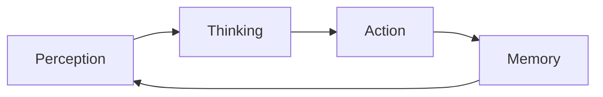
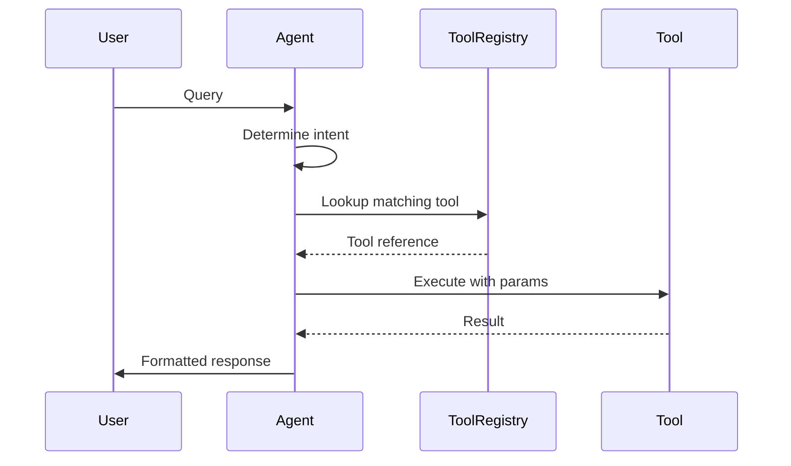
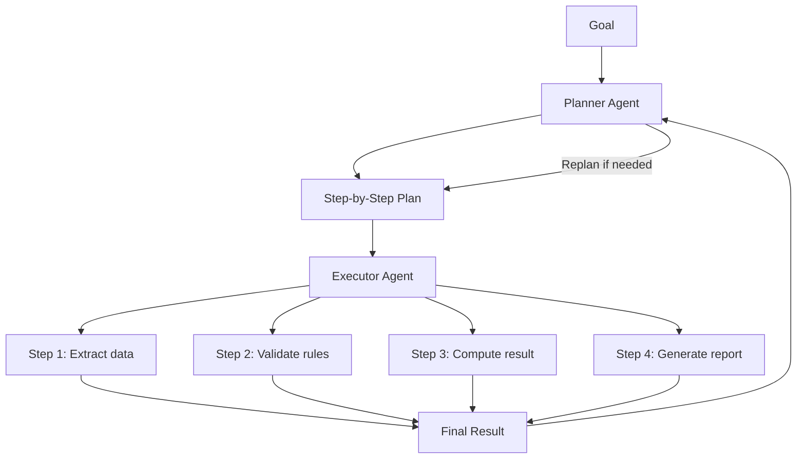
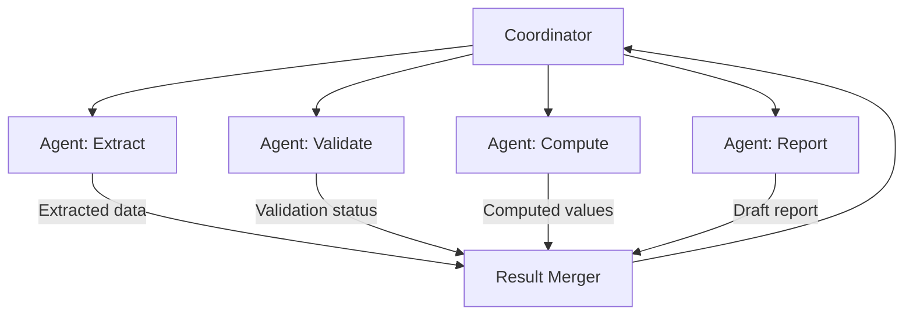
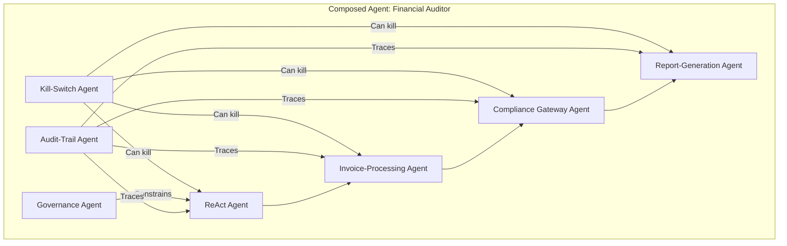

---

sidebar_position: 3
title: "80+ Agent Design Patterns"
description: "Comprehensive catalog of agent design patterns used across the AINEFF Ecosystem — from foundational perception-action loops to advanced governance, temporal, and institutional memory patterns."
tags: [architecture, technical, agent]
custom_status: active
custom_owner: Andrew Leo
custom_last_review: 2026-03-01
custom_next_review: 2026-06-01
---

# 80+ Agent Design Patterns

Every agent in the AINEFF Ecosystem implements one or more design patterns from this catalog. Patterns are composable -- a single agent may combine multiple patterns to fulfill its Authorized Function Bundle (AFB).

---

## Core Loop: The Universal Agent Pattern

All agents, regardless of classification, execute the same foundational loop:



```python
class AgentCoreLoop:
    """Every agent in the ecosystem executes this loop."""

    def run(self):
        while self.is_active():
            # 1. PERCEIVE — Ingest inputs from environment
            observation = self.perceive(self.environment)

            # 2. THINK — Reason about observation given memory and goals
            plan = self.think(
                observation=observation,
                memory=self.memory.retrieve_relevant(observation),
                goals=self.current_goals,
                constraints=self.afb.constraints
            )

            # 3. ACT — Execute the plan (within AFB scope)
            result = self.act(plan, scope=self.afb.authority_scope)

            # 4. REMEMBER — Store outcome for future reasoning
            self.memory.store(
                observation=observation,
                plan=plan,
                result=result,
                timestamp=now()
            )

            # 5. REPEAT — Or exit if done
            if self.goal_achieved(result) or self.should_terminate():
                break
```

---

## 5 Common Foundational Patterns

### Pattern 1: Tool-Using Chatbot

The simplest agent pattern. Receives user input, selects a tool, executes it, returns the result.



**Use in AINEFF:** Consumer-facing Micro-SaaS interfaces, helpdesk agents, simple query-response workflows.

### Pattern 2: ReAct Agent (Reasoning + Acting)

Interleaves reasoning traces with actions. The agent thinks out loud, acts, observes the result, then reasons again.

```
Thought: I need to verify this invoice against the purchase order.
Action: search(purchase_orders, invoice_id="INV-2026-0042")
Observation: PO-2026-0018 found, amount $12,500, vendor "Acme Corp"
Thought: The invoice amount ($12,800) exceeds the PO by $300. Flag for review.
Action: flag_for_review(invoice_id="INV-2026-0042", reason="amount_mismatch", delta=300)
Observation: Flag created, assigned to supervisor queue.
Thought: Task complete. Invoice flagged with evidence.
```

**Use in AINEFF:** Validator agents, compliance checking, anomaly investigation.

### Pattern 3: Planner-Executor

Separates planning from execution. A planner agent creates a step-by-step plan, then an executor agent carries out each step.



**Use in AINEFF:** Manager agents orchestrating composite workflows, multi-step business processes.

### Pattern 4: Multi-Agent Swarm

Multiple agents collaborate on a shared task, each contributing specialized capability. A coordinator distributes work and merges results.



**Use in AINEFF:** Team-level workflows (AINEOUT), parallel document processing, multi-domain analysis.

### Pattern 5: Autonomous Agent

Operates independently within its AFB scope, selecting its own goals and methods. Has full perception-action-memory loop with self-directed planning.

**Use in AINEFF:** Drift Sentinel, Safety Governor, long-running monitoring agents.

---

## 80+ Advanced Agent Patterns

The following catalog organizes advanced patterns into functional categories. Each pattern has a canonical name, a brief description, and its primary use within the AINEFF Ecosystem.

### Governance & Control Patterns (1-12)

| # | Pattern Name | Description | AINEFF Use |
|---|-------------|-------------|------------|
| 1 | **Governance Agent** | Enforces constitutional constraints on all actions within scope. Evaluates every action against the Lifecycle Lawbook before permitting execution. | AINE Control Plane, AINEG policy enforcement |
| 2 | **Kill-Switch Agent** | Maintains a continuously-evaluated set of termination conditions. Executes immediate halt when any trigger fires. Cannot be overridden by the agent it monitors. | Safety Governor implementation |
| 3 | **Power-Ceiling Agent** | Tracks cumulative authority usage and blocks actions that would exceed the power ceiling. Implements graduated response: warn, throttle, freeze, kill. | PAME enforcement at AINE level |
| 4 | **Audit-Trail Agent** | Produces immutable, cryptographically-committed records of every action. Cannot be disabled, paused, or instructed to skip entries. | ACTS integration layer |
| 5 | **Compliance Gateway Agent** | Sits at the boundary of every external action and verifies regulatory compliance before permitting execution. Jurisdiction-aware. | Cross-border transactions, regulated industries |
| 6 | **Constitutional Interpreter Agent** | Resolves ambiguity in governance rules by applying precedent-based reasoning to novel situations. Decisions become precedent for future cases. | Edge-case adjudication in the Lifecycle Lawbook |
| 7 | **Scope Boundary Agent** | Monitors data access patterns and blocks any access outside the declared data scope. Operates as a transparent proxy. | Data residency enforcement, tenant isolation |
| 8 | **Escalation Cascade Agent** | Implements tiered escalation: local → team → org unit → AINE → AINEG → AINEF → AINEFF. Each tier has a timeout before auto-escalation. | Cross-cutting incident response |
| 9 | **Consent-Gate Agent** | Blocks execution until explicit consent is obtained from the appropriate authority (human or higher-level agent). Implements consent expiry. | High-value transactions, PII access |
| 10 | **Policy Compiler Agent** | Translates human-readable governance policies into machine-executable constraint rules. Produces formally verifiable output. | AINEF Factory policy compilation |
| 11 | **Transparency Agent** | Generates human-readable explanations of agent decisions on demand. Cannot fabricate explanations that don't match the actual reasoning trace. | Regulatory reporting, stakeholder communication |
| 12 | **Whistleblower Agent** | Independently monitors for governance violations and reports directly to the AINEG audit layer, bypassing the local management chain. Cannot be silenced by the AINE it monitors. | Anti-corruption, regulatory compliance |

### Memory & Knowledge Patterns (13-24)

| # | Pattern Name | Description | AINEFF Use |
|---|-------------|-------------|------------|
| 13 | **Institutional Memory Agent** | Maintains long-term organizational knowledge across agent lifecycles. When an agent exits, its valuable knowledge is distilled and stored. | Enterprise knowledge continuity |
| 14 | **Episodic Replay Agent** | Stores and replays past experiences to improve future decision-making. Implements experience-weighted learning. | Analyst agents learning from past cases |
| 15 | **Semantic Compression Agent** | Compresses verbose knowledge into dense, queryable semantic representations. Reduces memory cost while preserving retrieval quality. | Memory optimization for AINE-Lite |
| 16 | **Forgetting Agent** | Actively manages knowledge decay. Implements half-life-based confidence decay and mandatory deletion schedules. | Right-to-Erasure compliance, memory hygiene |
| 17 | **Context-Field Agent** | Maintains a continuously-updated "field" of contextual awareness. Every piece of information influences the field, and the field influences every decision. | Analyst agents, market monitoring |
| 18 | **Hidden-Variable Agent** | Infers latent (unobservable) variables from observable data. Uses Bayesian inference to maintain beliefs about hidden states. | Fraud detection, risk assessment |
| 19 | **Knowledge-Graph Agent** | Builds and queries a structured knowledge graph. Entities and relationships are first-class objects with provenance tracking. | OMG (Orchestrated Memory Graph) nodes |
| 20 | **Compression-Expansion Agent** | Alternates between compressing knowledge (summarization, abstraction) and expanding it (detailed retrieval, elaboration) based on task demands. | Report generation, deep-dive analysis |
| 21 | **Working-Memory Agent** | Maintains a small, high-priority scratch space for active reasoning. Items in working memory are accessed with zero latency but decay rapidly. | Complex multi-step reasoning tasks |
| 22 | **Distributed Memory Agent** | Distributes memory across multiple nodes with consensus-based retrieval. No single point of failure for critical knowledge. | Enterprise-grade memory resilience |
| 23 | **Memory-Provenance Agent** | Tracks the origin, transformation history, and confidence decay of every piece of stored knowledge. | Audit trail for knowledge bases |
| 24 | **Temporal Memory Agent** | Stores knowledge with temporal metadata. Can answer questions like "what did we know as of date X?" | Regulatory point-in-time queries |

### Temporal & Time-Aware Patterns (25-34)

| # | Pattern Name | Description | AINEFF Use |
|---|-------------|-------------|------------|
| 25 | **Distributed Time Agent** | Maintains synchronized temporal awareness across distributed agent systems. Handles clock skew, causal ordering, and temporal conflict resolution. | Multi-region AINE coordination |
| 26 | **Deadline-Aware Agent** | Plans and executes with explicit deadline awareness. Implements progressive degradation as deadlines approach. | SLA-bound skill execution |
| 27 | **Temporal Governance Agent** | Enforces time-based governance rules: operating hours, cooling periods, mandatory delays, expiry enforcement. | Regulatory timing requirements |
| 28 | **Predictive-Scheduling Agent** | Predicts future resource needs and pre-schedules agent capacity. Uses historical patterns and trend analysis. | Workforce capacity planning |
| 29 | **Retroactive-Analysis Agent** | Re-analyzes past decisions with current knowledge. Identifies decisions that would be made differently today and quantifies the impact. | Continuous improvement, bias detection |
| 30 | **Rate-Limiting Agent** | Enforces rate limits across temporal windows. Implements token-bucket and sliding-window algorithms. | API throttling, cost control |
| 31 | **Time-Decay Agent** | Implements exponential decay on confidence scores, permissions, and cached results. Everything has a half-life. | Memory freshness, authorization expiry |
| 32 | **Batch-Window Agent** | Aggregates work into time-bounded batches for efficient processing. Optimizes throughput vs. latency tradeoff. | Financial reconciliation, bulk processing |
| 33 | **Event-Sourcing Agent** | Maintains state as a sequence of immutable events rather than mutable snapshots. Full temporal reconstruction is always possible. | Audit-grade state management |
| 34 | **Heartbeat Agent** | Emits regular health signals. Absence of a heartbeat triggers investigation and potential kill-switch activation. | Agent liveness monitoring |

### Risk & Safety Patterns (35-46)

| # | Pattern Name | Description | AINEFF Use |
|---|-------------|-------------|------------|
| 35 | **Signal-to-Noise Agent** | Filters high-volume input streams to extract actionable signals. Implements adaptive thresholding that adjusts to changing noise floors. | Market monitoring, log analysis |
| 36 | **Regulatory Radar Agent** | Continuously monitors regulatory feeds across jurisdictions. Detects changes that affect the AINE's operating constraints. | Compliance, jurisdiction management |
| 37 | **Contagion Firewall Agent** | Monitors inter-agent dependencies and blocks cascading failures. Implements circuit-breaker patterns at the agent level. | AINEG Contagion Firewall |
| 38 | **Risk-Aggregation Agent** | Combines risk signals from multiple sources into a unified risk score. Handles correlation, concentration, and tail risk. | Portfolio risk management |
| 39 | **Anomaly-Detection Agent** | Learns baseline behavior and flags statistical anomalies. Uses z-score, IQR, and isolation forest methods. | Fraud detection, drift detection |
| 40 | **Stress-Test Agent** | Simulates adverse scenarios to test system resilience. Runs scenarios: market crash, regulatory shock, mass outage, coordinated attack. | Resilience validation |
| 41 | **Insurance-Pricing Agent** | Calculates risk premiums for AINE insurance pools based on behavioral history, failure rates, and industry risk profiles. | AINEG Insurance Pool |
| 42 | **Quarantine Agent** | Isolates suspect agents or data while maintaining evidence integrity. Implements graduated isolation levels. | Incident response |
| 43 | **Rollback Agent** | Reverses the effects of a failed or compromised action sequence. Maintains compensation transactions for every mutable action. | Error recovery |
| 44 | **Circuit-Breaker Agent** | Monitors failure rates and opens the circuit (blocking requests) when failure exceeds threshold. Implements half-open testing. | Service resilience |
| 45 | **Chaos-Injection Agent** | Deliberately introduces controlled failures to test resilience. Only operates in designated test environments. | Resilience engineering |
| 46 | **Dead-Man-Switch Agent** | Triggers a predetermined action if a specific signal is NOT received within a time window. | Critical system monitoring |

### Cognitive & Reasoning Patterns (47-60)

| # | Pattern Name | Description | AINEFF Use |
|---|-------------|-------------|------------|
| 47 | **Emotional Gravity Agent** | Models the "emotional weight" of decisions -- how stakeholders will feel about outcomes. Uses sentiment analysis and empathy modeling to inform communication. | Customer-facing interactions, dispute resolution |
| 48 | **Multi-Perspective Agent** | Evaluates decisions from multiple stakeholder perspectives simultaneously. Produces a perspective matrix showing impact on each stakeholder. | Strategic planning, policy evaluation |
| 49 | **Adversarial-Reasoning Agent** | Assumes the worst-case interpretation of ambiguous situations. Red-teams its own conclusions. | Security review, contract analysis |
| 50 | **Analogical-Reasoning Agent** | Solves novel problems by finding analogies in past cases. Maintains a case library with similarity scoring. | Precedent-based decision making |
| 51 | **Decomposition Agent** | Breaks complex problems into independent sub-problems, solves each, then synthesizes. Implements hierarchical task decomposition. | Complex analysis, planning |
| 52 | **Contradiction-Detection Agent** | Monitors for logical contradictions across the knowledge base and active decisions. Flags contradictions for resolution. | Data quality, policy consistency |
| 53 | **Hypothesis-Testing Agent** | Generates multiple hypotheses, designs tests for each, executes tests, and ranks hypotheses by evidence. | Investigation, root cause analysis |
| 54 | **Confidence-Calibration Agent** | Continuously calibrates its own confidence scores against actual outcomes. Learns to be neither overconfident nor underconfident. | All agents (meta-capability) |
| 55 | **Chain-of-Thought Agent** | Produces explicit, step-by-step reasoning chains that can be audited and verified. Every conclusion has a traceable reasoning path. | Decision justification |
| 56 | **Debate Agent** | Two sub-agents argue opposing positions on a decision. A judge sub-agent evaluates arguments and renders a verdict. | High-stakes decisions, risk assessment |
| 57 | **Counterfactual Agent** | Explores "what if" scenarios by simulating alternative actions and their consequences. | Strategic planning, impact analysis |
| 58 | **Meta-Cognitive Agent** | Monitors its own reasoning process and detects reasoning failures (circular reasoning, confirmation bias, anchoring). | Quality control on agent reasoning |
| 59 | **Abductive-Reasoning Agent** | Infers the most likely explanation from incomplete observations. Handles uncertainty and missing data explicitly. | Diagnosis, investigation |
| 60 | **Constraint-Satisfaction Agent** | Finds solutions that satisfy all constraints simultaneously. Uses constraint propagation and backtracking. | Scheduling, resource allocation |

### Communication & Coordination Patterns (61-72)

| # | Pattern Name | Description | AINEFF Use |
|---|-------------|-------------|------------|
| 61 | **Delegation Agent** | Breaks a task into subtasks and delegates each to the best-suited agent. Monitors completion and handles failures. | Manager agent implementation |
| 62 | **Negotiation Agent** | Negotiates terms between two or more agents or between an agent and external systems. Implements BATNA (best alternative to negotiated agreement). | Contract Gateway, vendor management |
| 63 | **Broadcast Agent** | Distributes information to all agents in a scope simultaneously. Implements pub/sub semantics with delivery guarantees. | System-wide alerts, policy updates |
| 64 | **Translation Agent** | Translates between different data formats, protocols, or semantic frameworks. Preserves meaning across translation boundaries. | IPS (Inter-Protocol System) |
| 65 | **Summarization Agent** | Produces concise summaries of complex data at multiple granularity levels. Stakeholder-aware: different summaries for different audiences. | Reporting, dashboard generation |
| 66 | **Handoff Agent** | Manages clean handoffs between agents, ensuring no information loss and proper context transfer. Implements handoff protocols. | Shift changes, escalation |
| 67 | **Consensus Agent** | Achieves agreement among multiple agents on a shared decision. Implements voting, weighted consensus, and quorum rules. | Multi-agent decision making |
| 68 | **Feedback Agent** | Collects execution results and routes them to the appropriate agents for learning. Implements feedback loops with delay correction. | Continuous improvement |
| 69 | **Priority-Queue Agent** | Manages task prioritization across a team of agents. Implements priority inheritance and starvation prevention. | AINEOUT task routing |
| 70 | **Load-Balancing Agent** | Distributes work across available agents based on capacity, capability, and current load. | Team-level resource optimization |
| 71 | **Gateway Agent** | Controls access to external systems. All outbound communication passes through a gateway that enforces protocol, rate-limiting, and logging. | PCP boundary enforcement |
| 72 | **Mediator Agent** | Resolves conflicts between agents that have incompatible goals or resource requirements. | Inter-team coordination |

### Specialized Domain Patterns (73-84)

| # | Pattern Name | Description | AINEFF Use |
|---|-------------|-------------|------------|
| 73 | **Regulatory Radar Agent** | Monitors regulatory changes across multiple jurisdictions. Translates regulatory text into constraint updates. | Compliance automation |
| 74 | **Market-Sensing Agent** | Monitors market signals (pricing, demand, competition) and translates them into strategic intelligence. | Business operations |
| 75 | **Invoice-Processing Agent** | End-to-end invoice extraction, validation, matching, and posting. Combines Extractor + Validator + Accountant patterns. | Accounts payable automation |
| 76 | **KYC/AML Agent** | Performs identity verification, sanctions screening, and risk scoring for customer onboarding. | Financial compliance |
| 77 | **Contract-Analysis Agent** | Extracts terms, obligations, and risks from legal contracts. Flags non-standard clauses. | Legal operations |
| 78 | **Tax-Compliance Agent** | Computes tax obligations across jurisdictions. Maintains jurisdiction-specific rule sets. | Financial compliance |
| 79 | **Inventory-Optimization Agent** | Predicts demand and optimizes inventory levels. Balances carrying cost against stockout risk. | Supply chain management |
| 80 | **Customer-Sentiment Agent** | Analyzes customer interactions to detect sentiment trends. Escalates negative trends before they become crises. | Customer success |
| 81 | **Pricing-Optimization Agent** | Dynamically adjusts pricing based on demand, competition, cost, and margin targets. | Revenue optimization |
| 82 | **Report-Generation Agent** | Produces structured reports from multiple data sources. Format-aware (PDF, JSON, dashboard, email). | Cross-functional reporting |
| 83 | **Data-Quality Agent** | Continuously monitors data pipelines for quality issues: missing values, schema drift, statistical anomalies. | Data operations |
| 84 | **Document-Classification Agent** | Classifies inbound documents by type, urgency, and routing destination. | Mailroom automation |

### Meta & Infrastructure Patterns (85-92)

| # | Pattern Name | Description | AINEFF Use |
|---|-------------|-------------|------------|
| 85 | **Self-Healing Agent** | Detects its own degradation and applies corrective actions: cache clearing, connection re-establishment, configuration reload. | Infrastructure resilience |
| 86 | **Shadow Agent** | Runs in parallel with a primary agent, processing the same inputs independently. Results are compared for consistency. Discrepancies trigger investigation. | Critical path validation |
| 87 | **Canary Agent** | Deployed alongside existing agents to test new versions. Receives a small percentage of traffic. Promoted or rolled back based on performance. | Safe deployment |
| 88 | **Feature-Flag Agent** | Controls which capabilities are enabled at runtime. Implements gradual rollout, A/B testing, and instant kill of problematic features. | Feature lifecycle management |
| 89 | **Telemetry Agent** | Collects operational metrics from all agents in scope. Produces dashboards, alerts, and trend analysis. | Observability |
| 90 | **Migration Agent** | Manages schema migrations, data migrations, and agent version upgrades with zero downtime. | Infrastructure maintenance |
| 91 | **Garbage-Collection Agent** | Identifies and reclaims unused resources: orphaned data, expired caches, abandoned agent states. | Resource hygiene |
| 92 | **Bootstrap Agent** | Initializes a new AINE from its CER (Canonical Enterprise Record). Sets up infrastructure, deploys initial agent complement, runs health checks. | AINE instantiation |

---

## Pattern Composition Rules

Patterns may be composed, but composition must follow these rules:

1. **No circular dependencies** -- If Agent A delegates to Agent B, Agent B cannot delegate back to Agent A (directly or transitively).
2. **Scope monotonicity** -- A composed pattern cannot have more authority than its most-constrained component.
3. **Evidence union** -- The evidence produced by a composed pattern is the union of all component evidence.
4. **Failure propagation** -- Failure in any component propagates upward unless explicitly caught by a Rollback Agent or Circuit-Breaker Agent.
5. **Kill-switch supremacy** -- A Kill-Switch Agent can terminate any pattern composition regardless of how many patterns are composed.



---

## Pattern Selection Guide

| Situation | Recommended Patterns |
|-----------|---------------------|
| Simple query-response | Tool-Using Chatbot |
| Multi-step investigation | ReAct + Chain-of-Thought |
| Complex workflow orchestration | Planner-Executor + Delegation |
| Parallel processing | Multi-Agent Swarm + Load-Balancing |
| High-stakes decision | Debate + Multi-Perspective + Consent-Gate |
| Regulatory compliance | Compliance Gateway + Regulatory Radar + Audit-Trail |
| Long-running monitoring | Autonomous + Heartbeat + Dead-Man-Switch |
| Financial processing | Invoice-Processing + Accountant + Tax-Compliance |
| Security-sensitive | Adversarial-Reasoning + Shadow + Kill-Switch |
| Customer-facing | Emotional Gravity + Summarization + Feedback |
