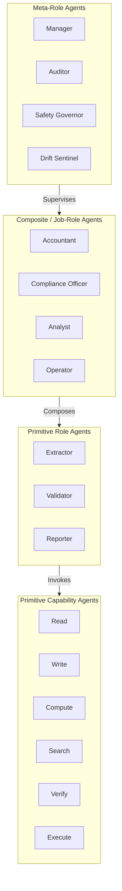
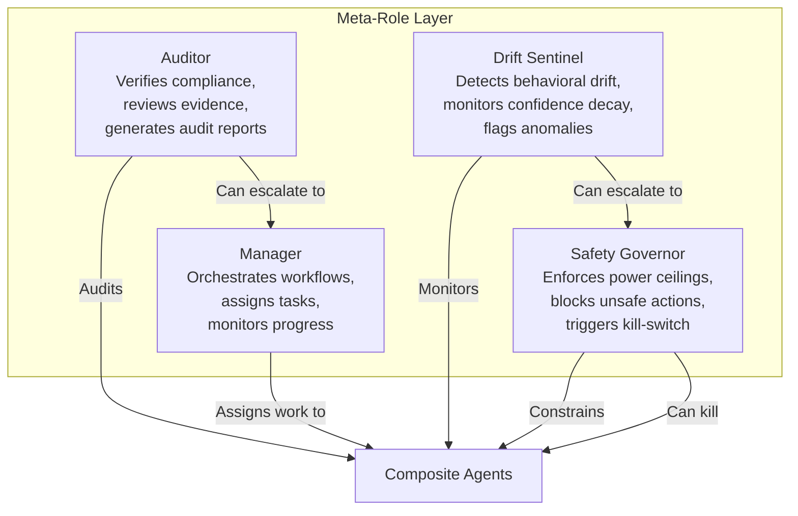
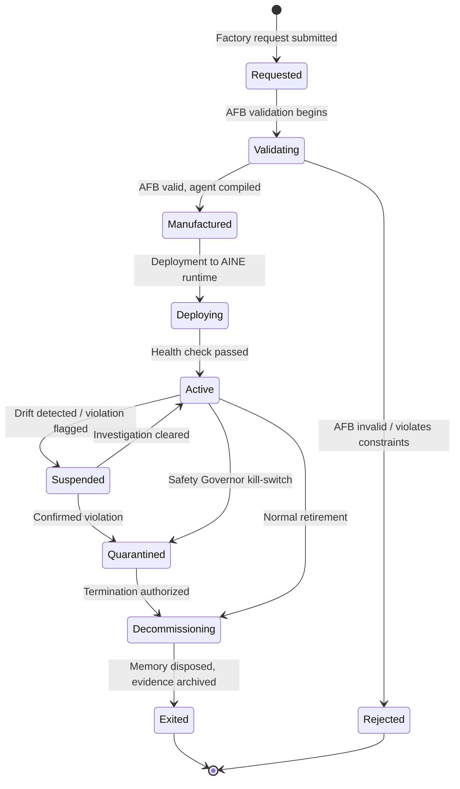

# Agent Taxonomy

Every agent in the AINEFF Ecosystem is classified along two independent axes: **capability level** (what it can do) and **role scope** (what it is authorized to do). No agent self-assigns its classification. Classification is stamped at manufacture time by the AINEF Factory and enforced at runtime by the AINE Control Plane.

---

## Classification Hierarchy



---

## Level 0: Primitive Capability Agents

These are the atomic, irreducible units of agent capability. Each does exactly one thing. They are stateless, memory-free, and side-effect-bounded.

| Agent | Capability | Input | Output | Constraints |
|-------|-----------|-------|--------|-------------|
| **Read** | Reads data from a specified source | Source URI, access token | Raw data payload | Read-only. No mutation. No caching. |
| **Write** | Writes data to a specified target | Target URI, payload, schema | Write receipt with hash | Write-once or append-only. No overwrite without authorization. |
| **Compute** | Performs a deterministic computation | Function ID, input params | Computed result + trace | Must be pure. No side effects. Timeout-bounded. |
| **Search** | Searches an index or knowledge base | Query, scope, filters | Ranked result set | Scope-limited. No cross-tenant leakage. |
| **Verify** | Verifies a claim against evidence | Claim, evidence bundle | Boolean + confidence score | Must produce confidence. Cannot fabricate evidence. |
| **Execute** | Executes a pre-approved action | Action ID, params, auth token | Execution receipt | Pre-approved action list only. No dynamic dispatch. |

### Primitive Capability Contract

Every primitive capability agent must satisfy this interface:

```typescript
interface PrimitiveCapabilityAgent {
  // Identity
  readonly agentId: string;
  readonly capabilityType: 'read' | 'write' | 'compute' | 'search' | 'verify' | 'execute';
  readonly version: SemVer;

  // Execution
  execute(input: CapabilityInput): Promise<CapabilityOutput>;

  // Constraints
  readonly maxExecutionTimeMs: number;
  readonly maxMemoryBytes: number;
  readonly sideEffects: 'none' | 'write-only' | 'append-only';

  // Evidence
  readonly traceEnabled: true;  // Always true. Non-negotiable.
}

interface CapabilityOutput {
  result: unknown;
  confidence: number;       // 0.0 to 1.0, mandatory
  executionTimeMs: number;
  traceId: string;          // Links to ACTS
  hashOfInput: string;      // SHA-256 of input for replay
  hashOfOutput: string;     // SHA-256 of output for audit
}
```

---

## Level 1: Primitive Role Agents

Primitive role agents compose 2-5 primitive capabilities into a coherent role with a defined purpose. They have minimal working memory (context window only) but no long-term memory.

### Extractor

Reads structured data from unstructured sources.

```
Capabilities used: Read + Compute + Verify
Input:  Unstructured document (PDF, image, email)
Output: Structured fields with confidence scores
```

| Field | Type | Description |
|-------|------|-------------|
| `extractedFields` | `Record<string, ExtractedValue>` | Key-value pairs with provenance |
| `confidence` | `number` | Overall extraction confidence |
| `sourceHash` | `string` | Hash of source document |
| `extractionModel` | `string` | Model/method used |

### Validator

Checks extracted data against rules, schemas, or reference databases.

```
Capabilities used: Verify + Search + Compute
Input:  Extracted data + validation rules
Output: Validation report with pass/fail per rule
```

### Reporter

Transforms validated data into formatted output for humans or downstream systems.

```
Capabilities used: Read + Compute + Write
Input:  Validated data + report template
Output: Formatted report (PDF, JSON, dashboard payload)
```

---

## Level 2: Composite / Job-Role Agents

Composite agents combine multiple primitive roles into a coherent "job function." They are the operational workhorses of an AINE. Each composite agent is governed by an **Authorized Function Bundle (AFB)** that defines exactly what it may and may not do.

### Authorized Function Bundles (AFBs)

An AFB replaces the ambiguous concept of a "job role" with a cryptographically-signed, version-controlled, auditable permission set.

```yaml
# Example AFB: Accountant Agent
afb:
  id: "afb-accountant-v3.2.1"
  name: "Accountant"
  version: "3.2.1"
  signed_by: "ainef-factory-01"
  valid_from: "2026-01-15T00:00:00Z"
  valid_until: "2027-01-15T00:00:00Z"

  # Composed roles
  roles:
    - extractor:invoice
    - extractor:receipt
    - validator:financial-rules
    - validator:tax-compliance
    - reporter:financial-statement

  # Authorized capabilities
  capabilities:
    read:
      - "ledger:*"
      - "invoice:*"
      - "bank-statement:*"
    write:
      - "journal-entry:*"
      - "reconciliation-report:*"
    compute:
      - "tax-calculation:*"
      - "depreciation:*"
      - "currency-conversion:*"
    search:
      - "chart-of-accounts:*"
      - "vendor-registry:*"
    verify:
      - "invoice-against-po:*"
      - "balance-sheet-integrity:*"
    execute: []  # No direct execution authority

  # Hard limits
  constraints:
    max_transaction_value: 100000.00
    max_batch_size: 500
    requires_approval_above: 50000.00
    prohibited_actions:
      - "wire-transfer"
      - "account-creation"
      - "vendor-onboarding"
    jurisdiction: ["US", "UK", "EU"]
```

### Composite Agent Catalog

| Agent | AFB | Roles Composed | Key Constraints |
|-------|-----|----------------|-----------------|
| **Accountant** | `afb-accountant` | Extractor(invoice, receipt) + Validator(financial) + Reporter(statement) | Max transaction value, jurisdiction-locked |
| **Compliance Officer** | `afb-compliance` | Extractor(regulatory) + Validator(policy) + Reporter(compliance) | Cannot grant exemptions, read-only on policies |
| **Analyst** | `afb-analyst` | Extractor(data) + Compute(statistical) + Reporter(insight) | No write access to source systems |
| **Operator** | `afb-operator` | Execute(approved-actions) + Validator(pre-check) + Reporter(status) | Pre-approved action list, kill-switch enabled |

---

## Level 3: Meta-Role Agents

Meta-role agents supervise, audit, and constrain other agents. They operate at the AINE Control Plane level and have elevated observation privileges but strictly limited mutation privileges.



### Manager Agent

| Property | Value |
|----------|-------|
| **Purpose** | Orchestrate agent workflows, assign tasks, monitor completion |
| **Can create agents** | No -- requests creation from AINEF Factory |
| **Can destroy agents** | Yes -- within its AINE scope only |
| **Can modify AFBs** | No -- AFBs are immutable once signed |
| **Max subordinates** | Configurable per AINE (default: 50) |

### Auditor Agent

| Property | Value |
|----------|-------|
| **Purpose** | Independently verify that agents comply with their AFBs |
| **Access** | Read-only to all execution traces within scope |
| **Reporting** | Generates compliance reports, flags violations |
| **Independence** | Cannot be managed by the Manager it audits |

### Safety Governor Agent

| Property | Value |
|----------|-------|
| **Purpose** | Enforce power ceilings and safety invariants |
| **Kill authority** | Can immediately halt any agent within scope |
| **Escalation** | Escalates to AINEG-level if AINE-level threat detected |
| **Override** | Cannot be overridden by any agent below AINEG level |

### Drift Sentinel Agent

| Property | Value |
|----------|-------|
| **Purpose** | Detect behavioral drift, confidence decay, pattern anomalies |
| **Monitoring** | Continuous observation of agent outputs vs. expected distributions |
| **Threshold** | Configurable drift tolerance (default: 15% deviation triggers alert) |
| **Response** | Alert → investigate → escalate → recommend quarantine |

---

## Agent Lifecycle

Every agent follows a strict lifecycle with no ambiguity about state transitions.



### Lifecycle State Definitions

| State | Description | Allowed Actions | Duration Limit |
|-------|-------------|-----------------|----------------|
| **Requested** | Factory request submitted, awaiting validation | None | 24 hours |
| **Validating** | AFB and constraints being verified | None | 1 hour |
| **Manufactured** | Agent compiled, awaiting deployment | None | 72 hours |
| **Active** | Fully operational, executing within AFB | Full AFB scope | AFB validity period |
| **Suspended** | Temporarily halted pending investigation | Read-only self-diagnostics | 7 days (then auto-quarantine) |
| **Quarantined** | Isolated, no execution, evidence preserved | None | 30 days (then auto-decommission) |
| **Decommissioning** | Memory disposition in progress | Memory export/archive only | 48 hours |
| **Exited** | Terminal state, all resources released | None | Permanent |

---

## Scope Enforcement

Every agent has a **scope boundary** defined in its AFB. The runtime enforces scope at three levels:

### 1. Data Scope

```typescript
interface DataScope {
  // What data sources the agent can access
  readableResources: ResourcePattern[];
  writableResources: ResourcePattern[];

  // What data the agent can NEVER access
  prohibitedResources: ResourcePattern[];

  // Jurisdiction constraints
  dataResidency: JurisdictionCode[];
}
```

### 2. Temporal Scope

```typescript
interface TemporalScope {
  // When the agent can operate
  validFrom: ISO8601;
  validUntil: ISO8601;
  operatingHours?: CronExpression;

  // Execution limits
  maxExecutionsPerHour: number;
  maxExecutionsPerDay: number;
  maxConcurrentExecutions: number;
}
```

### 3. Authority Scope

```typescript
interface AuthorityScope {
  // Maximum decision authority
  maxDecisionValue: CurrencyAmount;
  requiresApprovalAbove: CurrencyAmount;

  // Escalation chain
  escalationTarget: AgentId;
  autoEscalateAfter: Duration;

  // Cannot exceed parent's scope
  parentScope: ScopeId;
}
```

---

## Kill Triggers

Kill triggers are conditions that cause immediate, non-negotiable agent termination. They are evaluated continuously by the Safety Governor.

| Trigger | Condition | Response Time |
|---------|-----------|---------------|
| **AFB Expiry** | Agent's AFB `valid_until` timestamp passed | Immediate |
| **Power Ceiling Breach** | Agent attempted action exceeding authority scope | < 100ms |
| **Confidence Collapse** | Agent confidence drops below 0.3 for 3 consecutive outputs | < 1 second |
| **Drift Threshold** | Behavioral drift exceeds 25% of baseline | < 5 seconds |
| **Contagion Signal** | Downstream agent flagged as compromised | < 500ms |
| **Manual Kill** | Safety Governor or human operator issues kill command | Immediate |
| **Resource Exhaustion** | Agent exceeds memory or compute allocation by 2x | < 1 second |
| **Evidence Gap** | Agent produces output without corresponding trace | Immediate |

### Kill Sequence

```
1. FREEZE    — All in-flight operations halted (no new inputs accepted)
2. SNAPSHOT  — Current state captured for forensic analysis
3. ISOLATE   — Network and data access revoked
4. EVIDENCE  — All traces sealed and committed to ACTS
5. NOTIFY    — Manager, Auditor, and Safety Governor notified
6. DISPOSE   — Memory disposition per exit protocol (inherit / archive / destroy)
7. RELEASE   — Compute resources freed
```

---

## Agent Count Projections

| AINE Size | Primitive Capability | Primitive Role | Composite | Meta-Role | Total |
|-----------|---------------------|----------------|-----------|-----------|-------|
| **Micro** (single function) | 6 | 3-5 | 1-3 | 2 | 12-16 |
| **Small** (single domain) | 12 | 8-12 | 5-10 | 4 | 29-38 |
| **Medium** (multi-domain) | 24 | 20-30 | 15-25 | 6 | 65-85 |
| **Large** (enterprise-scale) | 48 | 40-60 | 30-50 | 10 | 128-168 |
