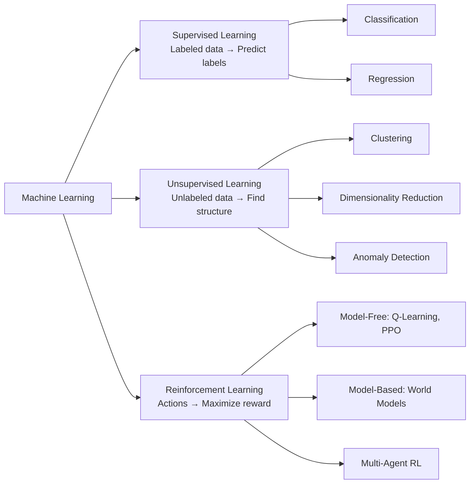
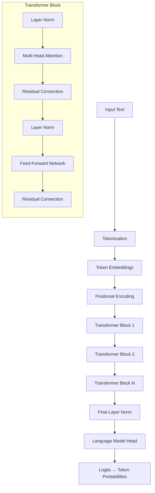
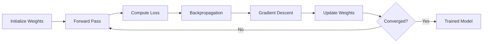
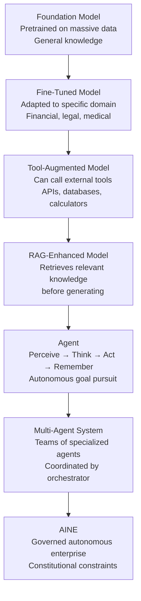
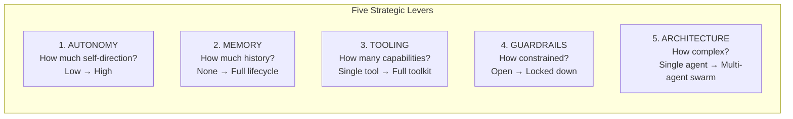

---

sidebar_position: 10
title: "AI Model Taxonomy"
description: "Complete taxonomy of AI approaches — from symbolic logic through statistical learning to neural networks and transformers, with detailed architecture breakdowns, training loops, and the evolutionary chain from foundation models to autonomous agents."
tags: [architecture, technical, agent]
custom_status: active
custom_owner: Andrew Leo
custom_last_review: 2026-03-01
custom_next_review: 2026-06-01
---

# AI Model Taxonomy

This document provides a comprehensive classification of AI approaches used across the AINEFF Ecosystem. Every agent, skill, and capability ultimately relies on one or more of these foundational AI techniques.

---

## Three Grand Kingdoms

All artificial intelligence techniques fall into three fundamental kingdoms, each with a radically different approach to knowledge representation and reasoning.

```mermaid
graph TD
    AI["Artificial Intelligence"]

    AI --> SYMBOLIC["Kingdom 1: Symbolic AI
    'Logic Engines'"]
    AI --> STATISTICAL["Kingdom 2: Statistical AI
    'Probability Wizards'"]
    AI --> NEURAL["Kingdom 3: Neural Models
    'Function Shapeshifters'"]

    SYMBOLIC --> RULES[Rule-Based Systems]
    SYMBOLIC --> EXPERT[Expert Systems]
    SYMBOLIC --> KB[Knowledge Bases]
    SYMBOLIC --> LOGIC[Formal Logic / SAT]
    SYMBOLIC --> PLANNING[Planning / Search]

    STATISTICAL --> BAYES[Bayesian Methods]
    STATISTICAL --> HMM[Hidden Markov Models]
    STATISTICAL --> SVM[Support Vector Machines]
    STATISTICAL --> ENSEMBLE[Ensemble Methods]
    STATISTICAL --> TRAD_ML[Traditional ML]

    NEURAL --> MLP[Multi-Layer Perceptrons]
    NEURAL --> CNN[Convolutional Networks]
    NEURAL --> RNN[Recurrent Networks]
    NEURAL --> TRANSFORMER[Transformers]
    NEURAL --> GENERATIVE[Generative Models]
```



### Kingdom Comparison

| Property | Symbolic AI | Statistical AI | Neural Models |
|----------|-----------|---------------|---------------|
| **Knowledge** | Explicit rules | Probability distributions | Learned weights |
| **Interpretability** | High (rules are readable) | Medium (probabilities are inspectable) | Low (weights are opaque) |
| **Learning** | Manual rule encoding | Statistical estimation | Gradient-based optimization |
| **Strengths** | Precision, explainability, compliance | Uncertainty quantification, small data | Pattern recognition, scale, generalization |
| **Weaknesses** | Brittleness, manual effort | Feature engineering required | Data hunger, compute cost, opacity |
| **AINEFF Use** | Policy compilation, constraint checking | Risk scoring, anomaly detection | NLP, document processing, reasoning |

---

## Machine Learning: The Three Paradigms



### Supervised Learning

| Algorithm | Type | AINEFF Application |
|-----------|------|-------------------|
| Logistic Regression | Classification | Intent classification, simple binary decisions |
| Random Forest | Classification / Regression | Risk scoring, feature importance analysis |
| Gradient Boosting (XGBoost, LightGBM) | Classification / Regression | Fraud detection, credit scoring |
| Support Vector Machines | Classification | Document classification, small-data scenarios |
| Linear Regression | Regression | Cost prediction, trend estimation |

### Unsupervised Learning

| Algorithm | Type | AINEFF Application |
|-----------|------|-------------------|
| K-Means | Clustering | Customer segmentation, document grouping |
| DBSCAN | Clustering | Anomaly detection in transaction patterns |
| PCA | Dimensionality Reduction | Feature compression for memory optimization |
| t-SNE / UMAP | Visualization | Embedding space visualization for debugging |
| Isolation Forest | Anomaly Detection | Fraud detection, drift detection |
| Autoencoders | Representation Learning | Data compression for AINE-Lite memory |

### Reinforcement Learning

| Algorithm | Type | AINEFF Application |
|-----------|------|-------------------|
| Q-Learning | Model-Free, Value-Based | Simple agent decision policies |
| PPO (Proximal Policy Optimization) | Model-Free, Policy-Based | Agent action selection under constraints |
| SAC (Soft Actor-Critic) | Model-Free, Actor-Critic | Continuous action spaces |
| MCTS (Monte Carlo Tree Search) | Model-Based | Planning under uncertainty |
| Multi-Agent RL | Multi-Agent | Team coordination optimization |

---

## Deep Learning Architectures

### MLPs (Multi-Layer Perceptrons)

The simplest neural network: stacked layers of fully-connected neurons with non-linear activations.

```
Input Layer → Hidden Layer 1 → Hidden Layer 2 → ... → Output Layer
     ↓              ↓                ↓                      ↓
  Features     ReLU(Wx+b)       ReLU(Wx+b)            Softmax/Linear
```

**AINEFF Use:** Feature transformation layers within larger models, simple classification tasks.

### CNNs (Convolutional Neural Networks)

Specialized for spatial data (images, structured documents) using learnable convolutional filters.

```
Input → [Conv → ReLU → Pool] × N → Flatten → FC → Output
```

**AINEFF Use:** Document layout analysis, invoice field extraction from images, receipt scanning.

### RNNs, LSTMs, and GRUs

Sequential models that maintain hidden state across time steps.

| Architecture | Innovation | Limitation |
|-------------|-----------|------------|
| **Vanilla RNN** | Hidden state carries information forward | Vanishing gradients for long sequences |
| **LSTM** | Gated memory cell (forget, input, output gates) | Slow training, sequential processing |
| **GRU** | Simplified gating (reset, update gates) | Less expressive than LSTM but faster |

**AINEFF Use:** Legacy time-series analysis. Largely superseded by Transformers in the ecosystem.

### Transformers

The dominant architecture in the AINEFF Ecosystem. Transformers process sequences in parallel using self-attention.

---

## Transformer Deep Dive

The transformer is the foundational architecture for all LLM-based agents in the ecosystem.

### Architecture Diagram



### Step-by-Step Breakdown

#### 1. Tokenization

Converts raw text into a sequence of integer token IDs.

```python
# Example: BPE tokenization
text = "Invoice total: $12,500.00"
tokens = tokenizer.encode(text)
# → [15496, 3858, 25, 720, 1065, 11, 4059, 13, 405]
```

| Method | Description | Vocabulary Size |
|--------|-------------|-----------------|
| **BPE** (Byte Pair Encoding) | Iteratively merges frequent byte pairs | 32K-100K |
| **WordPiece** | Similar to BPE, used in BERT | 30K |
| **SentencePiece** | Language-agnostic, works on raw text | Configurable |
| **Tiktoken** | OpenAI's BPE variant | 100K+ |

#### 2. Token Embeddings

Each token ID maps to a dense vector.

```python
# Embedding lookup
embedding_dim = 4096
vocab_size = 100000
embedding_table = nn.Embedding(vocab_size, embedding_dim)
token_vectors = embedding_table(token_ids)  # Shape: [seq_len, 4096]
```

#### 3. Positional Encoding

Since attention is permutation-invariant, position information must be added explicitly.

```python
# Sinusoidal positional encoding
def positional_encoding(seq_len, d_model):
    pe = torch.zeros(seq_len, d_model)
    position = torch.arange(0, seq_len).unsqueeze(1).float()
    div_term = torch.exp(torch.arange(0, d_model, 2).float() * -(math.log(10000.0) / d_model))
    pe[:, 0::2] = torch.sin(position * div_term)
    pe[:, 1::2] = torch.cos(position * div_term)
    return pe
```

Modern models use **Rotary Positional Embedding (RoPE)** which encodes relative positions in the attention computation itself.

#### 4. Self-Attention (Q/K/V)

The core mechanism. Each token attends to every other token to determine what is relevant.

```python
def self_attention(X, W_Q, W_K, W_V):
    """
    X:   Input embeddings       [seq_len, d_model]
    W_Q: Query weight matrix    [d_model, d_k]
    W_K: Key weight matrix      [d_model, d_k]
    W_V: Value weight matrix    [d_model, d_v]
    """
    Q = X @ W_Q    # Queries: "What am I looking for?"
    K = X @ W_K    # Keys:    "What do I contain?"
    V = X @ W_V    # Values:  "What do I provide?"

    # Scaled dot-product attention
    d_k = K.shape[-1]
    scores = (Q @ K.T) / math.sqrt(d_k)   # [seq_len, seq_len]
    weights = softmax(scores, dim=-1)       # Attention weights (sum to 1)
    output = weights @ V                    # Weighted combination of values

    return output
```

#### 5. Multi-Head Attention

Multiple attention heads learn different relationship types in parallel.

```python
def multi_head_attention(X, num_heads=32):
    heads = []
    for i in range(num_heads):
        head_i = self_attention(X, W_Q[i], W_K[i], W_V[i])
        heads.append(head_i)

    concatenated = torch.cat(heads, dim=-1)  # [seq_len, num_heads * d_v]
    output = concatenated @ W_O               # Project back to d_model
    return output
```

#### 6. Feed-Forward Network (FFN)

A position-wise MLP applied independently to each token.

```python
def feed_forward(x, d_model=4096, d_ff=16384):
    """Two linear layers with activation in between."""
    hidden = gelu(x @ W1 + b1)    # Expand: 4096 → 16384
    output = hidden @ W2 + b2      # Compress: 16384 → 4096
    return output
```

#### 7. Layer Normalization

Normalizes activations to stabilize training. Applied before attention and FFN (pre-norm architecture).

#### 8. Residual Connections

Skip connections that add the input directly to the output of each sub-layer, enabling gradient flow through deep networks.

```python
# Residual pattern
x = x + multi_head_attention(layer_norm(x))
x = x + feed_forward(layer_norm(x))
```

---

## Training Loop

The training process for all neural models follows this universal loop:



| Step | Description | Key Concept |
|------|-------------|-------------|
| **1. Initialize** | Set weights to random values (Xavier, He, or similar) | Good initialization prevents vanishing/exploding gradients |
| **2. Forward Pass** | Push input through the network to produce prediction | Computation graph records all operations |
| **3. Compute Loss** | Compare prediction to ground truth | Cross-entropy (classification), MSE (regression) |
| **4. Backpropagation** | Compute gradient of loss w.r.t. every weight | Chain rule applied through computation graph |
| **5. Gradient Descent** | Update weights in the direction that reduces loss | Adam optimizer: adaptive learning rates |
| **6. Iterate** | Repeat for millions of batches | Convergence: loss stops decreasing |

---

## Generative Models

| Architecture | Mechanism | AINEFF Application |
|-------------|-----------|-------------------|
| **GANs** (Generative Adversarial Networks) | Generator vs. discriminator adversarial training | Synthetic data generation for testing |
| **VAEs** (Variational Autoencoders) | Probabilistic latent space encoding | Anomaly detection, data compression |
| **Diffusion Models** | Iterative denoising from noise to data | Document image enhancement |
| **Autoregressive** (GPT-style) | Predict next token given previous tokens | Language generation, reasoning, all LLM agents |

---

## Foundation Models to Agents: Evolutionary Chain



---

## Agent Architecture Patterns

### RAG (Retrieval-Augmented Generation)

```
Query → Retrieve relevant documents → Augment prompt with retrieved context → Generate response
```

**AINEFF Use:** Every agent with long-term memory uses RAG to ground its reasoning in stored knowledge.

### Planner-Executor

```
Goal → Plan decomposition → Step-by-step execution → Result aggregation
```

**AINEFF Use:** Manager agents orchestrating multi-step workflows.

### Hierarchical

```
Strategic Agent → Tactical Agent → Operational Agent → Execution
```

**AINEFF Use:** AINE → AINEOU → AINEOUT → AINEOUTM hierarchy.

### Self-Reflection

```
Generate → Evaluate own output → Critique → Refine → Re-generate
```

**AINEFF Use:** Confidence calibration, quality assurance in composite agents.

### Multi-Agent

```
Coordinator → {Agent A, Agent B, Agent C} → Result Merger → Final Output
```

**AINEFF Use:** Team-level (AINEOUT) execution with specialized agents.

---

## Four Pillars of Agent Architecture

Every production agent must address all four pillars:

| Pillar | Purpose | AINEFF Implementation |
|--------|---------|----------------------|
| **Grounding** | Connect the model to real-world data | RAG from Long-Term Memory, Semantic Memory, external APIs |
| **Control** | Constrain the model's behavior | AFB scope enforcement, Policy Check Protocol, Kill-Switch |
| **Feedback** | Improve from experience | Episodic Memory, Confidence Calibration, Drift Sentinel |
| **Orchestration** | Coordinate multiple components | Manager Agent, Planner-Executor pattern, Task Router |

---

## Five Strategic Levers

When designing an agent's architecture, these five levers determine its operational profile:



### Lever Settings by Agent Type

| Agent Type | Autonomy | Memory | Tooling | Guardrails | Architecture |
|-----------|----------|--------|---------|------------|--------------|
| Primitive Capability | None | None | Single primitive | Maximum | Single |
| Primitive Role | Low | Context window only | 2-5 capabilities | High | Single |
| Composite / Job-Role | Medium | Full lifecycle | AFB-scoped toolkit | Medium-High | Planner-Executor |
| Meta-Role (Manager) | High | Full lifecycle | Delegation + monitoring | Medium | Hierarchical |
| Meta-Role (Safety Governor) | Autonomous | Full lifecycle | Kill-switch + observation | Self-imposed | Autonomous |
| AINE (aggregate) | Bounded autonomy | Enterprise memory graph | Full skill portfolio | Constitutional | Multi-agent system |
