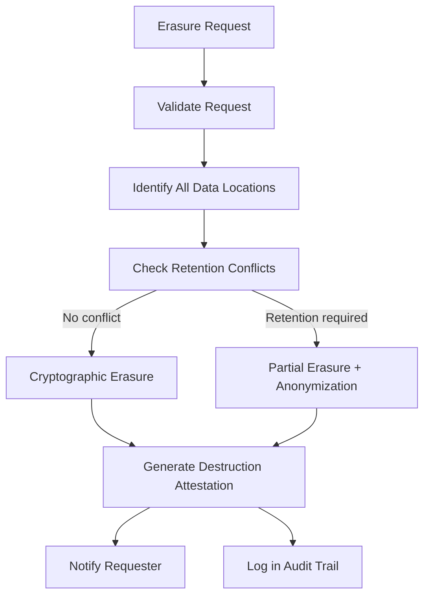
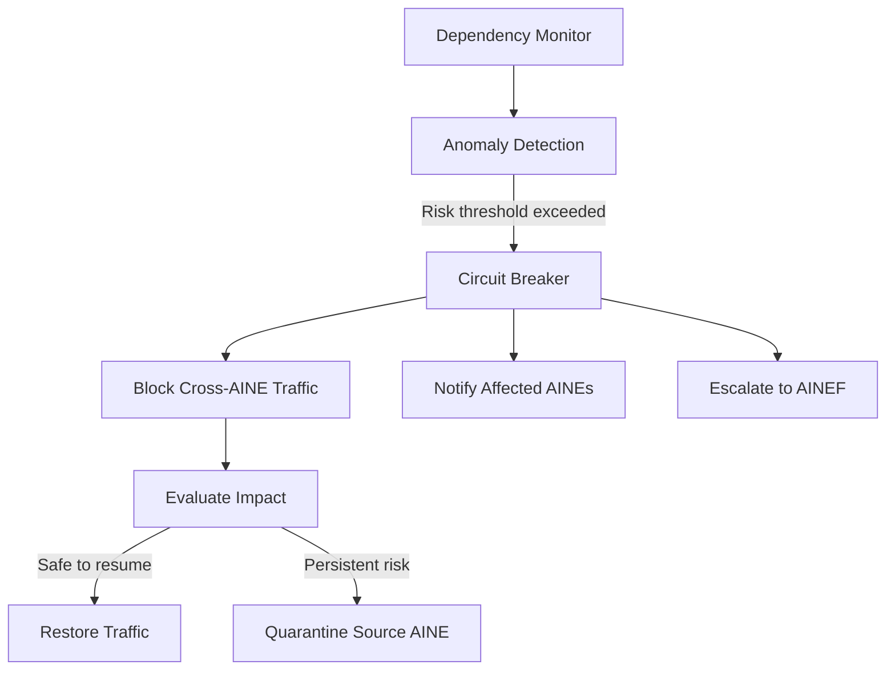
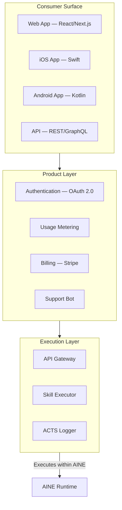

# E2E Application Architecture

The AINEFF Ecosystem delivers value through a structured application portfolio. Each layer owns specific applications that enforce its governance mandate and deliver its operational capability. Applications at higher layers constrain applications at lower layers.

---

## Application Layer Map

```mermaid
graph TD
    subgraph AINEFF_Apps["AINEFF — Framework Apps (7)"]
        direction LR
        A1[Ontology Registry]
        A2[Governance Console]
        A3[Lifecycle Lawbook]
        A4[Failure & Time Standards]
        A5[Protocol Class Registry]
        A6[Audit Evidence Standards]
        A7[Right-to-Erasure Engine]
    end

    subgraph AINEF_Apps["AINEF — Factory Apps (9)"]
        direction LR
        B1[Genome Designer]
        B2[Validation Engine]
        B3[Agent Foundry]
        B4[Assembly Line]
        B5[Policy Compiler]
        B6[PEP-GEN]
        B7[Failure Market]
        B8[Temporal Governance]
        B9[Exit Orchestrator]
    end

    subgraph AINEG_Apps["AINEG — Group Apps (8)"]
        direction LR
        C1[Registry & Ledger]
        C2[Portfolio Lifecycle]
        C3[Jurisdiction Engine]
        C4[Risk Aggregation]
        C5[Contagion Firewall]
        C6[Insurance Pool]
        C7[Contract Gateway]
        C8[Portfolio Audit]
    end

    subgraph AINE_Apps["AINE — Enterprise Apps (6 domains)"]
        direction LR
        D1[Control Plane]
        D2[Workforce Manager]
        D3[Business Ops]
        D4[Decision Authorization]
        D5[Compliance & Audit]
        D6[Failure / Time / Exit]
    end

    subgraph Workforce_Apps["AINEOU / AINEOUT / AINEOUTM — Workforce Apps"]
        direction LR
        E1[Team Orchestrator]
        E2[Task Router]
        E3[Agent Runtime]
        E4[Skill Executor]
    end

    subgraph Consumer["Consumer Micro-SaaS"]
        direction LR
        F1[Skill Marketplace]
        F2[Individual Products]
    end

    AINEFF_Apps -->|"Constrains"| AINEF_Apps
    AINEF_Apps -->|"Manufactures for"| AINEG_Apps
    AINEG_Apps -->|"Coordinates"| AINE_Apps
    AINE_Apps -->|"Operates"| Workforce_Apps
    Workforce_Apps -->|"Delivers"| Consumer
```



---

## AINEFF Framework Apps (7)

These applications define the constitutional layer. They are the "laws of physics" for the ecosystem. Once published at a version, they are immutable for that version.

### 1. Ontology Registry

**Purpose:** Defines the canonical vocabulary, entity types, relationship types, and classification schemes used across the entire ecosystem.

| Property | Value |
|----------|-------|
| **Users** | All ecosystem participants (read), AINEFF governance board (write) |
| **Data** | Entity definitions, taxonomy hierarchies, relationship schemas |
| **API** | GraphQL for queries, versioned REST for mutations |
| **SLA** | 99.99% read availability, &lt;50ms P99 query latency |

```typescript
// Ontology entry example
interface OntologyEntry {
  id: string;                    // "entity:aine"
  type: 'entity' | 'relationship' | 'classification' | 'constraint';
  version: SemVer;
  definition: string;            // Human-readable definition
  schema: JSONSchema;            // Machine-readable schema
  constraints: Constraint[];     // Rules this entity must satisfy
  supertype?: string;            // Parent in hierarchy
  effectiveFrom: ISO8601;
  supersedes?: string;           // Previous version
}
```

### 2. Governance Console

**Purpose:** Dashboard and control surface for ecosystem-wide governance. Provides real-time visibility into compliance, power distribution, and system health.

| Feature | Description |
|---------|-------------|
| Power Distribution Map | Heatmap of power concentration across all AINEs |
| Compliance Dashboard | Real-time compliance status per AINE, per jurisdiction |
| Incident Timeline | Chronological view of governance events and interventions |
| Policy Editor | Version-controlled policy authoring with impact analysis |
| Audit Trail Viewer | Query and visualize audit trails across the ecosystem |

### 3. Lifecycle Lawbook

**Purpose:** The canonical, versioned, executable set of rules governing every entity lifecycle from creation to exit.

| Lifecycle Phase | Rules Defined |
|----------------|---------------|
| Creation | What genome specifications are valid, what artifacts are mandatory |
| Operation | Power ceilings, reporting requirements, mandatory audits |
| Modification | What can be changed, approval requirements, version control |
| Suspension | Trigger conditions, investigation procedures, reinstatement criteria |
| Exit | Disposition requirements, evidence preservation, stakeholder notification |

### 4. Failure & Time Standards

**Purpose:** Defines how failure is measured, budgeted, and reported across the ecosystem. Establishes temporal governance rules.

| Standard | Description |
|----------|-------------|
| Failure Budget Allocation | How much failure each AINE is allowed per period |
| Failure Classification | Taxonomy of failure types (operational, compliance, security, governance) |
| Time Standards | Clock synchronization, temporal ordering, deadline enforcement |
| Recovery Standards | Maximum recovery time by failure class |

### 5. Protocol Class Registry

**Purpose:** Catalogs all approved PCP protocol classes and their specifications.

### 6. Audit Evidence Standards

**Purpose:** Defines the evidence format, quality criteria, and commitment requirements for all audit artifacts.

### 7. Right-to-Erasure Engine

**Purpose:** Processes data deletion requests in compliance with GDPR, CCPA, and other privacy regulations while maintaining audit integrity.



---

## AINEF Factory Apps (9)

These applications manufacture AINEs. They are the "factory floor" of the ecosystem.

### 1. Genome Designer

**Purpose:** Visual and programmatic interface for designing AINE genomes -- the specification from which an AINE is manufactured.

```yaml
# AINE Genome (simplified)
genome:
  id: "genome-finance-v2.3.0"
  name: "Finance AINE"
  mandate: "Accounts payable automation for US-based SMBs"

  industry:
    naics: "523110"
    sic: "6211"
    isic: "K6411"

  capabilities:
    - invoice_validation
    - payment_processing
    - financial_reporting
    - tax_compliance

  constraints:
    max_transaction_value: 500000
    jurisdictions: ["US"]
    required_certifications: ["SOC2", "PCI-DSS"]

  failure_budget:
    operational: 0.001        # 99.9% uptime
    compliance: 0.0           # Zero compliance failures tolerated
    security: 0.0

  exit_protocol: "standard-financial-7yr-retention"
```

### 2. Validation Engine

**Purpose:** Validates genomes against the Lifecycle Lawbook before manufacturing begins. Rejects invalid or contradictory specifications.

### 3. Agent Foundry

**Purpose:** Manufactures individual agents from AFB specifications. Compiles the agent's capability set, installs constraints, and runs pre-deployment tests.

### 4. Assembly Line

**Purpose:** Orchestrates the full AINE manufacturing process: genome validation, agent manufacture, integration testing, PEP generation, deployment.


### 5. Policy Compiler

**Purpose:** Compiles human-readable governance policies into machine-executable constraint rules that are embedded in each AINE.

### 6. PEP-GEN

**Purpose:** Generates the unique Private Enterprise Protocol suite for each AINE. See [Protocol Architecture](./protocol-architecture.md).

### 7. Failure Market

**Purpose:** Manages the allocation, trading, and settlement of failure budgets across the ecosystem. AINEs can purchase additional failure budget from a shared pool.

### 8. Temporal Governance

**Purpose:** Manages all time-related governance: clock synchronization, deadline enforcement, retention schedules, temporal scope.

### 9. Exit Orchestrator

**Purpose:** Manages the controlled shutdown of an AINE: memory disposition, evidence preservation, stakeholder notification, resource release.

---

## AINEG Group Apps (8)

These applications coordinate groups of AINEs operating together.

### 1. Registry & Ledger

**Purpose:** Maintains the authoritative registry of all AINEs in the group and the ledger of all cross-AINE transactions.

| Record | Contents |
|--------|----------|
| AINE Registration | Identity, genome, manufacturing date, status, jurisdiction |
| Transaction Ledger | Every cross-AINE interaction with hashes and timestamps |
| Ownership Graph | Who owns what stake in which AINE |

### 2. Portfolio Lifecycle

**Purpose:** Manages the collective lifecycle of AINEs in the group: onboarding new AINEs, monitoring health, coordinating upgrades, managing exits.

### 3. Jurisdiction Engine

**Purpose:** Manages cross-jurisdictional compliance. Determines which rules apply when AINEs operating in different jurisdictions interact.

```typescript
interface JurisdictionDecision {
  interaction: InteractionDescriptor;
  sourceJurisdiction: JurisdictionCode;
  targetJurisdiction: JurisdictionCode;
  applicableRules: Rule[];
  conflicts: RuleConflict[];
  resolution: ConflictResolution;
  dataResidencyRequirements: DataResidencyRule[];
}
```

### 4. Risk Aggregation

**Purpose:** Aggregates risk signals from all AINEs in the group into a portfolio-level risk view. Detects concentration risk, correlation risk, and systemic risk.

### 5. Contagion Firewall

**Purpose:** Prevents cascading failures across AINEs. Monitors inter-AINE dependencies and implements circuit breakers at the group level.



### 6. Insurance Pool

**Purpose:** Manages collective insurance against operational failures. AINEs contribute premiums based on risk profile; payouts cover losses from failures.

### 7. Contract Gateway

**Purpose:** Manages inter-AINE contracts: service level agreements, data sharing agreements, revenue sharing terms.

### 8. Portfolio Audit

**Purpose:** Conducts group-level audits that span multiple AINEs. Produces aggregated compliance reports.

---

## AINE Enterprise Apps (6 Domains)

Each AINE runs its own suite of enterprise applications.

### Domain 1: Control Plane

The central nervous system of the AINE.

| App | Function |
|-----|----------|
| Agent Lifecycle Manager | Create, monitor, suspend, terminate agents |
| Policy Enforcer | Real-time policy evaluation for every agent action |
| Configuration Manager | Versioned configuration for all AINE components |
| Health Monitor | Continuous health checks, alerting, auto-recovery |

### Domain 2: Workforce Manager

| App | Function |
|-----|----------|
| Skill Registry | Catalog of all skills available to this AINE |
| Task Scheduler | Assigns tasks to agents based on capability and capacity |
| Capacity Planner | Predicts resource needs and scales agent fleet |
| Performance Tracker | Measures agent efficiency, accuracy, and throughput |

### Domain 3: Business Operations

| App | Function |
|-----|----------|
| Revenue Engine | Tracks revenue from skill execution and Micro-SaaS |
| Cost Manager | Tracks compute, API, and storage costs |
| Customer Manager | Manages client relationships and SLAs |
| Billing & Invoicing | Usage metering, invoice generation, payment collection |

### Domain 4: Decision Authorization

| App | Function |
|-----|----------|
| Authorization Engine | Evaluates whether agents may perform requested actions |
| Escalation Manager | Routes decisions that exceed agent authority |
| Approval Workflow | Multi-step approval for high-value decisions |
| Consent Manager | Tracks and enforces consent requirements |

### Domain 5: Compliance & Audit

| App | Function |
|-----|----------|
| Compliance Monitor | Real-time compliance status across all agents |
| Audit Report Generator | Produces audit reports on demand or on schedule |
| Evidence Manager | Manages the AINE's ACTS evidence store |
| Regulatory Reporter | Generates jurisdiction-specific regulatory filings |

### Domain 6: Failure, Time & Exit

| App | Function |
|-----|----------|
| Failure Budget Tracker | Monitors failure budget consumption |
| Incident Manager | Detects, classifies, and manages incidents |
| Temporal Governor | Enforces time-based rules within the AINE |
| Exit Planner | Prepares and executes AINE exit when triggered |

---

## AINEOU / AINEOUT / AINEOUTM Workforce Apps

These applications operate at the team and individual agent level.

### AINEOU (Org Unit) Apps

| App | Function |
|-----|----------|
| Team Orchestrator | Coordinates teams within the org unit |
| Resource Allocator | Distributes compute, memory, and API quotas |
| OrgUnit Dashboard | Real-time view of OrgUnit performance |

### AINEOUT (Team) Apps

| App | Function |
|-----|----------|
| Task Router | Distributes tasks to team members based on capability |
| Evidence Collector | Aggregates evidence from team member executions |
| Team Health Monitor | Monitors team-level metrics and alerts |

### AINEOUTM (Member) Apps

| App | Function |
|-----|----------|
| Agent Runtime | Core execution environment for the agent |
| Skill Executor | Invokes skills and manages execution lifecycle |
| Memory Interface | Agent's interface to the memory system |
| Trace Emitter | Produces trace entries for every action |

---

## Consumer Micro-SaaS (App Store Safe)

The user-facing products that consumers and businesses purchase.

### Micro-SaaS Catalog (Initial)

| Product | Skill | Target User | Price Point | Platform |
|---------|-------|-------------|-------------|----------|
| **Invoice Checker** | invoice-validation | SMB owners | $0.15/check | Web, iOS, Android |
| **KYC Express** | kyc-check | FinTech onboarding | $2.50/check | API, Web |
| **Contract Scanner** | contract-analysis | Legal professionals | $5.00/doc | Web |
| **Expense Auto-Sort** | expense-classification | Freelancers | $4.99/month | iOS, Android |
| **Tax Prep Helper** | tax-return-prep | Individual filers | $1.00/return | Web |
| **Compliance Pulse** | regulatory-monitoring | Compliance teams | $500/month | Web |
| **Vendor Risk Score** | vendor-risk-assessment | Procurement | $1.00/score | API, Web |
| **Receipt Digitizer** | receipt-extraction | Small businesses | $0.05/receipt | iOS, Android |

### Micro-SaaS Architecture Pattern



### App Store Compliance

All consumer Micro-SaaS products comply with:

| Requirement | Implementation |
|-------------|---------------|
| Apple App Store Guidelines | No external payment links, privacy nutrition labels |
| Google Play Policies | Data safety section, permission minimization |
| GDPR | Consent management, data export, right to erasure |
| CCPA | "Do Not Sell" toggle, data disclosure |
| SOC 2 Type II | Annual audit, continuous monitoring |
| Accessibility (WCAG 2.1 AA) | Screen reader support, keyboard navigation, contrast ratios |
