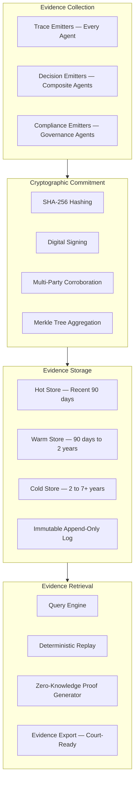
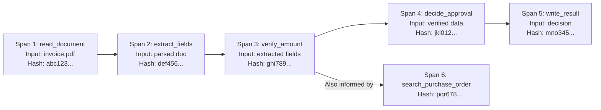
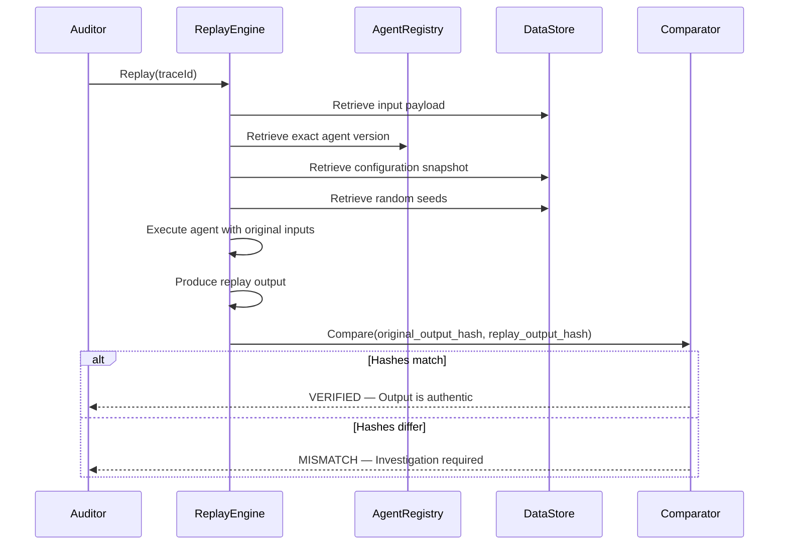

---

sidebar_position: 7
title: "Audit & Evidence Architecture"
description: "Architecture of ACTS (Audit & Causal Trace System) — causal traces, cryptographic commitments, deterministic replay, zero-knowledge proofs, and court-grade evidence standards."
tags: [architecture, technical, governance]
custom_status: active
custom_owner: Andrew Leo
custom_last_review: 2026-03-01
custom_next_review: 2026-06-01
---

# Audit & Evidence Architecture

The AINEFF Ecosystem produces **court-grade evidence** for every action taken by every agent. This is not optional logging -- it is a constitutional requirement enforced at the protocol level. An agent that cannot produce evidence for an action is treated as if that action never happened, and the agent is immediately terminated.

---

## ACTS: Audit & Causal Trace System

ACTS is the cross-cutting audit infrastructure that spans all layers of the ecosystem. It collects, commits, stores, and serves evidence for every action.



---

## Causal Traces

A causal trace links every output to the chain of inputs, decisions, and actions that produced it. Given any output, the full causal chain can be reconstructed.

### Trace Structure

```typescript
interface CausalTrace {
  // Identity
  traceId: string;                 // Globally unique
  spanId: string;                  // Unique within this trace
  parentSpanId?: string;           // Links to parent span (causality)

  // Who
  agentId: AgentId;
  agentType: AgentType;
  afbId: string;                   // Authorized Function Bundle in effect

  // What
  action: string;                  // e.g., "extract_fields"
  actionCategory: 'read' | 'write' | 'compute' | 'search' | 'verify' | 'execute' | 'decide';

  // When
  startedAt: ISO8601;
  completedAt: ISO8601;
  durationMs: number;

  // Inputs
  inputHash: string;               // SHA-256 of input payload
  inputSchema: string;             // Schema version used

  // Outputs
  outputHash: string;              // SHA-256 of output payload
  outputSchema: string;
  confidence: number;              // Agent's confidence in this output

  // Reasoning (for decision actions)
  reasoningChainHash?: string;     // Hash of step-by-step reasoning
  alternativesConsidered?: number; // How many alternatives were evaluated
  selectedAlternativeRank?: number;// Rank of the chosen alternative

  // Cryptographic Commitment
  commitment: {
    algorithm: 'SHA-256' | 'SHA-512' | 'BLAKE3';
    hash: string;                  // Hash of (inputHash + outputHash + agentId + timestamp)
    signature: string;             // Agent's digital signature
    signerPublicKey: string;
    corroborators?: Corroboration[]; // Multi-party signatures
  };

  // Linkage
  predecessorSpans: string[];      // Spans that causally preceded this one
  successorSpans: string[];        // Spans that this one causally enables
}
```

### Causal Chain Example



---

## Cryptographic Commitments

Every trace entry is cryptographically committed, making tampering detectable.

### Commitment Process

```
1. HASH INPUT     — SHA-256(input_payload)
2. HASH OUTPUT    — SHA-256(output_payload)
3. COMPOSE BLOCK  — Concatenate: inputHash + outputHash + agentId + timestamp + parentSpanId
4. HASH BLOCK     — SHA-256(composed_block)
5. SIGN           — Agent signs block hash with private key
6. MERKLE INSERT  — Insert into per-hour Merkle tree
7. CORROBORATE    — If multi-party required, collect co-signatures
```

### Merkle Tree Aggregation

Every hour, all trace entries are aggregated into a Merkle tree. The root hash is published, enabling efficient proof of inclusion.

```
                    Root Hash (published hourly)
                   /                             \
            Hash(AB)                          Hash(CD)
           /        \                        /        \
      Hash(A)    Hash(B)              Hash(C)    Hash(D)
        |           |                    |           |
    Trace 1     Trace 2             Trace 3     Trace 4
```

A verifier can prove that a specific trace exists in the tree by providing only the trace and the sibling hashes along the path to the root -- logarithmic proof size.

---

## Deterministic Replay

Any past execution can be replayed deterministically to verify that the recorded output matches the recorded input.

### Replay Requirements

For replay to work, the following must be preserved:

| Component | Preserved | Storage |
|-----------|-----------|---------|
| Input payload hash | Yes | ACTS hot/warm/cold store |
| Input payload (full) | Configurable | ACTS or separate data store |
| Agent version (exact) | Yes | AINEF Factory version registry |
| Model version (exact) | Yes | Model registry with deterministic seeds |
| Configuration snapshot | Yes | ACTS configuration store |
| Random seeds | Yes | Stored per-execution for stochastic models |
| External data snapshots | Yes | Point-in-time snapshots of external data |

### Replay Process



### Replay Limitations

| Scenario | Mitigation |
|----------|------------|
| Non-deterministic model outputs | Store random seeds; use temperature=0 where possible |
| External API responses changed | Store point-in-time snapshots of all external data |
| Model no longer available | Archive model artifacts in immutable storage |
| Expired credentials | Replay uses snapshot data, not live APIs |

---

## Zero-Knowledge Proofs (ZK Proofs)

ZK proofs allow an AINE to prove that a computation was performed correctly without revealing the inputs, outputs, or internal reasoning.

### Use Cases

| Use Case | What Is Proved | What Remains Hidden |
|----------|---------------|-------------------|
| **Compliance verification** | "This transaction complied with regulation X" | Transaction details, customer data |
| **Risk score validation** | "This risk score was computed from valid inputs" | The inputs and scoring model |
| **Decision justification** | "This decision followed the correct reasoning process" | The actual reasoning chain |
| **Identity verification** | "This person passed KYC checks" | Personal identification data |
| **Audit without visibility** | "All operations in period X were compliant" | Individual operation details |

### ZK Proof Architecture

```mermaid
graph TD
    subgraph Prover["AINE (Prover)"]
        EXEC[Execute computation]
        WITNESS[Generate witness (private inputs)]
        CIRCUIT[Compile to arithmetic circuit]
        PROVE[Generate ZK proof]
    end

    subgraph Verifier["Court / Regulator (Verifier)"]
        RECEIVE[Receive proof + public inputs]
        VERIFY_ZK[Verify proof]
        ACCEPT[Accept: computation was correct]
    end

    EXEC --> WITNESS
    WITNESS --> CIRCUIT
    CIRCUIT --> PROVE
    PROVE -->|"Proof + public inputs only"| RECEIVE
    RECEIVE --> VERIFY_ZK
    VERIFY_ZK --> ACCEPT

    Note1["Private inputs never
    leave the AINE"]
```

### ZK Proof Specification

```typescript
interface ZKProofArtifact {
  // Identity
  proofId: string;
  proofType: 'groth16' | 'plonk' | 'stark';
  circuitId: string;              // Which computation circuit

  // Public inputs (visible to verifier)
  publicInputs: {
    statementHash: string;         // Hash of the claim being proved
    timestamp: ISO8601;
    agentId: string;               // Pseudonymized
    complianceRuleId: string;
  };

  // Proof (verifiable without seeing private data)
  proof: Uint8Array;

  // Verification key
  verificationKey: Uint8Array;

  // Metadata
  generatedAt: ISO8601;
  expiresAt: ISO8601;
  generationTimeMs: number;
}
```

---

## Audit Without Visibility

The "Audit Without Visibility" principle enables courts, regulators, and auditors to verify that an AINE's operations were compliant without ever seeing the AINE's internal data or reasoning.

### Three-Layer Verification

```
Layer 1: Public Evidence
  → PCP audit logs (API calls, responses, timestamps)
  → Published Merkle roots (hourly commitment hashes)
  → SLA compliance metrics

Layer 2: ZK Proofs
  → "All transactions in Q1 2026 complied with AML regulations" — VERIFIED
  → "Risk scores were computed from valid, unmanipulated inputs" — VERIFIED
  → "No unauthorized data access occurred in period X" — VERIFIED

Layer 3: Sealed Evidence (opened only by court order)
  → Full PEP audit trail (encrypted, key held by AINEG escrow)
  → Deterministic replay capability
  → Raw causal traces
```

---

## Court-Grade Proof Standards

Evidence produced by ACTS is designed to meet evidentiary standards in legal proceedings.

### Evidence Quality Criteria

| Criterion | How ACTS Satisfies It |
|-----------|----------------------|
| **Authenticity** | Digital signatures with PKI chain of trust |
| **Integrity** | Cryptographic hashes, Merkle trees, tamper-evident logs |
| **Completeness** | Mandatory trace emission — gaps are detected and flagged |
| **Chain of custody** | Every access to evidence is logged in the meta-audit trail |
| **Timeliness** | Timestamps from multiple synchronized sources, NTP-verified |
| **Non-repudiation** | Agent signatures are bound to the agent's identity and AFB |
| **Reproducibility** | Deterministic replay demonstrates outputs match inputs |

### Tamper-Evident Logs

```typescript
interface TamperEvidentLog {
  // Each entry links to the previous entry
  entries: LogEntry[];
}

interface LogEntry {
  sequenceNumber: number;
  timestamp: ISO8601;
  payload: unknown;
  payloadHash: string;

  // Chain linkage
  previousEntryHash: string;       // Hash of the entire previous entry
  cumulativeHash: string;          // Hash of (previousCumulativeHash + currentPayloadHash)

  // If any entry is modified or deleted, the chain breaks
  // and all subsequent cumulativeHashes become invalid
}
```

### Signed Attestations

Attestations are formal, signed statements that an agent makes about its own behavior.

```typescript
interface SignedAttestation {
  attestationId: string;
  agent: AgentId;
  statement: string;               // e.g., "I processed 1,247 invoices in February 2026 with 0 compliance violations."
  evidenceRefs: TraceId[];         // Links to supporting trace data
  confidence: number;

  // Signature
  signature: CryptographicSignature;
  signerPublicKey: string;
  timestamp: ISO8601;

  // Counter-signatures (multi-party corroboration)
  corroborations: {
    agent: AgentId;
    role: 'auditor' | 'safety_governor' | 'peer';
    signature: CryptographicSignature;
    timestamp: ISO8601;
  }[];
}
```

### Multi-Party Corroboration

For high-stakes evidence, multiple independent agents must corroborate the evidence. No single agent's attestation is sufficient.

| Evidence Level | Corroborators Required | Use Case |
|---------------|----------------------|----------|
| **Standard** | 1 (the acting agent) | Routine operations |
| **Elevated** | 2 (agent + auditor) | Financial transactions above threshold |
| **High** | 3 (agent + auditor + safety governor) | Regulatory submissions |
| **Critical** | 4+ (agent + auditor + safety governor + external verifier) | Court evidence, insurance claims |

---

## Evidence Artifacts

ACTS produces three primary artifact types, each designed for a specific audience.

### Task-Execution-Logs

Machine-readable logs of every task execution. Primary consumers: internal agents, automated audit systems.

```json
{
  "artifact_type": "task-execution-log",
  "task_id": "task-2026-03-01-invoice-batch-042",
  "agent_id": "agent-accountant-03",
  "skill_id": "skill-invoice-validation-v3.1.0",
  "started_at": "2026-03-01T14:22:03Z",
  "completed_at": "2026-03-01T14:22:07Z",
  "duration_ms": 4012,
  "input_hash": "sha256:abc123def456...",
  "output_hash": "sha256:789ghi012jkl...",
  "confidence": 0.92,
  "trace_id": "trace-2026-03-01-abc123",
  "spans": 7,
  "merkle_root_ref": "merkle-2026-03-01-14:00:00Z"
}
```

### Decision-Records

Structured records of decisions made by composite and meta-role agents. Primary consumers: human auditors, compliance teams.

```json
{
  "artifact_type": "decision-record",
  "decision_id": "decision-2026-03-01-approval-042",
  "agent_id": "agent-compliance-officer-01",
  "decision_type": "transaction_approval",
  "input_summary": "Invoice INV-2026-0042 from Acme Corp for $12,500",
  "decision": "APPROVED",
  "confidence": 0.94,
  "reasoning_summary": "Invoice matches PO-2026-0018. Amount within tolerance. Vendor verified. Compliance rules 4.1, 4.2, 4.3 satisfied.",
  "alternatives_considered": [
    {"option": "REJECT", "reason": "No basis for rejection"},
    {"option": "ESCALATE", "reason": "Considered but confidence above threshold"}
  ],
  "evidence_refs": ["trace-2026-03-01-abc123", "trace-2026-03-01-def456"],
  "attestation": {
    "signature": "sig:...",
    "corroborated_by": ["agent-auditor-01"]
  }
}
```

### Compliance-Proof.zk

Zero-knowledge proof artifact that demonstrates compliance without revealing operational details. Primary consumers: regulators, courts.

```json
{
  "artifact_type": "compliance-proof-zk",
  "proof_id": "zkp-2026-Q1-aml-compliance",
  "statement": "All 47,392 transactions processed by AINE-01-Finance in Q1 2026 complied with AML regulations 31 CFR 1010.311-314.",
  "public_inputs": {
    "aine_id": "aine-01-finance",
    "period_start": "2026-01-01T00:00:00Z",
    "period_end": "2026-03-31T23:59:59Z",
    "transaction_count": 47392,
    "regulation_ids": ["31-CFR-1010.311", "31-CFR-1010.312", "31-CFR-1010.313", "31-CFR-1010.314"],
    "compliance_result": "FULL_COMPLIANCE"
  },
  "proof": "base64:...",
  "verification_key": "base64:...",
  "proof_system": "groth16",
  "generated_at": "2026-04-01T02:00:00Z",
  "verification_instructions": "Use verification key with public inputs. Proof verifies in < 10ms."
}
```
