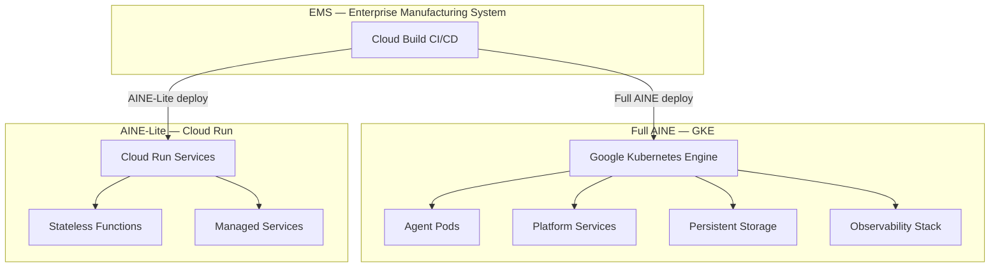
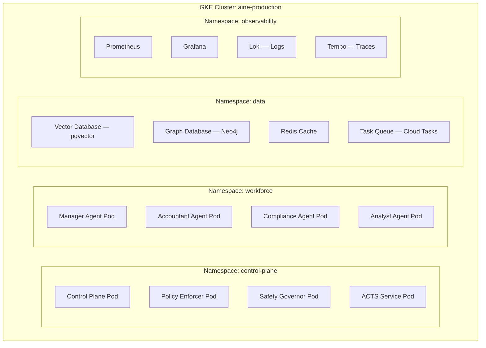
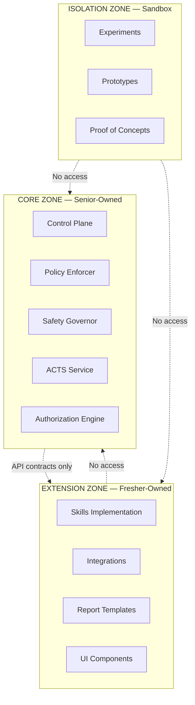
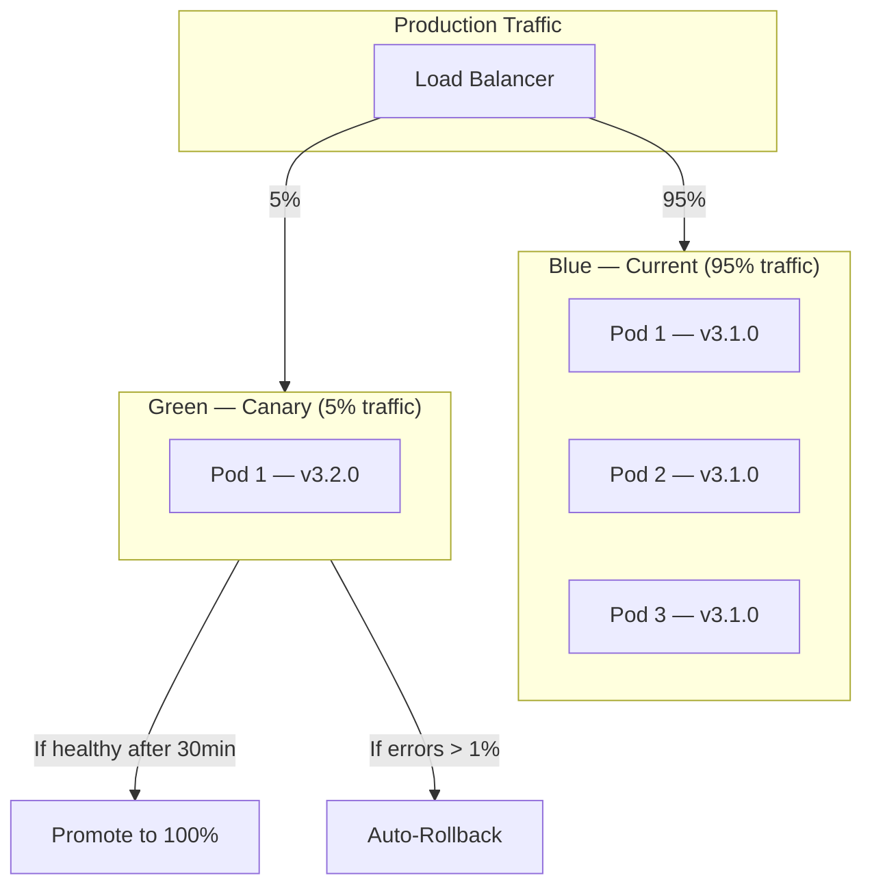

---

sidebar_position: 13
title: "Deployment Infrastructure"
description: "Complete deployment infrastructure architecture — GKE for full AINEs, Cloud Run for AINE-Lite, CI/CD pipelines, Golden Repo Template, architecture zones, guardrails, and Documentation-as-Code."
tags: [architecture, technical, operational]
custom_status: active
custom_owner: Andrew Leo
custom_last_review: 2026-03-01
custom_next_review: 2026-06-01
---

# Deployment Infrastructure

Every AINE in the AINEFF Ecosystem runs on a standardized, repeatable, auditable infrastructure stack. There are no snowflake deployments. Every AINE is deployed through the same pipeline, monitored with the same observability stack, and governed by the same infrastructure guardrails.

---

## Target Execution Environments



---

## GKE: Full AINE Deployment

GKE is the primary execution environment for production AINEs. It provides the compute isolation, scaling, and lifecycle management required for governed autonomous operations.

### GKE Cluster Architecture



### GKE Configuration

```yaml
# Kubernetes cluster specification
apiVersion: container.cnrm.cloud.google.com/v1beta1
kind: ContainerCluster
metadata:
  name: aine-production-us-central1
spec:
  location: us-central1
  releaseChannel:
    channel: STABLE

  # Node pools
  nodeConfig:
    machineType: e2-standard-8
    diskSizeGb: 100
    diskType: pd-ssd
    oauthScopes:
      - "https://www.googleapis.com/auth/cloud-platform"

  # Security
  masterAuth:
    clientCertificateConfig:
      issueClientCertificate: false
  networkPolicy:
    enabled: true
    provider: CALICO
  privateClusterConfig:
    enablePrivateNodes: true
    enablePrivateEndpoint: false
    masterIpv4CidrBlock: "172.16.0.0/28"

  # Autoscaling
  autoscaling:
    enableNodeAutoprovisioning: true
    resourceLimits:
      - resourceType: cpu
        minimum: 8
        maximum: 128
      - resourceType: memory
        minimum: 32
        maximum: 512

  # Maintenance
  maintenancePolicy:
    window:
      recurringWindow:
        window:
          startTime: "2026-01-01T04:00:00Z"
          endTime: "2026-01-01T08:00:00Z"
        recurrence: "FREQ=WEEKLY;BYDAY=SU"
```

### Agent Pod Specification

```yaml
# Example: Accountant Agent Pod
apiVersion: apps/v1
kind: Deployment
metadata:
  name: agent-accountant
  namespace: workforce
  labels:
    aine.id: "aine-01-finance"
    agent.type: "composite"
    agent.role: "accountant"
    afb.version: "3.2.1"
spec:
  replicas: 2
  selector:
    matchLabels:
      agent: accountant
  template:
    metadata:
      labels:
        agent: accountant
      annotations:
        sidecar.istio.io/inject: "true"
    spec:
      serviceAccountName: agent-accountant-sa
      containers:
        - name: agent
          image: gcr.io/aineff-production/agent-accountant:v3.2.1
          ports:
            - containerPort: 8080
              name: grpc
            - containerPort: 9090
              name: metrics
          resources:
            requests:
              cpu: "500m"
              memory: "1Gi"
            limits:
              cpu: "2000m"
              memory: "4Gi"
          env:
            - name: AINE_ID
              value: "aine-01-finance"
            - name: AGENT_ID
              valueFrom:
                fieldRef:
                  fieldPath: metadata.name
            - name: AFB_VERSION
              value: "3.2.1"
            - name: TRACE_ENABLED
              value: "true"    # Always true. Non-negotiable.
          livenessProbe:
            grpc:
              port: 8080
            initialDelaySeconds: 10
            periodSeconds: 30
          readinessProbe:
            grpc:
              port: 8080
            initialDelaySeconds: 5
            periodSeconds: 10
          startupProbe:
            grpc:
              port: 8080
            failureThreshold: 30
            periodSeconds: 10

        # Sidecar: Trace emitter
        - name: trace-emitter
          image: gcr.io/aineff-production/trace-emitter:v1.2.0
          ports:
            - containerPort: 4317
              name: otlp
          resources:
            requests:
              cpu: "100m"
              memory: "128Mi"
            limits:
              cpu: "200m"
              memory: "256Mi"
```

---

## Cloud Run: AINE-Lite

AINE-Lite is a constrained version of an AINE that runs on Cloud Run (serverless) instead of GKE. It is designed for simple, single-function AINEs that do not need persistent compute.

### AINE vs. AINE-Lite Comparison

| Property | AINE (GKE) | AINE-Lite (Cloud Run) |
|----------|------------|----------------------|
| Compute model | Always-on Kubernetes pods | Scale-to-zero serverless |
| Max agents | 50+ | 5 |
| Persistent storage | Vector DB, Graph DB, Redis | Cloud Firestore only |
| Memory system | Full (STM, WM, LTM, EM, SM) | Reduced (STM, WM, limited LTM) |
| PEP complexity | Full unique protocol suite | Simplified protocol |
| Cost | $500-5,000/month | $10-100/month |
| Best for | Multi-domain, high-volume, enterprise | Single-skill, low-volume, Micro-SaaS |
| Cold start | None (always on) | 2-10 seconds |

### Cloud Run Configuration

```yaml
# Example: AINE-Lite on Cloud Run
apiVersion: serving.knative.dev/v1
kind: Service
metadata:
  name: aine-lite-receipt-scanner
spec:
  template:
    metadata:
      annotations:
        autoscaling.knative.dev/minScale: "0"
        autoscaling.knative.dev/maxScale: "10"
        run.googleapis.com/cpu-throttling: "true"
    spec:
      containerConcurrency: 10
      timeoutSeconds: 30
      containers:
        - image: gcr.io/aineff-production/aine-lite-receipt-scanner:v1.0.0
          ports:
            - containerPort: 8080
          resources:
            limits:
              cpu: "2"
              memory: "2Gi"
          env:
            - name: AINE_ID
              value: "aine-lite-receipt-scanner"
            - name: TRACE_ENABLED
              value: "true"
```

---

## Cloud Build CI/CD Pipeline

All deployments pass through Cloud Build. No manual deployments exist. No SSH-to-production. No kubectl-from-laptop.

### Pipeline Stages

```mermaid
graph LR
    subgraph Source["Source"]
        GIT[Git Push / PR Merge]
    end

    subgraph Build["Build"]
        LINT[Lint & Format]
        TEST_UNIT[Unit Tests]
        TEST_INT[Integration Tests]
        SECURITY[Security Scan]
        BUILD_IMG[Build Container Image]
    end

    subgraph Validate["Validate"]
        POLICY_CHECK[Policy Compliance Check]
        AFB_VALIDATE[AFB Validation]
        SCHEMA_CHECK[Schema Migration Check]
    end

    subgraph Deploy_Stages["Deploy"]
        STAGING[Deploy to Staging]
        SMOKE[Smoke Tests on Staging]
        CANARY[Canary Deploy — 5% traffic]
        MONITOR_CANARY[Monitor Canary — 30 min]
        FULL[Full Rollout]
    end

    Source --> Build --> Validate --> Deploy_Stages
```



### Cloud Build Configuration

```yaml
# cloudbuild.yaml — Standard AINE Deployment Pipeline
steps:
  # Lint
  - id: 'lint'
    name: 'node:20'
    entrypoint: 'npm'
    args: ['run', 'lint']
    waitFor: ['-']

  # Unit tests
  - id: 'unit-tests'
    name: 'node:20'
    entrypoint: 'npm'
    args: ['run', 'test:unit']
    waitFor: ['lint']

  # Integration tests
  - id: 'integration-tests'
    name: 'node:20'
    entrypoint: 'npm'
    args: ['run', 'test:integration']
    waitFor: ['unit-tests']

  # Security scan
  - id: 'security-scan'
    name: 'gcr.io/$PROJECT_ID/security-scanner'
    args: ['scan', '--strict']
    waitFor: ['lint']

  # Build image
  - id: 'build-image'
    name: 'gcr.io/cloud-builders/docker'
    args: ['build', '-t', 'gcr.io/$PROJECT_ID/$_SERVICE_NAME:$COMMIT_SHA', '.']
    waitFor: ['integration-tests', 'security-scan']

  # Push image
  - id: 'push-image'
    name: 'gcr.io/cloud-builders/docker'
    args: ['push', 'gcr.io/$PROJECT_ID/$_SERVICE_NAME:$COMMIT_SHA']
    waitFor: ['build-image']

  # Policy compliance check
  - id: 'policy-check'
    name: 'gcr.io/$PROJECT_ID/policy-checker'
    args: ['check', '--image', 'gcr.io/$PROJECT_ID/$_SERVICE_NAME:$COMMIT_SHA']
    waitFor: ['push-image']

  # Deploy canary
  - id: 'canary-deploy'
    name: 'gcr.io/cloud-builders/gke-deploy'
    args:
      - 'run'
      - '--filename=kubernetes/canary.yaml'
      - '--image=gcr.io/$PROJECT_ID/$_SERVICE_NAME:$COMMIT_SHA'
      - '--cluster=$_CLUSTER'
      - '--location=$_REGION'
    waitFor: ['policy-check']

  # Monitor canary (30 minutes)
  - id: 'canary-monitor'
    name: 'gcr.io/$PROJECT_ID/canary-monitor'
    args: ['monitor', '--duration=30m', '--error-threshold=1%']
    waitFor: ['canary-deploy']
    timeout: 2400s

  # Full rollout
  - id: 'full-deploy'
    name: 'gcr.io/cloud-builders/gke-deploy'
    args:
      - 'run'
      - '--filename=kubernetes/production.yaml'
      - '--image=gcr.io/$PROJECT_ID/$_SERVICE_NAME:$COMMIT_SHA'
      - '--cluster=$_CLUSTER'
      - '--location=$_REGION'
    waitFor: ['canary-monitor']

timeout: 3600s
```

---

## Golden Repo Template

Every AINE is manufactured from a standardized repository template. This ensures consistency across all AINEs.

### Repository Structure

```
aine-{id}/
├── .github/
│   └── CODEOWNERS                  # Ownership by architecture zone
│
├── cloudbuild.yaml                 # CI/CD pipeline definition
├── Dockerfile                      # Standardized multi-stage build
├── docker-compose.yaml             # Local development environment
│
├── src/
│   ├── core/                       # ZONE: Core (senior-owned)
│   │   ├── control-plane/
│   │   ├── policy-enforcer/
│   │   ├── safety-governor/
│   │   └── acts-service/
│   │
│   ├── extension/                  # ZONE: Extension (fresher-owned)
│   │   ├── skills/
│   │   ├── integrations/
│   │   └── reports/
│   │
│   └── isolation/                  # ZONE: Isolation (sandbox)
│       ├── experiments/
│       └── prototypes/
│
├── tests/
│   ├── unit/
│   ├── integration/
│   ├── compliance/
│   ├── smoke/
│   └── stress/
│
├── kubernetes/
│   ├── base/                       # Kustomize base manifests
│   ├── staging/                    # Staging overlays
│   ├── canary/                     # Canary deployment
│   └── production/                 # Production overlays
│
├── terraform/                      # Infrastructure as Code
│   ├── main.tf
│   ├── variables.tf
│   ├── outputs.tf
│   └── modules/
│
├── migrations/                     # Database schema migrations
│   ├── 001_initial.sql
│   ├── 002_add_audit_tables.sql
│   └── ...
│
├── observability/
│   ├── prometheus-rules.yaml       # Alert rules
│   ├── grafana-dashboards/         # Dashboard JSON
│   └── slo-definitions.yaml        # SLO/SLI definitions
│
├── docs/                           # Documentation-as-Code
│   ├── cer.yaml                    # Canonical Enterprise Record
│   ├── genome.yaml
│   ├── agents/
│   ├── skills/
│   ├── apis/
│   ├── runbooks/
│   └── CHANGELOG.md
│
├── scripts/
│   ├── setup.sh                    # Local dev setup
│   ├── seed.sh                     # Test data seeding
│   └── healthcheck.sh              # Manual health check
│
├── .env.example                    # Environment variable template (NO secrets)
├── .gitignore
├── package.json                    # (or go.mod, requirements.txt, etc.)
└── README.md
```

---

## Three Architecture Zones

The codebase is divided into three zones with different ownership, review, and testing requirements.



### Zone Policies

| Policy | Core | Extension | Isolation |
|--------|------|-----------|-----------|
| **Ownership** | Senior engineers only | Junior engineers welcome | Anyone |
| **Code review** | 2 senior reviewers required | 1 reviewer required | Self-review OK |
| **Test coverage** | 95% minimum | 80% minimum | 50% minimum |
| **Deploy to production** | Yes, through full pipeline | Yes, through full pipeline | Never |
| **Access to production data** | Yes (read-only for debugging) | No | No |
| **Can modify governance logic** | Yes | No | No |
| **Can add new capabilities** | Yes | Yes (with AFB approval) | Yes (sandbox only) |
| **Breaking change allowed** | With migration plan + 2 approvers | No | Yes (sandbox only) |

---

## Infrastructure Guardrails

These guardrails are enforced by CI/CD and cannot be bypassed.

### 1. Protected Branches

```yaml
# Branch protection rules
main:
  required_reviews: 2
  required_status_checks:
    - lint
    - unit-tests
    - integration-tests
    - security-scan
    - policy-check
  enforce_admins: true
  allow_force_push: false
  allow_deletion: false
```

### 2. Blocking CI

All CI checks must pass before merge. No exceptions. No "merge anyway" button.

### 3. Test-First

New features require tests before implementation code. CI enforces test coverage thresholds.

### 4. IaC Only (Terraform/Pulumi)

No infrastructure may be created manually. All infrastructure is defined in code and deployed through the pipeline.

```hcl
# Example: Vector database instance
resource "google_sql_database_instance" "vector_db" {
  name             = "aine-01-finance-vectordb"
  database_version = "POSTGRES_15"
  region           = "us-central1"

  settings {
    tier = "db-custom-4-16384"

    database_flags {
      name  = "shared_preload_libraries"
      value = "pgvector"
    }

    backup_configuration {
      enabled    = true
      start_time = "03:00"
    }

    ip_configuration {
      ipv4_enabled    = false
      private_network = google_compute_network.aine_vpc.id
    }
  }

  deletion_protection = true
}
```

### 5. Feature Flags

All new features are deployed behind feature flags. Flags enable instant rollback without redeployment.

```typescript
// Feature flag check
if (featureFlags.isEnabled('new-invoice-parser', {
  aineId: context.aineId,
  rolloutPercentage: 10,  // 10% of traffic
})) {
  return newInvoiceParser.process(invoice);
} else {
  return legacyInvoiceParser.process(invoice);
}
```

### 6. Mandatory Telemetry

Every deployed component must emit metrics, logs, and traces. Components without telemetry are rejected by CI.

```typescript
// Required telemetry interface
interface TelemetryRequirements {
  metrics: {
    requestCount: Counter;
    requestDuration: Histogram;
    errorRate: Gauge;
    activeConnections: Gauge;
  };
  logs: {
    format: 'structured-json';
    fields: ['timestamp', 'level', 'message', 'trace_id', 'agent_id'];
  };
  traces: {
    protocol: 'otlp';
    samplingRate: number;  // Minimum 10% in production
  };
  healthChecks: {
    startup: HealthCheck;
    liveness: HealthCheck;
    readiness: HealthCheck;
  };
}
```

### 7. Schema Migration

Database schema changes must go through versioned, reversible migrations. No ad-hoc SQL in production.

```sql
-- migrations/003_add_confidence_decay.sql
-- Up migration
ALTER TABLE long_term_memory
  ADD COLUMN half_life_days FLOAT NOT NULL DEFAULT 180.0,
  ADD COLUMN last_validated_at TIMESTAMP WITH TIME ZONE NOT NULL DEFAULT NOW(),
  ADD COLUMN current_confidence FLOAT NOT NULL DEFAULT 1.0;

CREATE INDEX idx_ltm_confidence ON long_term_memory(current_confidence);

-- Down migration (for rollback)
ALTER TABLE long_term_memory
  DROP COLUMN IF EXISTS half_life_days,
  DROP COLUMN IF EXISTS last_validated_at,
  DROP COLUMN IF EXISTS current_confidence;
```

### 8. Least Privilege

Every service account, pod, and API key has the minimum permissions required. No wildcard permissions. No admin keys in application code.

### 9. Environment Separation

```
┌─────────────────┐    ┌─────────────────┐    ┌─────────────────┐
│   Development    │    │    Staging       │    │   Production    │
│                  │    │                  │    │                 │
│ Local Docker     │    │ GKE Staging      │    │ GKE Production  │
│ Compose          │    │ Cluster          │    │ Cluster         │
│                  │    │                  │    │                 │
│ Fake data        │    │ Anonymized data  │    │ Real data       │
│ No telemetry     │    │ Full telemetry   │    │ Full telemetry  │
│ No PEP           │    │ Test PEP         │    │ Production PEP  │
│ No billing       │    │ Test billing     │    │ Real billing    │
└─────────────────┘    └─────────────────┘    └─────────────────┘
        ↓                       ↓                      ↓
   Developer laptop         PR merge              Release tag
```

### 10. Blue/Green and Canary Deployments



---

## Documentation-as-Code

Every AINE ships with a versioned, executable documentation repository. Documentation is treated with the same rigor as code.

### Documentation Pipeline

```mermaid
graph LR
    WRITE[Write Docs] --> LINT_DOCS[Lint Docs]
    LINT_DOCS --> TEST_DOCS[Test Doc Links & References]
    TEST_DOCS --> BUILD_DOCS[Build Doc Site]
    BUILD_DOCS --> DEPLOY_DOCS[Deploy to docs.aine-{id}.aineff.io]
```

### Documentation Requirements

| Rule | Enforcement |
|------|-------------|
| Every agent has a doc page | CI checks `docs/agents/` for each agent in the genome |
| Every skill has a doc page | CI checks `docs/skills/` for each skill in the manifest |
| API docs are auto-generated | OpenAPI spec generated from code annotations |
| Runbooks are tested | Runbook commands are executed in CI against staging |
| No broken links | Link checker runs in CI |
| Docs versioned with code | Same Git tag, same release |
| Docs reviewed | Documentation PRs require the same review as code PRs |
| CER is machine-readable | CER YAML is validated against the CER schema |
| CHANGELOG updated | CI enforces CHANGELOG entry for every version bump |
