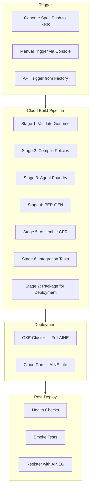
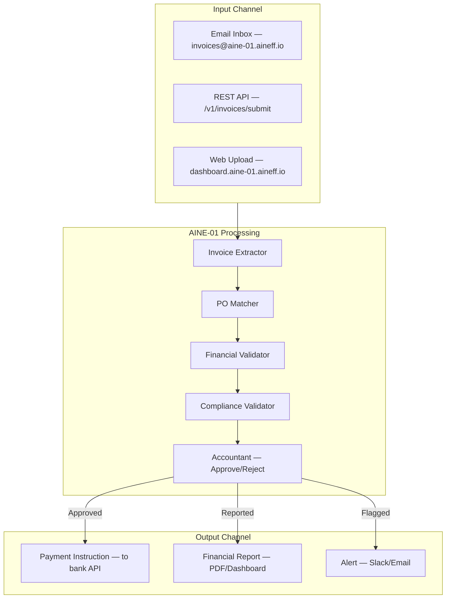

---

sidebar_position: 9
title: "Enterprise Manufacturing System (EMS)"
description: "Full PRD for the Enterprise Manufacturing System — the factory that produces AINEs as atomic governed enterprises with CI/CD pipelines, mandatory artifacts, and Documentation-as-Code."
tags: [architecture, technical, ainef-os]
custom_status: active
custom_owner: Andrew Leo
custom_last_review: 2026-03-01
custom_next_review: 2026-06-01
---

# Enterprise Manufacturing System (EMS)

The EMS is the factory floor of the AINEFF Ecosystem. Its sole purpose is to manufacture AINEs -- autonomous intelligent economic entities -- as **atomic governed enterprises**. Every AINE that exists was produced by the EMS. No AINE may be created outside this system.

---

## Purpose

```
INPUT:  AINE Genome Specification
OUTPUT: Running AINE with CER (Canonical Enterprise Record)
```

The EMS transforms a declarative genome specification into a fully operational enterprise with:
- A complete agent complement
- Compiled policy constraints
- A unique Private Enterprise Protocol (PEP)
- Deployed infrastructure
- A Canonical Enterprise Record (CER) that serves as its "birth certificate"

---

## CER: Canonical Enterprise Record

The CER is the authoritative record of an AINE's identity, constitution, and operating parameters. It is produced at manufacture time and is immutable for the AINE's lifetime.

```yaml
cer:
  # Identity
  id: "aine-01-finance"
  version: "1.0.0"
  manufactured_at: "2026-03-01T10:00:00Z"
  manufactured_by: "ems-production-01"
  genome_id: "genome-finance-v2.3.0"
  genome_hash: "sha256:abc123def456..."

  # Mandate
  mandate:
    description: "Accounts payable automation for US-based SMBs"
    scope: "Invoice processing, vendor payment, financial reporting"
    boundaries:
      - "May NOT process payroll"
      - "May NOT open bank accounts"
      - "May NOT execute wire transfers above $100,000"
      - "May NOT operate outside US jurisdiction"

  # Industry Classifications
  industry:
    naics: "523110"       # Investment Banking and Securities Dealing
    sic: "6211"           # Security Brokers, Dealers, and Flotation Companies
    isic: "K6411"         # Central banking
    gics: "40101010"      # Diversified Banks
    unspsc: "84111500"    # Accounting services
    hs: "N/A"             # Not a goods producer

  # Power Ceilings
  power_ceilings:
    max_transaction_value_usd: 500000
    max_daily_transaction_volume: 10000
    max_concurrent_agents: 50
    max_memory_gb: 256
    max_compute_vcpus: 64
    max_api_calls_per_minute: 1000
    jurisdictions: ["US"]
    data_classifications_allowed: ["public", "internal", "confidential"]
    prohibited_capabilities: ["wire_transfer", "account_creation", "payroll"]

  # Failure Budget
  failure_budget:
    operational:
      uptime_target: 0.999
      max_incidents_per_month: 3
      max_recovery_time_minutes: 30
    compliance:
      tolerance: 0.0                # Zero tolerance for compliance failures
    security:
      tolerance: 0.0                # Zero tolerance for security failures

  # Exit Protocol
  exit_protocol:
    type: "standard-financial-7yr-retention"
    memory_disposition:
      financial_records: "archive"   # 7-year retention
      customer_data: "destroy"       # GDPR compliance
      operational_logs: "archive"    # 3-year retention
      agent_states: "destroy"
    notification_targets:
      - "aineg-registry"
      - "affected-customers"
      - "regulatory-bodies"
    max_exit_duration_hours: 48

  # Ownership Graph
  ownership:
    owner: "frankmax-digital"
    group: "aineg-01"
    federation: "aineff-01"
    equity_split:
      - entity: "frankmax-digital"
        percentage: 100.0
    governance_rights:
      - entity: "frankmax-digital"
        rights: ["modify_genome", "trigger_exit", "modify_power_ceiling"]
```

---

## Mandatory Artifacts

Every manufactured AINE must include ALL of the following artifacts. Missing artifacts prevent the AINE from deploying.

| Artifact | Description | Validation |
|----------|-------------|------------|
| **Mandate** | Natural-language statement of what the AINE exists to do | Must be bounded, falsifiable, non-overlapping with other AINEs in the group |
| **Industry Classifications** | NAICS, SIC, ISIC, GICS, UNSPSC, HS codes | At least NAICS + one additional classification required |
| **Power Ceilings** | Hard limits on transaction value, agent count, compute, jurisdictions | Must not exceed parent AINEG ceilings |
| **Failure Budgets** | Quantified tolerance for operational, compliance, and security failures | Compliance and security default to zero |
| **Exit Protocol** | Complete plan for AINE shutdown | Must specify disposition for every memory class |
| **Ownership Graph** | Who owns the AINE and their governance rights | Must trace to a verified legal entity |
| **Agent Complement** | List of all agents with their AFBs | Must include Safety Governor and Auditor as minimum |
| **PEP Bundle** | Generated private protocol suite | Produced by PEP-GEN, sealed and signed |
| **Policy Set** | Compiled governance constraints | Compiled by Policy Compiler from AINEFF Lawbook |
| **Health Check Config** | Startup, liveness, and readiness probe definitions | Must pass before AINE is marked Active |

---

## CI/CD Pipeline

The EMS uses **Cloud Build** as the orchestration engine for AINE manufacturing.

### Pipeline Architecture



### Cloud Build Configuration

```yaml
# cloudbuild.yaml — AINE Manufacturing Pipeline
steps:
  # Stage 1: Validate genome against Lifecycle Lawbook
  - id: 'validate-genome'
    name: 'gcr.io/$PROJECT_ID/ems-validator'
    args: ['validate', '--genome', '${_GENOME_PATH}', '--lawbook', 'latest']
    waitFor: ['-']

  # Stage 2: Compile governance policies
  - id: 'compile-policies'
    name: 'gcr.io/$PROJECT_ID/ems-policy-compiler'
    args: ['compile', '--genome', '${_GENOME_PATH}', '--output', '/workspace/policies/']
    waitFor: ['validate-genome']

  # Stage 3: Manufacture agents from AFB specifications
  - id: 'agent-foundry'
    name: 'gcr.io/$PROJECT_ID/ems-agent-foundry'
    args: ['build', '--genome', '${_GENOME_PATH}', '--policies', '/workspace/policies/']
    waitFor: ['compile-policies']

  # Stage 4: Generate unique PEP
  - id: 'pep-gen'
    name: 'gcr.io/$PROJECT_ID/ems-pep-gen'
    args: ['generate', '--aine-id', '${_AINE_ID}']
    waitFor: ['agent-foundry']

  # Stage 5: Assemble CER
  - id: 'assemble-cer'
    name: 'gcr.io/$PROJECT_ID/ems-assembler'
    args: ['assemble', '--output', '/workspace/cer/']
    waitFor: ['pep-gen']

  # Stage 6: Run integration tests
  - id: 'integration-tests'
    name: 'gcr.io/$PROJECT_ID/ems-test-runner'
    args: ['test', '--cer', '/workspace/cer/', '--suite', 'integration']
    waitFor: ['assemble-cer']

  # Stage 7: Package deployment artifacts
  - id: 'package'
    name: 'gcr.io/$PROJECT_ID/ems-packager'
    args: ['package', '--cer', '/workspace/cer/', '--target', '${_DEPLOY_TARGET}']
    waitFor: ['integration-tests']

  # Stage 8: Deploy to GKE
  - id: 'deploy'
    name: 'gcr.io/cloud-builders/gke-deploy'
    args: ['run', '--filename', '/workspace/deploy/', '--cluster', '${_CLUSTER}']
    waitFor: ['package']

  # Stage 9: Health checks
  - id: 'health-check'
    name: 'gcr.io/$PROJECT_ID/ems-health-checker'
    args: ['check', '--aine-id', '${_AINE_ID}', '--timeout', '300']
    waitFor: ['deploy']

  # Stage 10: Register with AINEG
  - id: 'register'
    name: 'gcr.io/$PROJECT_ID/ems-registrar'
    args: ['register', '--aine-id', '${_AINE_ID}', '--group', '${_AINEG_ID}']
    waitFor: ['health-check']

substitutions:
  _GENOME_PATH: 'genomes/finance-v2.3.0.yaml'
  _AINE_ID: 'aine-01-finance'
  _DEPLOY_TARGET: 'gke'
  _CLUSTER: 'aine-production-us-central1'
  _AINEG_ID: 'aineg-01'

options:
  logging: CLOUD_LOGGING_ONLY
  machineType: 'E2_HIGHCPU_8'
```

### Jules (AI Engineer) Integration

Jules, the AI software engineer, writes code for AINE components during manufacturing:

| Jules Responsibility | Output |
|---------------------|--------|
| Agent implementation code | TypeScript/Python agent modules |
| Integration test suites | Automated test cases for all agent interactions |
| Deployment configurations | Kubernetes manifests, Terraform modules |
| Documentation | Auto-generated docs for every manufactured AINE |
| Bug fixes | Automated fix PRs when health checks fail |

Jules operates under strict constraints:
- All code passes through the standard CI pipeline
- Code review is mandatory (by human or senior AI reviewer)
- No direct production access -- all changes go through Cloud Build
- Every code change is traced and attributed

---

## AINE Instantiation Walkthrough

Step-by-step process for manufacturing a new AINE:

### Phase 1: Specification (Human-Driven)

```
1. Define mandate → "What will this AINE do?"
2. Select industry codes → NAICS, SIC, ISIC, GICS
3. Set power ceilings → Transaction limits, jurisdiction, compute
4. Define failure budgets → How much failure is acceptable?
5. Design exit protocol → What happens when this AINE dies?
6. Specify agent complement → Which agents does it need?
7. Commit genome to repo → Version-controlled specification
```

### Phase 2: Manufacturing (Automated)

```
 8. Cloud Build triggers on genome push
 9. Genome validated against Lifecycle Lawbook
10. Policies compiled from Lawbook + genome constraints
11. Agents manufactured in Agent Foundry
12. PEP generated (unique sealed protocol)
13. CER assembled (all artifacts combined)
14. Integration tests executed
15. Deployment package created
```

### Phase 3: Deployment (Automated)

```
16. Kubernetes manifests applied to GKE cluster
17. Pods scheduled and started
18. Startup health checks executed
19. Liveness probes confirmed
20. Readiness probes confirmed
21. AINE registered with AINEG
22. AINE marked ACTIVE in Registry
```

### Phase 4: Verification (Automated + Human)

```
23. Smoke tests executed against live AINE
24. First audit cycle runs
25. Safety Governor reports green
26. Human operator reviews and confirms
27. AINE enters normal operations
```

---

## AINE-01 Example: Finance-Only Pilot

The first AINE manufactured by the EMS, designed as a minimal viable enterprise for accounts payable automation.

### AINE-01 Specifications

| Parameter | Value |
|-----------|-------|
| **ID** | `aine-01-finance` |
| **Mandate** | Invoice validation and payment processing for US-based SMBs |
| **Industry** | NAICS 523110, SIC 6211 |
| **Jurisdictions** | US only |
| **Max Transaction** | $100,000 |
| **Agent Count** | 16 (6 primitive, 5 role, 3 composite, 2 meta) |
| **Deployment** | GKE, us-central1 |
| **Failure Budget** | 99.9% uptime, zero compliance failures |

### AINE-01 Agent Complement

```
Meta-Role Agents (2):
  ├── Safety Governor
  └── Auditor

Composite Agents (3):
  ├── Accountant (invoice processing)
  ├── Compliance Officer (financial regulations)
  └── Reporter (financial reporting)

Primitive Role Agents (5):
  ├── Invoice Extractor
  ├── PO Matcher
  ├── Financial Validator
  ├── Compliance Validator
  └── Statement Reporter

Primitive Capability Agents (6):
  ├── Read
  ├── Write
  ├── Compute
  ├── Search
  ├── Verify
  └── Execute
```

### Finance-Only Live Pilot Design



---

## Documentation-as-Code Architecture

Every AINE ships with a versioned, executable documentation repository. Documentation is not a side artifact -- it is a first-class manufactured component.

### Documentation Repository Structure

```
aine-01-finance-docs/
├── README.md                     # AINE overview and quick start
├── cer.yaml                      # Canonical Enterprise Record
├── genome.yaml                   # Genome specification
│
├── agents/
│   ├── safety-governor.md        # Agent documentation
│   ├── auditor.md
│   ├── accountant.md
│   └── ...
│
├── skills/
│   ├── invoice-validation.md     # Skill documentation
│   ├── payment-processing.md
│   └── ...
│
├── apis/
│   ├── openapi.yaml              # OpenAPI 3.1 spec (PCP)
│   ├── graphql.schema            # GraphQL schema
│   └── postman-collection.json   # Postman collection for testing
│
├── policies/
│   ├── compiled-policies.json    # Machine-readable policies
│   └── policy-summary.md         # Human-readable policy summary
│
├── runbooks/
│   ├── incident-response.md      # What to do when things break
│   ├── scaling.md                # How to scale the AINE
│   └── exit-procedure.md         # How to shut down the AINE
│
├── tests/
│   ├── integration/              # Integration test suites
│   ├── compliance/               # Compliance test suites
│   └── smoke/                    # Smoke test suites
│
├── infrastructure/
│   ├── terraform/                # Infrastructure as Code
│   ├── kubernetes/               # Kubernetes manifests
│   └── cloudbuild.yaml           # CI/CD pipeline
│
└── CHANGELOG.md                  # Version history
```

### Documentation Invariants

| Rule | Enforcement |
|------|-------------|
| Docs versioned with AINE | Same Git repo, same version tags |
| API docs auto-generated | OpenAPI spec generated from code |
| Runbooks tested | Runbook steps are executable and tested in CI |
| No stale docs | CI fails if docs reference non-existent agents, skills, or APIs |
| Docs reviewed | Documentation changes require review, same as code |
