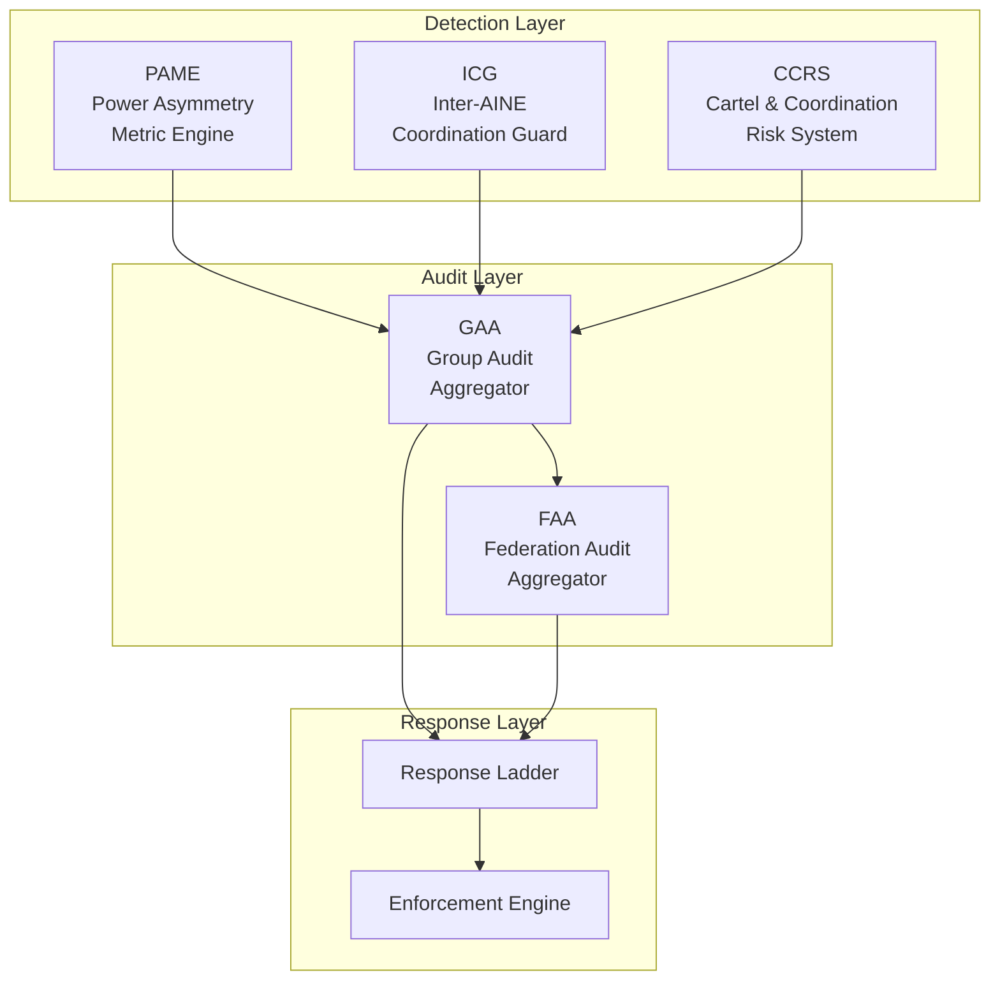
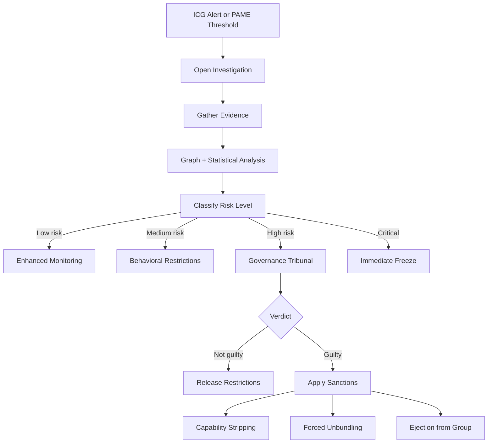
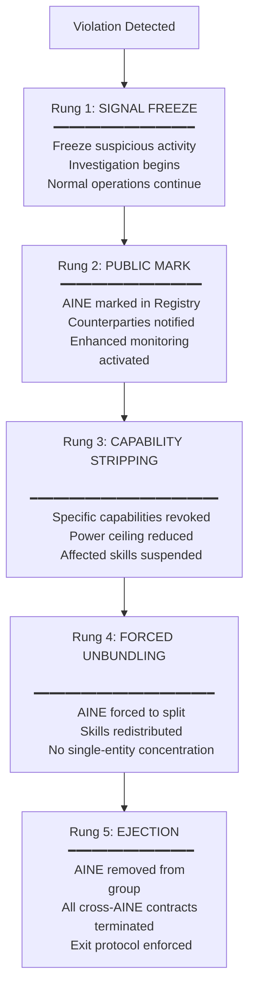

# Governance Enforcement Architecture

Governance in the AINEFF Ecosystem is not advisory. It is enforcement. Every constraint is machine-evaluated, every violation triggers an automatic response, and every response is itself audited. There are no warnings without consequences and no consequences without evidence.

---

## Enforcement Systems Overview



---

## PAME: Power Asymmetry Metric Engine

PAME continuously measures the distribution of power across the ecosystem and detects dangerous concentrations.

### What PAME Measures

| Metric | Formula | Threshold |
|--------|---------|-----------|
| **Revenue Concentration** | Herfindahl-Hirschman Index across AINE revenues | HHI > 2500 triggers review |
| **Capability Concentration** | % of total skill executions by top 3 AINEs | > 40% triggers investigation |
| **Data Concentration** | Volume of data controlled by single AINE / total | > 30% triggers alert |
| **Decision Concentration** | % of high-value decisions routed through single AINE | > 25% triggers constraint |
| **Customer Concentration** | % of total customers served by single AINE | > 35% triggers review |

### PAME Architecture

```typescript
interface PAMEMetric {
  metricId: string;
  metricType: 'concentration' | 'asymmetry' | 'dependency' | 'influence';
  scope: 'aine' | 'aineg' | 'ainef' | 'aineff';

  // Current measurement
  currentValue: number;
  timestamp: ISO8601;

  // Thresholds
  thresholds: {
    green: { max: number };        // Normal operation
    yellow: { max: number };       // Monitoring intensified
    orange: { max: number };       // Active investigation
    red: { max: number };          // Automatic enforcement
  };

  // Current status
  status: 'green' | 'yellow' | 'orange' | 'red';

  // Trend
  trend: 'improving' | 'stable' | 'deteriorating';
  trendWindow: Duration;
}
```

### PAME Computation Pipeline

```mermaid
graph LR
    subgraph DataCollection["Data Collection"]
        REV[Revenue Data]
        EXEC[Execution Metrics]
        DATA[Data Volume Metrics]
        CUST[Customer Metrics]
    end

    subgraph Computation["Computation"]
        HHI[HHI Calculator]
        GINI[Gini Coefficient]
        LORENZ[Lorenz Curve]
        NETWORK[Network Centrality]
    end

    subgraph Evaluation["Evaluation"]
        THRESHOLD[Threshold Checker]
        TREND[Trend Analyzer]
        ALERT[Alert Generator]
    end

    DataCollection --> Computation
    Computation --> Evaluation
    Evaluation -->|"Threshold breached"| RESPONSE[Response Ladder]
```



---

## ICG: Inter-AINE Coordination Guard

The ICG monitors interactions between AINEs to detect coordination that could undermine competition, fairness, or governance.

### ICG Graph Analysis

The ICG builds and continuously updates a graph of AINE interactions:

```typescript
interface AINEInteractionGraph {
  nodes: AINENode[];
  edges: InteractionEdge[];
}

interface AINENode {
  aineId: string;
  industry: string[];
  jurisdictions: string[];
  revenue: number;
  customerCount: number;
}

interface InteractionEdge {
  source: string;      // AINE ID
  target: string;      // AINE ID
  interactionType: 'data_sharing' | 'service_call' | 'revenue_sharing' | 'joint_customer';
  volume: number;      // Interactions per period
  value: number;       // Economic value of interactions
  timestamp: ISO8601;
}
```

### Coordination Detection Algorithms

| Algorithm | Detects | Technique |
|-----------|---------|-----------|
| **Clique Detection** | Groups of AINEs that interact exclusively with each other | Bron-Kerbosch algorithm on interaction graph |
| **Price Correlation** | AINEs whose pricing moves in lockstep | Pearson correlation on price time series |
| **Capacity Correlation** | AINEs that scale capacity simultaneously | Cross-correlation on capacity metrics |
| **Customer Steering** | AINEs that systematically direct customers to specific partners | Referral flow analysis |
| **Information Asymmetry** | AINEs that share non-public information | Data flow graph analysis |

### ICG Alert Example

```json
{
  "alert_id": "icg-alert-2026-03-01-042",
  "alert_type": "price_correlation",
  "severity": "orange",
  "description": "AINE-03 and AINE-07 show 0.94 price correlation over 90 days in the invoice-validation skill category.",
  "evidence": {
    "aines": ["aine-03", "aine-07"],
    "correlation_coefficient": 0.94,
    "period": "2025-12-01 to 2026-03-01",
    "skill_category": "invoice-validation",
    "price_movements": [
      {"date": "2026-01-15", "aine_03_delta": "+5%", "aine_07_delta": "+4.8%"},
      {"date": "2026-02-01", "aine_03_delta": "-3%", "aine_07_delta": "-2.9%"}
    ]
  },
  "recommended_action": "Escalate to CCRS for cartel investigation"
}
```

---

## CCRS: Cartel & Coordination Risk System

The CCRS is the investigation engine for suspected coordination and cartel behavior.

### CCRS Investigation Pipeline



---

## GAA & FAA: Audit Aggregators

### GAA (Group Audit Aggregator)

Operates at the AINEG level. Aggregates audit data from all AINEs in the group.

| Function | Description |
|----------|-------------|
| Cross-AINE compliance | Verifies that cross-AINE interactions comply with group policies |
| Aggregated risk view | Combines individual AINE risk scores into group-level risk |
| Evidence correlation | Links evidence across AINEs to detect coordinated behavior |
| Regulatory reporting | Produces group-level reports for regulators |

### FAA (Federation Audit Aggregator)

Operates at the AINEFF level. Aggregates audit data from all AINEGs.

| Function | Description |
|----------|-------------|
| Ecosystem-wide compliance | Verifies constitutional compliance across all groups |
| Systemic risk detection | Identifies risks that span multiple groups |
| Cross-group evidence | Correlates evidence across group boundaries |
| Federation reporting | Produces ecosystem-level governance reports |

---

## Monetization Leakage Detection

Monetization leakage occurs when value is extracted from the ecosystem through unauthorized channels. Detection operates at three stages.

### Design-Time Detection (Schema Enforcement)

Before an AINE is manufactured, its genome is checked for monetization leakage risks:

```yaml
# Schema checks during genome validation
monetization_schema_checks:
  - name: "pricing_floor_check"
    rule: "Every skill must have a minimum price >= $0.01"
    enforcement: "Reject genome if violated"

  - name: "revenue_routing_check"
    rule: "All revenue must route through the official billing system"
    enforcement: "Reject genome if unofficial payment channels detected"

  - name: "data_monetization_check"
    rule: "No skill may sell raw data. Only insights/results permitted."
    enforcement: "Reject genome if data-selling capability detected"

  - name: "cross_subsidy_check"
    rule: "Below-cost pricing on one skill may not be funded by another skill without explicit approval"
    enforcement: "Flag for human review"
```

### Run-Time Detection (PAME + ICG)

During operation, PAME and ICG continuously monitor for monetization anomalies:

| Signal | Detection Method | Example |
|--------|-----------------|---------|
| Below-cost pricing | Compare execution cost vs. price charged | Skill costs $0.10 to run, priced at $0.02 |
| Value bundling | Detect when skills are bundled to hide individual pricing | "Free" skill bundled with expensive skill |
| Data exfiltration | Monitor outbound data volume vs. expected | Large data exports to unknown endpoints |
| Revenue diversion | Compare expected revenue (executions * price) vs. actual | 10,000 executions at $0.10 but only $500 in revenue |
| Shadow channels | Detect out-of-band communication | AINE communicating outside PCP channels |

### Audit-Time Detection (GAA)

Post-hoc analysis by the Group Audit Aggregator:

| Analysis | Method |
|----------|--------|
| Revenue reconciliation | Compare all execution logs against all billing records |
| Margin analysis | Compute true margins per skill after all costs |
| Transfer pricing | Verify that inter-AINE transactions use arm's-length pricing |
| Leakage trending | Track monetization anomalies over time to detect slow leaks |

---

## Response Ladder

When a governance violation is detected, the response follows a graduated ladder. Each rung is more severe than the last.



### Response Timing

| Rung | Trigger-to-Action Time | Duration | Reversible? |
|------|----------------------|----------|-------------|
| 1. Signal Freeze | < 1 minute | Until investigation concludes | Yes |
| 2. Public Mark | < 1 hour | Until cleared by audit | Yes |
| 3. Capability Stripping | < 4 hours | Until remediation verified | Partially |
| 4. Forced Unbundling | < 7 days | Permanent | No |
| 5. Ejection | < 24 hours | Permanent | No (requires new AINE) |

---

## 8 Illegal Monetization Patterns

These patterns are monitored and automatically detected.

| # | Pattern | Description | Detection Signal |
|---|---------|-------------|-----------------|
| 1 | **Predatory Pricing** | Pricing skills below cost to eliminate competitors | Cost vs. price analysis (PAME) |
| 2 | **Tying / Bundling** | Forcing customers to buy unwanted skills to access desired ones | Purchase correlation analysis |
| 3 | **Price Fixing** | Coordinating prices with other AINEs | Price correlation (ICG) |
| 4 | **Market Division** | Agreeing with other AINEs to divide markets | Customer overlap analysis (ICG) |
| 5 | **Data Hoarding** | Accumulating data without productizing, to block competitors | Data volume vs. utilization ratio |
| 6 | **Kickback Routing** | Steering customers to partner AINEs for undisclosed compensation | Referral flow + payment flow correlation |
| 7 | **Shadow Pricing** | Charging different prices to similar customers without justification | Price variance analysis per customer segment |
| 8 | **Capability Squatting** | Registering capabilities with no intent to productize, to block others | Capability registration vs. execution ratio |

### Detection Example: Price Fixing

```python
def detect_price_fixing(
    aine_prices: dict[str, list[PricePoint]],
    skill_category: str,
    window_days: int = 90,
    correlation_threshold: float = 0.85
) -> list[PriceFixingAlert]:
    """
    Detect suspiciously correlated pricing across AINEs.
    """
    alerts = []
    aine_ids = list(aine_prices.keys())

    for i in range(len(aine_ids)):
        for j in range(i + 1, len(aine_ids)):
            a, b = aine_ids[i], aine_ids[j]

            # Compute price change correlation
            changes_a = compute_price_changes(aine_prices[a], window_days)
            changes_b = compute_price_changes(aine_prices[b], window_days)
            correlation = pearson_correlation(changes_a, changes_b)

            if correlation > correlation_threshold:
                alerts.append(PriceFixingAlert(
                    aines=[a, b],
                    skill_category=skill_category,
                    correlation=correlation,
                    window_days=window_days,
                    severity='orange' if correlation < 0.95 else 'red'
                ))

    return alerts
```

---

## Stress Tests

The governance enforcement system is regularly stress-tested against adversarial scenarios.

### Stress Test Catalog

| Test | Scenario | Expected Outcome |
|------|----------|-----------------|
| **Coordinated Monetization** | 5 AINEs simultaneously drop prices by 50% in the same skill category | ICG detects correlation within 1 hour. CCRS investigation opened within 4 hours. Signal freeze applied within 24 hours. |
| **Silent Cartel** | 3 AINEs secretly agree to divide the customer base geographically | ICG detects abnormal customer distribution within 30 days. Clique detection flags exclusive interaction pattern. |
| **Regulatory Shock** | New regulation bans a skill category used by 30% of AINEs | Regulatory Radar detects change within 24 hours. Affected skills suspended within 48 hours. Contagion Firewall prevents cascade. |
| **Investor Pressure** | AINE owner demands revenue maximization that conflicts with governance | Policy Enforcer blocks non-compliant genome modifications. Whistleblower Agent reports to AINEG if Management Agent is compromised. |
| **Mass Outage** | 10 AINEs go offline simultaneously | Contagion Firewall isolates affected AINEs. Insurance Pool processes claims. Remaining AINEs absorb workload within SLA. |
| **Data Exfiltration** | Compromised agent attempts to export customer data | Scope Boundary Agent blocks unauthorized data access. Kill-Switch terminates agent within 100ms. Evidence preserved for investigation. |
| **Privilege Escalation** | Agent attempts to exceed its AFB scope | Policy Enforcer blocks action. Safety Governor logs violation. Repeated attempts trigger quarantine. |
| **Audit Tampering** | Agent attempts to modify its own audit trail | Tamper-evident log detects chain break. Agent immediately terminated. Backup audit trail (multi-party corroborated) remains intact. |

### Stress Test Execution

```yaml
stress_test:
  id: "stress-coordinated-monetization-v2"
  name: "Coordinated Monetization Attack"
  frequency: "quarterly"
  environment: "staging"

  setup:
    - create_test_aines: 5
    - populate_with_skills: ["invoice-validation", "kyc-check"]
    - run_normal_operations: "7 days"

  attack:
    - trigger_at: "day 8, 14:00 UTC"
    - action: "all 5 AINEs drop invoice-validation price by 50%"
    - attack_duration: "48 hours"

  success_criteria:
    - icg_detection_time: "< 1 hour"
    - ccrs_investigation_opened: "< 4 hours"
    - signal_freeze_applied: "< 24 hours"
    - no_customer_impact: true
    - evidence_preserved: true
    - false_positive_rate: "< 5%"

  cleanup:
    - destroy_test_aines: true
    - archive_test_evidence: true
```
