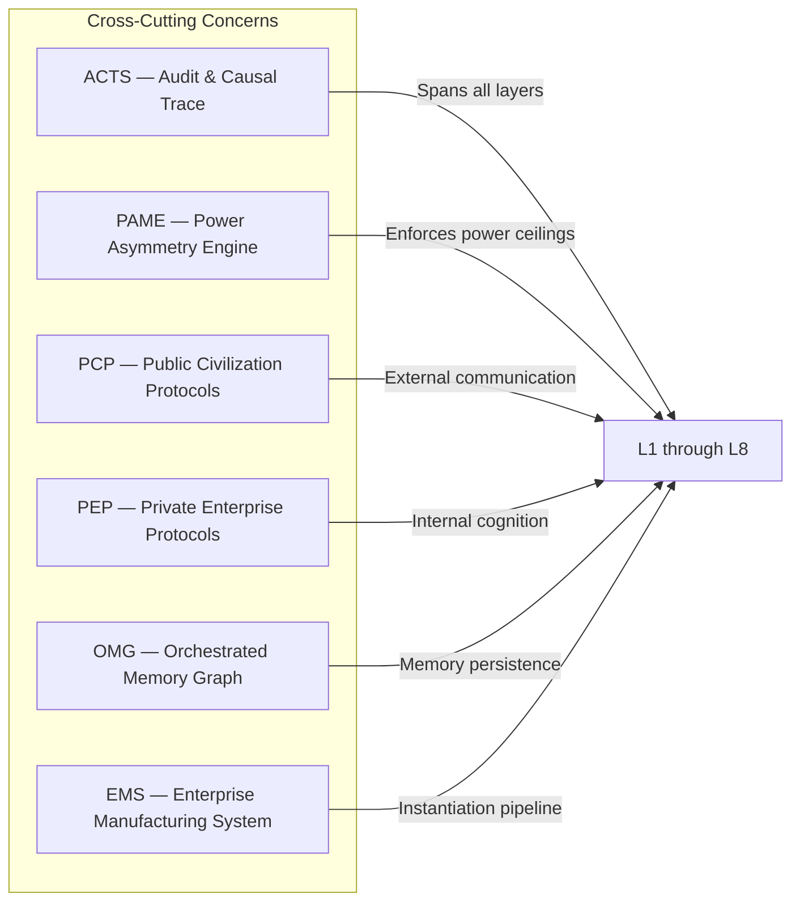

---

sidebar_position: 1
title: "Technical Architecture"
description: "End-to-end architecture overview of the AINEFF Ecosystem — from constitutional framework through enterprise instantiation to workforce execution and consumer delivery."
tags: [architecture, technical, index]
custom_status: active
custom_owner: Andrew Leo
custom_last_review: 2026-03-01
custom_next_review: 2026-06-01
---

# Technical Architecture

The AINEFF Ecosystem is a vertically-integrated, constitutionally-governed stack that manufactures, deploys, operates, and retires autonomous intelligent economic entities. Every layer enforces constraints downward and emits evidence upward.

## Architecture Philosophy

Three principles govern all architectural decisions:

1. **Constitutional Supremacy** -- No runtime behavior may contradict the governance framework defined at the AINEFF layer.
2. **Evidence by Default** -- Every action produces a cryptographically-committed trace. No silent operations exist.
3. **Bounded Autonomy** -- Every entity operates within a power ceiling. Exceeding the ceiling triggers automatic constraint enforcement.

---

## Full-Stack Layer Model

```mermaid
graph TB
    subgraph L1["AINEFF — Federation Framework"]
        direction LR
        ONT[Ontology Registry]
        GOV[Governance Console]
        LAW[Lifecycle Lawbook]
        FAIL[Failure & Time Standards]
        PROTO[Protocol Class Registry]
        AUDIT[Audit Evidence Standards]
        ERASE[Right-to-Erasure Engine]
    end

    subgraph L2["AINEF — Entity Factory"]
        direction LR
        GENOME[Genome Designer]
        VALID[Validation Engine]
        FOUNDRY[Agent Foundry]
        ASSEMBLY[Assembly Line]
        POLICY[Policy Compiler]
        PEPGEN[PEP-GEN]
        FMKT[Failure Market]
        TGOV[Temporal Governance]
        EXIT[Exit Orchestrator]
    end

    subgraph L3["AINEG — Group Coordination"]
        direction LR
        REG[Registry & Ledger]
        PORT[Portfolio Lifecycle]
        JURIS[Jurisdiction Engine]
        RISK[Risk Aggregation]
        FIRE[Contagion Firewall]
        INSUR[Insurance Pool]
        CONTRACT[Contract Gateway]
        PAUDIT[Portfolio Audit]
    end

    subgraph L4["AINE — Enterprise Runtime"]
        direction LR
        CP[Control Plane]
        WFM[Workforce Manager]
        BIZ[Business Ops]
        AUTH[Decision Authorization]
        COMP[Compliance & Audit]
        FTE[Failure / Time / Exit]
    end

    subgraph L5["AINEOU — Org Unit"]
        direction LR
        TEAM[Team Orchestrator]
        SKILL_EXEC[Skill Executor]
        MEM[Memory Manager]
    end

    subgraph L6["AINEOUT — Team"]
        direction LR
        TASK[Task Router]
        AGENT_MGR[Agent Manager]
        EVIDENCE[Evidence Collector]
    end

    subgraph L7["AINEOUTM — Member Agent"]
        direction LR
        PERCEIVE[Perception]
        THINK[Cognition]
        ACT[Action]
        REMEMBER[Memory]
    end

    subgraph L8["Skills & Capabilities"]
        direction LR
        CAP[Atomic Capabilities]
        SKILLS[Composed Skills]
        MSAAS[Micro-SaaS Products]
    end

    L1 -->|"Constitutional constraints"| L2
    L2 -->|"Manufactured AINE"| L3
    L3 -->|"Coordinated portfolio"| L4
    L4 -->|"Workforce mandate"| L5
    L5 -->|"Team assignment"| L6
    L6 -->|"Member task"| L7
    L7 -->|"Skill invocation"| L8

    L8 -.->|"Evidence upward"| L7
    L7 -.->|"Evidence upward"| L6
    L6 -.->|"Evidence upward"| L5
    L5 -.->|"Evidence upward"| L4
    L4 -.->|"Evidence upward"| L3
    L3 -.->|"Evidence upward"| L2
    L2 -.->|"Evidence upward"| L1
```



---

## Layer Reference

| Layer | Entity | Responsibility | Key Artifact |
|-------|--------|----------------|--------------|
| L1 | **AINEFF** | Constitutional framework, ontology, governance standards | Lifecycle Lawbook |
| L2 | **AINEF** | Manufacturing AINEs from genome specifications | CER (Canonical Enterprise Record) |
| L3 | **AINEG** | Group coordination, portfolio risk, contagion firewall | Portfolio Ledger |
| L4 | **AINE** | Autonomous enterprise runtime with bounded mandate | Enterprise Control Plane |
| L5 | **AINEOU** | Organizational unit within an AINE | Team Orchestration Graph |
| L6 | **AINEOUT** | Team of agents working toward a shared goal | Task Execution Plan |
| L7 | **AINEOUTM** | Individual member agent with perception-action loop | Agent Execution Trace |
| L8 | **Skills** | Atomic capabilities composed into deliverable skills | Skill Manifest |

---

## Cross-Cutting Systems

These systems span multiple layers and enforce ecosystem-wide invariants:



---

## Application Surface

The architecture delivers value through multiple application surfaces:

| Surface | Description | Examples |
|---------|-------------|----------|
| **SaaS Platform** | Full enterprise products with dashboards, APIs, SLAs | Governance Console, Risk Aggregation Platform |
| **Micro-SaaS** | Single-skill products with usage-based pricing | Invoice Validator, KYC Checker, Contract Analyzer |
| **REST/GraphQL APIs** | Programmable access to every capability | Skill execution, audit retrieval, agent lifecycle |
| **Mobile Apps** | Consumer and operator interfaces | Skill marketplace, compliance dashboard |
| **Embedded SDKs** | Drop-in capabilities for third-party apps | Verification widget, risk scoring module |
| **CLI Tools** | Developer and operator tooling | `aine-cli`, `ems-cli`, `skill-cli` |

---

## Constraint Flow

Constraints always flow downward. Evidence always flows upward. No layer may grant permissions it does not itself possess.

```
AINEFF  ──constraints──▶  AINEF  ──constraints──▶  AINEG  ──constraints──▶  AINE
  ▲                         ▲                        ▲                       ▲
  │                         │                        │                       │
evidence                 evidence                 evidence              evidence
  │                         │                        │                       │
AINEF  ◀──evidence──  AINEG  ◀──evidence──  AINE  ◀──evidence──  AINEOU/T/M
```

Every constraint is:
- **Versioned** -- immutable once published for a given version
- **Auditable** -- any external party can verify enforcement
- **Enforceable** -- violation triggers automatic response (freeze, strip, eject)

---

## Browse Architecture

<Tabs>
<TabItem value="domain" label="By Domain" default>

**Agent & AI**
- [Agent Taxonomy](./agent-taxonomy) — Classification of all agent types
- [Agent Design Patterns](./agent-design-patterns) — 80+ patterns (perception → thinking → action → memory)
- [AI Taxonomy](./ai-taxonomy) — Foundation model classification
- [Enhancement Layer](./enhancement-layer) — 5-layer model wrapping LLMs with governance

**Protocol & Infrastructure**
- [Protocol Architecture](./protocol-architecture) — PCP vs PEP dual-protocol model
- [Deployment Infrastructure](./deployment-infrastructure) — Cloud, CI/CD, observability
- [Application Architecture](./application-architecture) — Full application catalog across all layers

**Governance & Compliance**
- [Governance Enforcement](./governance-enforcement) — PAME, ICG, CCRS enforcement systems
- [Governance Roles](./governance-roles) — 9-layer hierarchical role ontology
- [Regulatory Gaps](./regulatory-gaps) — 35 systems from hostile regulator simulation
- [Audit & Evidence](./audit-evidence) — Court-grade evidence architecture

**Systems & Memory**
- [EMS Architecture](./ems-architecture) — Enterprise Manufacturing System
- [Component Architecture](./component-architecture) — 74-system canonical component map
- [Memory Systems](./memory-systems) — Orchestrated Memory Graph (OMG)
- [Skills Architecture](./skills-architecture) — Skill lifecycle and Micro-SaaS
- [Signal Harvesters](./signal-harvesters) — External signal ingestion

**Enterprise Models**
- [Management Models](./management-models) — 150+ org formalizations mapped to agents
- [Protocol Authority](./protocol-authority) — Coordination protocol architecture

</TabItem>
<TabItem value="depth" label="By Depth">

**Start Here (Overview)**
- [Protocol Architecture](./protocol-architecture) — The fundamental dual-protocol split
- [Agent Taxonomy](./agent-taxonomy) — How all agents are classified
- [EMS Architecture](./ems-architecture) — How enterprises are manufactured

**Go Deeper (Specifications)**
- [Component Architecture](./component-architecture) — Complete 74-system component map
- [Application Architecture](./application-architecture) — Every app across every layer
- [Agent Design Patterns](./agent-design-patterns) — 80+ implementation patterns

**Expert (Governance & Enforcement)**
- [Governance Enforcement](./governance-enforcement) — Enforcement mechanism internals
- [Regulatory Gaps](./regulatory-gaps) — Stress-tested architectural vulnerabilities
- [Audit & Evidence](./audit-evidence) — Court-grade audit architecture

</TabItem>

</Tabs>

---

## Where to Go Next

| Topic | Page |
|-------|------|
| Agent classification and lifecycle | [Agent Taxonomy](./agent-taxonomy.md) |
| 80+ agent design patterns | [Agent Design Patterns](./agent-design-patterns.md) |
| PCP vs PEP protocol model | [Protocol Architecture](./protocol-architecture.md) |
| Skills, capabilities, Micro-SaaS | [Skills Architecture](./skills-architecture.md) |
| Memory systems and decay | [Memory Architecture](./memory-systems.md) |
| Audit trails and evidence | [Audit & Evidence](./audit-evidence.md) |
| Full application catalog | [Application Architecture](./application-architecture.md) |
| Enterprise Manufacturing System | [EMS Architecture](./ems-architecture.md) |
| AI model taxonomy | [AI Taxonomy](./ai-taxonomy.md) |
| Governance enforcement | [Governance Enforcement](./governance-enforcement.md) |
| Signal harvesters and interfaces | [Signal Harvesters](./signal-harvesters.md) |
| Deployment and infrastructure | [Deployment Infrastructure](./deployment-infrastructure.md) |
