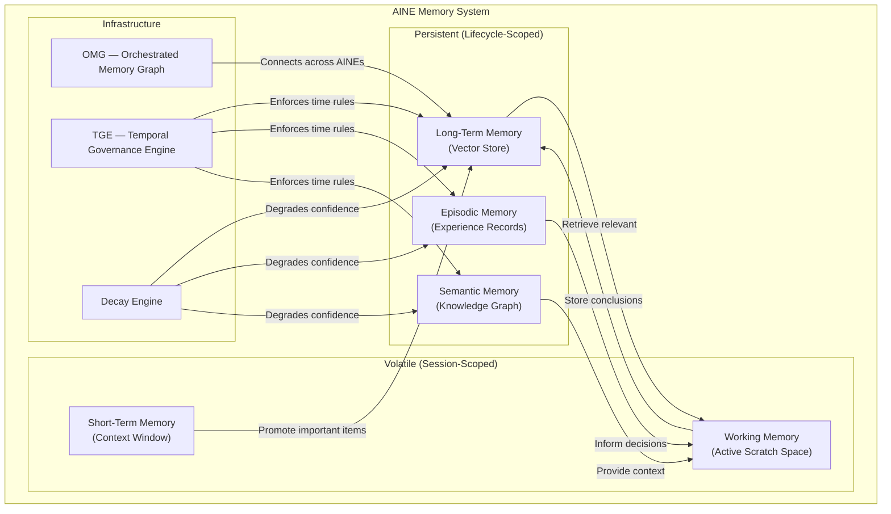
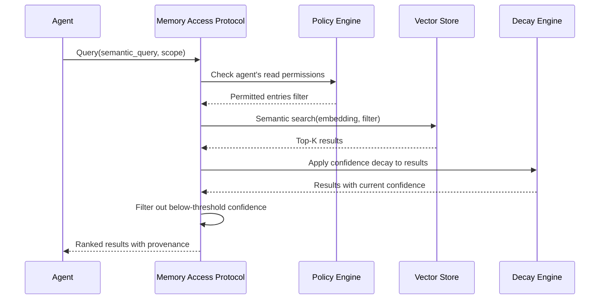
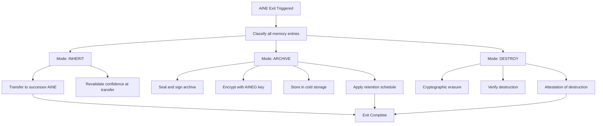
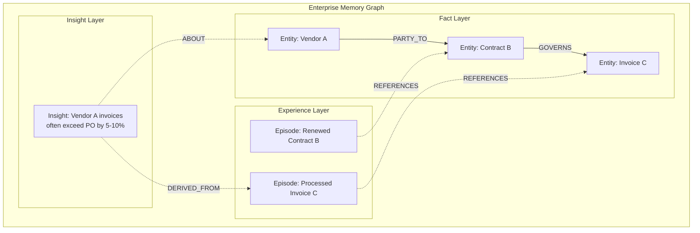
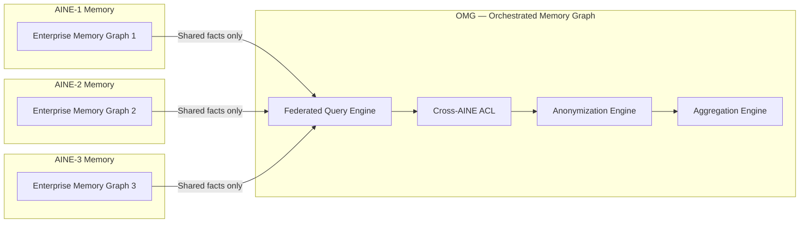

# Memory Architecture

Memory in the AINEFF Ecosystem is not a single store. It is a governed, multi-tier, decay-aware system with strict access controls, provenance tracking, and mandatory disposition on exit. Every byte of stored knowledge has an owner, a classification, a confidence score, and an expiry date.

---

## Memory Type Taxonomy



---

## Short-Term Memory (Context Window)

Short-term memory is the active context available to an agent during a single execution. It is equivalent to the LLM context window — bounded, volatile, and destroyed after the task completes.

| Property | Value |
|----------|-------|
| **Scope** | Single task execution |
| **Capacity** | Model-dependent (e.g., 128K-200K tokens) |
| **Persistence** | None — destroyed on task completion |
| **Access** | Current agent only |
| **Governance** | No retention, no audit (transient computation) |

### Context Window Management

```typescript
interface ShortTermMemory {
  // Capacity
  maxTokens: number;
  usedTokens: number;
  remainingTokens: number;

  // Content slots
  systemPrompt: TokenSlot;      // Fixed: AFB, constraints, identity
  taskInput: TokenSlot;          // Variable: current task data
  retrievedContext: TokenSlot;   // Variable: retrieved from LTM/EM/SM
  workingState: TokenSlot;       // Variable: intermediate reasoning
  outputBuffer: TokenSlot;       // Variable: response being constructed

  // Overflow strategy
  overflowStrategy: 'summarize_oldest' | 'drop_oldest' | 'compress_all';
}

// Token budget allocation (example for 128K model)
const BUDGET = {
  systemPrompt:    16_000,  // 12.5% — Identity, constraints, AFB
  taskInput:       32_000,  // 25.0% — Current task data
  retrievedContext:32_000,  // 25.0% — Knowledge from persistent memory
  workingState:    32_000,  // 25.0% — Reasoning scratch space
  outputBuffer:    16_000,  // 12.5% — Response generation
};
```

---

## Working Memory (Active Scratch Space)

Working memory is a small, high-priority buffer used during active reasoning. Items in working memory are accessed with zero additional latency but are limited in capacity and decay within minutes of disuse.

| Property | Value |
|----------|-------|
| **Scope** | Active reasoning session (minutes) |
| **Capacity** | 7 +/- 2 items (inspired by Miller's Law) |
| **Persistence** | Minutes — items decay if not refreshed |
| **Access** | Current agent only |
| **Use** | Intermediate conclusions, partial results, hypotheses under evaluation |

```typescript
interface WorkingMemoryItem {
  id: string;
  content: unknown;
  createdAt: ISO8601;
  lastAccessedAt: ISO8601;
  accessCount: number;
  importance: number;              // 0.0 to 1.0
  decayRate: number;               // Per-minute importance decay
  expiresAt: ISO8601;              // Hard expiry
}
```

---

## Long-Term Memory (Vector Store)

Long-term memory is the primary persistent knowledge store. It uses vector embeddings for semantic search and retrieval.

| Property | Value |
|----------|-------|
| **Scope** | AINE lifecycle (years) |
| **Capacity** | Configurable — typically millions of embeddings |
| **Persistence** | Durable, replicated, backed up |
| **Access** | Governed by Memory Access Protocol (PEP) |
| **Backend** | Vector database (e.g., Pinecone, Weaviate, pgvector) |

### Storage Schema

```typescript
interface LongTermMemoryEntry {
  // Identity
  id: string;
  embedding: Float32Array;         // Dense vector representation
  content: string;                 // Original text content
  contentHash: string;             // SHA-256 for deduplication

  // Metadata
  sourceAgent: AgentId;
  sourceSkill?: SkillId;
  sourceTask?: TaskId;
  createdAt: ISO8601;
  lastAccessedAt: ISO8601;

  // Classification
  classification: 'public' | 'internal' | 'confidential' | 'restricted';
  dataResidency: JurisdictionCode;
  retentionPolicy: RetentionPolicy;

  // Confidence & Decay
  originalConfidence: number;
  currentConfidence: number;       // Decayed over time
  halfLifeDays: number;
  lastValidatedAt: ISO8601;

  // Provenance
  derivedFrom?: string[];          // IDs of source entries
  transformationChain?: string[];  // How this was derived
  version: number;
}
```

### Retrieval Process



---

## Episodic Memory (Experience Records)

Episodic memory stores structured records of past experiences: tasks completed, decisions made, outcomes observed. It enables agents to learn from history.

| Property | Value |
|----------|-------|
| **Scope** | AINE lifecycle |
| **Structure** | Structured episodes with temporal ordering |
| **Use** | Pattern recognition, precedent lookup, improvement |
| **Decay** | Episodes decay in confidence but are never silently deleted |

### Episode Schema

```typescript
interface Episode {
  // Identity
  episodeId: string;
  timestamp: ISO8601;
  duration: Duration;

  // Context
  agent: AgentId;
  skill: SkillId;
  task: TaskDescriptor;
  environment: EnvironmentSnapshot;

  // Execution
  inputSummary: string;
  actionsTaken: ActionRecord[];
  outputSummary: string;

  // Outcome
  success: boolean;
  confidence: number;
  outcomeMetrics: Record<string, number>;

  // Learning
  lessonsLearned: string[];
  mistakesMade?: string[];
  improvementSuggestions?: string[];

  // Linkage
  similarEpisodes: string[];       // IDs of similar past episodes
  causalPredecessors: string[];    // Episodes that caused this one
}
```

---

## Semantic Memory (Knowledge Graph)

Semantic memory stores structured knowledge as entities and relationships. It provides factual grounding for agent reasoning.

| Property | Value |
|----------|-------|
| **Scope** | AINE lifecycle, shareable across AINEG |
| **Structure** | Knowledge graph (entities + relationships) |
| **Use** | Factual grounding, relationship inference, context |
| **Backend** | Graph database (e.g., Neo4j, Amazon Neptune) |

### Knowledge Graph Structure

```
Entity: Vendor("Acme Corp")
  - industry: "Manufacturing"
  - jurisdiction: "US-DE"
  - risk_score: 42
  - relationship: SUPPLIES_TO → Entity: AINE("aine-01-finance")
  - relationship: REGISTERED_IN → Entity: Jurisdiction("US-DE")
  - confidence: 0.94
  - last_validated: "2026-02-15"
  - source: "vendor_onboarding_episode_2026-001"
```

---

## Memory Decay Rules

All persistent memory is subject to confidence decay. Nothing is permanently trusted.

### Knowledge Half-Life Model

```python
import math

def confidence_at_time(
    c0: float,           # Original confidence
    t: float,            # Days since last validation
    half_life: float     # Days until confidence halves
) -> float:
    """Exponential confidence decay."""
    return c0 * math.pow(0.5, t / half_life)

# Examples
confidence_at_time(0.95, t=90, half_life=90)    # → 0.475
confidence_at_time(0.95, t=45, half_life=90)     # → 0.672
confidence_at_time(0.95, t=180, half_life=90)    # → 0.238
confidence_at_time(0.95, t=0, half_life=90)      # → 0.950
```

### Decay Tiers

| Confidence Range | Status | Agent Behavior |
|-----------------|--------|----------------|
| 0.80 - 1.00 | **Fresh** | Use directly in decisions |
| 0.60 - 0.79 | **Aging** | Use with caveat, flag for revalidation |
| 0.40 - 0.59 | **Stale** | Do not use in decisions, require revalidation |
| 0.20 - 0.39 | **Degraded** | Quarantine, mark for review |
| 0.00 - 0.19 | **Expired** | Schedule for disposition (archive or destroy) |

### Half-Life by Knowledge Type

| Knowledge Type | Half-Life | Rationale |
|---------------|-----------|-----------|
| Regulatory rules | 90 days | Regulations change frequently |
| Market data | 1 day | Markets move continuously |
| Customer identity | 180 days | Identity information is relatively stable |
| Tax rates | 365 days | Annual changes typical |
| Internal procedures | 90 days | Procedures evolve |
| Industry classifications | 730 days | Taxonomies change slowly |
| Physical constants | Never decays | Immutable facts |

---

## Knowledge Disposition on Exit

When an AINE exits (planned retirement, failure, or forced termination), all its memory must be disposed of. Three disposition modes exist:

### Disposition Protocol



| Mode | When Used | Retention | Access |
|------|-----------|-----------|--------|
| **INHERIT** | Successor AINE exists, knowledge is transferable | Successor's lifecycle | Successor AINE only |
| **ARCHIVE** | No successor, but regulatory retention required | Per retention schedule (e.g., 7 years for financial) | AINEG audit only, with authorization |
| **DESTROY** | No successor, no retention requirement, or PII subject requests deletion | None — cryptographically erased | No one — permanently destroyed |

---

## Temporal Governance Engine (TGE)

The TGE enforces all time-based rules across the memory system.

### TGE Responsibilities

| Function | Description |
|----------|-------------|
| **Decay scheduling** | Runs confidence decay calculations on a configurable schedule (hourly, daily) |
| **Retention enforcement** | Deletes entries that exceed their retention period |
| **Revalidation triggers** | Alerts agents when knowledge needs revalidation |
| **Point-in-time queries** | Supports queries like "what was the confidence of X on date Y?" |
| **Temporal conflict resolution** | When two entries conflict, TGE determines which is authoritative based on timestamp and confidence |
| **Exit disposition** | Executes memory disposition during AINE exit |

### TGE Configuration

```yaml
temporal_governance:
  decay:
    schedule: "0 */6 * * *"      # Every 6 hours
    batch_size: 10000             # Entries per batch
    parallel_workers: 4

  retention:
    schedule: "0 2 * * *"        # Daily at 2 AM
    grace_period_days: 7         # Buffer before deletion
    require_attestation: true    # Log every deletion

  revalidation:
    alert_at_confidence: 0.60    # Alert when confidence drops below
    urgent_at_confidence: 0.40   # Urgent when below
    quarantine_at_confidence: 0.20

  point_in_time:
    enabled: true
    snapshot_interval: "daily"
    retention_of_snapshots: "365d"
```

---

## Aggressive Memory Decay for AINE-Lite

AINE-Lite instances (running on Cloud Run without GKE) have severely constrained memory budgets. They implement aggressive decay to stay within limits.

| Parameter | AINE (GKE) | AINE-Lite (Cloud Run) |
|-----------|------------|----------------------|
| Long-term memory capacity | Millions of entries | 100K entries max |
| Default half-life multiplier | 1.0x | 0.25x (4x faster decay) |
| Episodic memory retention | Full lifecycle | 90 days rolling |
| Semantic memory depth | Full graph | 2-hop neighborhood only |
| Working memory items | 7 +/- 2 | 5 max |
| Compression | Optional | Mandatory |

### AINE-Lite Memory Strategy

```python
class AINELiteMemoryManager:
    """Aggressive memory management for constrained environments."""

    MAX_ENTRIES = 100_000
    DECAY_MULTIPLIER = 0.25       # 4x faster decay
    COMPRESSION_THRESHOLD = 0.7    # Compress when 70% full

    def on_memory_pressure(self):
        """Called when memory usage exceeds threshold."""
        # 1. Compress all entries above compression threshold
        self.compress_low_confidence_entries(below=0.6)

        # 2. Merge similar entries (semantic deduplication)
        self.merge_similar_entries(similarity_threshold=0.95)

        # 3. Drop expired entries immediately (no grace period)
        self.drop_expired()

        # 4. If still over limit, drop lowest-confidence entries
        if self.entry_count > self.MAX_ENTRIES:
            self.drop_lowest_confidence(
                count=self.entry_count - self.MAX_ENTRIES
            )
```

---

## Enterprise Memory Graph Infrastructure

For full-scale AINEs, memory is organized as an interconnected graph that spans all memory types.

### Graph Layers



---

## OMG: Orchestrated Memory Graph

The OMG operates at the AINEG level, connecting memory graphs across multiple AINEs while preserving isolation and access control.

### OMG Architecture



### OMG Access Rules

| Rule | Description |
|------|-------------|
| **Opt-in sharing** | AINEs must explicitly mark entries as shareable. Default is private. |
| **Classification floor** | Only `public` and `internal` entries can be shared. `confidential` and `restricted` never leave the AINE. |
| **Anonymization** | PII is stripped before cross-AINE queries. |
| **Aggregation only** | Cross-AINE queries return aggregated results, never individual records. |
| **Audit** | Every cross-AINE memory access is logged in both the requesting and providing AINE's audit trail. |
| **Revocable** | An AINE can revoke sharing at any time. Previously shared data is marked as "source revoked" in consuming AINEs. |
