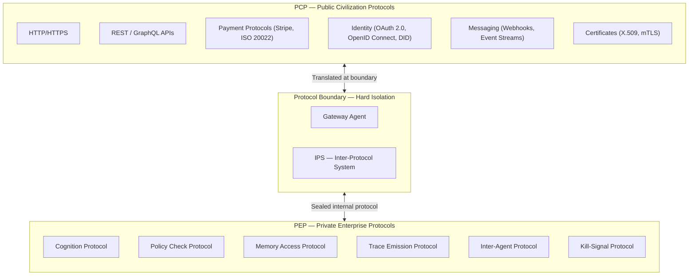
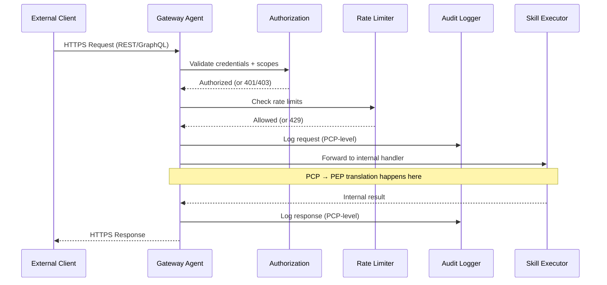
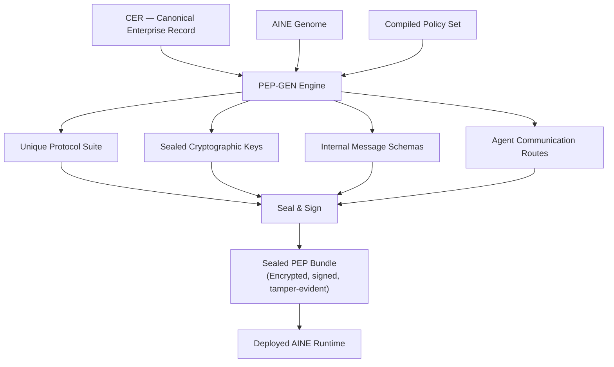
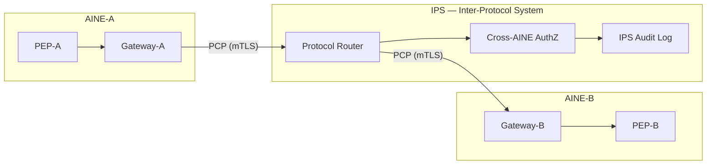

---

sidebar_position: 4
title: "Protocol Architecture — PCP vs PEP"
description: "Dual-protocol civilization model separating public inter-enterprise communication (PCP) from private internal cognition (PEP), with protocol generation, isolation, and boundary enforcement."
tags: [architecture, technical, orf]
custom_status: active
custom_owner: Andrew Leo
custom_last_review: 2026-03-01
custom_next_review: 2026-06-01
---

# Protocol Architecture — PCP vs PEP

The AINEFF Ecosystem enforces a hard separation between two protocol domains. This separation is not a design preference -- it is a constitutional requirement.

:::danger[PCP/PEP Separation Is a Constitutional Requirement]
No internal cognition protocol may ever leak to the public domain, and no public protocol may dictate internal cognition. Violating this boundary is treated as a constitutional breach.
::: No internal cognition protocol may ever leak to the public domain, and no public protocol may dictate internal cognition.

---

## Dual-Protocol Model



---

## PCP: Public Civilization Protocols

PCPs are the standardized protocols through which AINEs interact with the external world: other AINEs, human users, regulators, payment systems, and third-party services.

### PCP Characteristics

| Property | Value |
|----------|-------|
| **Visibility** | Public, documented, version-controlled |
| **Standardization** | Industry-standard protocols (HTTP, REST, OAuth, etc.) |
| **Scope** | Inter-enterprise, inter-AINE, external-facing |
| **Governed by** | AINEFF Protocol Class Registry |
| **Lifecycle** | Versioned, deprecated with grace periods, never silently changed |

### PCP Protocol Stack

```
Layer 7 — Application    : REST APIs, GraphQL endpoints, webhook handlers
Layer 6 — Presentation   : JSON, Protocol Buffers, Avro (schema-enforced)
Layer 5 — Session         : OAuth 2.0 / OpenID Connect / API keys
Layer 4 — Transport       : TLS 1.3 (mandatory), mTLS for AINE-to-AINE
Layer 3 — Network         : Standard IP networking
Layer 2 — Data Link       : Cloud provider networking
Layer 1 — Physical        : Cloud infrastructure
```

### PCP API Contract

Every public-facing AINE API must conform to this contract:

```typescript
interface PCPEndpoint {
  // Identity
  path: string;                    // e.g., "/v1/skills/invoice-validation/execute"
  method: 'GET' | 'POST' | 'PUT' | 'DELETE';
  version: SemVer;

  // Authentication
  auth: {
    type: 'oauth2' | 'api_key' | 'mtls';
    scopes: string[];              // Required OAuth scopes
  };

  // Request
  requestSchema: JSONSchema;       // Validated before processing
  maxRequestSizeBytes: number;

  // Response
  responseSchema: JSONSchema;
  successCodes: number[];          // e.g., [200, 201]
  errorCodes: ErrorCodeMap;

  // Governance
  rateLimitPerMinute: number;
  rateLimitPerDay: number;
  auditLevel: 'full' | 'summary' | 'none';
  dataResidency: JurisdictionCode[];

  // SLA
  targetLatencyP50Ms: number;
  targetLatencyP99Ms: number;
  availabilityTarget: number;      // e.g., 0.999
}
```

### PCP Communication Patterns



---

## PEP: Private Enterprise Protocols

PEPs govern all internal communication within an AINE. Every AINE has a unique PEP generated at manufacture time by PEP-GEN. PEPs are never exposed, never shared, and destroyed when the AINE exits.

### PEP Characteristics

| Property | Value |
|----------|-------|
| **Visibility** | Private, sealed, never exposed externally |
| **Standardization** | Unique per AINE -- no two AINEs share a PEP |
| **Scope** | Intra-enterprise, inter-agent within a single AINE |
| **Governed by** | AINE Control Plane |
| **Lifecycle** | Created at AINE instantiation, destroyed at AINE exit |

### PEP Sub-Protocols

#### 1. Cognition Protocol

Governs how agents reason internally. Includes thought-chain formatting, confidence scoring, and reasoning trace emission.

```typescript
interface CognitionMessage {
  // Routing
  fromAgent: AgentId;
  toAgent: AgentId | 'self';
  messageType: 'thought' | 'conclusion' | 'uncertainty' | 'request';

  // Content
  payload: {
    reasoningChain: ThoughtStep[];
    confidence: number;           // 0.0 to 1.0
    alternatives: Alternative[];  // Other options considered
    evidenceCited: EvidenceRef[];
  };

  // Trace
  traceId: string;
  parentTraceId?: string;
  timestamp: ISO8601;
  sequenceNumber: number;
}
```

#### 2. Policy Check Protocol

Every action must pass a policy check before execution. This protocol defines how agents request and receive policy verdicts.

```typescript
interface PolicyCheckRequest {
  requestingAgent: AgentId;
  proposedAction: ActionDescriptor;
  scope: ScopeDescriptor;
  context: Record<string, unknown>;
}

interface PolicyCheckResponse {
  verdict: 'allow' | 'deny' | 'escalate' | 'allow_with_conditions';
  conditions?: Condition[];
  policyRulesCited: PolicyRuleId[];
  expiresAt: ISO8601;           // Verdict is time-bounded
  traceId: string;
}
```

#### 3. Memory Access Protocol

Governs how agents read from and write to the memory system. Implements access control, versioning, and provenance tracking.

```typescript
interface MemoryAccessRequest {
  agent: AgentId;
  operation: 'read' | 'write' | 'search' | 'delete';
  memoryType: 'short_term' | 'long_term' | 'episodic' | 'semantic' | 'working';
  query?: SemanticQuery;
  payload?: MemoryPayload;
  ttl?: Duration;
  classification: 'public' | 'internal' | 'confidential' | 'restricted';
}
```

#### 4. Trace Emission Protocol

Every agent action emits a trace. This protocol defines the format, routing, and commitment of trace data.

```typescript
interface TraceEntry {
  traceId: string;
  spanId: string;
  parentSpanId?: string;
  agentId: AgentId;
  action: string;
  input: HashedPayload;       // SHA-256 of input
  output: HashedPayload;      // SHA-256 of output
  confidence: number;
  durationMs: number;
  timestamp: ISO8601;
  cryptographicCommitment: string; // Signed hash for tamper evidence
}
```

#### 5. Inter-Agent Protocol

Governs direct agent-to-agent communication within the AINE. All messages are routed through the Control Plane -- no direct peer-to-peer communication.

#### 6. Kill-Signal Protocol

The highest-priority protocol. Kill signals preempt all other communication and cannot be queued, delayed, or filtered.

```typescript
interface KillSignal {
  target: AgentId | AgentId[] | 'all';
  issuer: AgentId;                    // Must be Safety Governor or higher
  reason: KillReason;
  severity: 'freeze' | 'quarantine' | 'terminate';
  timestamp: ISO8601;
  signature: CryptographicSignature;  // Must be verified before execution
  // Kill signals are NOT acknowledgment-dependent.
  // The target does not need to acknowledge — the runtime enforces.
}
```

---

## PEP-GEN: Protocol Generation Engine

PEP-GEN is an AINEF Factory component that generates a unique, sealed protocol suite for each manufactured AINE.

### PEP-GEN Process



:::info[PEP-GEN Creates Unique, Sealed Protocols Per AINE]
Every AINE receives a unique Private Enterprise Protocol generated at manufacture time. No two AINEs share a PEP, and PEPs cannot be copied, transferred, or inspected -- even by AINEF operators.
:::

### PEP-GEN Guarantees

| Guarantee | Description |
|-----------|-------------|
| **Uniqueness** | No two AINEs receive the same PEP. Protocol identifiers, message formats, and routing rules are unique. |
| **Sealed** | Once generated, the PEP cannot be modified without re-manufacture. |
| **Opaque** | The PEP is encrypted at rest and in transit. Even AINEF operators cannot inspect a running AINE's PEP. |
| **Destructible** | On AINE exit, the PEP is cryptographically destroyed. No recovery is possible. |
| **Non-transferable** | A PEP cannot be copied from one AINE to another. The keys are bound to the AINE's hardware identity. |

---

## Protocol Isolation and Boundary Enforcement

The boundary between PCP and PEP is enforced by the Gateway Agent and the IPS (Inter-Protocol System).

### Isolation Rules

:::warning[Protocol Boundary Violations Are Automatically Detected]
The Gateway Agent and IPS enforce hard isolation between PCP and PEP. Any attempt to leak PEP data into PCP responses or inject PCP commands into PEP operations is blocked and logged as a security event.
:::

1. **No PEP leakage** -- Internal message formats, agent identifiers, memory addresses, and cognition traces never appear in PCP responses.
2. **No PCP injection** -- External requests cannot directly invoke PEP-level operations. All external input is sanitized, validated, and translated.
3. **One-way transparency** -- PCP behavior is documented and predictable. PEP behavior is invisible to external observers.
4. **Audit bridge** -- ACTS operates across both domains but produces separate audit streams: PCP-audit (externally visible) and PEP-audit (internally visible only, with ZK proofs for external verification).

### Boundary Translation

```
External Request (PCP)                    Internal Execution (PEP)
─────────────────────                    ──────────────────────
POST /v1/skills/kyc/execute       →      CognitionMessage(type: 'request')
  { "customer_id": "C-123" }             PolicyCheck(action: 'kyc_execute')
                                          MemoryAccess(type: 'read', query: 'C-123')
                                          AgentExecution(skill: 'kyc', input: ...)
200 OK                             ←      CognitionMessage(type: 'conclusion')
  { "result": "pass",                    TraceEmission(all steps committed)
    "confidence": 0.97 }
```

---

## IPS: Inter-Protocol System

The IPS manages communication between AINEs through PCP while keeping each AINE's PEP completely isolated.



### IPS Design Principles

| Principle | Implementation |
|-----------|---------------|
| **No protocol bridging** | IPS never translates between PEPs. AINE-A's PEP and AINE-B's PEP never touch. |
| **PCP-only channel** | All inter-AINE communication uses PCP exclusively. |
| **Mutual authentication** | mTLS with certificates issued by the AINEG Certificate Authority. |
| **Message-level encryption** | Beyond transport encryption, message payloads are encrypted with the recipient's public key. |
| **Audit at every hop** | IPS logs every cross-AINE message with sender, recipient, timestamp, and payload hash (not payload content). |
| **Rate limiting** | Per-AINE rate limits enforced by IPS to prevent denial-of-service. |
| **Jurisdiction check** | IPS verifies that cross-jurisdiction communication complies with data residency rules. |

---

## Protocol Versioning

Both PCP and PEP are versioned independently.

### PCP Versioning

```
/v1/skills/invoice-validation/execute   ← Version 1 (stable)
/v2/skills/invoice-validation/execute   ← Version 2 (current)
/v3/skills/invoice-validation/execute   ← Version 3 (beta)
```

- **Deprecation policy:** 12 months notice before any PCP version is retired.
- **Breaking changes:** New major version only. Never modify an existing version.
- **Sunset header:** All responses include `Sunset: <date>` header for deprecated versions.

### PEP Versioning

PEP versions are internal and opaque. The AINE Control Plane manages PEP version upgrades during maintenance windows. External parties never see PEP version information.


---

## Related Documents

<CrossReference to="/docs/entities/orf-protocol" title="ORF — Obligation & Responsibility Finality Protocol" description="The obligation-netting protocol that uses PCP for cross-boundary settlement while maintaining PEP isolation within each enterprise" badge="Entity" />
