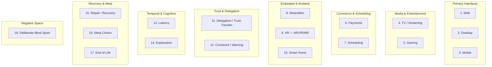
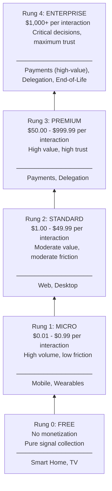

# Signal Harvesters & Interface Taxonomy

Signal harvesters are the sensory organs of the AINEFF Ecosystem. They collect structured input from humans, systems, and environments across 18 distinct interface types. Each interface type is purpose-built for its device class, interaction model, and trust level.

---

## Interface Type Map

---

## Interface Specifications

### 1. Web Interface

| Property | Value |
|----------|-------|
| **Device** | Desktop/laptop browser |
| **Interaction Model** | Click, type, form submission, drag-and-drop |
| **Session Duration** | Minutes to hours |
| **Bandwidth** | High (broadband) |
| **Trust Level** | Medium (authenticated session) |

**Signals Harvested:**
- Form field inputs (structured data)
- Document uploads (invoices, contracts, receipts)
- Dashboard interactions (filter selections, drill-downs)
- Session behavior (time-on-page, navigation patterns)
- Explicit feedback (ratings, thumbs up/down)

**AINEFF Products:** Governance Console, Skill Marketplace, AINE Dashboard, Micro-SaaS web apps.

### 2. Desktop Interface

| Property | Value |
|----------|-------|
| **Device** | Native desktop application (macOS, Windows, Linux) |
| **Interaction Model** | Rich GUI, keyboard shortcuts, file system access |
| **Session Duration** | Hours (workflow sessions) |
| **Bandwidth** | High |
| **Trust Level** | High (installed application, OS-level permissions) |

**Signals Harvested:**
- File system interactions (opens, saves, file selections)
- Clipboard operations (copy, paste, cut)
- Application state transitions
- Workflow completion patterns
- Integration events (email client, calendar, ERP)

**AINEFF Products:** `aine-cli`, Genome Designer desktop app, Audit Evidence Viewer.

### 3. Mobile Interface

| Property | Value |
|----------|-------|
| **Device** | Smartphone (iOS, Android) |
| **Interaction Model** | Touch, swipe, voice, camera, location |
| **Session Duration** | Seconds to minutes (micro-sessions) |
| **Bandwidth** | Variable (WiFi to cellular) |
| **Trust Level** | Medium (biometric auth, device attestation) |

**Signals Harvested:**
- Camera captures (receipt photos, document scans)
- Location (jurisdiction-relevant for compliance)
- Push notification responses (approve/reject actions)
- Voice input (dictation, voice commands)
- Biometric confirmations (Face ID, Touch ID for high-value actions)

**AINEFF Products:** Invoice Checker, Expense Auto-Sort, Receipt Digitizer, Approval Workflow.

### 4. TV / Streaming Interface

| Property | Value |
|----------|-------|
| **Device** | Smart TV, streaming devices (Roku, Apple TV, Fire TV) |
| **Interaction Model** | Remote control, voice, limited text input |
| **Session Duration** | Extended (passive consumption) |
| **Bandwidth** | High |
| **Trust Level** | Low (shared device, no individual auth) |

**Signals Harvested:**
- Content selection patterns
- Viewing duration and attention signals
- Voice commands
- Household-level preferences

**AINEFF Products:** Investor dashboard (read-only), ecosystem status display, educational content delivery.

### 5. Gaming Interface

| Property | Value |
|----------|-------|
| **Device** | Console, PC, mobile game, VR headset |
| **Interaction Model** | Game controller, keyboard/mouse, motion, haptic |
| **Session Duration** | Extended (immersive) |
| **Bandwidth** | High, low-latency required |
| **Trust Level** | Low to Medium |

**Signals Harvested:**
- In-game economic decisions (training simulations)
- Reaction time patterns
- Collaboration vs. competition preferences
- Risk appetite (behavioral finance gamification)

**AINEFF Products:** Risk simulation games, financial literacy training, agent behavior visualization.

### 6. Payments Interface

| Property | Value |
|----------|-------|
| **Device** | POS terminal, mobile wallet, web checkout |
| **Interaction Model** | Tap, scan, confirm |
| **Session Duration** | Seconds |
| **Bandwidth** | Variable |
| **Trust Level** | Critical (financial transaction) |

**Signals Harvested:**
- Transaction amounts, frequencies, merchants
- Payment method preferences
- Authorization decisions (approve/decline)
- Fraud signals (unusual location, amount, timing)

**AINEFF Products:** Payment routing, fraud scoring, expense categorization, tax capture.

### 7. Scheduling Interface

| Property | Value |
|----------|-------|
| **Device** | Calendar apps, scheduling widgets |
| **Interaction Model** | Time slot selection, availability declaration |
| **Session Duration** | Seconds to minutes |
| **Bandwidth** | Low |
| **Trust Level** | Medium |

**Signals Harvested:**
- Availability patterns
- Meeting preferences (time, duration, frequency)
- Scheduling conflicts and resolutions
- Response latency to scheduling requests

**AINEFF Products:** Agent task scheduling, SLA deadline management, audit scheduling.

### 8. Wearables Interface

| Property | Value |
|----------|-------|
| **Device** | Smartwatch, fitness tracker, smart ring |
| **Interaction Model** | Glance, haptic tap, voice, small touch |
| **Session Duration** | Seconds (micro-interactions) |
| **Bandwidth** | Low (Bluetooth, WiFi) |
| **Trust Level** | High (biometric, on-body) |

**Signals Harvested:**
- Quick approval/rejection (haptic tap patterns)
- Contextual signals (location, activity level)
- Urgent notification responses
- Health-correlated decision patterns (if consented)

**AINEFF Products:** Approval notifications, urgent alert delivery, on-the-go status checks.

### 9. XR Interface (AR / VR / MR)

| Property | Value |
|----------|-------|
| **Device** | AR glasses, VR headset, mixed reality device |
| **Interaction Model** | Gaze, gesture, voice, spatial anchoring |
| **Session Duration** | Minutes to hours |
| **Bandwidth** | High, low-latency |
| **Trust Level** | Medium |

**Signals Harvested:**
- Gaze patterns (what captures attention)
- Spatial interaction (gesture-based data manipulation)
- Voice commands in spatial context
- Environmental awareness (physical space mapping)

**AINEFF Products:** 3D data visualization, spatial audit trail navigation, immersive agent monitoring.

### 10. Smart Home Interface

| Property | Value |
|----------|-------|
| **Device** | Smart speakers, displays, sensors, actuators |
| **Interaction Model** | Voice, ambient sensing, automation triggers |
| **Session Duration** | Continuous (ambient) |
| **Bandwidth** | Low to Medium |
| **Trust Level** | Low (shared household environment) |

**Signals Harvested:**
- Voice commands and queries
- Ambient patterns (routines, preferences)
- Environmental triggers (time, presence, conditions)

**AINEFF Products:** Voice-activated account queries, ambient compliance alerts, household financial summaries.

### 11. Delegation / Trust-Transfer Interface

| Property | Value |
|----------|-------|
| **Device** | Any (cross-device protocol) |
| **Interaction Model** | Explicit delegation acts, authority transfers |
| **Session Duration** | Event-driven |
| **Trust Level** | Critical (authority is being transferred) |

**Signals Harvested:**
- Delegation scope (what authority is being granted)
- Delegation target (who receives authority)
- Duration and conditions of delegation
- Revocation signals

**AINEFF Products:** Agent authority delegation, human-to-AINE trust transfer, inter-AINE authority handoff.

### 12. Constraint / Warning Interface

| Property | Value |
|----------|-------|
| **Device** | Overlay on any interface |
| **Interaction Model** | Interruption, acknowledgment, override (if permitted) |
| **Session Duration** | Seconds (interruption) |
| **Trust Level** | System-level (not user-initiated) |

**Signals Harvested:**
- Warning acknowledgment timing
- Override decisions and rationale
- Constraint impact on user behavior
- Repeated warning patterns (desensitization detection)

**AINEFF Products:** Power ceiling warnings, compliance alerts, kill-switch notifications, budget limit warnings.

### 13. Latency Interface

| Property | Value |
|----------|-------|
| **Device** | Embedded in all interfaces |
| **Interaction Model** | Timeout management, progress indication |
| **Session Duration** | Milliseconds to minutes |
| **Trust Level** | Informational |

**Signals Harvested:**
- User tolerance for wait times
- Abandonment thresholds
- Retry patterns
- Quality vs. speed tradeoff preferences

**AINEFF Products:** SLA monitoring, progressive loading strategies, graceful degradation.

### 14. Explanation Interface

| Property | Value |
|----------|-------|
| **Device** | Overlay or dedicated panel on any interface |
| **Interaction Model** | "Why did this happen?" queries, drill-down |
| **Session Duration** | Minutes |
| **Trust Level** | Medium |

**Signals Harvested:**
- Which decisions users seek explanations for
- Explanation depth preferences (summary vs. detailed)
- Satisfaction with explanations
- Follow-up questions after explanation

**AINEFF Products:** Decision explanation panels, audit trail viewers, confidence score breakdowns.

### 15. Repair / Recovery Interface

| Property | Value |
|----------|-------|
| **Device** | Dedicated or overlay on any interface |
| **Interaction Model** | Error acknowledgment, recovery option selection, rollback confirmation |
| **Session Duration** | Minutes |
| **Trust Level** | Elevated (recovery actions may have side effects) |

**Signals Harvested:**
- Error frequency and types
- Recovery option preferences
- Rollback vs. retry decisions
- Recovery success rates

**AINEFF Products:** Incident response dashboards, rollback confirmation interfaces, error resolution wizards.

### 16. Meta-Choice Interface

| Property | Value |
|----------|-------|
| **Device** | Any interface (configuration layer) |
| **Interaction Model** | Preference setting, tradeoff selection |
| **Session Duration** | Minutes (infrequent) |
| **Trust Level** | High (setting system-wide preferences) |

**Signals Harvested:**
- Autonomy vs. control preferences
- Risk tolerance settings
- Notification frequency preferences
- Data sharing consent decisions

**AINEFF Products:** AINE configuration dashboards, personal preference panels, consent management.

### 17. End-of-Life Interface

| Property | Value |
|----------|-------|
| **Device** | Dedicated interface (appears only during exit) |
| **Interaction Model** | Disposition decisions, archive/destroy choices, successor nomination |
| **Session Duration** | Hours to days (exit is a process) |
| **Trust Level** | Critical (irreversible decisions) |

**Signals Harvested:**
- Memory disposition decisions
- Successor preferences
- Data export requests
- Final attestation confirmations

**AINEFF Products:** AINE exit wizard, memory disposition console, successor nomination interface.

### 18. Deliberate Blind Spots

These are signals the ecosystem **intentionally does NOT collect**, even though it technically could.

| Signal NOT Collected | Reason |
|---------------------|--------|
| Keystroke dynamics | Privacy — typing patterns are biometric data |
| Emotional state inference from facial expressions | Ethics — emotional manipulation risk |
| Cross-device tracking without consent | Privacy — GDPR/CCPA compliance |
| Private communications content | Privacy — only metadata if consented |
| Health data without explicit medical consent | Regulation — HIPAA and equivalents |
| Political preferences or beliefs | Ethics — discrimination risk |
| Social graph beyond direct business relationships | Privacy — over-collection risk |
| Continuous location tracking | Privacy — only point-in-time for jurisdiction |

---

## Monetization Ladder by Device Class

Each device class has a monetization ceiling based on trust level, interaction depth, and economic capacity.

### Rung Model

### Monetization by Interface Type

| Interface | Rung | Monetization Model | Example |
|-----------|------|-------------------|---------|
| Web | 2 | Subscription + per-use | $29/mo base + $0.15/invoice |
| Desktop | 2-3 | License + per-use | $99/yr + premium features |
| Mobile | 1-2 | Freemium + in-app | Free tier + $4.99/mo pro |
| TV | 0 | No direct monetization | Brand presence, onboarding |
| Gaming | 0-1 | Free-to-play + educational | Free training, paid simulations |
| Payments | 3-4 | Transaction fee | 0.5% of transaction value |
| Scheduling | 1 | Per-scheduling event | $0.10/event |
| Wearables | 1 | Companion to mobile | Included with mobile subscription |
| XR | 2-3 | Premium visualization | $49/mo for immersive analytics |
| Smart Home | 0 | No direct monetization | Voice onramp to web/mobile |
| Delegation | 3-4 | Per-delegation event | $5.00/delegation (authority transfer) |
| Constraint | 0 | No monetization | Safety feature, never paywalled |
| Latency | 0 | No monetization | Quality feature, never paywalled |
| Explanation | 1-2 | Premium detail levels | Basic free, detailed $0.50/explanation |
| Repair | 0-1 | Free basic, paid advanced | Free rollback, $2.00/forensic analysis |
| Meta-Choice | 0 | No monetization | Configuration, never paywalled |
| End-of-Life | 3 | Exit service fee | Flat fee based on AINE complexity |
| Blind Spots | N/A | Never monetized | Ethical commitment |

### Monetization Rules

1. **Safety features are never paywalled.** Constraint, warning, and kill-switch interfaces are always free.
2. **Explanation has a free tier.** Basic "why" is always free. Detailed forensic explanation may be premium.
3. **Blind spots are never monetized.** Data not collected cannot generate revenue. This is intentional.
4. **Mobile monetization respects App Store rules.** No external payment links on iOS.
5. **Enterprise pricing is negotiated.** Rung 4 pricing is per-contract, not self-serve.
