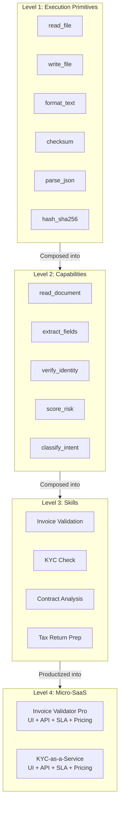
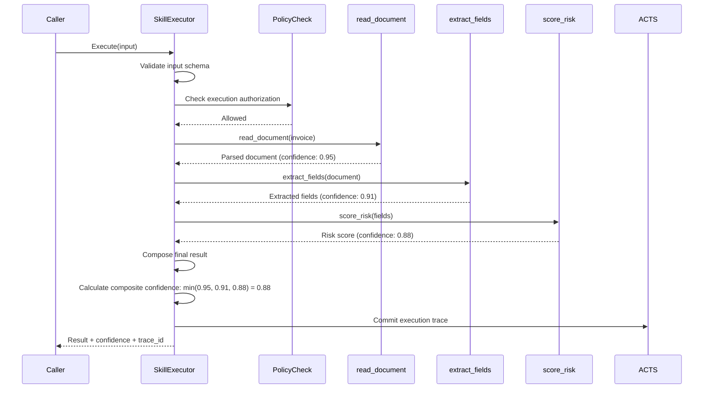
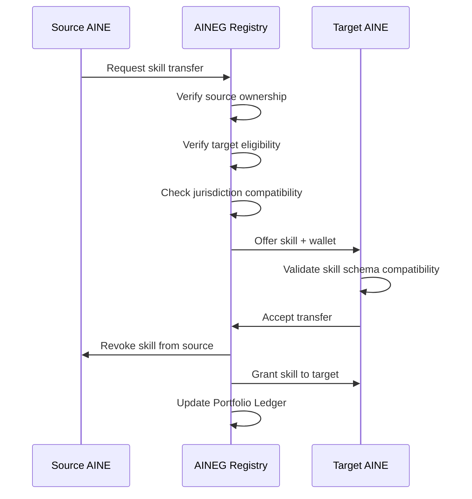

---

sidebar_position: 5
title: "Skills as First-Class Citizens"
description: "Complete architecture of skills in the AINEFF Ecosystem — from atomic capabilities through composed skills to productized Micro-SaaS, with execution primitives, portability, decay, and revocation."
tags: [architecture, technical, agent]
custom_status: active
custom_owner: Andrew Leo
custom_last_review: 2026-03-01
custom_next_review: 2026-06-01
---

# Skills as First-Class Citizens

In the AINEFF Ecosystem, a "skill" is not an informal label. It is a formally-defined, versioned, bounded, auditable unit of work with a fixed schema, mandatory confidence scoring, and a lifecycle governed by the AINEF Factory.

---

## Skill Hierarchy



---

## Level 1: Execution Primitives

Execution primitives are the irreducible atomic operations. They are the only code that touches the operating system or runtime environment directly. Every other level is composed from these.

### Primitive Catalog

| Primitive | Input | Output | Side Effects | Constraints |
|-----------|-------|--------|--------------|-------------|
| `read_file` | File path, encoding | File contents | None (read-only) | Max file size: 100MB |
| `write_file` | File path, contents, mode | Write receipt | Writes to disk | Append-only or create-new. No overwrite. |
| `format_text` | Template, variables | Formatted string | None | Max output: 1MB |
| `checksum` | Data, algorithm | Checksum string | None | Algorithms: SHA-256, SHA-512, BLAKE3 |
| `parse_json` | JSON string, schema | Parsed object | None | Max depth: 20 levels |
| `hash_sha256` | Data | 256-bit hash | None | Deterministic |
| `compare` | Value A, Value B, operator | Boolean | None | Operators: eq, gt, lt, contains, matches |
| `timestamp` | Timezone | ISO 8601 string | None | UTC or specified timezone |
| `uuid` | Version | UUID string | None | v4 (random) or v7 (time-ordered) |
| `base64_encode` | Data | Base64 string | None | URL-safe variant available |
| `base64_decode` | Base64 string | Data | None | Validates encoding |
| `regex_match` | Text, pattern | Match result | None | RE2 syntax (no backtracking) |

### Primitive Invariants

Every execution primitive must satisfy ALL of the following:

```
1. REVERSIBLE     — Effect can be undone (write_file has compensating delete_file)
2. NO NETWORK     — No network calls. Ever. Period.
3. NO RECURSION   — A primitive cannot invoke another primitive
4. NO STATE       — No mutable state between invocations
5. DETERMINISTIC  — Same input always produces same output (except uuid, timestamp)
6. BOUNDED TIME   — Maximum execution time: 5 seconds
7. BOUNDED MEMORY — Maximum memory: 256MB
8. TRACED         — Every invocation produces a trace entry
```

---

## Level 2: Capabilities

Capabilities are stateless compositions of 2-5 execution primitives. They perform a single, well-defined cognitive function.

### Capability Specification

```typescript
interface Capability {
  // Identity
  id: string;                      // e.g., "cap-read-document-v2.1.0"
  name: string;                    // e.g., "read_document"
  version: SemVer;
  category: CapabilityCategory;

  // Composition
  primitives: PrimitiveId[];       // Which primitives this capability uses
  maxPrimitiveInvocations: number; // Hard limit on primitive calls per execution

  // Schema
  inputSchema: JSONSchema;
  outputSchema: JSONSchema;

  // Constraints
  stateless: true;                 // Always true. Capabilities have no memory.
  maxExecutionTimeMs: number;
  maxMemoryBytes: number;

  // Confidence
  confidenceMandatory: true;       // Always true. Must produce confidence score.
  minAcceptableConfidence: number;  // Below this, output is discarded
}
```

### Capability Catalog

| Capability | Primitives Used | Description | Output |
|-----------|-----------------|-------------|--------|
| `read_document` | read_file, parse_json, format_text | Reads and parses any supported document format (PDF, DOCX, CSV, JSON) | Structured document object |
| `extract_fields` | read_file, parse_json, regex_match, format_text | Extracts named fields from unstructured text | `Record<fieldName, {value, confidence, source_location}>` |
| `verify_identity` | hash_sha256, compare, checksum | Verifies identity claims against provided evidence | `{verified: boolean, confidence: number, evidence_hash: string}` |
| `score_risk` | parse_json, compare, format_text | Computes a risk score from structured risk factors | `{score: 0-100, factors: RiskFactor[], confidence: number}` |
| `classify_intent` | parse_json, regex_match, compare | Classifies text into predefined intent categories | `{intent: string, confidence: number, alternatives: Intent[]}` |

---

## Level 3: Skills

Skills are **bounded compositions** of capabilities with a fixed schema, a defined purpose, and mandatory governance metadata. A skill is the unit of work that an AINE sells, licenses, or executes.

### Skill Manifest

Every skill is defined by a manifest:

```yaml
skill:
  id: "skill-invoice-validation-v3.1.0"
  name: "Invoice Validation"
  version: "3.1.0"
  description: "Validates an invoice against purchase orders, contracts, and compliance rules."

  # Capabilities used
  capabilities:
    - read_document
    - extract_fields
    - verify_identity
    - score_risk

  # Fixed input/output schema
  input:
    schema:
      type: object
      required: [invoice_document, purchase_order_id]
      properties:
        invoice_document:
          type: string
          format: base64
          description: "Base64-encoded invoice document (PDF or image)"
        purchase_order_id:
          type: string
          description: "Reference purchase order for validation"
        validation_rules:
          type: array
          items:
            type: string
          default: ["amount_match", "vendor_match", "date_validity"]

  output:
    schema:
      type: object
      required: [valid, confidence, findings]
      properties:
        valid:
          type: boolean
        confidence:
          type: number
          minimum: 0.0
          maximum: 1.0
        findings:
          type: array
          items:
            $ref: "#/definitions/Finding"
        extracted_fields:
          type: object
        evidence_hash:
          type: string

  # Governance
  governance:
    owner_aine: "aine-01-finance"
    jurisdiction: ["US", "UK", "EU"]
    data_classification: "confidential"
    retention_days: 2555    # 7 years for financial records
    audit_level: "full"
    requires_consent: false  # No PII in invoice metadata

  # Performance
  sla:
    target_latency_p50_ms: 2000
    target_latency_p99_ms: 8000
    max_execution_time_ms: 30000
    availability: 0.999

  # Pricing (for Micro-SaaS)
  pricing:
    model: "per_execution"
    base_price_usd: 0.15
    volume_discounts:
      - threshold: 1000
        price_usd: 0.12
      - threshold: 10000
        price_usd: 0.08
```

### Skill Execution Flow



---

## Level 4: Micro-SaaS

A Micro-SaaS is a productized skill with a user interface, pricing, SLA, and compliance wrapper. It is what end users and businesses actually purchase and consume.

### Micro-SaaS = Skill + Product Wrapper

```
Micro-SaaS = Skill
            + User Interface (web, mobile, API)
            + Authentication & Authorization
            + Usage Metering & Billing
            + SLA Monitoring & Enforcement
            + Compliance Wrapper (jurisdiction, data residency)
            + Customer Support Bot
            + Documentation
            + Onboarding Flow
```

### Micro-SaaS Catalog Structure

| Micro-SaaS | Underlying Skill | Target Market | Pricing Model |
|-------------|-----------------|---------------|---------------|
| Invoice Validator Pro | invoice-validation | SMB Finance Teams | $0.15/execution |
| KYC-as-a-Service | kyc-check | FinTech, Banks | $2.50/check |
| Contract Analyzer | contract-analysis | Legal Teams | $5.00/document |
| Tax Prep Assistant | tax-return-prep | Accountants | $1.00/return |
| Expense Classifier | expense-classification | Finance Ops | $0.05/transaction |
| Compliance Monitor | regulatory-monitoring | Compliance Teams | $500/month |

---

## No Recursive Skill Graphs

**Rule:** A skill may compose capabilities, but a skill MAY NOT invoke another skill. This prevents:

- Unbounded execution depth
- Circular dependency chains
- Unpredictable latency
- Unauditable execution paths

```
ALLOWED:
  Skill A → Capability 1 → Primitives
  Skill A → Capability 2 → Primitives
  Skill A → Capability 3 → Primitives

PROHIBITED:
  Skill A → Skill B → Skill C → Skill A  (circular)
  Skill A → Skill B → Capability 1        (skill invoking skill)
```

If a workflow requires multiple skills, it must be orchestrated by a **Manager Agent** at the AINEOUT level, which invokes each skill independently and manages the data flow between them.

---

## Skill Citizen-Wallet (Portability)

Every skill carries a **Citizen-Wallet** that enables portability across AINEs. When a skill is transferred from one AINE to another, the Citizen-Wallet travels with it.

### Wallet Contents

```typescript
interface SkillCitizenWallet {
  // Identity
  skillId: string;
  version: SemVer;
  originAine: AineId;           // Where the skill was first manufactured
  currentAine: AineId;          // Where it currently resides

  // Provenance
  createdAt: ISO8601;
  transferHistory: Transfer[];   // Every AINE it has lived in
  versionHistory: VersionEntry[];

  // Credentials
  certifications: Certification[]; // Industry certifications passed
  auditHistory: AuditResult[];     // Past audit results

  // Performance
  executionCount: number;
  averageConfidence: number;
  averageLatencyMs: number;
  failureRate: number;

  // Governance
  jurisdictionsCertified: JurisdictionCode[];
  complianceStatus: ComplianceStatus;
  lastAuditDate: ISO8601;
}
```

### Transfer Protocol



---

## Skill Decay and Revocation

Skills are not permanent. They decay and can be revoked.

### Confidence Decay

Every skill has a **knowledge half-life** that determines how quickly its confidence degrades without revalidation.

```python
def calculate_decayed_confidence(
    original_confidence: float,
    half_life_days: float,
    days_since_last_validation: float
) -> float:
    """
    Confidence decays exponentially.
    After one half-life, confidence is halved.
    """
    decay_factor = 0.5 ** (days_since_last_validation / half_life_days)
    return original_confidence * decay_factor
```

| Skill Category | Default Half-Life | Revalidation Trigger |
|---------------|-------------------|---------------------|
| Financial (tax rules, regulations) | 90 days | Regulatory change or 90 days elapsed |
| Identity (KYC, verification) | 180 days | Database update or 180 days elapsed |
| Document processing | 365 days | Schema change or 365 days elapsed |
| General classification | 180 days | Model update or 180 days elapsed |

### Revocation Triggers

| Trigger | Response | Recovery |
|---------|----------|----------|
| Confidence below 0.5 | Skill suspended, revalidation required | Pass revalidation |
| Confidence below 0.3 | Skill quarantined, cannot execute | Re-manufacture |
| Audit failure | Skill revoked, all instances deactivated | Re-manufacture + audit pass |
| Jurisdiction change | Skill suspended in affected jurisdictions | Jurisdiction-specific revalidation |
| Security vulnerability | Immediate revocation, all instances | Patch + re-manufacture + security audit |
| Owner AINE exit | Skill transferred or destroyed per exit protocol | Transfer to successor AINE |

### Revocation Cascade

When a skill is revoked, all Micro-SaaS products built on that skill are automatically suspended. Active subscribers are notified with a machine-readable sunset notice.

```json
{
  "event": "skill_revocation",
  "skill_id": "skill-invoice-validation-v3.1.0",
  "reason": "audit_failure",
  "effective_at": "2026-03-15T00:00:00Z",
  "affected_products": [
    "microsaas-invoice-validator-pro",
    "microsaas-ap-automation-suite"
  ],
  "subscriber_notice_days": 30,
  "migration_path": "skill-invoice-validation-v4.0.0"
}
```
