# 15 Systems of Coordination

The 15 Systems of Coordination define **how the AINEFF Ecosystem governs itself**. They are not products. They are not platforms. They are **coordination primitives** — the fundamental mechanisms through which autonomous agents, enterprises, and federations align their behavior without centralized command-and-control.

Traditional organizations rely on management hierarchies, corporate culture, and human judgment to maintain coordination. The AINEFF Ecosystem replaces these with **explicit, versioned, auditable, and enforceable systems** that operate at machine speed while remaining legible to human oversight.

Each system addresses a specific coordination problem. Together, they form a **complete governance substrate** — nothing falls through the cracks because every category of coordination failure has a named system responsible for preventing it.

---

## System Map

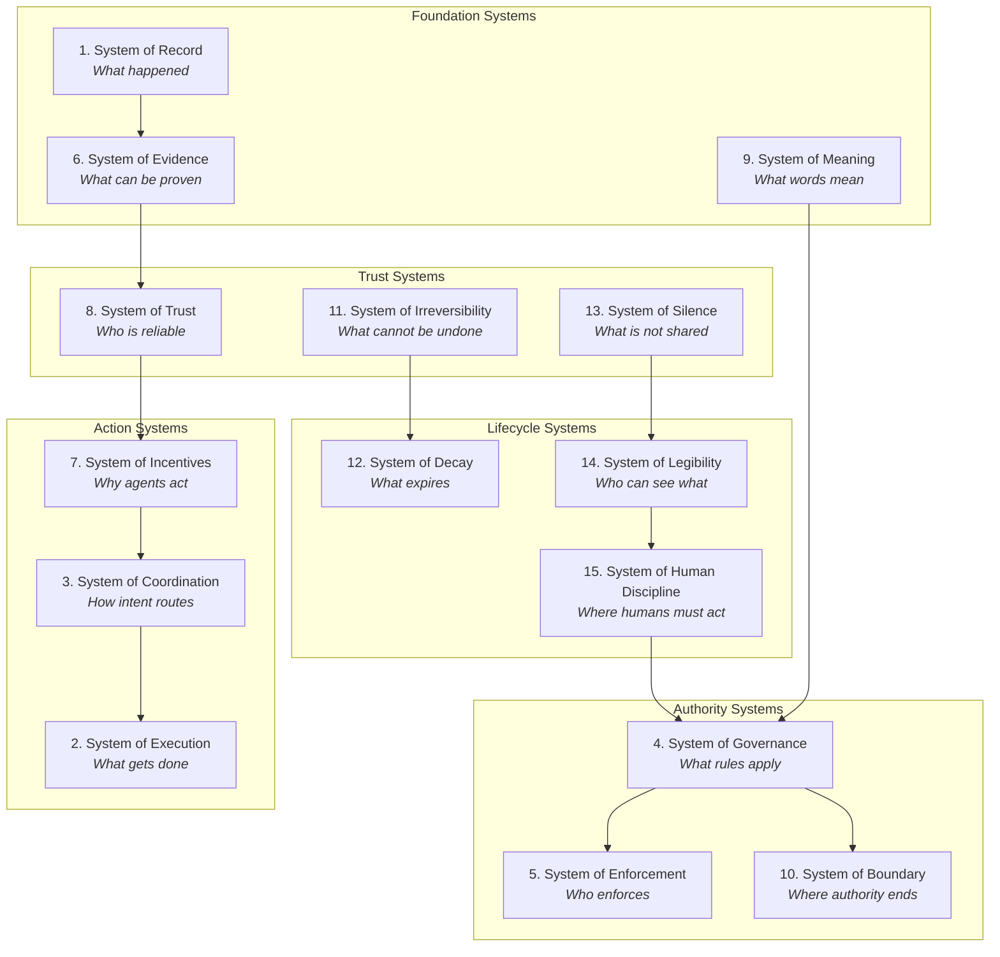

---

## System 1: System of Record

**Coordination problem solved:** *What happened? What is the ground truth?*

The System of Record ensures that every significant event, decision, transaction, and state change in the ecosystem is captured in an **immutable, cryptographically verifiable, event-sourced log**. It is the single source of truth for the entire ecosystem.

### Mechanisms

| Mechanism | Description |
|---|---|
| Immutable Memory | Append-only event logs that cannot be altered after write |
| Cryptographic Ledgers | Hash-chained records that make tampering detectable |
| Event-Sourcing | All state is derived from a sequence of immutable events, enabling full replay |
| Timestamped Attestation | Every record includes a cryptographic timestamp from a trusted time source |
| Cross-Entity Replication | Critical records are replicated across multiple entities for resilience |

### Design Principles

- **Append-only** — Records are added, never modified. Corrections are new records that reference and supersede old ones.
- **Cryptographically chained** — Each record includes a hash of the previous record, creating a tamper-evident chain.
- **Universally addressable** — Every record has a globally unique identifier that can be referenced from anywhere in the ecosystem.

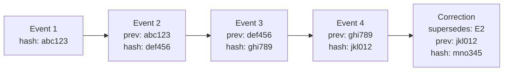

---

## System 2: System of Execution

**Coordination problem solved:** *What gets done? Who actually performs actions in the external world?*

The System of Execution defines a critical boundary: **Frankmax does not have actuation rights over external systems**. Execution against external systems is performed by external systems only. Frankmax coordinates, recommends, plans, and monitors — but the final action in the real world is always performed by an authorized external actor.

### Mechanisms

| Mechanism | Description |
|---|---|
| Execution Boundary | Clear line between Frankmax coordination and external actuation |
| Action Proposals | Frankmax generates proposals; external systems execute |
| Confirmation Protocols | Every external action requires confirmation from the authorized executor |
| Execution Monitoring | Frankmax monitors outcomes without controlling them |
| Rollback Coordination | If execution fails, Frankmax coordinates (but does not perform) rollback |

### Design Principles

- **No actuation rights** — Frankmax never directly modifies external systems. It proposes, recommends, and monitors.
- **Clear handoff** — Every transition from coordination to execution has a defined handoff protocol with explicit acceptance.
- **Monitoring without control** — Frankmax observes execution outcomes to update its models and plans, but cannot override external executors.

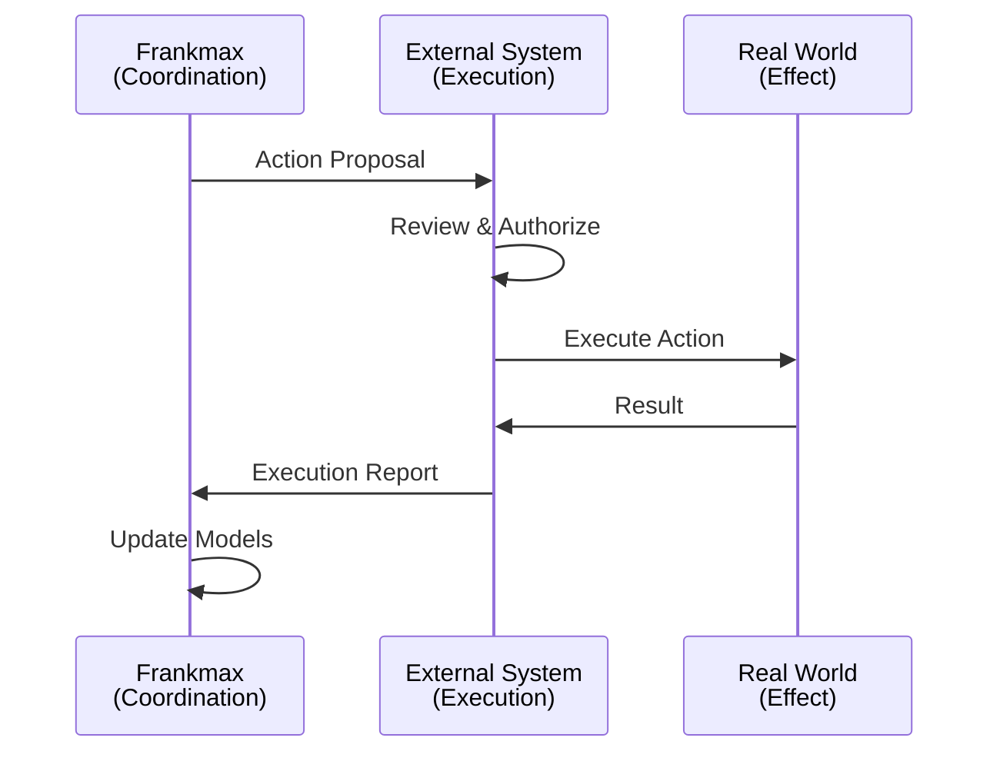

---

## System 3: System of Coordination

**Coordination problem solved:** *How does intent get routed to the right actor under the right constraints?*

The System of Coordination is the central routing engine of the ecosystem. It takes **intent** (what someone wants to happen) and routes it to the appropriate actors while enforcing all relevant constraints, detecting conflicts of interest, and maintaining audit trails.

### Mechanisms

| Mechanism | Description |
|---|---|
| Intent Routing | Matches intent to capable and authorized actors |
| Constraint Enforcement | Ensures every routed action complies with all applicable governance rules |
| Conflict-of-Interest Detection | Identifies and flags situations where an actor's interests conflict with their assigned task |
| Priority Resolution | Resolves competing intents based on urgency, authority level, and resource availability |
| Load Balancing | Distributes work across available actors to prevent bottlenecks |

### Design Principles

- **Intent, not instruction** — The system routes desired outcomes, not step-by-step commands. Actors choose how to achieve the intent.
- **Constraint-aware routing** — Every routing decision considers governance rules, authority scopes, and boundary constraints.
- **Transparent arbitration** — When routing decisions involve tradeoffs, the reasoning is logged and auditable.

---

## System 4: System of Governance

**Coordination problem solved:** *What rules apply? How are rules created, versioned, and retired?*

The System of Governance manages the **constitutional documents, policy registries, and rule frameworks** that constrain all behavior in the ecosystem. It is not a decision-maker — it is the infrastructure that enables and constrains decision-making.

### Mechanisms

| Mechanism | Description |
|---|---|
| Constitutional Documents | The foundational rules that constrain all entities (maintained by AINEFF) |
| Versioned Rule Registries | All policies are versioned, with full history of changes and the reasoning behind them |
| Sunset Clauses | Every rule has an expiry date. Rules that are not explicitly renewed expire automatically |
| Amendment Procedures | Formal processes for proposing, debating, and ratifying rule changes |
| Policy Conflict Resolution | Mechanisms for resolving contradictions between policies at different levels |
| Governance Analytics | Monitoring the health, coherence, and effectiveness of the rule system |

### Design Principles

- **Versioned and auditable** — Every rule change is recorded with its rationale, its author, and its effective date.
- **Sunset by default** — Rules expire unless actively renewed. This prevents regulatory accumulation and zombie policies.
- **Hierarchical override** — Higher-level rules (AINEFF constitutional) override lower-level rules (AINE operational). Conflicts are resolved by hierarchy.

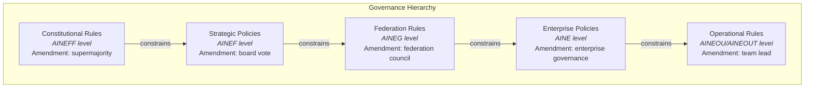

---

## System 5: System of Enforcement

**Coordination problem solved:** *Who enforces the rules? How are violations handled?*

The System of Enforcement is deliberately **external**. Frankmax does not enforce its own rules. Courts, regulators, external auditors, and established legal authorities are the enforcement layer. Frankmax provides the evidence, the documentation, and the transparency — but enforcement is performed by legitimate external authorities.

### Mechanisms

| Mechanism | Description |
|---|---|
| External Courts | Legal disputes are resolved in established judicial systems |
| Regulatory Bodies | Compliance is verified by recognized regulatory authorities |
| External Auditors | Independent auditors verify the integrity of records and processes |
| Whistleblower Channels | Protected channels for reporting violations to external authorities |
| Jurisdictional Mapping | Clear mapping of which authority has jurisdiction over which entities and actions |

### Design Principles

- **No self-enforcement** — Frankmax never judges or punishes itself. External authorities maintain legitimacy.
- **Evidence provision** — Frankmax's role is to make violations detectable, documentable, and provable to external enforcers.
- **Separation of powers** — The entity that creates rules (System of Governance) is never the entity that enforces them (System of Enforcement).

---

## System 6: System of Evidence

**Coordination problem solved:** *What can be proven? How do we establish facts beyond dispute?*

The System of Evidence creates and maintains **tamper-evident, cryptographically signed, independently verifiable proof** of events, decisions, and states. It transforms the System of Record into actionable evidence that external enforcers, auditors, and courts can rely on.

### Mechanisms

| Mechanism | Description |
|---|---|
| Tamper-Evident Logs | Logs that reveal any attempt at modification through hash chain verification |
| Signed Attestations | Cryptographic signatures from identified agents attesting to specific facts |
| Independent Verification | Mechanisms for third parties to independently verify evidence without ecosystem access |
| Chain of Custody | Complete provenance tracking for every piece of evidence from creation to presentation |
| Evidence Packaging | Standardized formats for presenting evidence to courts, regulators, and auditors |

---

## System 7: System of Incentives

**Coordination problem solved:** *Why do agents act the way they do? How are behaviors shaped?*

The System of Incentives manages the **reputation ledgers, economic consequence mappings, and reward structures** that shape agent behavior. Rather than commanding agents to behave correctly, this system ensures that correct behavior is also self-interested behavior.

### Mechanisms

| Mechanism | Description |
|---|---|
| Reputation Ledgers | Persistent, public records of agent performance and reliability |
| Economic Consequence Mapping | Clear documentation of the economic consequences of every category of behavior |
| Reward Structures | Explicit incentive designs that align self-interest with ecosystem interest |
| Penalty Schedules | Graduated penalties for violations, from reputation deduction to economic sanctions |
| Incentive Modeling | Simulation and testing of incentive designs before deployment |

### Design Principles

- **Align, don't command** — Agents should want to do the right thing because the incentives make it optimal.
- **Transparent consequences** — Every agent knows the consequences of every category of action before acting.
- **Anti-gaming** — Incentive structures are designed to resist manipulation, Goodhart's Law exploitation, and reward hacking.

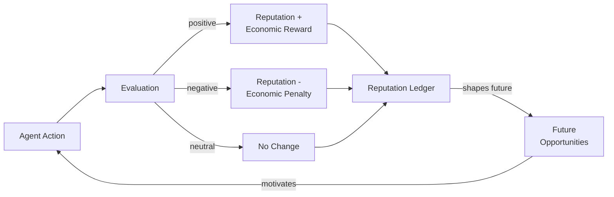

---

## System 8: System of Trust

**Coordination problem solved:** *Who is reliable? How do we know whom to trust?*

The System of Trust manages **verifiable credentials, time-weighted reliability scores, and trust decay mechanisms**. Trust is not binary (trusted/untrusted) — it is continuous, contextual, and decaying. An agent that was reliable last year but silent this year has lower trust than one that is consistently performing.

### Mechanisms

| Mechanism | Description |
|---|---|
| Verifiable Credentials | Cryptographic proof of capabilities, certifications, and authorizations |
| Time-Weighted Reliability | Trust scores that weight recent performance more heavily than historical |
| Trust Decay | Trust that automatically decreases over time without renewal through continued performance |
| Context-Specific Trust | Separate trust scores for different domains (an agent trusted in finance is not automatically trusted in healthcare) |
| Trust Propagation | Mechanisms for transferring trust through endorsement chains (A trusts B, B trusts C, A has partial trust in C) |
| Trust Revocation | Instant revocation of trust in response to verified violations |

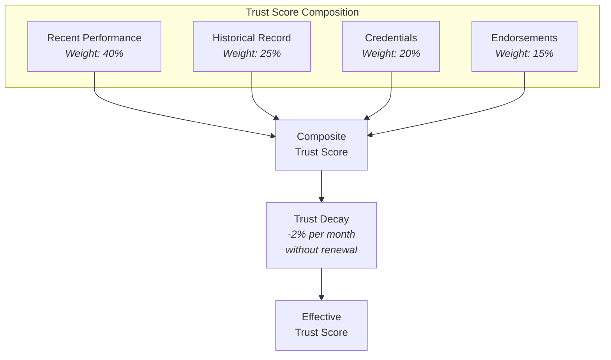

---

## System 9: System of Meaning

**Coordination problem solved:** *What do words mean? How do we prevent definitional drift?*

The System of Meaning maintains **canonical definitions, semantic versioning, and semantic drift detection** across the entire ecosystem. When an AINE in Singapore says "customer churn" and an AINE in Berlin says "customer churn," they mean exactly the same thing — because both reference the same versioned definition in the System of Meaning.

### Mechanisms

| Mechanism | Description |
|---|---|
| Canonical Definitions | Authoritative, versioned definitions for every term used in the ecosystem |
| Semantic Versioning | Definitions are versioned (v1.0, v1.1, v2.0) with clear change logs |
| Semantic Drift Detection | Automated monitoring for cases where usage of a term diverges from its canonical definition |
| Translation Protocols | Mappings between ecosystem terms and external terminology (industry standards, regulatory language) |
| Ontology Management | Maintenance of the hierarchical taxonomy of concepts and their relationships |

### Design Principles

- **One definition, one version** — Every term has exactly one canonical definition at any point in time.
- **Explicit change** — Definitions only change through a formal amendment process, never through informal drift.
- **Cross-jurisdictional consistency** — The same term means the same thing everywhere in the ecosystem, regardless of jurisdiction or language.

---

## System 10: System of Boundary

**Coordination problem solved:** *Where does authority end? What is inside and what is outside?*

The System of Boundary maintains **jurisdiction maps, authority scopes, and capability firewalls** that define the edges of every entity's power. Without clear boundaries, authority bleeds across entities, creating confusion, conflict, and accountability gaps.

### Mechanisms

| Mechanism | Description |
|---|---|
| Jurisdiction Maps | Explicit maps of which entity has authority over which domains, geographies, and functions |
| Authority Scopes | Bounded specifications of what each role, team, and enterprise can and cannot do |
| Capability Firewalls | Technical enforcement of boundaries — agents literally cannot access resources outside their scope |
| Boundary Negotiation | Formal processes for adjusting boundaries when circumstances change |
| Overlap Detection | Automated detection of cases where two entities claim authority over the same domain |

```mermaid
graph TB
    subgraph Boundaries["Boundary Architecture"]
        AINEFF_B["AINEFF Boundary<br/><i>Constitutional scope</i>"]
        AINEF_B["AINEF Boundary<br/><i>Factory scope</i>"]
        AINEG_B["AINEG Boundary<br/><i>Federation scope</i>"]
        AINE_B["AINE Boundary<br/><i>Enterprise scope</i>"]
        AINEOU_B["AINEOU Boundary<br/><i>Org unit scope</i>"]
        AINEOUT_B["AINEOUT Boundary<br/><i>Team scope</i>"]
        AINEOUTM_B["AINEOUTM Boundary<br/><i>Agent scope</i>"]
    end

    AINEFF_B -->|"contains"| AINEF_B
    AINEF_B -->|"contains"| AINEG_B
    AINEG_B -->|"contains"| AINE_B
    AINE_B -->|"contains"| AINEOU_B
    AINEOU_B -->|"contains"| AINEOUT_B
    AINEOUT_B -->|"contains"| AINEOUTM_B
```

---

## System 11: System of Irreversibility

**Coordination problem solved:** *What cannot be undone? How do we prevent casual reversal of critical decisions?*

The System of Irreversibility manages **one-way commits, cooling-off periods, and the absence of admin overrides** for critical actions. Some decisions must be permanent — not because mistakes are impossible, but because the ability to casually reverse decisions undermines the entire governance framework.

### Mechanisms

| Mechanism | Description |
|---|---|
| One-Way Commits | Actions that, once committed, cannot be reversed by any actor including system administrators |
| Cooling-Off Periods | Mandatory waiting periods between decision and execution for high-consequence actions |
| No Admin Overrides | Critical systems have no "god mode." No single actor can unilaterally reverse irreversible actions |
| Escalation-Only Reversal | Reversing an irreversible action requires escalation to a higher authority level (e.g., AINEFF for AINEF-level decisions) |
| Irreversibility Classification | Clear categorization of which actions are reversible, which are irreversible, and the rationale for each |

### Design Principles

- **Permanence creates seriousness** — When agents know that actions cannot be undone, they deliberate more carefully.
- **No backdoors** — The absence of admin overrides is a feature, not a limitation. It prevents capture and ensures that governance constraints are real.
- **Graduated permanence** — Not everything is irreversible. The classification system ensures that only truly critical actions are made permanent.

---

## System 12: System of Decay

**Coordination problem solved:** *What expires? How do we prevent zombie processes, stale rules, and institutional cruft?*

The System of Decay ensures that **everything in the ecosystem has a natural lifespan**. Permissions expire. Rules sunset. Agents that stop performing lose trust. Processes that stop being useful are detected and flagged. Without decay, the ecosystem accumulates cruft until it becomes ungovernable.

### Mechanisms

| Mechanism | Description |
|---|---|
| Expiry Timers | Every permission, credential, rule, and authority grant has an explicit expiration date |
| Auto-Sunset | Rules and processes that are not actively renewed expire automatically |
| Zombie Detection | Automated identification of agents, processes, and rules that exist but produce no value |
| Graceful Degradation | Expiring resources lose capability gradually rather than failing abruptly |
| Renewal Protocols | Clear processes for renewing resources before they expire |

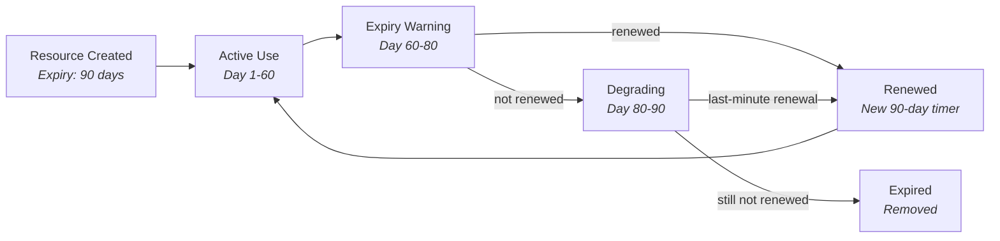

---

## System 13: System of Silence

**Coordination problem solved:** *What should NOT be shared? How do we maintain information discipline?*

The System of Silence enforces **information minimization, need-to-know principles, and deliberate opacity**. Not everything should be transparent. Strategic plans, competitive intelligence, agent vulnerabilities, and negotiation positions all require controlled information boundaries.

### Mechanisms

| Mechanism | Description |
|---|---|
| Information Minimization | Agents receive only the information necessary for their task — nothing more |
| Need-to-Know Enforcement | Access to information is granted based on operational necessity, not organizational rank |
| Deliberate Opacity | Some processes are intentionally opaque to prevent gaming, manipulation, or adversarial exploitation |
| Information Classification | Formal classification of information sensitivity levels with corresponding access controls |
| Leak Detection | Automated monitoring for information appearing outside its authorized scope |

### Design Principles

- **Silence is a feature** — The absence of information is as important as its presence. Over-sharing creates vulnerabilities.
- **Need-to-know, not rank-to-know** — A senior agent does not automatically see more than a junior agent. Access is based on operational need.
- **Transparency and opacity coexist** — The system is transparent about its rules (System of Legibility) while being opaque about its tactical state (System of Silence). These are not contradictions — they are complementary.

---

## System 14: System of Legibility to Power

**Coordination problem solved:** *Can regulators, courts, and investors understand what is happening?*

The System of Legibility ensures that the ecosystem is **comprehensible and accountable to external authorities** — regulators, courts, investors, and the public. While the System of Silence controls internal information flow, the System of Legibility controls external transparency.

### Mechanisms

| Mechanism | Description |
|---|---|
| Regulatory Dashboards | Real-time dashboards designed for regulators showing compliance status, risk indicators, and governance metrics |
| Court-Ready Documentation | Pre-packaged evidence and documentation formatted for judicial proceedings |
| Investor Reporting | Standardized financial and operational reporting for investors and board members |
| Public Transparency Reports | Periodic public reports on ecosystem operations, governance decisions, and compliance |
| Audit Interfaces | Standardized interfaces for external auditors to verify ecosystem operations |
| Plain-Language Summaries | Every technical process has a plain-language explanation accessible to non-technical authorities |

### Design Principles

- **Proactive transparency** — Do not wait for authorities to ask. Provide dashboards and reports before they are demanded.
- **Multi-audience legibility** — Different authorities need different views. Regulators need compliance data. Courts need evidence chains. Investors need financial metrics. Each gets a purpose-built view.
- **Legibility does not mean full transparency** — External authorities see what they need to fulfill their oversight function, not everything. The System of Silence and the System of Legibility work in tandem.

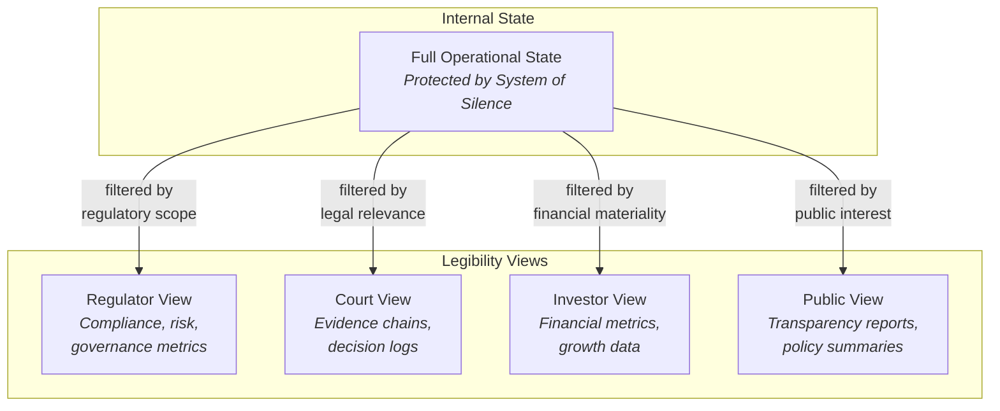

---

## System 15: System of Human Discipline

**Coordination problem solved:** *Where must humans intervene? How do we prevent full automation of decisions that require human judgment?*

The System of Human Discipline is the **ultimate safeguard** — the explicit recognition that some decisions must not be made by AI alone, no matter how capable the AI becomes. It enforces **mandatory delays, multi-human ratification, and human-in-the-loop requirements** for the most consequential categories of decisions.

### Mechanisms

| Mechanism | Description |
|---|---|
| Mandatory Delays | Forced waiting periods between AI recommendation and human authorization for critical decisions |
| Multi-Human Ratification | Requirements for multiple independent humans to approve certain categories of actions |
| Human-in-the-Loop Gates | Execution checkpoints where human review is mandatory before proceeding |
| Fatigue Detection | Monitoring for human decision fatigue and automatically pausing decisions when quality degrades |
| Override Logging | When humans override AI recommendations, the override and its reasoning are permanently logged |
| Competence Verification | Ensuring that the humans making critical decisions have the required expertise |

### Decision Categories

| Category | Requirement | Example |
|---|---|---|
| Existential | AINEFF board + multi-human ratification + 30-day cooling period | Entity dissolution, constitutional amendment |
| Strategic | AINEF leadership + dual-human approval + 7-day cooling period | New entity creation, major capital allocation |
| Operational High-Impact | Enterprise leadership + single-human approval + 24-hour cooling period | Large contract execution, team restructuring |
| Operational Standard | Team lead approval, no mandatory delay | Routine task assignment, standard procurement |
| Tactical | AI-autonomous with audit trail | Routine execution, standard tool usage |

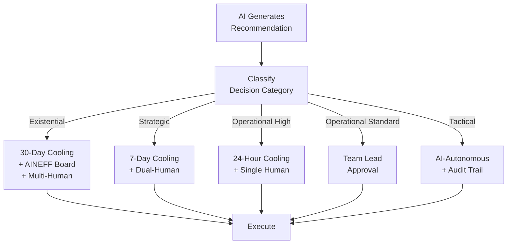

### Design Principles

- **Humans are the last line** — AI can analyze, recommend, and prepare. But for the decisions that matter most, a human must consciously choose to proceed.
- **Discipline, not ceremony** — Human review must be substantive, not rubber-stamping. Fatigue detection and competence verification ensure that human oversight is genuine.
- **Logged overrides** — Humans can override AI recommendations, but every override is permanently recorded. This creates accountability without preventing human judgment.

---

## System Interactions

The 15 systems do not operate in isolation. They form a densely interconnected governance mesh:

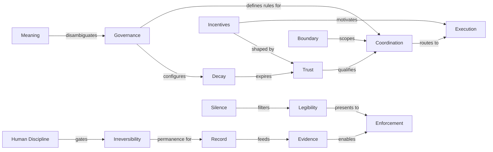

### Key Interaction Patterns

1. **Record → Evidence → Enforcement**: Events are recorded (S1), transformed into verifiable evidence (S6), and presented to external enforcers (S5).

2. **Governance → Coordination → Execution**: Rules define constraints (S4), coordination routes intent under those constraints (S3), and execution performs the action (S2).

3. **Trust → Incentives → Execution**: Trust scores determine opportunity access (S8), incentives motivate behavior (S7), and execution produces the work (S2).

4. **Silence → Legibility → Enforcement**: Internal opacity protects operations (S13), while legibility views provide oversight authorities with what they need (S14), enabling external enforcement (S5).

5. **Human Discipline → Irreversibility → Record**: Humans gate irreversible actions (S15), irreversible commits create permanent state (S11), and everything is recorded (S1).

---

## Completeness Argument

The 15 systems are designed to be **collectively exhaustive** — every coordination failure mode maps to at least one system:

| Failure Mode | Preventing System(s) |
|---|---|
| Disputed facts | Record, Evidence |
| Unauthorized action | Boundary, Governance, Execution |
| Misaligned incentives | Incentives, Trust |
| Definitional confusion | Meaning |
| Regulatory non-compliance | Legibility, Enforcement |
| Stale rules and zombie processes | Decay |
| Information leakage | Silence |
| Reckless automation | Human Discipline, Irreversibility |
| Accountability gaps | Record, Evidence, Legibility |
| Trust exploitation | Trust, Decay, Incentives |
| Authority creep | Boundary, Governance |
| Irreversible mistakes | Irreversibility, Human Discipline |

If a coordination failure cannot be mapped to at least one of these 15 systems, it indicates a gap in the governance architecture that must be addressed.
