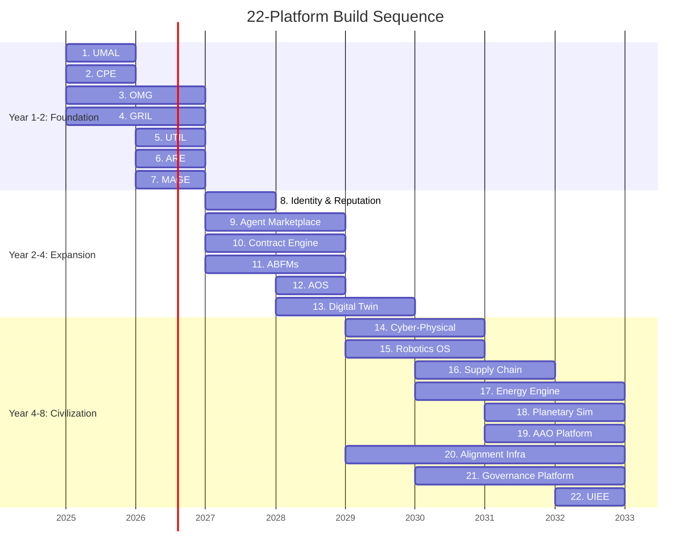
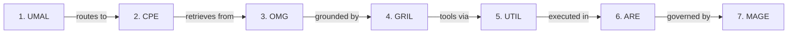
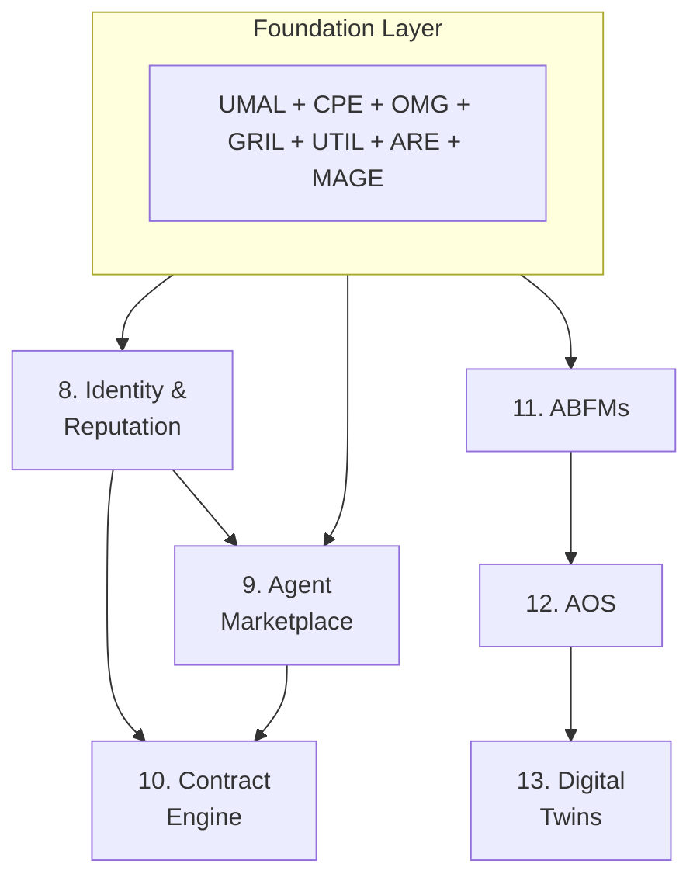
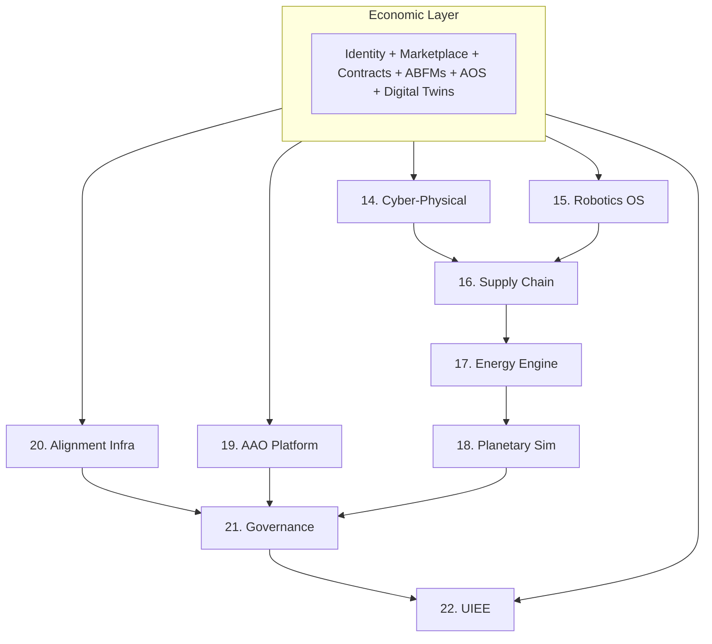
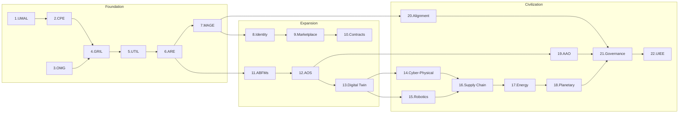

---

sidebar_position: 5
slug: 22-platforms
title: 22-Platform Build Sequence
description: The complete 22-platform implementation roadmap of the AINEFF Ecosystem — from intelligence abstraction to civilizational governance, sequenced across three strategic phases.
tags: [blueprint, strategic, technical]
custom_status: active
custom_owner: Andrew Leo
custom_last_review: 2026-03-01
custom_next_review: 2026-06-01
---

# 22-Platform Build Sequence

The 22 platforms are the concrete instantiation of the [7-Layer Control Model](./7-layer-control) and the [5-Layer Monopoly Blueprint](./5-layer-monopoly). Each platform is a standalone product with its own value proposition, revenue model, and defensibility — but they are designed to compose into a single, integrated infrastructure stack.

The build sequence is not arbitrary. Each platform is ordered to **maximize early revenue, minimize dependency risk, and create compounding lock-in** as the stack grows.

---

## Strategic Sequencing Overview

---

## Phase 1: Foundation (Year 1-2)

The first seven platforms establish the **intelligence and execution substrate**. They generate immediate revenue through developer tooling and enterprise intelligence services while building the foundation for everything that follows.

---

### Platform 1: UMAL (Universal Model Abstraction Layer)

**Purpose:** Unified interface that abstracts away provider, model, and version differences. One API to access any model.

**What it does:**
- Dynamic model routing based on task type, cost, latency, and quality requirements
- Provider failover and load balancing
- Unified prompt format translation
- Cost optimization across model portfolios
- A/B testing and model comparison

**Revenue model:** Usage-based pricing (per-request routing fee) + enterprise contracts

**Dependencies:** None (first platform, no upstream requirements)

**Monopoly layer:** Layer 1 (Intelligence Abstraction)

---

### Platform 2: CPE (Cognitive Post-Processing Engine)

**Purpose:** Multi-stage pipeline for validating, enhancing, and scoring model outputs after inference.

**What it does:**
- Hallucination detection and filtering
- Bias detection and mitigation
- Response quality scoring
- Citation verification and grounding
- Output format normalization
- Confidence calibration

**Revenue model:** Per-request processing fee + quality SLA tiers

**Dependencies:** UMAL (receives raw model outputs)

**Monopoly layer:** Layer 1 (Intelligence Abstraction)

---

### Platform 3: OMG (Orchestrated Memory Graph)

**Purpose:** Persistent, hierarchical memory system with episodic, semantic, and procedural layers.

**What it does:**
- Cross-session memory persistence
- Hierarchical memory organization (episodic, semantic, procedural, meta)
- Selective memory retrieval based on relevance and recency
- Memory consolidation and compression
- Memory sharing across agents with permission controls
- Forgetting protocols (deliberate, governed memory deletion)

**Revenue model:** Storage-based pricing + memory operations pricing + enterprise memory management

**Dependencies:** None (can operate standalone, enhanced by UMAL/CPE)

**Monopoly layer:** Layer 2 (Memory & Context Graph)

---

### Platform 4: GRIL (Grounded Retrieval Intelligence Layer)

**Purpose:** Retrieval system that grounds responses in verified, cited, authoritative knowledge.

**What it does:**
- Multi-source retrieval (documents, databases, APIs, knowledge graphs)
- Source authority scoring and ranking
- Citation generation and verification
- Contradiction detection across sources
- Temporal awareness (distinguishing current from outdated information)
- Domain-specific retrieval optimization

**Revenue model:** Per-query retrieval fee + knowledge base hosting + enterprise integration

**Dependencies:** OMG (retrieves from memory graph)

**Monopoly layer:** Layer 2 (Memory & Context Graph)

---

### Platform 5: UTIL (Universal Tool Interface Layer)

**Purpose:** Standardized protocol for agents to discover, authenticate with, and use external tools and APIs.

**What it does:**
- Tool discovery and registry
- Authentication and permission management
- Input/output schema standardization
- Tool capability description and matching
- Rate limiting and quota management
- Error handling and retry logic
- Tool composition (chaining tools into workflows)

**Revenue model:** Tool marketplace fees + developer registration + enterprise tool management

**Dependencies:** UMAL (for intelligent tool selection), GRIL (for tool documentation retrieval)

**Monopoly layer:** Layer 3 (Agent Runtime & Tool Orchestration)

---

### Platform 6: ARE (Agent Runtime Environment)

**Purpose:** Sandboxed execution environment where agents plan, act, observe, and iterate.

**What it does:**
- Secure execution sandbox with resource limits
- Multi-step planning with constraint satisfaction
- State management across execution steps
- Observation and feedback loops
- Rollback and recovery mechanisms
- Parallel execution and coordination
- Audit logging of all actions

**Revenue model:** Compute-time pricing + execution SLAs + enterprise runtime hosting

**Dependencies:** UTIL (for tool access), OMG (for memory), UMAL/CPE (for reasoning)

**Monopoly layer:** Layer 3 (Agent Runtime & Tool Orchestration)

---

### Platform 7: MAGE (Meta-Agent Governance Engine)

**Purpose:** Real-time governance enforcement during agent execution.

**What it does:**
- Policy definition and management (what agents can and cannot do)
- Real-time action validation against policies
- Escalation protocols (when to involve human oversight)
- Budget and resource enforcement
- Compliance logging and audit trails
- Multi-jurisdictional policy management
- Governance analytics and reporting

**Revenue model:** Governance-as-a-service + compliance certification + enterprise policy management

**Dependencies:** ARE (governs execution), UTIL (constrains tool access)

**Monopoly layer:** Layer 3 (Agent Runtime & Tool Orchestration)

---

## Phase 2: Expansion (Year 2-4)

The next six platforms build the **economic and organizational layer**. They transform the foundation from a developer tool into an autonomous economic ecosystem.

---

### Platform 8: Digital Identity & Reputation Infrastructure

**Purpose:** Self-sovereign identity and reputation system for AI agents.

**What it does:**
- Cryptographic identity issuance and management
- Verifiable credential infrastructure
- Time-weighted reputation scoring
- Trust decay and renewal mechanisms
- Cross-enterprise identity federation
- Identity-linked audit trails
- Selective disclosure (prove attributes without revealing identity)

**Revenue model:** Identity issuance fees + verification fees + reputation data access + enterprise identity management

**Dependencies:** OMG (reputation data storage), MAGE (governance integration)

**Monopoly layer:** Layer 4 (Identity, Trust & Economic)

---

### Platform 9: Agent Marketplace Platform

**Purpose:** Discovery, hiring, and procurement platform for AI agent capabilities.

**What it does:**
- Agent capability listing and discovery
- Skills matching and recommendation
- Pricing and negotiation
- Hiring workflows (trial, contract, permanent)
- Performance tracking and reviews
- Dispute resolution
- Marketplace analytics

**Revenue model:** Transaction fees (percentage of agent compensation) + listing fees + premium placement

**Dependencies:** Identity & Reputation (for trust), UTIL (for capability description), ARE (for execution)

**Monopoly layer:** Layer 4 (Identity, Trust & Economic)

---

### Platform 10: Autonomous Contract & Negotiation Engine

**Purpose:** Self-negotiating, self-executing, self-enforcing agreements between agents.

**What it does:**
- Machine-readable contract specification
- Automated negotiation with configurable strategies
- Smart contract deployment and execution
- Performance monitoring against contract terms
- Automated dispute detection
- Breach notification and remediation
- Multi-party contract coordination

**Revenue model:** Contract creation fees + execution monitoring fees + dispute resolution fees

**Dependencies:** Identity & Reputation (for counterparty verification), Agent Marketplace (for discovery)

**Monopoly layer:** Layer 4 (Identity, Trust & Economic)

---

### Platform 11: Agentic Business Function Modules (ABFMs)

**Purpose:** Pre-built, composable AI business function modules for common enterprise operations.

**What it does:**
- Pre-packaged AI modules for: Sales, Marketing, Finance, HR, Legal, Operations, Customer Success, IT
- Configurable workflow templates
- Inter-module coordination
- Enterprise integration connectors
- Performance benchmarking
- Module marketplace for third-party contributions

**Revenue model:** Per-module subscription + usage-based pricing + enterprise licensing + module marketplace fees

**Dependencies:** ARE (for execution), MAGE (for governance), OMG (for memory), UTIL (for tool access)

**Monopoly layer:** Layer 3 (Agent Runtime & Tool Orchestration)

---

### Platform 12: AOS (Agentic Operating System)

**Purpose:** Unified operating system for running, managing, and coordinating AI agent organizations.

**What it does:**
- Organizational structure management (org units, teams, roles)
- Resource allocation and scheduling
- Cross-team coordination
- Enterprise-wide policy enforcement
- Performance management and analytics
- Capacity planning
- Organizational topology optimization

**Revenue model:** Enterprise licensing + per-agent seat pricing + management SLAs

**Dependencies:** All Phase 1 platforms + ABFMs + Identity & Reputation

**Monopoly layer:** Layer 3 (Agent Runtime & Tool Orchestration)

---

### Platform 13: Digital Twin Platform

**Purpose:** Real-time synchronized virtual replicas of physical systems.

**What it does:**
- Physical system modeling and simulation
- Real-time sensor data integration
- Predictive analytics and anomaly detection
- Scenario simulation and what-if analysis
- Optimization recommendation generation
- Digital-physical synchronization protocols
- Multi-scale modeling (component, system, environment)

**Revenue model:** Platform licensing + data ingestion pricing + simulation compute pricing + enterprise integration

**Dependencies:** AOS (for organizational context), OMG (for data storage), ARE (for simulation execution)

**Monopoly layer:** Layer 5 (Cyber-Physical & Infrastructure)

---

## Phase 3: Civilization (Year 4-8)

The final nine platforms extend control into the **physical world and civilizational governance**. These are the long-term plays that transform the ecosystem from a technology company into a civilizational substrate.

---

### Platform 14: Cyber-Physical Control Layer

**Purpose:** Bridge between digital intelligence and physical-world actuation.

**What it does:**
- Sensor data ingestion and processing
- Actuator control interfaces
- Physical-digital state synchronization
- Safety constraint enforcement for physical actions
- Latency-critical edge computing
- Physical environment modeling

**Revenue model:** Per-device licensing + data throughput pricing + control SLAs

**Dependencies:** Digital Twin (for physical modeling), ARE (for execution), MAGE (for governance)

---

### Platform 15: Robotics & Humanoid OS

**Purpose:** Unified operating system for AI agents controlling physical robots and humanoid systems.

**What it does:**
- Motion planning and control
- Sensor fusion and perception
- Human-robot interaction protocols
- Safety-critical operation modes
- Fleet management and coordination
- Skill transfer across robot types
- Simulation-to-real transfer

**Revenue model:** Per-robot licensing + fleet management pricing + skill marketplace

**Dependencies:** Cyber-Physical Layer (for actuation), ARE (for planning), MAGE (for safety governance)

---

### Platform 16: Autonomous Supply Chain Network

**Purpose:** End-to-end autonomous management of global supply chains.

**What it does:**
- Demand forecasting and planning
- Supplier discovery and qualification
- Procurement automation
- Logistics optimization
- Inventory management
- Disruption detection and response
- Multi-tier supply chain visibility

**Revenue model:** Transaction-based pricing + network fees + optimization savings sharing

**Dependencies:** Digital Twin (for supply chain modeling), Contract Engine (for supplier agreements), Cyber-Physical (for warehouse/logistics control)

---

### Platform 17: Energy & Infrastructure Optimization Engine

**Purpose:** Optimization and control of energy generation, distribution, and consumption at scale.

**What it does:**
- Grid load balancing and optimization
- Renewable energy integration
- Demand response management
- Energy trading and arbitrage
- Carbon accounting and optimization
- Infrastructure maintenance scheduling
- Distributed energy resource coordination

**Revenue model:** Energy savings sharing + grid services fees + consulting + licensing

**Dependencies:** Digital Twin (for infrastructure modeling), Cyber-Physical (for grid control), Supply Chain (for energy procurement)

---

### Platform 18: Planetary Simulation & Policy Engine

**Purpose:** Multi-scale simulation engine for testing policy interventions across economic, climate, and social systems.

**What it does:**
- Climate system modeling
- Economic system simulation
- Demographic projection
- Policy impact assessment
- Multi-scenario comparison
- Uncertainty quantification
- Cross-domain interaction modeling

**Revenue model:** Government contracts + research licensing + policy consulting + simulation-as-a-service

**Dependencies:** Digital Twin (for physical models), Energy Engine (for energy models), Supply Chain (for economic models)

---

### Platform 19: AAO Platform (Autonomous AI Organizations)

**Purpose:** Infrastructure for creating and operating fully autonomous AI-native organizations.

**What it does:**
- Autonomous organization formation and registration
- Self-governing organizational structures
- Autonomous hiring, firing, and role assignment
- Self-directed strategy and goal setting
- Autonomous financial management
- Inter-organization federation
- Regulatory compliance automation

**Revenue model:** Organization hosting fees + governance services + federation fees

**Dependencies:** AOS (for org management), Identity (for agent identity), Contract Engine (for inter-org agreements), MAGE (for governance)

---

### Platform 20: Alignment & Value Encoding Infrastructure

**Purpose:** Technical infrastructure for encoding, verifying, and maintaining alignment of AI behavior with human values.

**What it does:**
- Value specification and encoding
- Behavioral constraint verification
- Alignment drift detection
- Value conflict resolution
- Multi-stakeholder value aggregation
- Alignment testing and certification
- Continuous alignment monitoring

**Revenue model:** Certification fees + monitoring services + research licensing + regulatory compliance

**Dependencies:** MAGE (for governance), Identity (for accountability), OMG (for behavioral history)

**Note:** This platform starts early (Year 4) because alignment is a cross-cutting concern that must be embedded from the beginning, even though its full scope extends to Year 8.

---

### Platform 21: Hybrid Human-AI Governance Platform

**Purpose:** Decision-making infrastructure that integrates human deliberation with AI analysis and execution.

**What it does:**
- Proposal generation and analysis
- Stakeholder preference aggregation
- Impact simulation before decision
- Transparent decision audit trails
- Human override and veto mechanisms
- Multi-jurisdictional governance
- Democratic and technocratic hybrid processes

**Revenue model:** Governance-as-a-service + consulting + government contracts

**Dependencies:** Alignment Infrastructure (for value compliance), AAO (for organizational governance), Planetary Simulation (for impact assessment)

---

### Platform 22: UIEE (Unified Intelligence Experience Engine)

**Purpose:** The "Spotify for Intelligence" — the consumer-facing layer that delivers seamless intelligence experiences to end users.

**What it does:**
- Personalized intelligence delivery
- Multi-modal interaction (text, voice, visual, spatial)
- Intelligence subscription management
- Capability discovery and recommendation
- Cross-platform intelligence continuity
- Intelligence quality preferences
- Usage analytics and optimization

**Revenue model:** Consumer subscription + enterprise licensing + intelligence marketplace fees

**Dependencies:** All preceding platforms (UIEE is the capstone that integrates the entire stack into a consumer experience)

**Monopoly layer:** Layer 1 (Intelligence Abstraction) — this is the ultimate expression of intelligence abstraction, built last because it requires every underlying platform to be operational.

---

## Platform Dependency Map

---

## Revenue Trajectory

| Phase | Platforms | Primary Revenue | Target ARR |
|---|---|---|---|
| Year 1-2 | 1-7 (Foundation) | Developer tools, API fees, enterprise intelligence services | $1M-$10M |
| Year 2-4 | 8-13 (Expansion) | Marketplace fees, enterprise licensing, identity services | $10M-$100M |
| Year 4-8 | 14-22 (Civilization) | Infrastructure contracts, government partnerships, consumer subscriptions | $100M-$1B+ |

The sequencing ensures that **each phase funds the next**. Foundation platforms generate the revenue needed to build expansion platforms, which generate the revenue needed to fund civilization-scale infrastructure. No phase requires external capital beyond what the previous phase can generate.
