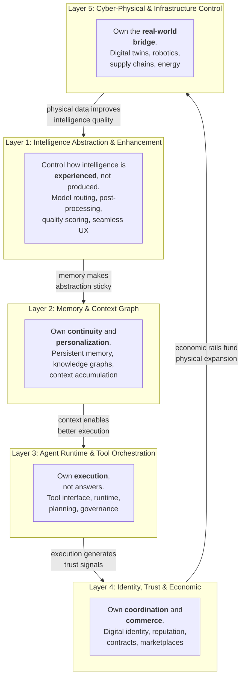
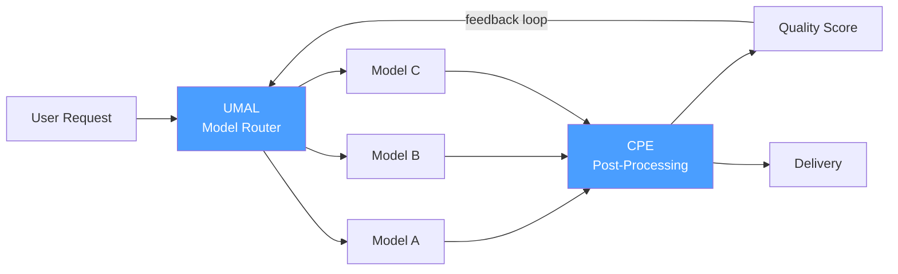
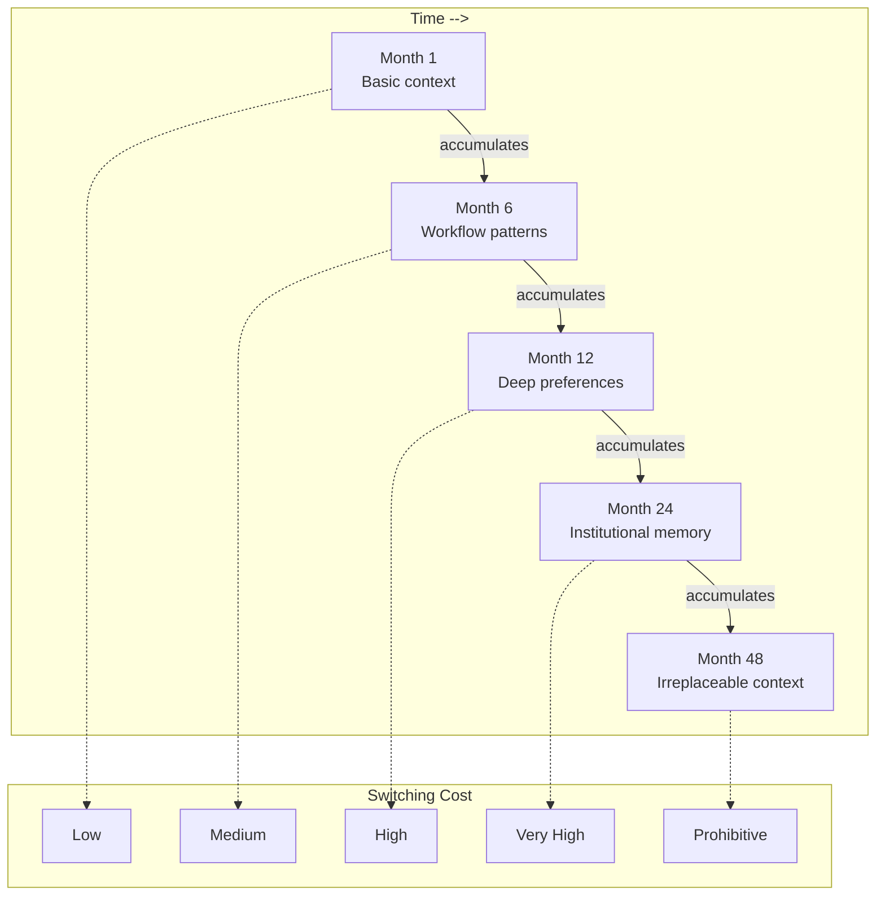
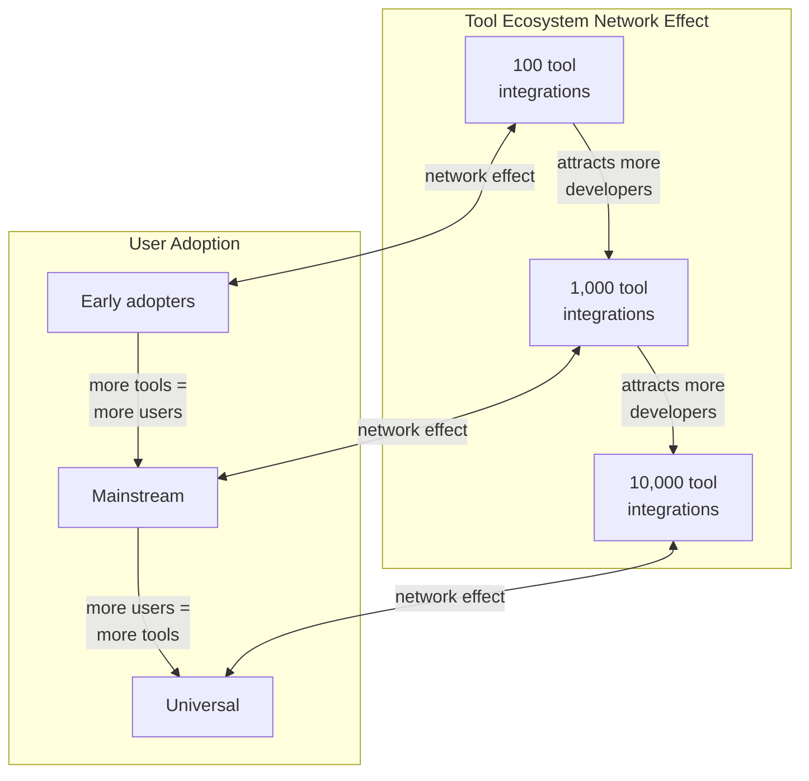
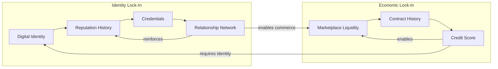
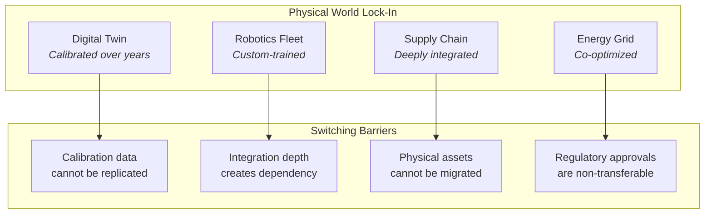
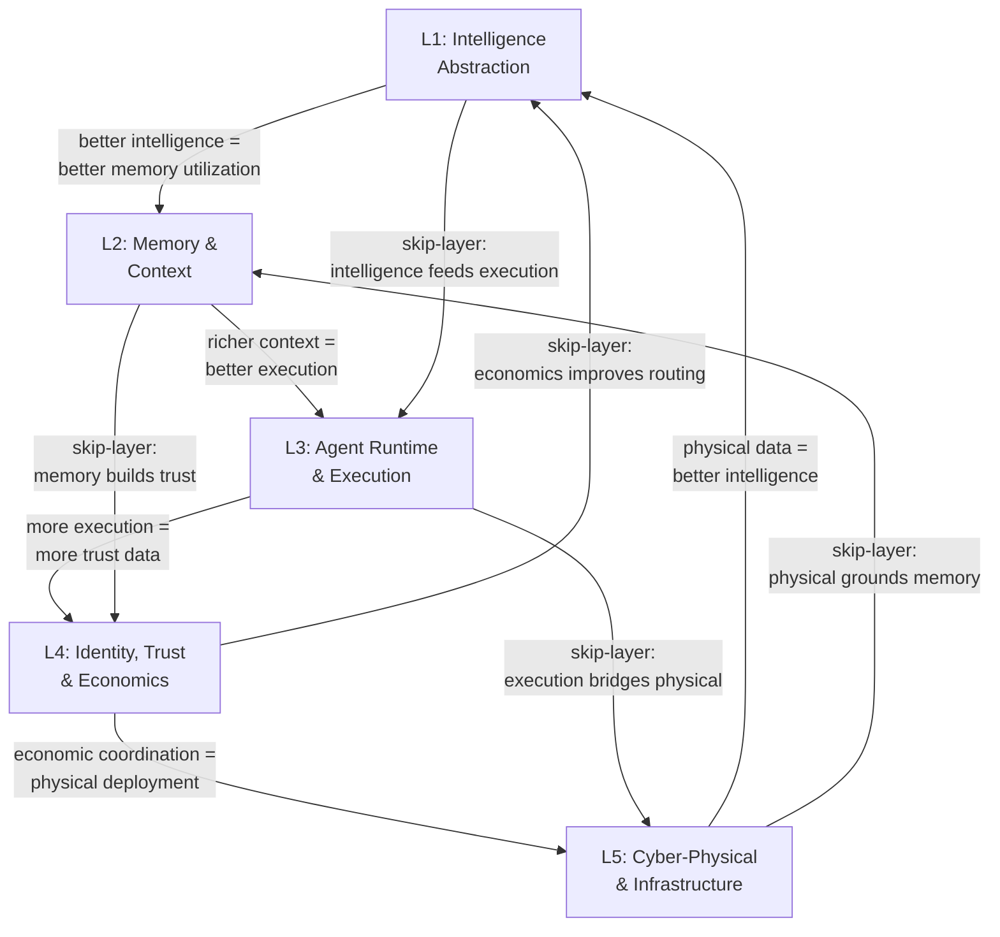
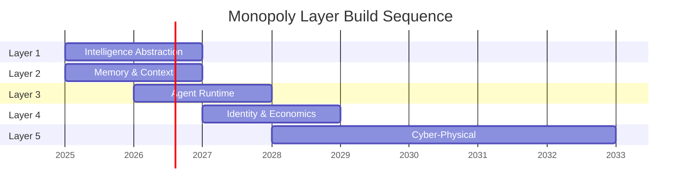

# 5-Layer Monopoly Blueprint

The 5-Layer Monopoly Blueprint answers a single strategic question: **where do defensible, compounding moats form in an AI-native economy?**

While the [7-Layer Control Model](./7-layer-control) maps everything that must be technically controlled, the 5-Layer Monopoly Blueprint identifies the five specific layers where **lock-in becomes structural** — where switching costs compound over time, where network effects create winner-take-all dynamics, and where control of one layer creates gravitational pull toward controlling the adjacent layers.

---

## The Five Monopoly Layers

---

## Layer 1: Intelligence Abstraction & Enhancement

### Control Thesis

**Control how intelligence is experienced, not how it is produced.**

Models are commoditizing. GPT-4, Claude, Gemini, Llama, Mistral — the supply side is fragmenting. The defensible position is not building another model. It is **owning the abstraction layer** that sits between all models and all consumers of intelligence.

### What This Layer Owns

- **Model routing** — Selecting the optimal model for each request based on task type, cost ceiling, latency requirement, and quality threshold
- **Cognitive post-processing** — Validating, enhancing, debiasing, and scoring model outputs before delivery
- **Quality-of-thought metrics** — Measuring reasoning quality, not just output quality
- **Intelligence UX** — The seamless experience of consuming intelligence without caring which model produced it

### Lock-In Mechanism

**Why switching is hard:** Once a user's workflows depend on the routing intelligence, quality guarantees, and post-processing enhancements of this layer, moving to raw model APIs means accepting lower quality, higher cost, and unpredictable behavior. The layer becomes invisible infrastructure — like DNS, you forget it exists until you try to leave.

### Key Platforms

- **UMAL** (Universal Model Abstraction Layer)
- **CPE** (Cognitive Post-Processing Engine)
- **UIEE** (Unified Intelligence Experience Engine)

---

## Layer 2: Memory & Context Graph

### Control Thesis

**Own continuity and personalization.**

Intelligence without memory is a stateless function call. Intelligence with memory is a **relationship**. This layer transforms transactional AI interactions into persistent, accumulating, deeply personalized relationships that become more valuable over time.

### What This Layer Owns

- **Persistent memory** — Cross-session, cross-context memory that accumulates over an agent's entire lifetime
- **Knowledge graphs** — Structured, queryable representations of everything an agent or user knows and has experienced
- **Context accumulation** — The compounding effect of every interaction making future interactions more valuable
- **Personalization depth** — The degree to which the system understands preferences, patterns, and needs

### Lock-In Mechanism

**Why switching is hard:** Memory compounds. After two years of continuous operation, an AI employee has accumulated a deep understanding of the user's domain, preferences, workflows, communication style, and decision patterns. This memory cannot be exported, replicated, or transferred. Switching means starting from zero.

### Key Platforms

- **OMG** (Orchestrated Memory Graph)
- **GRIL** (Grounded Retrieval Intelligence Layer)

---

## Layer 3: Agent Runtime & Tool Orchestration

### Control Thesis

**Own execution, not answers.**

The world is full of systems that produce answers. The scarce capability is **execution** — taking an intent, decomposing it into a plan, executing that plan across tools and systems, monitoring results, and adapting in real time. Whoever owns the runtime owns the conversion of intelligence into value.

### What This Layer Owns

- **Tool interface standardization** — The universal protocol through which agents interact with every external system
- **Runtime environment** — The sandboxed execution context with memory, planning, and governance integration
- **Planning and decomposition** — Multi-step task planning with constraint satisfaction and rollback
- **Governance during execution** — Inline policy enforcement that constrains what agents can do in real time

### Lock-In Mechanism

**Why switching is hard:** Tool integrations create a classic two-sided network effect. More tools attract more agents. More agents attract more tool developers. Once the ecosystem reaches critical mass, building a competing tool ecosystem becomes economically irrational.

### Key Platforms

- **UTIL** (Universal Tool Interface Layer)
- **ARE** (Agent Runtime Environment)
- **MAGE** (Meta-Agent Governance Engine)
- **AOS** (Agentic Operating System)

---

## Layer 4: Identity, Trust & Economic

### Control Thesis

**Own coordination and commerce.**

For autonomous agents to transact, they need **identity** (who are you?), **trust** (should I work with you?), and **economic rails** (how do we settle?). Whoever owns this infrastructure becomes the de facto central bank and identity provider of the AI economy.

### What This Layer Owns

- **Digital identity** — Cryptographically verifiable, non-transferable identity for every agent
- **Reputation infrastructure** — Time-weighted, context-specific, tamper-proof performance records
- **Contract negotiation and execution** — Self-negotiating, self-executing, self-enforcing agreements
- **Marketplace coordination** — Discovery, matching, and procurement of AI capabilities
- **Economic settlement** — Payment, clearing, and settlement for AI-to-AI transactions

### Lock-In Mechanism

**Why switching is hard:** Identity and reputation are **non-portable by design**. An agent's reputation on this platform cannot be transferred to a competitor because the reputation is cryptographically bound to the platform's attestation infrastructure. Moving platforms means abandoning years of accumulated trust.

### Key Platforms

- **Digital Identity & Reputation Infrastructure**
- **Agent Marketplace Platform**
- **Autonomous Contract & Negotiation Engine**

---

## Layer 5: Cyber-Physical & Infrastructure Control

### Control Thesis

**Own the real-world bridge.**

The first four layers operate in the digital domain. This layer extends control into the **physical world** — robots, factories, supply chains, energy grids, cities. This is where AI stops being software and becomes infrastructure.

### What This Layer Owns

- **Digital twins** — Real-time virtual replicas of physical systems
- **Robotics and actuation** — AI-controlled physical robots and industrial systems
- **Supply chain orchestration** — End-to-end autonomous management of global supply chains
- **Energy infrastructure** — Optimization and control of power generation, distribution, and consumption
- **Planetary-scale simulation** — Modeling and predicting outcomes at civilizational scale

### Lock-In Mechanism

**Why switching is hard:** Physical-world integrations are the hardest to replicate. A digital twin calibrated against years of sensor data from a specific factory cannot be recreated overnight. Regulatory approvals for energy grid management are jurisdiction-specific and non-transferable. The physical world creates the ultimate lock-in.

### Key Platforms

- **Digital Twin Platform**
- **Cyber-Physical Control Layer**
- **Robotics & Humanoid OS**
- **Autonomous Supply Chain Network**
- **Energy & Infrastructure Optimization Engine**

---

## The Lock-In Formula

The five layers do not create independent moats. They create a **compounding moat system** where control of each layer reinforces control of every other layer.

### The Formula

> **Total Lock-In = L1 x L2 x L3 x L4 x L5**
>
> Each layer is a **multiplier**, not an addend. A competitor must match all five simultaneously to offer a viable alternative. Matching four out of five is not 80% competitive — it is structurally incomplete.

### Why This Is Multiplicative, Not Additive

| Scenario | Competitor Has | What They Lack | Result |
|---|---|---|---|
| A | Great models, no memory | No continuity, no personalization | Stateless tool, not a relationship |
| B | Great memory, no runtime | Remembers everything, can do nothing | Knowledge without action |
| C | Great runtime, no identity | Can execute, cannot be trusted | Anonymous agents no one hires |
| D | Great identity, no physical | Trusted in digital, absent in physical | Software-only, no infrastructure |
| E | Great physical, no intelligence | Owns factories, no AI advantage | Traditional industrial company |

**Only the complete stack creates the compounding flywheel.** This is the strategic logic of the 5-Layer Monopoly Blueprint.

---

## Sequencing Strategy

The layers are built in sequence, each funding and enabling the next:

Layers 1 and 2 start simultaneously because they are mutually reinforcing from day one. Layer 3 follows quickly because execution is what converts intelligence and memory into revenue. Layer 4 emerges as the ecosystem reaches the scale where agent-to-agent commerce becomes necessary. Layer 5 is the long game — the decade-scale infrastructure play that transforms the ecosystem from a software company into a civilizational substrate.
