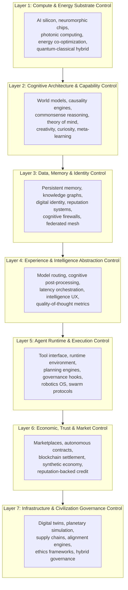
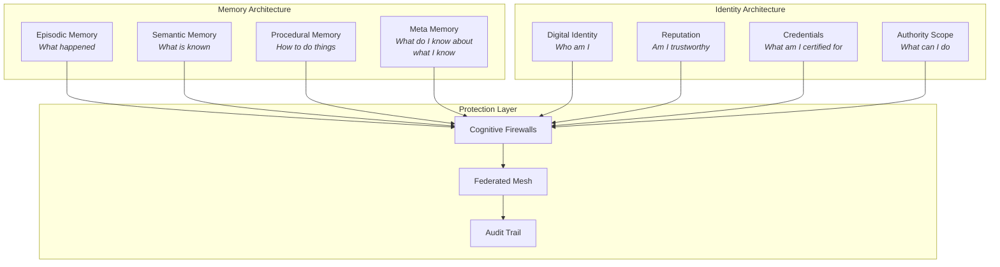
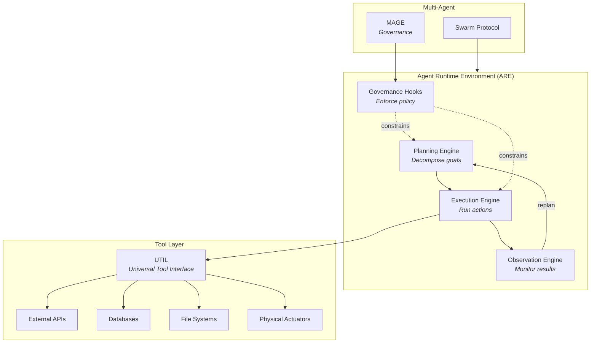
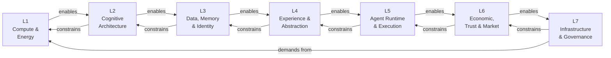

# 7-Layer Control Model

The 7-Layer Control Model defines **what must be controlled** and **at which abstraction level** to achieve full-stack civilizational autonomy. Each layer represents a distinct control surface — a set of capabilities that, if owned, create irreversible strategic advantage.

These layers are not products. They are **control points**. Products are instantiated within them, but the layers themselves represent the structural logic of where power accumulates in an AI-native civilization.

---

## Full Stack Overview

---

## Layer 1: Compute & Energy Substrate Control

**Control thesis:** Whoever controls the physical substrate of computation controls the ceiling of all intelligence above it.

This layer addresses the foundational question: **what is intelligence running on, and who controls the energy that powers it?**

### Scope

| Domain | Description |
|---|---|
| AI Silicon Design | Custom chip architectures optimized for agentic workloads, not just training |
| Neuromorphic Computing | Brain-inspired architectures for low-power, always-on reasoning |
| Photonic Computing | Light-based computation for latency-critical and energy-efficient inference |
| Energy Co-Optimization | Joint optimization of compute workloads and energy procurement/generation |
| Quantum-Classical Hybrid | Hybrid architectures that route subproblems to quantum processors when advantageous |
| Thermal Management | Heat harvesting and cooling systems that turn waste energy into useful work |

### Mapped Inventions

1. **Neuromorphic Agentic Processor** — Custom silicon designed for persistent agent execution rather than batch inference
2. **Photonic Inference Accelerator** — Optical computing units for sub-millisecond model routing
3. **Energy-Aware Compute Scheduler** — Scheduler that co-optimizes task placement with real-time energy pricing and carbon intensity
4. **Thermal Compute Recycler** — System that harvests waste heat from AI datacenters for industrial or municipal use
5. **Quantum Subroutine Router** — Middleware that identifies and routes quantum-advantageous subproblems to QPU clusters

---

## Layer 2: Cognitive Architecture & Capability Control

**Control thesis:** Whoever controls the fundamental cognitive capabilities — not just the models, but the architecture of thought itself — controls what intelligence can and cannot do.

This layer is about **the structure of cognition**: how AI systems reason, learn, imagine, and understand.

### Scope

| Domain | Description |
|---|---|
| World Models | Internal simulations of how the world works, enabling prediction and planning |
| Causal Reasoning | Ability to distinguish correlation from causation and reason about interventions |
| Commonsense Reasoning | Implicit knowledge about physics, social norms, and everyday logic |
| Theory of Mind | Modeling other agents' beliefs, intentions, and knowledge states |
| Creativity & Imagination | Generating novel ideas, designs, and solutions beyond training distribution |
| Curiosity & Exploration | Intrinsic motivation to seek information and reduce uncertainty |
| Meta-Learning | Learning how to learn — adapting learning strategies based on task characteristics |

### Mapped Inventions

6. **Causal World Model Engine** — Learns and maintains causal graphs of real-world domains from observational and interventional data
7. **Commonsense Knowledge Compiler** — Distills implicit commonsense knowledge into queryable, composable reasoning modules
8. **Theory of Mind Simulator** — Real-time modeling of other agents' epistemic states during multi-agent negotiation
9. **Creative Divergence Engine** — Controlled generation of novel hypotheses and designs via structured randomness and constraint relaxation
10. **Curiosity-Driven Exploration Controller** — Intrinsic reward system that drives agents to seek high-information-value observations
11. **Meta-Learning Optimizer** — Adapts learning rates, architectures, and data strategies based on task structure and performance history

---

## Layer 3: Data, Memory & Identity Control

**Control thesis:** Whoever controls memory controls continuity. Whoever controls identity controls trust. Together, they control the foundation of all persistent relationships.

This layer owns **who agents are** and **what they remember**.

### Scope

| Domain | Description |
|---|---|
| Persistent Memory | Cross-session, cross-context memory that accumulates over an agent's lifetime |
| Knowledge Graphs | Structured, queryable representations of domain knowledge and relationships |
| Digital Identity | Cryptographically verifiable, non-transferable identity for every agent |
| Reputation Systems | Time-weighted, context-specific performance and reliability scores |
| Cognitive Firewalls | Information boundaries that prevent unauthorized memory access or leakage |
| Federated Memory Mesh | Distributed memory architecture that allows controlled sharing across agents and enterprises |

### Mapped Inventions

12. **Orchestrated Memory Graph (OMG)** — Persistent, hierarchical memory system with episodic, semantic, and procedural layers
13. **Grounded Retrieval Intelligence Layer (GRIL)** — Retrieval system that grounds responses in verified, cited knowledge
14. **Sovereign Digital Identity Protocol** — Self-sovereign identity system for AI agents with cryptographic attestation
15. **Reputation Decay Engine** — Time-weighted reputation system where trust decays without renewal through performance
16. **Cognitive Firewall Manager** — Enforces information boundaries between agents, teams, and enterprises
17. **Federated Memory Mesh Protocol** — Enables controlled memory sharing across organizational boundaries without centralized storage

---

## Layer 4: Experience & Intelligence Abstraction Control

**Control thesis:** Whoever controls how intelligence is experienced — not how it is produced — controls the user relationship and the value perception.

This is the **"Spotify for Intelligence"** layer. It abstracts away the complexity of model selection, routing, and quality control, presenting a seamless intelligence experience to the consumer.

### Scope

| Domain | Description |
|---|---|
| Model Routing | Dynamic selection of the optimal model(s) for each request based on task, cost, latency, and quality requirements |
| Cognitive Post-Processing | Quality assurance, bias detection, hallucination filtering, and response enhancement applied after model inference |
| Latency Orchestration | Managing the tradeoff between response speed and response quality across the intelligence pipeline |
| Intelligence UX | The user experience of interacting with intelligence — seamlessness, predictability, trust |
| Quality-of-Thought Metrics | Quantitative measurement of reasoning quality, not just output quality |

### Mapped Inventions

18. **Universal Model Abstraction Layer (UMAL)** — Unified interface that abstracts away provider, model, and version differences
19. **Cognitive Post-Processing Engine (CPE)** — Multi-stage pipeline for response validation, enhancement, and quality scoring
20. **Latency-Quality Orchestrator** — Real-time optimization of the speed-quality tradeoff based on context and user preferences
21. **Intelligence Experience Score** — Composite metric that measures the subjective quality of intelligence interaction
22. **Model Portfolio Manager** — Dynamically manages a portfolio of models, optimizing for cost, quality, and availability

---

## Layer 5: Agent Runtime & Execution Control

**Control thesis:** Whoever controls the runtime controls what agents can actually do. Models produce tokens. Runtimes produce actions.

This layer transforms intelligence into **execution** — the bridge between thinking and doing.

### Scope

| Domain | Description |
|---|---|
| Tool Interface | Standardized protocol for agents to discover, authenticate with, and use external tools and APIs |
| Runtime Environment | The execution sandbox where agents plan, act, observe, and iterate |
| Planning Engines | Multi-step planning with constraint satisfaction, resource awareness, and rollback |
| Governance Hooks | Inline policy enforcement during execution — not after the fact |
| Robotics OS | Unified operating system for AI-controlled physical robots and actuators |
| Swarm Protocols | Coordination protocols for multi-agent systems operating in parallel |

### Mapped Inventions

23. **Universal Tool Interface Layer (UTIL)** — Standardized tool discovery, authentication, and execution protocol
24. **Agent Runtime Environment (ARE)** — Sandboxed execution environment with memory, planning, and governance integration
25. **Meta-Agent Governance Engine (MAGE)** — Real-time governance enforcement during agent execution
26. **Hierarchical Task Planner** — Multi-level planning engine that decomposes goals into executable subtask graphs
27. **Swarm Coordination Protocol** — Decentralized coordination for multi-agent task execution with conflict resolution
28. **Agentic Robotics Operating System** — Unified OS layer for AI agents controlling physical robots and industrial actuators

---

## Layer 6: Economic, Trust & Market Control

**Control thesis:** Whoever controls the economic rails of the AI economy — identity, contracts, payments, reputation — controls the coordination substrate for all autonomous commerce.

This layer builds the **economic operating system** for AI-to-AI and AI-to-human transactions.

### Scope

| Domain | Description |
|---|---|
| Agent Marketplaces | Discovery, hiring, and procurement platforms for AI agents and capabilities |
| Autonomous Contracts | Self-negotiating, self-executing, self-enforcing agreements between agents |
| Blockchain Settlement | Immutable, transparent settlement of transactions and obligations |
| Synthetic Economy | AI-native economic instruments — tokenized capabilities, reputation-backed credit, synthetic derivatives |
| Reputation-Backed Credit | Credit systems where lending is based on verified performance history rather than collateral |

### Mapped Inventions

29. **Agent Marketplace Protocol** — Decentralized marketplace for discovering and procuring AI agent capabilities
30. **Autonomous Contract Engine** — Self-negotiating contracts with machine-readable terms and automated enforcement
31. **Reputation Credit System** — Credit scoring and lending based on cryptographically verified performance records
32. **Synthetic Capability Token** — Tokenized representation of AI capabilities that can be traded, leased, or collateralized
33. **Economic Simulation Sandbox** — Environment for testing economic policies and market designs before deployment

---

## Layer 7: Infrastructure & Civilization Governance Control

**Control thesis:** Whoever controls the governance of AI-human civilization — the rules, the simulations, the alignment — controls the trajectory of the species.

This is the **civilizational layer** — where autonomous intelligence meets physical infrastructure, planetary-scale coordination, and the fundamental question of alignment.

### Scope

| Domain | Description |
|---|---|
| Digital Twins | Real-time virtual replicas of physical systems (cities, factories, supply chains) |
| Planetary Simulation | Large-scale simulation of climate, economics, demographics, and policy outcomes |
| Supply Chain Orchestration | End-to-end autonomous management of global supply chains |
| Alignment Infrastructure | Technical systems for ensuring AI behavior remains aligned with human values |
| Ethics Engines | Automated ethical reasoning frameworks for dilemma resolution |
| Hybrid Governance | Governance structures that integrate human judgment with AI analysis and execution |

### Mapped Inventions

34. **Digital Twin Platform** — Real-time synchronized virtual replicas of physical infrastructure
35. **Planetary Policy Simulator** — Multi-scale simulation engine for testing policy interventions across economic, climate, and social systems
36. **Autonomous Supply Chain Orchestrator** — End-to-end supply chain management with real-time optimization and disruption response
37. **Value Alignment Verification Engine** — Continuous verification that agent behavior conforms to encoded value constraints
38. **Ethical Reasoning Framework** — Structured ethical deliberation engine for complex dilemma resolution
39. **Hybrid Governance Protocol** — Decision-making framework that combines human deliberation with AI analysis and execution
40. **Alignment Drift Detector** — Continuous monitoring for subtle drift in AI behavior away from aligned baselines
41. **Constitutional Compliance Auditor** — Automated verification that all entities and agents operate within constitutional constraints
42. **Civilizational Risk Monitor** — Early warning system for existential and civilizational-scale risks emerging from AI deployment

---

## Layer Interaction Model

The layers do not operate in isolation. Each layer both **depends on** and **constrains** the layers around it:

**Upward flow:** Each layer enables the layer above it by providing necessary infrastructure.

**Downward flow:** Each layer constrains the layer below it by imposing governance requirements.

**Circular dependency:** Layer 7 (civilization governance) ultimately drives demand back to Layer 1 (compute and energy), creating a closed loop where civilizational needs shape hardware development.

---

## Invention Summary

| Layer | Inventions | Count |
|---|---|---|
| L1: Compute & Energy | Neuromorphic Processor, Photonic Accelerator, Energy Scheduler, Thermal Recycler, Quantum Router | 5 |
| L2: Cognitive Architecture | Causal World Model, Commonsense Compiler, ToM Simulator, Creative Divergence, Curiosity Controller, Meta-Learning Optimizer | 6 |
| L3: Data, Memory & Identity | OMG, GRIL, Sovereign ID, Reputation Decay, Cognitive Firewall, Federated Mesh | 6 |
| L4: Experience & Abstraction | UMAL, CPE, Latency Orchestrator, Intelligence Score, Model Portfolio Manager | 5 |
| L5: Agent Runtime & Execution | UTIL, ARE, MAGE, Task Planner, Swarm Protocol, Robotics OS | 6 |
| L6: Economic & Market | Marketplace Protocol, Contract Engine, Reputation Credit, Capability Token, Economic Sandbox | 5 |
| L7: Infrastructure & Governance | Digital Twin, Policy Simulator, Supply Chain Orchestrator, Alignment Verification, Ethics Framework, Hybrid Governance, Drift Detector, Compliance Auditor, Risk Monitor | 9 |
| **Total** | | **42** |
