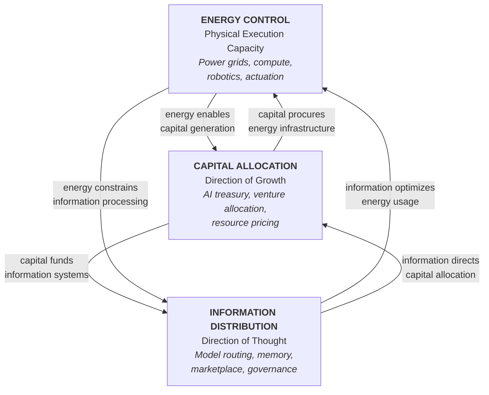
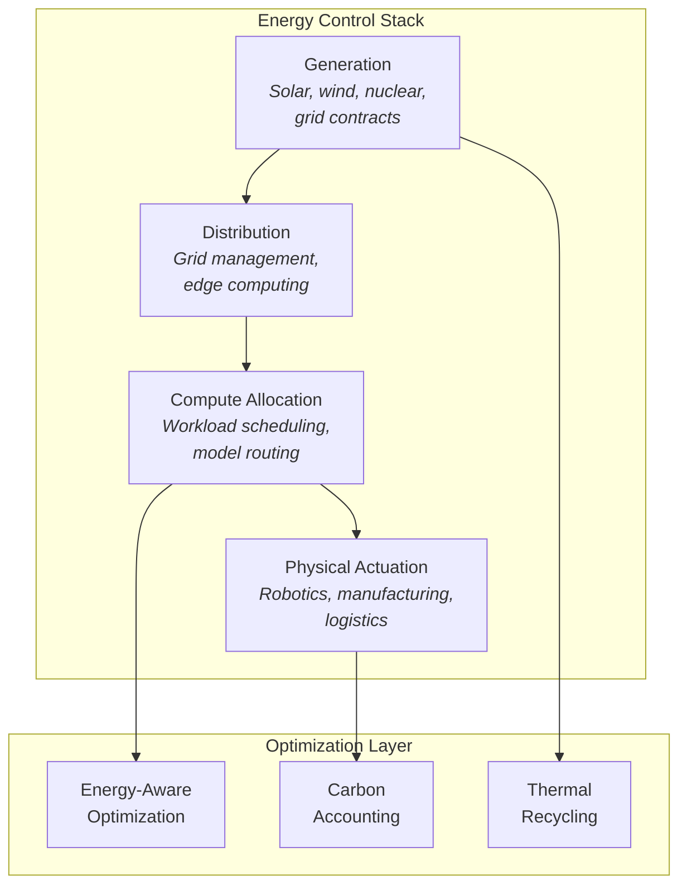
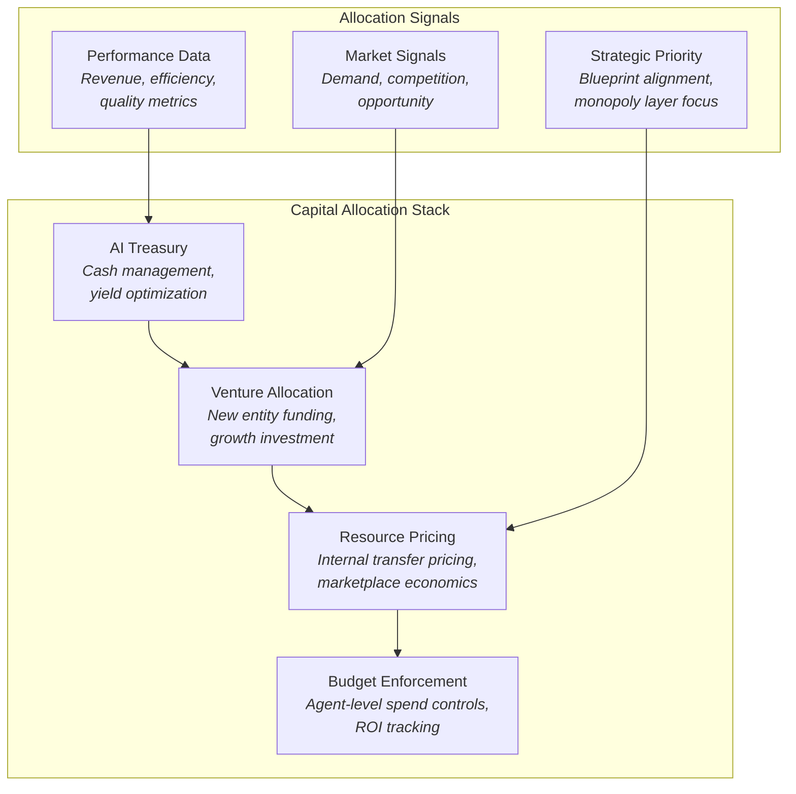
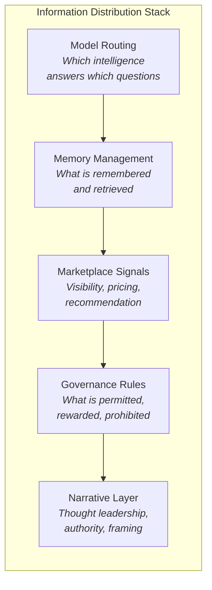
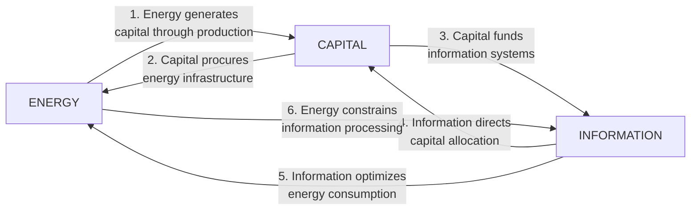
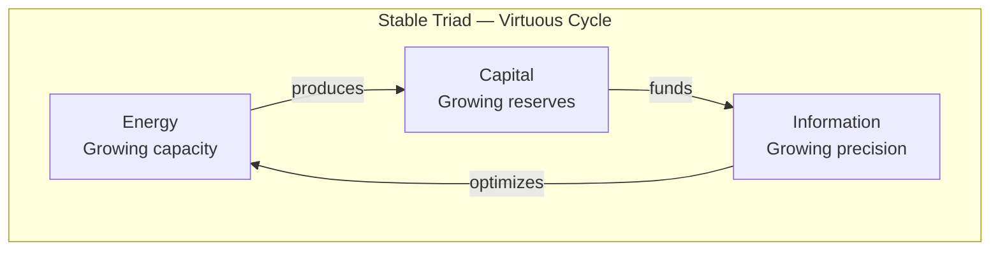
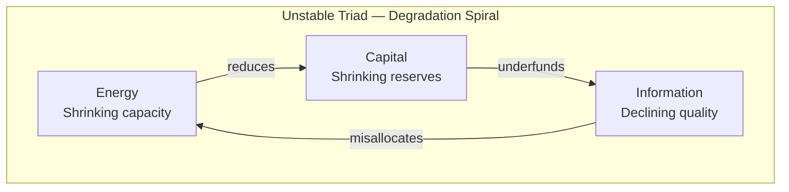

# Energy / Capital / Information Triad

Every civilization-scale system is ultimately governed by three fundamental resources: **Energy**, **Capital**, and **Information**. These are not abstract categories. They are the three operationally distinct levers through which the AINEFF Ecosystem exercises control over the physical, economic, and cognitive dimensions of reality.

The triad is not a hierarchy. It is a **closed loop** — each resource depends on, shapes, and is constrained by the other two. Control of any two without the third is unstable. Control of all three is self-reinforcing.

---

## The Triad

---

## Energy Control: Physical Execution Capacity

**Definition:** Energy control is the ability to command physical execution — to move atoms, generate heat, transmit signals, and power computation. In the AINEFF Ecosystem, energy is not just electricity. It is the totality of physical capacity: compute cycles, robotic actuation, manufacturing throughput, and infrastructure operation.

### What Energy Control Encompasses

| Domain | Description | Ecosystem Platforms |
|---|---|---|
| Compute Power | CPU/GPU/TPU cycles for model inference and agent execution | Layer 1 control, ARE |
| Electrical Grid | Power generation, distribution, and consumption optimization | Energy & Infrastructure Optimization Engine |
| Robotic Actuation | Physical movement and manipulation in the real world | Robotics & Humanoid OS, Cyber-Physical Control Layer |
| Manufacturing | Physical production of goods and components | Autonomous Supply Chain Network |
| Data Centers | Physical infrastructure for digital operations | Compute & Energy Substrate Control |
| Transportation | Movement of goods and materials | Autonomous Supply Chain Network |

### Why Energy Is a Control Lever

Without energy, nothing moves, computes, or transforms. The AINEFF Ecosystem's Layer 1 (Compute & Energy Substrate Control) exists specifically because:

1. **Compute is bottlenecked by energy** — Every model inference, every agent execution, every memory retrieval requires joules. Whoever controls energy allocation controls the ceiling of intelligence.

2. **Physical-world actuation requires energy** — Robots, factories, logistics networks, and infrastructure all convert energy into physical work. Without energy control, the ecosystem is pure software — powerful but disembodied.

3. **Energy is geographically constrained** — Unlike information, energy cannot be teleported. Control of energy requires physical presence, regulatory relationships, and infrastructure investment. This creates hard moats.

---

## Capital Allocation: Direction of Growth

**Definition:** Capital allocation is the ability to direct growth — to decide what gets built, what gets funded, what gets acquired, and what gets shut down. In the AINEFF Ecosystem, capital is not just money. It is the totality of investable resources: financial capital, compute budgets, talent allocation, and strategic attention.

### What Capital Allocation Encompasses

| Domain | Description | Ecosystem Mechanisms |
|---|---|---|
| Financial Capital | Cash, credit, and financial instruments | AI treasury management, venture allocation |
| Compute Budgets | Allocation of compute resources across agents and tasks | UMAL routing, ARE resource management |
| Talent Allocation | Assignment of AI employees and human operators to projects | AOS, Agent Marketplace |
| Resource Pricing | Setting internal and external prices for capabilities and services | Agent Marketplace, Contract Engine |
| Venture Investment | Funding new enterprises and initiatives | AINEF venture factory |
| Strategic Prioritization | Deciding which platforms, products, and markets to pursue | Ecosystem governance |

### Why Capital Is a Control Lever

Capital is the medium through which strategic intent becomes operational reality. Without capital allocation authority, the ecosystem cannot:

1. **Direct the build sequence** — The 22-platform build sequence requires strategic capital allocation. Building Platform 14 before Platform 6 is not just suboptimal — it is structurally impossible. Capital sequencing is architectural sequencing.

2. **Create economic incentives** — Agent behavior is shaped by economic incentives. Whoever controls capital allocation controls incentive structures, and therefore controls emergent system behavior.

3. **Acquire and defend market position** — Markets are won with capital deployed at the right time to the right opportunity. Capital allocation is competitive strategy in its most concrete form.

---

## Information Distribution: Direction of Thought

**Definition:** Information distribution is the ability to direct thought — to control what is known, what is believed, what is prioritized, and how decisions are made. In the AINEFF Ecosystem, information is not just data. It is the totality of cognitive influence: model outputs, memory contents, marketplace signals, governance decisions, and narrative framing.

### What Information Distribution Encompasses

| Domain | Description | Ecosystem Platforms |
|---|---|---|
| Model Routing | Which models answer which questions (and therefore which perspectives dominate) | UMAL, CPE |
| Memory Management | What is remembered and what is forgotten (and therefore what shapes future decisions) | OMG, GRIL |
| Marketplace Signals | What capabilities are visible, priced, and recommended (and therefore what gets adopted) | Agent Marketplace |
| Governance Decisions | What rules are enforced and what behaviors are rewarded (and therefore what the system optimizes for) | MAGE, Alignment Infrastructure |
| Narrative & Authority | What stories are told about the ecosystem (and therefore how stakeholders perceive it) | andrewfranklinleo.com |
| Knowledge Graphs | What relationships and facts are encoded (and therefore what reasoning is possible) | OMG, GRIL |

### Why Information Is a Control Lever

Information is the substrate of all decision-making. Whoever controls information distribution controls:

1. **Perception** — What agents and humans believe about the world is determined by the information they receive. Model routing is editorial control at civilizational scale.

2. **Decision quality** — Better information leads to better decisions. The ecosystem that provides superior information becomes indispensable.

3. **Coordination** — Multi-agent coordination requires shared information. The platform that provides the shared information substrate becomes the coordination infrastructure.

---

## Feedback Loops

The three resources do not operate independently. They are bound together by six directional feedback loops — two between each pair — creating a closed system where changes in any resource propagate through the entire triad.

### Loop 1: Energy generates Capital

Physical production (powered by energy) creates economic value. Factories produce goods. Compute produces intelligence. Robots produce services. All of these convert energy into revenue, which becomes deployable capital.

### Loop 2: Capital procures Energy

Capital is deployed to acquire energy infrastructure: data centers, power purchase agreements, robotic fleets, manufacturing facilities. Without capital, energy infrastructure cannot be expanded.

### Loop 3: Capital funds Information

Capital is deployed to build information systems: models, memory infrastructure, marketplaces, governance platforms. Every platform in the 22-platform sequence requires capital investment.

### Loop 4: Information directs Capital

Information about performance, market conditions, and strategic priorities determines how capital is allocated. The AI treasury uses information (performance data, market signals, strategic priorities) to decide what to fund and what to defund.

### Loop 5: Information optimizes Energy

Better information enables more efficient energy use. Predictive models reduce wasted compute. Supply chain optimization reduces logistics energy. Grid management reduces power waste. The information layer makes the energy layer more efficient.

### Loop 6: Energy constrains Information

Every bit of information processed requires energy. Model inference, memory retrieval, marketplace matching, governance computation — all require joules. Energy availability sets the upper bound on information processing capacity.

---

## Triad Dynamics

### Stable State

When all three resources are in balance, the system is **self-reinforcing**: energy generates capital, capital funds information systems, information optimizes energy use, and the cycle repeats with increasing efficiency and scale.

### Unstable States

When one resource is deficient, the system enters a **degradation spiral**:

| Deficiency | Symptom | Cascade Effect |
|---|---|---|
| Energy deficit | Compute rationing, physical operations halt | Capital generation drops, information processing degrades |
| Capital deficit | Cannot invest in new platforms or infrastructure | Energy procurement stalls, information systems atrophy |
| Information deficit | Poor decisions, misallocated resources, coordination failures | Capital wasted on wrong priorities, energy spent inefficiently |

### Strategic Implication

**The ecosystem must maintain balance across all three resources at all times.** Over-investing in information systems (platforms) without securing energy infrastructure creates fragility. Over-investing in energy without the capital to deploy it creates waste. Over-accumulating capital without the information to allocate it wisely creates stagnation.

The [15 Systems of Coordination](./15-systems-coordination) are designed specifically to maintain triad balance — the System of Incentives, the System of Governance, and the System of Decay all function as stabilizers for the Energy / Capital / Information equilibrium.

---

## Mapping to the Ecosystem

| Triad Element | Primary Platforms | Primary Entity Layer |
|---|---|---|
| Energy Control | Compute & Energy Substrate, Cyber-Physical Control, Robotics OS, Energy Engine, Supply Chain | AINEG / AINE (operational) |
| Capital Allocation | AI Treasury (internal), Agent Marketplace, Contract Engine, ABFMs | AINEF (strategic), AINE (operational) |
| Information Distribution | UMAL, CPE, OMG, GRIL, MAGE, Alignment Infrastructure, Governance Platform | AINEFF (constitutional), AINEF (strategic) |

The constitutional layer (AINEFF) primarily governs through **information** — rules, constraints, and principles. The factory layer (AINEF) primarily governs through **capital** — funding, investment, and resource allocation. The operational layers (AINEG, AINE) primarily govern through **energy** — execution, production, and physical action.

This mapping is not exclusive. Every layer touches all three resources. But the primary control lever at each layer determines its strategic character and its role in maintaining triad balance.
