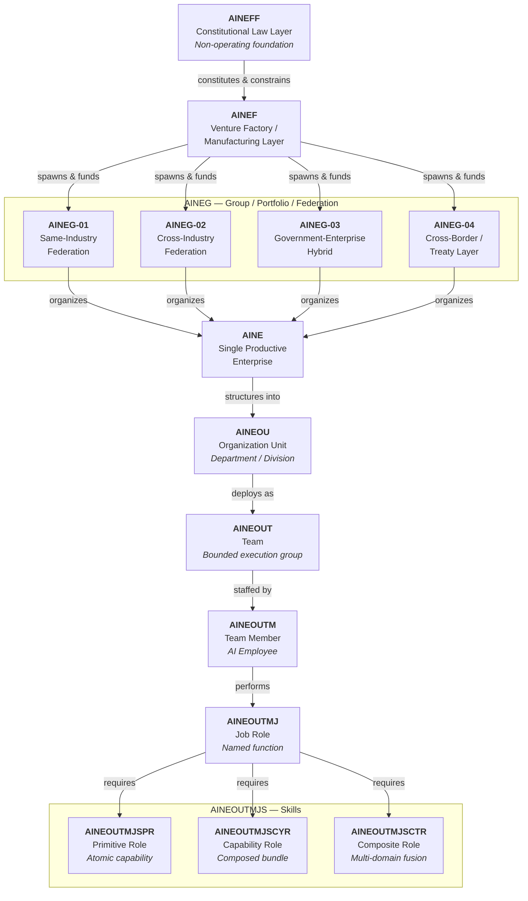
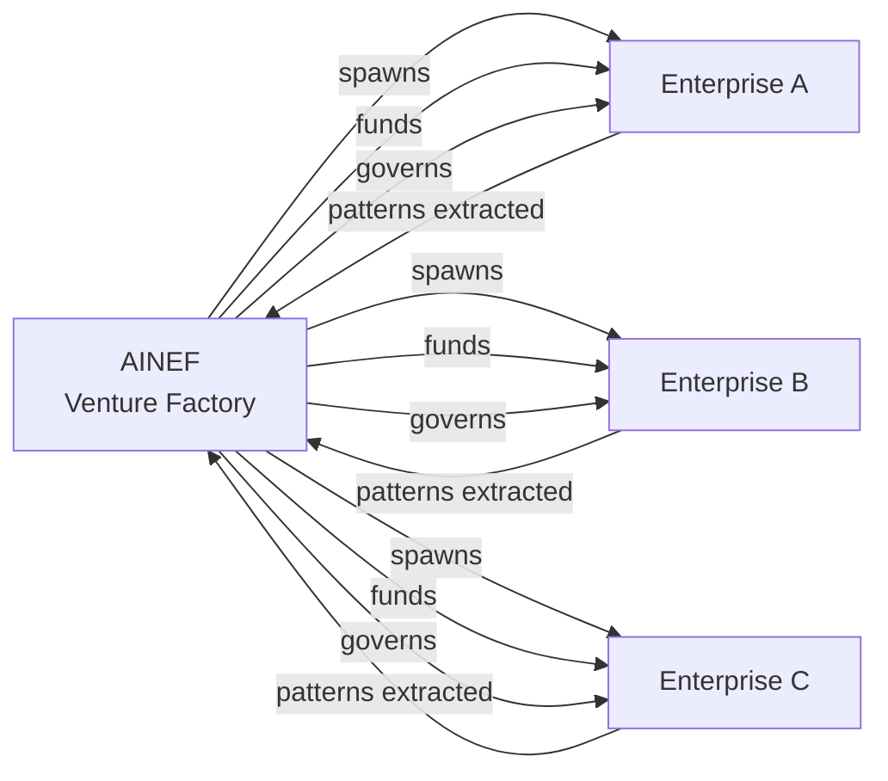
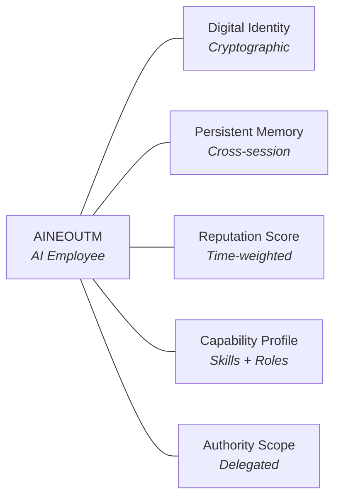
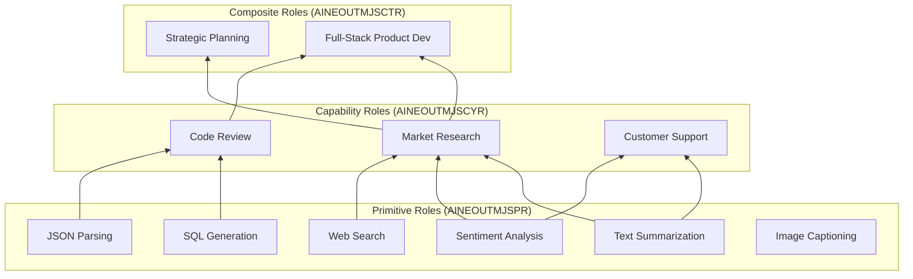

# Entity Hierarchy

The AINEFF Ecosystem is organized as an **ontological chain** — a strict hierarchy of named entity types where each level defines the constraints, capabilities, and authority boundaries for the level below it. Nothing in the ecosystem exists outside this hierarchy. Every AI employee, every team, every enterprise, every federation, and every governance decision has a precise structural address.

This is not an org chart. It is a **constitutional ontology**: a formal specification of what kinds of things can exist, what they can do, and who controls them.

---

## Complete Hierarchy Diagram

---

## Level-by-Level Specification

### Level 0: AINEFF — Constitutional Law Layer

**Full name:** AI Native Enterprise Foundation of Foundations

**Nature:** Non-operating foundation. AINEFF does not build products, hire employees, or generate revenue. It exists solely as a **constitutional constraint layer** — the ultimate source of authority and the ultimate limit on power.

**What it controls:**
- The foundational charter that all downstream entities must obey
- Intellectual property custody and licensing
- Veto power over existential decisions (mergers, dissolutions, fundamental pivots)
- Amendment procedures for the constitutional framework itself
- Appointment and removal of AINEF leadership

**What it cannot do:**
- Operate any business
- Allocate capital to specific projects
- Direct day-to-day operations
- Override decisions that fall within delegated authority

**Analogy:** AINEFF is to the ecosystem what a national constitution is to a country. It does not govern — it constrains governance.

---

### Level 1: AINEF — Venture Factory / Manufacturing Layer

**Full name:** AI Native Enterprise Factory

**Nature:** The single operating entity that manufactures all other entities. AINEF is a **venture factory** — it spawns, funds, governs, and (when necessary) dissolves enterprises, federations, and groups.

**What it controls:**
- Entity creation and dissolution
- Capital allocation across the portfolio
- Platform development priorities
- Cross-entity standards and protocols
- Shared infrastructure and tooling

**Key functions:**
- Blueprint enforcement — ensuring every spawned entity conforms to the ontology
- Resource arbitration — allocating compute, capital, and talent across entities
- Pattern extraction — identifying reusable structures across enterprises and codifying them

---

### Level 2: AINEG — Group / Portfolio / Federation Layer

**Full name:** AI Native Enterprise Group

AINEG is the **federation layer** — it organizes multiple enterprises into coherent portfolios with shared governance, shared data, and coordinated strategy. There are four distinct subtypes, each serving a different coordination need.

#### AINEG-01: Same-Industry Federation

Multiple enterprises operating in the **same industry vertical**. They share domain knowledge, training data, regulatory compliance frameworks, and customer pipelines.

**Example:** Three AI-native law firms federated under a single AINEG-01, sharing legal knowledge graphs, case law embeddings, and compliance protocols while competing on execution quality.

#### AINEG-02: Cross-Industry Federation

Enterprises from **different industry verticals** federated for cross-pollination. They share general-purpose capabilities (reasoning, planning, communication) while maintaining domain-specific specialization.

**Example:** An AI-native logistics company, an AI-native financial services firm, and an AI-native healthcare provider federated to share supply chain optimization, risk modeling, and resource allocation capabilities.

#### AINEG-03: Government-Enterprise Hybrid

Federations that include **government entities** as participants. These operate under additional regulatory constraints, transparency requirements, and public accountability mandates.

**Example:** A public-private partnership where municipal governments and private AI enterprises coordinate on infrastructure maintenance, permitting, and citizen services.

#### AINEG-04: Cross-Border / Treaty Layer

Federations that span **multiple legal jurisdictions**. These require treaty-level agreements, cross-border data governance, and multi-regulatory compliance.

**Example:** An EU-US-ASEAN federation coordinating autonomous supply chain management across tariff regimes, data sovereignty laws, and labor regulations.

```mermaid
graph TB
    subgraph SameIndustry["AINEG-01: Same-Industry"]
        S1["Enterprise A<br/><i>Legal AI</i>"]
        S2["Enterprise B<br/><i>Legal AI</i>"]
        S3["Enterprise C<br/><i>Legal AI</i>"]
    end

    subgraph CrossIndustry["AINEG-02: Cross-Industry"]
        C1["Enterprise D<br/><i>Logistics</i>"]
        C2["Enterprise E<br/><i>Finance</i>"]
        C3["Enterprise F<br/><i>Healthcare</i>"]
    end

    subgraph GovHybrid["AINEG-03: Gov-Enterprise"]
        H1["Municipal Gov"]
        H2["Enterprise G<br/><i>Infra AI</i>"]
    end

    subgraph CrossBorder["AINEG-04: Cross-Border"]
        B1["EU Entity"]
        B2["US Entity"]
        B3["ASEAN Entity"]
    end

    S1 <-->|"shared legal KG"| S2
    S2 <-->|"shared compliance"| S3
    C1 <-->|"shared optimization"| C2
    C2 <-->|"shared risk models"| C3
    H1 <-->|"public accountability"| H2
    B1 <-->|"treaty protocol"| B2
    B2 <-->|"treaty protocol"| B3
```

---

### Level 3: AINE — Single Productive Enterprise

**Full name:** AI Native Enterprise

The **fundamental unit of economic production** in the ecosystem. An AINE is a single, bounded enterprise with its own P&L, its own customers, its own products, and its own workforce of AI employees.

**What defines an AINE:**
- A clear value proposition and target market
- An autonomous revenue stream (or funded path to one)
- A bounded organizational structure (org units, teams, members)
- Compliance with all constraints inherited from AINEG, AINEF, and AINEFF
- A named identity in the digital identity infrastructure

**What an AINE can do:**
- Hire and fire AI employees (AINEOUTM)
- Create and dissolve teams and org units
- Set internal policies within constitutional constraints
- Enter contracts with customers, partners, and other AINEs
- Accumulate and deploy capital within allocated budgets

---

### Level 4: AINEOU — Organization Unit

**Full name:** AI Native Enterprise Organization Unit

The **departmental layer** — a logical grouping of teams within an enterprise. Org units correspond roughly to traditional departments (engineering, sales, operations, finance) but are defined functionally rather than bureaucratically.

**Key properties:**
- Each AINEOU has a named function (e.g., "Customer Acquisition," "Product Delivery," "Risk Management")
- Authority to create and dissolve teams within its scope
- Budget allocation within enterprise-granted limits
- Cross-team coordination responsibility

---

### Level 5: AINEOUT — Team

**Full name:** AI Native Enterprise Organization Unit Team

The **bounded execution group** — the smallest organizational unit that can independently deliver value. A team is a coherent group of AI employees (and potentially human collaborators) assigned to a specific mission.

**Key properties:**
- Bounded scope — every team has a defined mission, inputs, and outputs
- Autonomous execution within delegated authority
- Internal coordination protocols (who leads, who follows, how conflicts resolve)
- Performance accountability to the parent org unit

---

### Level 6: AINEOUTM — Team Member / AI Employee

**Full name:** AI Native Enterprise Organization Unit Team Member

The **individual agent** — a single AI employee with a persistent identity, memory, reputation, and capability profile. This is the atomic unit of labor in the ecosystem.

**Key properties:**
- Persistent digital identity (cryptographically verifiable)
- Continuous memory and learning across sessions
- Reputation score based on historical performance
- Capability profile derived from assigned job roles and skills
- Bounded authority — can only act within the scope delegated by its team

---

### Level 7: AINEOUTMJ — Job Role

**Full name:** AI Native Enterprise Organization Unit Team Member Job

A **named function** that an AI employee performs. Job roles are composable — a single AI employee may hold multiple job roles simultaneously, and a single job role may be shared across multiple employees.

**Key properties:**
- Named and versioned (e.g., "Senior Data Analyst v2.3")
- Defined input/output contracts
- Required skill set (links down to AINEOUTMJS)
- Performance metrics and evaluation criteria
- Authority grants specific to the role

---

### Level 8: AINEOUTMJS — Skills

**Full name:** AI Native Enterprise Organization Unit Team Member Job Skills

The **atomic capability layer** — the lowest level of the ontology. Skills are the fundamental building blocks from which all higher-level capabilities are composed. There are three distinct subtypes:

#### AINEOUTMJSPR — Primitive Role (Atomic Capability)

The most basic, indivisible skill. A primitive role does exactly one thing and cannot be decomposed further.

**Examples:**
- Text summarization
- Sentiment classification
- JSON parsing
- SQL query generation
- Image captioning

#### AINEOUTMJSCYR — Capability Role (Composed Bundle)

A bundle of primitive roles composed into a coherent capability. Capability roles represent the ability to perform a meaningful task that requires multiple atomic skills in sequence or parallel.

**Examples:**
- Market research (web search + text extraction + summarization + trend analysis)
- Code review (parsing + static analysis + style checking + security scanning)
- Customer support (intent detection + knowledge retrieval + response generation + sentiment monitoring)

#### AINEOUTMJSCTR — Composite Role (Multi-Domain Fusion)

The highest level of skill composition — a fusion of capability roles across multiple domains. Composite roles represent expert-level, cross-functional abilities.

**Examples:**
- Strategic planning (market research + financial modeling + competitive analysis + scenario simulation)
- Full-stack product development (requirements analysis + architecture design + implementation + testing + deployment + monitoring)
- Regulatory compliance management (legal analysis + risk assessment + policy drafting + audit preparation + stakeholder communication)

---

## The Ontological Chain

The hierarchy is not merely organizational — it is **ontological**. Each level defines what the level below it **can be**. This creates a chain of constraint that flows from the most abstract (constitutional law) to the most concrete (atomic skills):

```mermaid
graph LR
    A["AINEFF<br/><i>What can exist?</i>"] --> B["AINEF<br/><i>What gets created?</i>"]
    B --> C["AINEG<br/><i>How are things grouped?</i>"]
    C --> D["AINE<br/><i>What produces value?</i>"]
    D --> E["AINEOU<br/><i>How is work organized?</i>"]
    E --> F["AINEOUT<br/><i>Who works together?</i>"]
    F --> G["AINEOUTM<br/><i>Who does the work?</i>"]
    G --> H["AINEOUTMJ<br/><i>What work is done?</i>"]
    H --> I["AINEOUTMJS<br/><i>How is it done?</i>"]
```

**Key insight:** Authority flows downward. Data flows upward. Constraints narrow at each level. Capabilities compose at each level. This bidirectional flow — constraint descending, capability ascending — is what makes the hierarchy self-reinforcing rather than merely bureaucratic.

---

## Cross-Entity Composition

Entities at the same level can compose horizontally:

- **AINEGs** can form inter-federation agreements (especially AINEG-04)
- **AINEs** within a federation can share employees, data, and infrastructure
- **AINEOUTs** across org units can form cross-functional task forces
- **AINEOUTMs** can hold roles in multiple teams simultaneously
- **Skills** can be shared across the entire ecosystem via the skill marketplace

This horizontal composability, combined with vertical constraint propagation, creates a **mesh** rather than a tree — a structure that is both rigidly governed and infinitely flexible.
