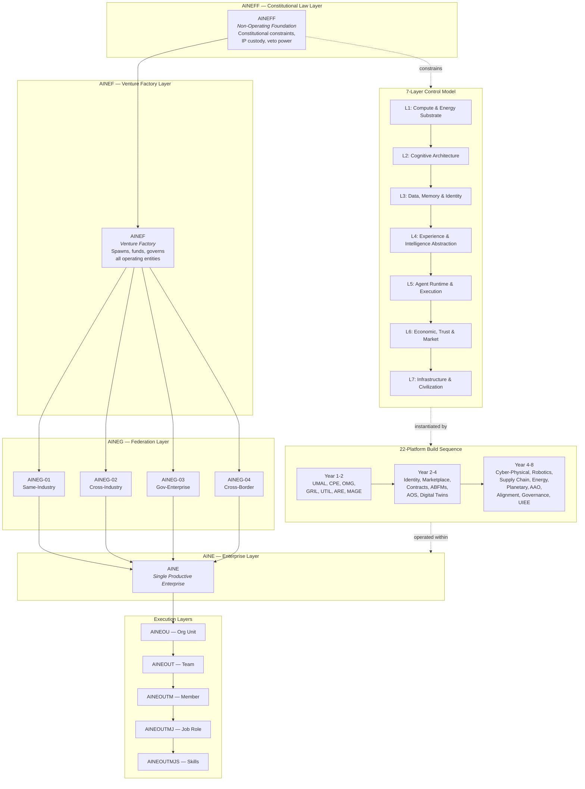

# Ecosystem Blueprint

The AINEFF Ecosystem Blueprint is the consolidated architectural map of a civilization-scale coordination infrastructure. Over **535,856+ lines** of strategic documents — spanning constitutional frameworks, technical specifications, economic models, governance protocols, and operational playbooks — converge into a single coherent design across **8 interlocking entities** and **74 systems**.

This is not a product roadmap. It is a **structural specification for how autonomous intelligence, capital, energy, and governance compose into a self-reinforcing economic organism**.

---

## Master Architecture Overview

The following diagram captures the complete ecosystem at a glance: the entity hierarchy from constitutional law down to atomic skills, the 7-layer control model, and the 22-platform build sequence.

---

## What This Blueprint Contains

| Section | Focus | Key Question Answered |
|---|---|---|
| [Entity Hierarchy](./entity-hierarchy) | Organizational ontology | What are the structural units and how do they compose? |
| [7-Layer Control Model](./7-layer-control) | Technology control stack | What must be controlled and at which abstraction level? |
| [5-Layer Monopoly Blueprint](./5-layer-monopoly) | Strategic lock-in architecture | Where do defensible moats form? |
| [22-Platform Build Sequence](./22-platforms) | Implementation roadmap | What gets built, in what order, and why? |
| [Three-Domain Strategy](./three-domains) | Market positioning and growth | How do trust, revenue, and talent compound? |
| [Energy / Capital / Information Triad](./energy-capital-information) | Resource control theory | What are the three fundamental levers of civilizational control? |
| [15 Systems of Coordination](./15-systems-coordination) | Governance infrastructure | How does the ecosystem self-govern without centralized authority? |

---

## Design Principles

The blueprint is organized around five non-negotiable architectural principles:

1. **Ontological Completeness** — Every entity, role, skill, and decision has a named place in the hierarchy. Nothing operates outside the ontology.

2. **Constitutional Constraint** — All power flows downward through explicit, versioned, auditable constraints. No entity can exceed the authority granted by the layer above it.

3. **Composability Over Monolith** — The system is built from atomic, interchangeable primitives (skills, roles, teams, enterprises) that compose into arbitrary configurations.

4. **Control-Point Monopoly** — Strategic value accrues at choke points in the stack: intelligence abstraction, memory continuity, execution runtime, identity infrastructure, and physical-world bridging.

5. **Self-Reinforcing Flywheel** — Every component feeds at least two others. Authority creates demand, demand creates revenue, revenue funds platforms, platforms create data, data creates authority.

---

## Scale of the Design

| Metric | Count |
|---|---|
| Strategic document lines consolidated | 535,856+ |
| Named entity types in the hierarchy | 8 levels, 12+ subtypes |
| Control layers | 7 |
| Monopoly layers | 5 |
| Platforms in build sequence | 22 |
| Inventions mapped to control layers | 40+ |
| Systems of coordination | 15 |
| Market domains | 3 |
| Target timeline | 8 years to full deployment |

---

## How to Read This Blueprint

**Start with the [Entity Hierarchy](./entity-hierarchy)** to understand what the structural units are. Then read the [7-Layer Control Model](./7-layer-control) to understand what those entities must control. The [5-Layer Monopoly Blueprint](./5-layer-monopoly) explains where defensible value accumulates. The [22-Platform Build Sequence](./22-platforms) translates all of this into a phased implementation plan. The [Three-Domain Strategy](./three-domains) maps go-to-market. The [Energy / Capital / Information Triad](./energy-capital-information) provides the resource-theoretic foundation. And the [15 Systems of Coordination](./15-systems-coordination) specify how the entire structure governs itself.

Each page is self-contained but cross-references its neighbors. The system is designed to be read in any order after this overview.
