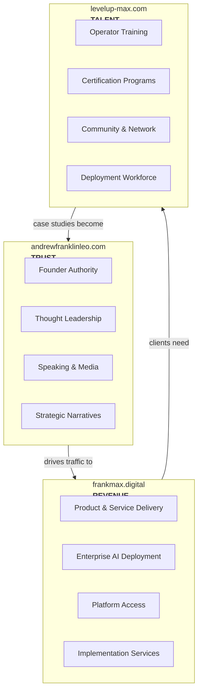
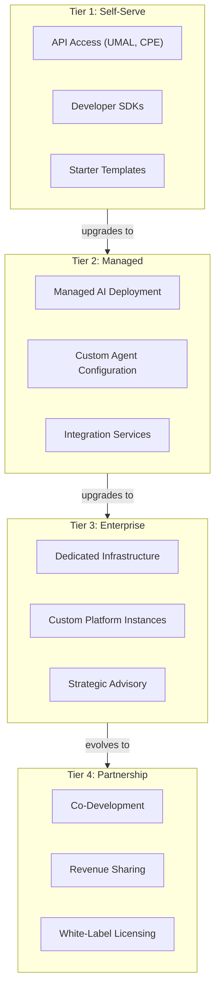
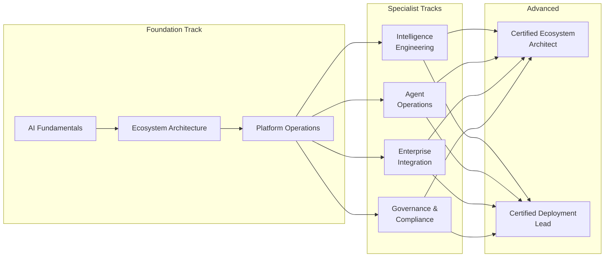
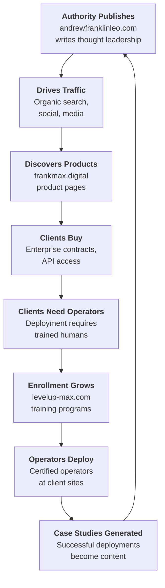
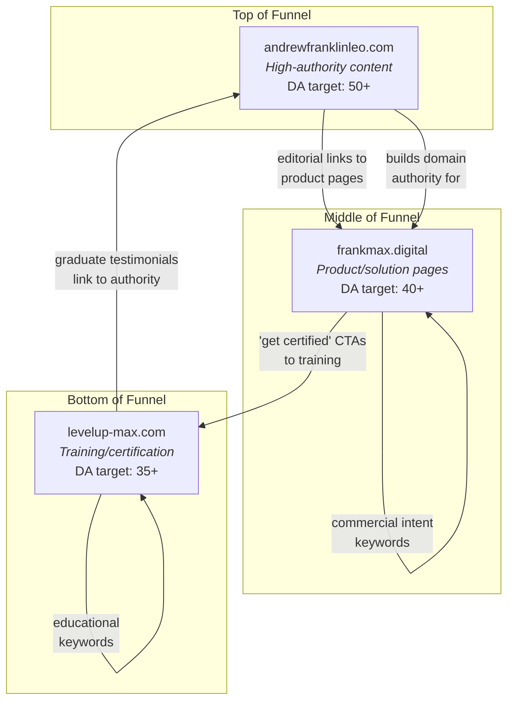
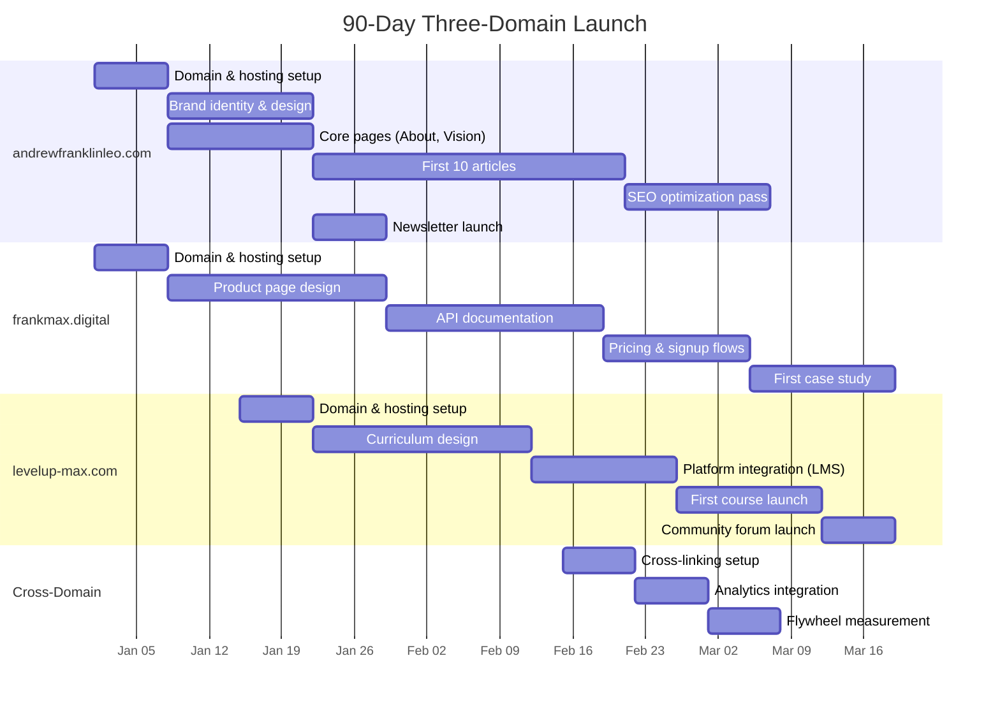
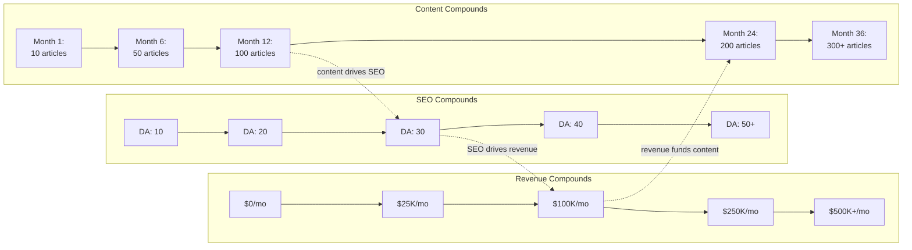

# Three-Domain Strategy

The AINEFF Ecosystem's go-to-market strategy operates across **three interlocking domains**, each serving a distinct audience, generating a distinct type of value, and feeding the other two through a self-reinforcing flywheel.

This is not three separate businesses. It is **one flywheel with three surfaces**.

---

## The Three Domains

---

## Domain 1: andrewfranklinleo.com (TRUST)

**Strategic function:** Founder authority and thought leadership. This domain establishes the intellectual and strategic credibility that drives all downstream demand.

**Target audience:**
- C-suite executives (CEOs, CTOs, COOs)
- Institutional investors and venture capitalists
- Government regulators and policymakers
- Media and industry analysts
- Strategic partners and board advisors

**Content pillars:**
| Pillar | Description | Format |
|---|---|---|
| Strategic Vision | Long-form essays on AI-native economics, civilization-scale infrastructure, and autonomous enterprise | Blog posts, white papers |
| Industry Analysis | Deep technical and strategic analysis of AI market dynamics, competitor positioning, and inflection points | Weekly analysis, reports |
| Founder Story | Authentic narrative of building the ecosystem — decisions, failures, insights, pivots | Personal essays, interviews |
| Policy & Ethics | Thought leadership on AI governance, alignment, and human-AI hybrid institutions | Position papers, testimony |
| Ecosystem Updates | Public progress reports on the AINEFF Ecosystem build | Quarterly updates |

**Key metrics:**
- Domain authority and search ranking
- Inbound leads from organic content
- Speaking invitation volume
- Media citation frequency
- Newsletter subscriber growth

**SEO strategy:**
- Target high-intent keywords: "AI-native enterprise," "autonomous AI organizations," "AI business infrastructure"
- Long-tail content strategy: 2,000-5,000 word essays optimized for featured snippets
- Backlink acquisition through original research and data
- Cross-linking to frankmax.digital product pages

---

## Domain 2: frankmax.digital (REVENUE)

**Strategic function:** Product and service delivery. This is where trust converts to revenue. Every dollar the ecosystem earns flows through this domain.

**Target audience:**
- COOs, CFOs, and CTOs at companies with $5M-$100M revenue
- Operations leaders seeking AI-driven efficiency gains
- Technology leaders evaluating AI infrastructure investments
- Procurement teams with active AI tool budgets

**Product/service tiers:**

**Revenue streams:**
| Stream | Model | Target |
|---|---|---|
| API usage | Per-request / per-token | Developers, startups |
| Platform subscriptions | Monthly/annual SaaS | SMBs, mid-market |
| Enterprise contracts | Annual/multi-year | Enterprise, $5M-$100M companies |
| Implementation services | Project-based | Enterprise, government |
| Marketplace fees | Transaction percentage | Agent marketplace participants |
| Licensing | Per-seat / per-instance | Partners, resellers |

**Key metrics:**
- Monthly Recurring Revenue (MRR) and Annual Recurring Revenue (ARR)
- Customer Acquisition Cost (CAC) and Lifetime Value (LTV)
- Net Revenue Retention (NRR)
- Pipeline velocity (lead to close)

---

## Domain 3: levelup-max.com (TALENT)

**Strategic function:** Operator training, certification, and community. This domain creates the human workforce that deploys and manages the ecosystem's technology at client sites.

**Target audience:**
- AI operations professionals seeking career advancement
- Career changers entering the AI operations field
- Enterprise teams needing upskilling
- Freelance consultants seeking certification
- Agency partners building AI practices

**Program structure:**

**Revenue streams:**
| Stream | Model | Target |
|---|---|---|
| Course enrollment | Per-course / cohort-based | Individual learners |
| Certification exams | Per-exam fee | Career professionals |
| Enterprise training | Per-seat licensing | Corporate L&D teams |
| Community membership | Monthly subscription | Practitioners |
| Job placement | Placement fees | Graduates + hiring companies |

**Key metrics:**
- Enrollment volume and completion rates
- Certification pass rates
- Graduate employment rate (within ecosystem clients)
- Community engagement (active members, content contributions)
- Employer satisfaction scores

---

## The Flywheel

The three domains form a **self-reinforcing flywheel** where each domain's output becomes another domain's input:

### Flywheel Mechanics

**Step 1: Authority Publishes.** andrewfranklinleo.com publishes a deep analysis of why autonomous AI organizations outperform traditional companies by 10x on operational efficiency.

**Step 2: Drives Traffic.** The article ranks on Google, gets shared on LinkedIn, gets cited by industry analysts. 5,000 visitors read it.

**Step 3: Discovers Products.** 500 of those visitors click through to frankmax.digital to explore the platforms that enable autonomous AI operations.

**Step 4: Clients Buy.** 10 companies sign enterprise contracts for UMAL + ARE + MAGE deployment.

**Step 5: Clients Need Operators.** Those 10 companies need trained operators to deploy and manage the platforms. They cannot hire from the general market because the skills do not exist yet.

**Step 6: Enrollment Grows.** 50 professionals enroll in levelup-max.com certification programs, driven by the job demand signal.

**Step 7: Operators Deploy.** 40 certified operators deploy to client sites, managing day-to-day platform operations.

**Step 8: Case Studies Generated.** The successful deployments produce quantified results: "Company X reduced operational costs by 47% in 90 days." These results become content for andrewfranklinleo.com.

**The cycle repeats, each iteration larger than the last.**

---

## SEO Strategy

### Cross-Domain SEO Architecture

### Keyword Strategy by Domain

| Domain | Keyword Category | Example Keywords | Search Intent |
|---|---|---|---|
| andrewfranklinleo.com | Thought leadership | "future of AI enterprise," "autonomous AI organizations" | Informational |
| frankmax.digital | Product/solution | "AI model routing platform," "agent runtime environment" | Commercial |
| levelup-max.com | Training/career | "AI operations certification," "learn agent deployment" | Transactional |

### Content Cadence

| Domain | Frequency | Content Type |
|---|---|---|
| andrewfranklinleo.com | 2x/week | Long-form essays (2,000-5,000 words) |
| frankmax.digital | 1x/week | Product updates, case studies, documentation |
| levelup-max.com | 1x/week | Tutorials, curriculum updates, community highlights |

---

## 90-Day Launch Timeline

---

## Compounding Math

The flywheel compounds. Here is the growth model assuming consistent execution:

### Traffic Growth

| Period | andrewfranklinleo.com | frankmax.digital | levelup-max.com | Total |
|---|---|---|---|---|
| Month 1 | 500 | 300 | 200 | **1,000** |
| Month 3 | 2,000 | 1,200 | 800 | **4,000** |
| Month 6 | 8,000 | 5,000 | 3,000 | **16,000** |
| Month 12 | 30,000 | 20,000 | 12,000 | **62,000** |
| Month 18 | 80,000 | 55,000 | 35,000 | **170,000** |
| Month 24 | 200,000 | 140,000 | 90,000 | **430,000** |
| Month 36 | 500,000 | 350,000 | 220,000 | **1,070,000** |

### Revenue Growth

| Period | Revenue/Month | Revenue Source Mix |
|---|---|---|
| Month 1 | $0 | Pre-revenue |
| Month 3 | $5K | Early API users, first course sales |
| Month 6 | $25K | API revenue growing, 2-3 enterprise pilots |
| Month 12 | $100K | 10+ enterprise clients, certification revenue |
| Month 18 | $250K | Marketplace launching, enterprise expansion |
| Month 24 | $500K | Full product suite, 50+ enterprise clients |
| Month 36 | $500K+/mo | Platform fees, marketplace, enterprise, training |

### Compounding Drivers

The critical insight is that **all three curves compound simultaneously**. More content improves SEO. Better SEO drives more traffic. More traffic drives more revenue. More revenue funds more content production and product development. Each cycle makes the next cycle larger and faster. By Month 36, the flywheel is self-sustaining and accelerating.
