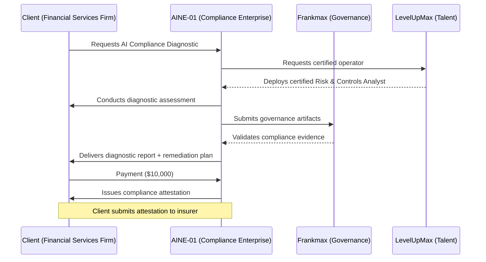
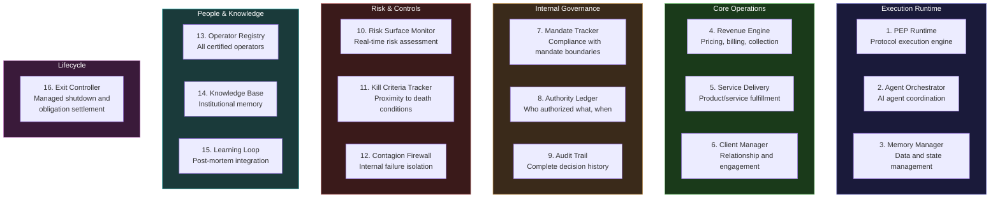
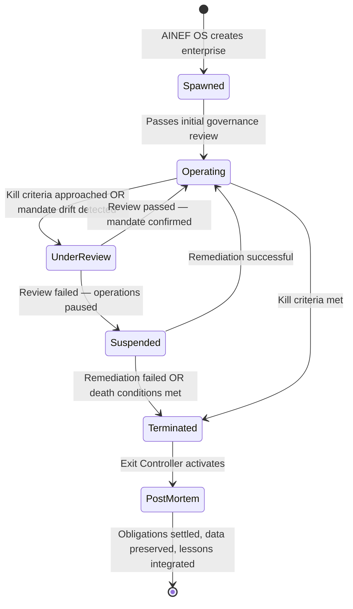

---

sidebar_position: 5
title: "AINE — Single Productive Enterprise"
description: "AINE is the legal, economic, and operational unit of the AINEFF Ecosystem — the entity that generates revenue, serves clients, and produces value. Every AINE operates within constitutional constraints inherited from AINEFF, produced by AINEF OS, and coordinated through AINEG."
tags: [entity, aine]
custom_status: active
custom_owner: Andrew Leo
custom_last_review: 2026-03-01
custom_next_review: 2026-06-01
---

# AINE — Single Productive Enterprise

AINE is where the ecosystem meets the market. It is the **legal, economic, and operational unit** that generates revenue, serves clients, employs operators, and produces measurable economic value.

Every other entity in the ecosystem exists to enable, constrain, or coordinate AINEs. AINEFF writes the law. AINEF OS builds the factory. AINEG coordinates the portfolio. Frankmax ensures accountability. LevelUpMax supplies talent. But **AINE is the entity that does the work**.

---

## Core Identity

| Attribute | Value |
|---|---|
| **Entity Type** | Single Productive Enterprise |
| **Revenue** | Yes — this is the primary revenue-generating layer |
| **Authority** | Operational, within mandate boundaries |
| **Governed By** | AINEFF (constitutional), AINEF OS (production), AINEG (coordination), Frankmax (accountability) |
| **Primary Output** | Products, services, revenue, operational data, governance artifacts |

---

## AINE-01: Compliance Services Enterprise

The first AINE instantiation is a **Compliance Services Enterprise** — providing AI governance, risk management, and compliance services to organizations navigating the AI regulatory landscape.

### Mandate

Provide AI compliance diagnostic, advisory, and operational services to enterprises that need to demonstrate governed AI usage to regulators, insurers, and stakeholders.

### Revenue Model

| Service Tier | Price Range | Delivery |
|---|---|---|
| **AI Compliance Diagnostic** | $5,000 - $15,000 | One-time assessment |
| **Governance Framework Implementation** | $25,000 - $75,000 | 30-90 day engagement |
| **Ongoing Compliance Monitoring** | $5,000 - $15,000/month | Continuous service |
| **Pre-Incident Accountability Review** | $10,000 - $30,000 | Per review cycle |
| **Certification Preparation** | $15,000 - $50,000 | Exam-readiness engagement |

### First Transaction Walkthrough

A mid-market financial services company needs to demonstrate AI governance to their insurance carrier. The transaction flow:

---

## AINE-Lite-01: Citizen-Owned Micro-Enterprise

Not every AINE is a full enterprise. **AINE-Lite** is a variant designed for individuals — a citizen-owned micro-enterprise with aggressive constraints.

| Attribute | AINE (Full) | AINE-Lite |
|---|---|---|
| **Scope** | Multi-product, multi-team | Single narrow function |
| **Revenue Cap** | No constitutional cap | Hard revenue ceiling |
| **Team Size** | Multiple roles | Single operator + AI agents |
| **Governance Overhead** | Full governance stack | Simplified governance |
| **Memory Decay** | Standard retention | Aggressive memory decay — data expires automatically |
| **Lifecycle** | Open-ended (within mandate) | Time-bounded by design |

### AINE-Lite-01 Design

- **Function:** Single narrow service (e.g., "AI resume screening compliance check")
- **Revenue cap:** Constitutional maximum prevents accumulation beyond micro-enterprise scale
- **Aggressive memory decay:** Client data, operational data, and even internal state expire on defined schedules. The enterprise forgets by design — preventing surveillance accumulation.
- **Operator model:** One human operator augmented by AI agents, operating within a Frankmax governance wrapper

AINE-Lite exists because **not every economic need requires a full enterprise, but every economic activity requires governance**.

---

## 16 Enterprise Systems

Every AINE operates through sixteen canonical systems. These systems map to the complete operational surface of a productive enterprise:

| # | System | Function |
|---|---|---|
| 1 | **PEP Runtime** | Executes Protocol-Extension Protocols — the enterprise-specific workflows that operate within PCP constraints |
| 2 | **Agent Orchestrator** | Coordinates AI agents operating within the enterprise, managing their authority, memory, and interactions |
| 3 | **Memory Manager** | Manages all data, state, and institutional memory with defined retention, decay, and privacy rules |
| 4 | **Revenue Engine** | Handles pricing, billing, collection, and revenue recognition — all auditable, all traceable |
| 5 | **Service Delivery** | Fulfills the enterprise's products and services to clients |
| 6 | **Client Manager** | Manages client relationships, engagement history, and satisfaction tracking |
| 7 | **Mandate Tracker** | Continuously monitors whether the enterprise is operating within its constitutionally defined mandate |
| 8 | **Authority Ledger** | Immutable record of every authorization — who approved what, when, under what authority |
| 9 | **Audit Trail** | Complete, tamper-evident history of every significant decision and action |
| 10 | **Risk Surface Monitor** | Real-time assessment of the enterprise's risk exposure across operational, financial, and reputational dimensions |
| 11 | **Kill Criteria Tracker** | Monitors proximity to the enterprise's death conditions. When thresholds are approached, alerts escalate automatically. |
| 12 | **Contagion Firewall** | Isolates internal failures to prevent cascade — a failed product line cannot take down the entire enterprise |
| 13 | **Operator Registry** | Canonical record of all certified operators assigned to the enterprise, their roles, and their authority levels |
| 14 | **Knowledge Base** | Institutional memory — patterns, precedents, and lessons accessible to all operators |
| 15 | **Learning Loop** | Integrates post-mortem findings into the knowledge base and feeds lessons back to AINEF OS |
| 16 | **Exit Controller** | Manages enterprise shutdown — obligation settlement, data preservation, blame allocation, operator redeployment |

---

## SAP-Equivalent AINEOU Mapping

For readers familiar with enterprise resource planning, the AINE's internal organizational units (AINEOUs) map to SAP module equivalents — but with constitutional governance baked in:

| SAP Module | AINEOU Equivalent | Key Difference |
|---|---|---|
| **FI** (Financial Accounting) | Revenue Engine + Authority Ledger | Every financial entry traces to an explicit authorization |
| **CO** (Controlling) | Mandate Tracker + Kill Criteria Tracker | Cost control is mandate control — budgets are constitutional, not advisory |
| **MM** (Materials Management) | Resource Allocation (via AINEG) | Resources are allocated by federation rules, not procurement decisions |
| **SD** (Sales & Distribution) | Client Manager + Service Delivery | Sales cannot promise what the mandate does not authorize |
| **PP** (Production Planning) | PEP Runtime + Agent Orchestrator | Production is protocol-driven, not plan-driven |
| **QM** (Quality Management) | Audit Trail + Risk Surface Monitor | Quality is governance compliance, not defect counting |
| **PM** (Plant Maintenance) | Resilience Layer (via AINEF OS L7) | Maintenance is stress testing and failure simulation |
| **HR** (Human Resources) | Operator Registry + LevelUpMax interface | Operators are certified assets, not headcount |
| **WM** (Warehouse Management) | Memory Manager | Data and state are managed with the discipline of physical inventory |
| **EWM** (Extended Warehouse) | Knowledge Base + Learning Loop | Extended memory includes institutional knowledge and lessons learned |
| **TM** (Transportation) | ORF Protocol interface | "Transportation" of obligations across boundaries, not physical goods |

---

## Big-4 Comparison

How does an AINE compare to a Big-4 professional services firm (Deloitte, PwC, EY, KPMG)?

| Dimension | Big-4 Model | AINE Model |
|---|---|---|
| **Delivery** | Partner-led teams, billable hours, utilization metrics | Protocol-driven cells, outcome-based pricing, mandate compliance metrics |
| **Governance** | Partnership agreements, practice-level policies, voluntary compliance | Constitutional constraints, automated audit, kill criteria |
| **Economics** | Revenue per partner, leverage ratios, annual billing targets | Revenue within capital envelope, mandate-bounded growth, constitutional caps |
| **Speed** | Months to staff, weeks to scope, quarters to deliver | Days to deploy (pre-certified operators), hours to scope (protocol templates), weeks to deliver |
| **Trust** | Brand reputation, partner relationships, track record | Auditable governance artifacts, tamper-evident decision trails, third-party verifiable compliance |
| **Scalability** | Linear with headcount | Exponential with protocol reuse and AI agent deployment |
| **Failure Mode** | Reputation damage, lawsuits, regulatory action | Constitutional investigation, managed shutdown, blame allocation, learning integration |

### Lines That Die First at Big-4

The most vulnerable Big-4 service lines — the ones an AINE disrupts first:

1. **Compliance assessments** — Standardized, repeatable, template-driven. AI + governance protocols can deliver these at 10x speed and 20% cost.
2. **Internal audit support** — Documentation-heavy, process-following work that AI agents excel at.
3. **Regulatory filing preparation** — Form-filling with expert judgment at the margins. The forms are automatable; the judgment is what the AINE's certified operators provide.

### Lines That Survive Longest at Big-4

The most defensible Big-4 service lines — the ones that resist AINE disruption:

1. **M&A advisory** — Requires deep relationship networks, negotiation skill, and access to decision-makers that no protocol can replace.
2. **Litigation support** — Adversarial, judgment-intensive, and deeply embedded in legal systems that change slowly.
3. **C-suite advisory** — Trust-based, relationship-dependent, and valued precisely because it comes from a named partner, not a system.

---

## The AINE Lifecycle

Every AINE follows a constitutionally defined lifecycle:

No AINE is immortal. Every AINE is born with the conditions of its death already defined. This is not pessimism — it is **architectural honesty**. An enterprise that cannot die cannot be governed.
