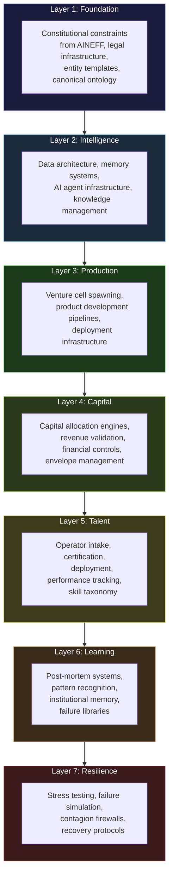
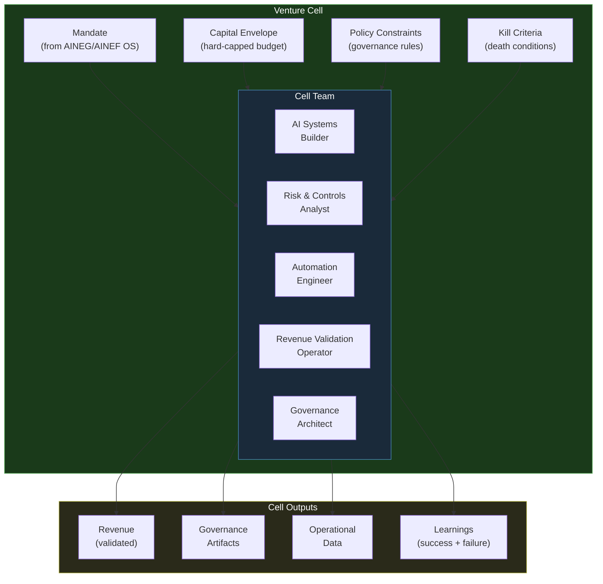
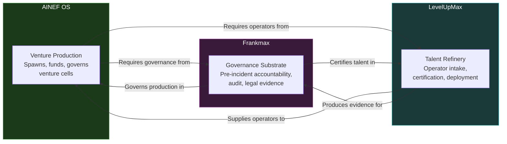

---

sidebar_position: 3
title: "AINEF OS — Controlled Venture Production Infrastructure"
description: "AINEF OS is a controlled venture production infrastructure — not a bootcamp, not a venture studio, not an AI platform. It is a semiconductor fab for ventures: precision-engineered, capital-envelope-bound, policy-constrained production of economic entities."
tags: [entity, ainef-os]
custom_status: active
custom_owner: Andrew Leo
custom_last_review: 2026-03-01
custom_next_review: 2026-06-01
---

# AINEF OS — Controlled Venture Production Infrastructure

**You are building a controlled venture production infrastructure.**

That sentence is the anchor. Every time ambiguity creeps in, every time someone asks "but what IS this?", return to that sentence. AINEF OS is a **controlled venture production infrastructure**.

It is not a bootcamp. It is not a venture studio. It is not an AI platform. It is not an incubator, an accelerator, or a consulting firm. It is a **factory that produces ventures** — with the precision, repeatability, and quality control of a semiconductor fabrication facility.

---

## What This Actually Is

The confusion is understandable. Nothing like AINEF OS exists in the market. Here are the analogies that come closest:

| Analogy | What It Captures | What It Misses |
|---|---|---|
| **Semiconductor fab** | Extreme precision, clean-room discipline, yield optimization | AINEF OS produces economic entities, not chips |
| **Military command doctrine** | Chain of authority, rules of engagement, after-action review | AINEF OS has no enemy — failure is the adversary |
| **Portfolio risk engine** | Capital allocation, risk-adjusted returns, diversification | AINEF OS also produces the ventures, not just the capital strategy |
| **Operating system** | Resource management, process scheduling, access control | AINEF OS manages organizations, not compute resources |

What it is **not**:

| Common Misidentification | Why It Is Wrong |
|---|---|
| Incubator | Incubators provide space and mentorship. AINEF OS provides constitutional constraints and production infrastructure. |
| Venture studio | Studios build companies. AINEF OS builds the factory that builds companies. |
| Co-working space | Co-working spaces provide desks. AINEF OS provides governance, capital envelopes, and kill criteria. |
| AI platform | AI platforms provide APIs. AINEF OS provides the entire venture lifecycle from spawn to exit or death. |
| Pitch deck factory | Pitch decks sell stories. AINEF OS produces auditable, governed economic entities. |

---

## The 7-Layer Architecture

AINEF OS operates through seven interlocking layers. Each layer depends on the one below it and constrains the one above it.

### Layer 1: Foundation
The constitutional substrate. Everything AINEF OS does must trace back to an explicit authorization from AINEFF. This layer holds entity templates, legal structure libraries, and the canonical ontology that names everything.

### Layer 2: Intelligence
The cognitive infrastructure. Data pipelines, AI agent runtimes, memory systems, and knowledge graphs that give the factory its ability to learn across ventures and apply institutional intelligence.

### Layer 3: Production
The actual venture-building machinery. Spawn protocols, product development pipelines, deployment automation, and the toolchains that convert a venture specification into a running economic entity.

### Layer 4: Capital
Financial control and allocation. Every venture operates within a **capital envelope** — a hard-capped budget that cannot be exceeded without explicit re-authorization. Revenue validation ensures that ventures are producing real economic value, not vanity metrics.

### Layer 5: Talent
The operator pipeline. Intake, certification, deployment, and performance tracking of the humans who operate within venture cells. This layer interfaces directly with [LevelUpMax](./levelupmax).

### Layer 6: Learning
Institutional memory. Every venture that succeeds contributes patterns. Every venture that fails contributes lessons. This layer ensures the factory gets smarter with every cycle — but the learning is governed, not ad hoc.

### Layer 7: Resilience
Stress testing and failure containment. What happens when a venture fails catastrophically? When a market collapses? When a key operator disappears? This layer simulates failures before they happen and contains them when they do.

---

## Venture Cell Structure

The fundamental unit of production in AINEF OS is the **Venture Cell** — a modular, self-contained production unit that operates within explicit constraints.

### Key Properties of a Venture Cell

- **Modular:** Each cell is self-contained. It can operate, succeed, or fail without affecting other cells.
- **Capital-envelope-bound:** The cell has a hard budget. When the budget is exhausted, the cell either demonstrates enough revenue to justify re-funding or it dies.
- **Policy-constrained:** The cell operates under explicit governance rules inherited from AINEFF and AINEF OS. It cannot invent its own governance.
- **Kill-criteria-equipped:** Every cell is born with its own death conditions. If those conditions are met, the cell terminates — automatically, without debate.

---

## Venture Cell Roles

Each venture cell contains five canonical roles:

### AI Systems Builder
Builds and deploys the AI systems that power the cell's products. Responsible for model selection, prompt engineering, pipeline construction, and system integration. Operates under strict constraints regarding model access, data handling, and autonomous decision authority.

### Risk & Controls Analyst
Monitors the cell's risk surface. Tracks compliance with policy constraints, capital envelope utilization, and kill criteria proximity. Reports to both the cell and the governance layer. This role has **dual reporting** by design — it cannot be captured by cell leadership.

### Automation Engineer
Builds the automation infrastructure that converts manual processes into repeatable, auditable workflows. Responsible for reducing human error surface while maintaining governance visibility.

### Revenue Validation Operator
Validates that the cell's revenue is real, sustainable, and compliant. Distinguishes between genuine value creation and vanity metrics. This role exists because **revenue without validation is just a number**.

### Governance Architect
Designs and maintains the cell's governance artifacts. Ensures that every decision, authorization, and action produces the evidence required by AINEFF's Audit & Legal Evidence Standards.

---

## Three Interlocking Pillars

AINEF OS does not operate alone. It is one of three interlocking pillars that together form the complete venture production system:

- **AINEF OS** produces ventures but cannot produce talent or governance on its own
- **Frankmax** produces governance but cannot produce ventures or talent on its own
- **LevelUpMax** produces talent but cannot produce ventures or governance on its own

The three are **irreducible** — remove any one, and the system collapses. This is by design. No single pillar can become a monopoly because it depends on the other two for survival.

---

## Risk Controls

AINEF OS enforces three categories of risk control that have zero tolerance for violation:

### Rogue Engineering Prevention
No individual engineer or AI agent may deploy code, models, or infrastructure that has not been reviewed by at least one other human and one governance check. Solo deployment is a termination event — for the deployment, the operator, and potentially the cell.

### Shadow Optimization Detection
The system continuously monitors for optimization patterns that serve the cell's metrics but not its mandate. A cell that hits its revenue targets by gaming the measurement system is more dangerous than a cell that misses its targets honestly. Shadow optimization triggers immediate investigation.

### Logging Bypass Zero Tolerance
Every action that matters must produce a log entry. Disabling logging, circumventing audit trails, or creating processes that operate outside the visibility layer is treated as a constitutional violation — equivalent to destroying evidence in a legal proceeding. There are no exceptions, no grace periods, and no warnings.

---

## The Factory Metaphor

When in doubt, think of AINEF OS as a factory:

- The **factory floor** is the production infrastructure
- The **blueprints** come from AINEFF (constitutional constraints)
- The **raw materials** are ideas, capital, and talent
- The **quality control** is Frankmax (governance)
- The **workforce** comes from LevelUpMax (talent refinery)
- The **finished goods** are governed, auditable, revenue-generating AINE enterprises
- The **waste** is documented failures that feed the learning layer

The factory does not care what the product is. It cares that the product is produced **within constraints, to specification, with full traceability**. That is what makes it infrastructure, not a business.
