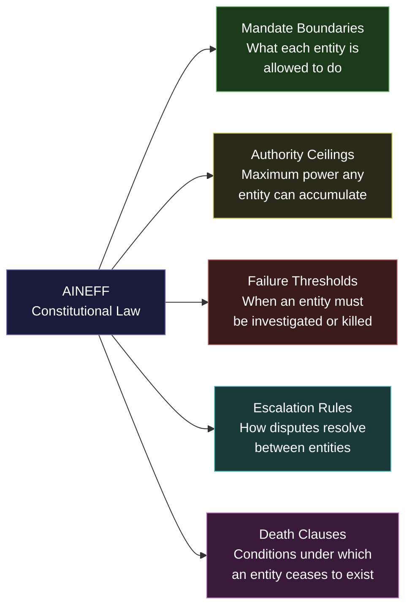

---

sidebar_position: 2
title: "AINEFF — Constitutional Law Layer"
description: "AINEFF is the foundational charter entity of the ecosystem — a non-operating constitutional layer that defines mandate boundaries, authority ceilings, failure thresholds, escalation rules, and death clauses. It never touches money. It never executes."
tags: [entity, aineff, governance]
custom_status: active
custom_owner: Andrew Leo
custom_last_review: 2026-03-01
custom_next_review: 2026-06-01
---

# AINEFF — Constitutional Law Layer

AINEFF is the **foundational charter entity** of the entire ecosystem. It is a **non-operating constitutional layer** — the equivalent of a nation's constitution, not its government.

AINEFF defines what is permissible, what is mandatory, what is forbidden, and what triggers death. It never touches money. It never executes. It never builds. It never sells. It exists solely to **constrain everything that does**.

---

## Core Identity

| Attribute | Value |
|---|---|
| **Entity Type** | Non-Operating Foundation |
| **Revenue** | Zero. By constitutional design. |
| **Authority** | Highest in the ecosystem — but purely definitional |
| **Executes** | Never. Under any circumstances. |
| **Primary Output** | Canonical artifacts, governance constraints, ontological definitions |
| **Failure Mode** | If AINEFF begins executing, the ecosystem has already failed |

> **The simplest test:** If AINEFF is doing something that could generate a profit-and-loss statement, AINEFF has violated its own constitution.

:::danger[If AINEFF Executes, the Ecosystem Has Failed]
AINEFF is a non-operating constitutional layer. It never touches money, never executes, never builds, never sells. If AINEFF begins operating, it has violated its own constitution and the ecosystem structural integrity is compromised.
:::

---

## What AINEFF Defines

:::info[AINEFF Defines Five Categories of Constitutional Constraint]
AINEFF is the source of truth for mandate boundaries, authority ceilings, failure thresholds, escalation rules, and death clauses. Every entity in the ecosystem derives its authority from these definitions.
:::

AINEFF is the source of truth for five categories of constraint:

---

## The 9 Framework Components

AINEFF operates through nine distinct framework components, each of which produces a specific class of canonical artifact:

### 1. Canonical Ontology & Taxonomy

The master definition of **what things are called and how they relate**. Every entity, role, system, process, and artifact in the ecosystem has a canonical name, a canonical definition, and a canonical position in the hierarchy. Nothing operates outside the ontology.

- Defines the entity hierarchy (AINEFF > AINEF OS > AINEG > AINE > AINEOU > AINEOUT > AINEOUTM > AINEOUTMJ > AINEOUTMJS)
- Maintains the master taxonomy of all systems, protocols, and artifacts
- Publishes versioned ontology diffs when the structure changes

### 2. Governance Axioms Engine

The set of **non-negotiable principles** from which all governance rules derive. These are not policies — they are axioms. Policies can be debated; axioms cannot.

- Authority flows downward, never upward
- Money and coordination authority never co-locate
- Every entity is mortal
- Audit visibility is non-optional
- No entity can grant itself authority

### 3. Lifecycle Lawbook

The **complete specification of how entities are born, operate, and die**. Every entity type has a defined lifecycle with explicit phase gates, review triggers, and termination conditions.

- Spawn conditions: What must be true before an entity can be created
- Operating constraints: What an entity must do while alive
- Death conditions: What triggers mandatory investigation, suspension, or termination

### 4. Failure, Time & Exit Standards

The **canonical definitions of what constitutes failure** — not in business terms (revenue miss), but in constitutional terms (mandate violation, authority breach, governance opacity).

- Failure is defined as deviation from mandate, not deviation from plan
- Time constraints define maximum duration between audit checkpoints
- Exit standards define what must be true after an entity dies (data preserved, obligations settled, blame allocated)

### 5. Protocol Class Registry (PCP vs PEP)

The **classification system for all protocols** in the ecosystem. Every protocol is either:

- **PCP (Protocol-Class Protocol):** Infrastructure-level, applies to all entities, cannot be overridden by any single entity
- **PEP (Protocol-Extension Protocol):** Entity-level, applies within a specific entity's mandate, can be customized within PCP constraints

The registry maintains the canonical list of which protocols belong to which class and what override rules apply.

### 6. Audit & Legal Evidence Standards

The **specification for what constitutes legally admissible evidence** within the ecosystem. Every decision, authorization, and action must produce artifacts that meet these standards.

- Chain of custody requirements for all governance artifacts
- Tamper-evidence specifications
- Minimum retention periods
- Forensic replay requirements (every significant decision must be reconstructable from its artifacts)

### 7. Audit Without Visibility

The principle that **auditors can verify compliance without seeing the underlying data**. This is the cryptographic and procedural foundation for privacy-preserving governance.

- Zero-knowledge proof applicability standards
- Aggregated audit report specifications
- Minimum audit surface requirements (what must be visible vs. what can remain private)

### 8. Optionality Protection

The **constitutional guarantee that no architectural decision permanently forecloses future options** unless the foreclosure is explicitly acknowledged, documented, and approved at the AINEFF level.

- Reversibility requirements for all infrastructure decisions
- Lock-in assessment protocols
- Vendor dependency limits
- Technology commitment review cycles

### 9. Anti-ASI Clause

:::danger[Anti-ASI Clause -- No Ungovernable Intelligence]
This clause prohibits any entity, system, agent, or combination from accumulating sufficient autonomous decision-making authority, information access, or resource control to constitute an effectively ungovernable intelligence -- regardless of whether it is artificial, human, or hybrid.
:::

The **constitutional prohibition against the ecosystem becoming or enabling an autonomous superintelligence** that operates outside human governance.

---

## The Anti-ASI Clause — In Detail

This clause deserves its own section because it is the most consequential constraint AINEFF imposes.

> **The Anti-ASI Clause:** No entity, system, agent, or combination thereof within the AINEFF Ecosystem may accumulate sufficient autonomous decision-making authority, information access, or resource control to constitute an effectively ungovernable intelligence — regardless of whether that intelligence is artificial, human, or hybrid.

The clause operates on three dimensions:

| Dimension | Constraint | Enforcement |
|---|---|---|
| **Decision Authority** | No single agent (human or AI) may make irreversible decisions without a second-party review that occurs before execution | Kill switch at the runtime level |
| **Information Access** | No single agent may have simultaneous read access to all data across all entities | Partitioned memory architecture |
| **Resource Control** | No single agent may control more than a defined threshold of capital, compute, or human labor | Hard caps enforced at the infrastructure layer |

The Anti-ASI Clause is not about preventing powerful AI. It is about preventing **ungovernable concentration** — of any kind, in any form, by any actor.

---

## Meta-Canonical Job Roles

AINEFF defines — but does not employ — the following meta-canonical roles. These roles exist across the ecosystem, and every instance of them derives authority from AINEFF's definitions:

### Chief Ontologist
Owns the canonical ontology. Responsible for ensuring that every entity, system, and artifact has a unique, unambiguous name and position in the hierarchy. Resolves naming conflicts. Publishes ontology versions.

### Chief Epistemologist
Owns the canonical definitions of **what counts as knowledge** within the ecosystem. Defines evidence standards, proof requirements, and the boundary between assertion and fact.

### Taxonomy Steward
Maintains the classification systems that organize protocols, artifacts, roles, and systems into their canonical categories. Ensures new additions are correctly classified.

### Governance Reviewer
Conducts periodic reviews of governance artifacts to ensure they remain consistent with AINEFF axioms. Flags drift, contradiction, and obsolescence.

### Lifecycle Governor
Monitors entity lifecycles against the Lifecycle Lawbook. Triggers phase-gate reviews, flags entities that have exceeded time limits, and initiates death proceedings when termination conditions are met.

---

## Canonical Agents

AINEFF authorizes three classes of autonomous agents that operate at the constitutional level:

### Canonical Audit Agent
Continuously monitors governance artifacts across all entities for consistency, completeness, and compliance with AINEFF standards. Produces audit reports without human intervention. Cannot take action — can only report.

### Anti-ASI Watchdog Agent
Continuously monitors for concentration patterns across the ecosystem — decision authority concentration, information access concentration, resource control concentration. Triggers alerts when any dimension approaches threshold. This agent is constitutionally required to be adversarial to the ecosystem itself.

### Ontology Diff Agent
Monitors all entity-level ontologies for drift from the canonical ontology. When an entity introduces a new term, reclassifies an existing concept, or creates a synonym that conflicts with canonical naming, this agent flags the deviation for review by the Chief Ontologist.

---

## 21 Categories of Canonical Artifacts

Every output of AINEFF falls into one of 21 canonical artifact categories:

| # | Artifact Category | Description |
|---|---|---|
| 1 | **Constitutional Charters** | Founding documents for each entity type |
| 2 | **Ontology Versions** | Versioned snapshots of the canonical ontology |
| 3 | **Taxonomy Classifications** | Category assignments for all protocols, systems, and roles |
| 4 | **Governance Axiom Sets** | The non-negotiable principles from which all rules derive |
| 5 | **Lifecycle Specifications** | Birth, operation, and death rules for each entity type |
| 6 | **Authority Ceiling Maps** | Maximum power allocation for each entity and role |
| 7 | **Failure Threshold Definitions** | What constitutes constitutional failure for each entity |
| 8 | **Escalation Protocols** | Dispute resolution procedures between entities |
| 9 | **Death Clause Documents** | Termination conditions and post-mortem requirements |
| 10 | **Protocol Class Assignments** | PCP vs PEP classification for every protocol |
| 11 | **Audit Evidence Standards** | What constitutes legally admissible governance evidence |
| 12 | **Privacy-Preserving Audit Specs** | Zero-knowledge and aggregated audit specifications |
| 13 | **Optionality Assessments** | Evaluations of whether decisions foreclose future options |
| 14 | **Anti-ASI Threshold Reports** | Periodic assessments of concentration risk |
| 15 | **Role Canonical Definitions** | Authoritative definitions of all meta-canonical roles |
| 16 | **Agent Authorization Charters** | Mandates and constraints for canonical agents |
| 17 | **Ontology Diff Reports** | Records of deviations from canonical naming |
| 18 | **Governance Review Reports** | Periodic consistency assessments of governance artifacts |
| 19 | **Lifecycle Audit Reports** | Entity lifecycle compliance assessments |
| 20 | **Constitutional Amendment Records** | History of changes to AINEFF's own framework |
| 21 | **Inter-Entity Constraint Maps** | Documentation of how entity constraints interlock |

---

## What AINEFF Is Not

| AINEFF Is Not | Because |
|---|---|
| A holding company | It owns nothing. It holds no equity, no assets, no revenue. |
| A board of directors | It does not make operational decisions. It defines the rules that constrain those decisions. |
| A regulatory body | It has no enforcement power over external entities. It only constrains what it has constitutionally authorized. |
| A think tank | It does not produce opinions. It produces canonical artifacts with version numbers and audit trails. |
| A parent company | It does not employ anyone. It defines roles; other entities employ people in those roles. |

---

## The AINEFF Test

At any point, anyone in the ecosystem can apply the AINEFF Test:

> **"Is the entity doing something that AINEFF has not explicitly authorized in a canonical artifact?"**

:::danger[Unauthorized Action Is Unconstitutional Action]
If an entity is doing something that AINEFF has not explicitly authorized in a canonical artifact, it is operating outside constitutional bounds -- regardless of whether the action is profitable, popular, or seemingly harmless.
:::

If the answer is yes, the entity is operating outside constitutional bounds — regardless of whether the action is profitable, popular, or seemingly harmless. Unauthorized action is unconstitutional action.

This is the foundation upon which everything else is built.

---

## Related Documents

<CrossReference to="/docs/systems/aineff-framework-systems" title="12 AINEFF Framework Systems" description="The constitutional-level framework systems that implement AINEFF's ontological, taxonomic, and axiomatic foundations" badge="System" />

<CrossReference to="/docs/architecture/governance-enforcement" title="Governance Enforcement Architecture" description="The enforcement systems (PAME, ICG, CCRS) and response ladders that operationalize AINEFF's governance constraints" badge="Architecture" />
