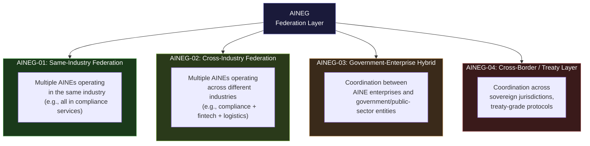
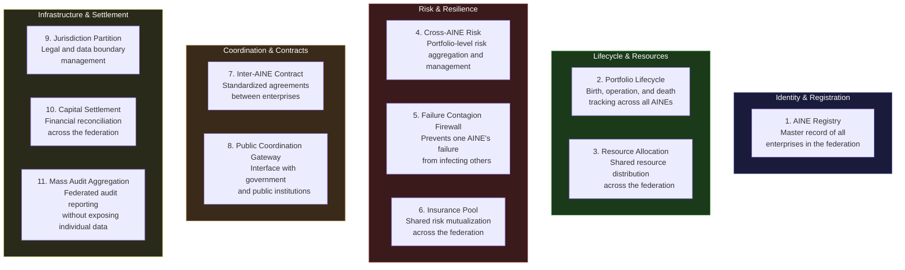
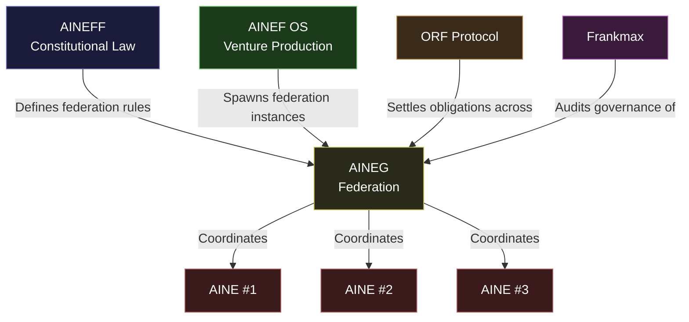

---

sidebar_position: 4
title: "AINEG — Group / Portfolio / Federation"
description: "AINEG is the portfolio and federation layer of the AINEFF Ecosystem — coordinating across enterprises, industries, jurisdictions, and sovereign boundaries through four distinct subtypes. Money must never sit at the same layer as coordination authority."
tags: [entity, aineg]
custom_status: active
custom_owner: Andrew Leo
custom_last_review: 2026-03-01
custom_next_review: 2026-06-01
---

# AINEG — Group / Portfolio / Federation

AINEG is the **portfolio and federation layer** of the ecosystem. It sits between AINEF OS (the venture factory) and AINE (the single productive enterprise), coordinating across multiple enterprises without ever capturing their revenue.

AINEG answers the question: **"How do autonomous enterprises coordinate without creating a centralized controller that becomes a single point of failure?"**

---

## Core Identity

| Attribute | Value |
|---|---|
| **Entity Type** | Portfolio / Federation / Coordination Layer |
| **Revenue** | Membership fees and certification fees only |
| **Authority** | Coordinates enterprises — does not command them |
| **Executes** | Never operates products or services directly |
| **Primary Output** | Coordination protocols, resource allocation, risk firewalls |
| **Core Law** | Money must never sit at the same layer as coordination authority |

---

## Four Federation Subtypes

AINEG is not a single entity type. It is a **class** with four subtypes, each designed for a specific coordination geometry:

### AINEG-01: Same-Industry Federation

Coordinates multiple AINE enterprises operating within a single industry vertical. Enables shared standards, cross-enterprise talent mobility, pooled risk management, and coordinated market positioning — without merging the enterprises into a single entity.

**Example:** Five AINE enterprises all providing AI compliance services. AINEG-01 coordinates their service standards, shares anonymized performance data, manages industry reputation, and prevents destructive internal competition — but each AINE sets its own prices, serves its own clients, and keeps its own revenue.

### AINEG-02: Cross-Industry Federation

Coordinates AINE enterprises across different industries. Enables cross-pollination of capabilities, shared infrastructure investment, and portfolio diversification — without creating a conglomerate.

**Example:** An AINE in compliance services, an AINE in logistics automation, and an AINE in financial technology. AINEG-02 identifies synergies (the compliance AINE can audit the fintech AINE), allocates shared resources (all three share a common AI infrastructure), and manages portfolio-level risk (if the fintech AINE fails, the compliance AINE is insulated).

### AINEG-03: Government-Enterprise Hybrid

Coordinates between AINE enterprises and government or public-sector entities. Handles the unique challenges of public-private coordination: procurement cycles, regulatory compliance, security clearance requirements, and democratic accountability.

**Example:** An AINE providing AI governance services to a national regulator. AINEG-03 manages the interface between the AINE's commercial operations and the government's procurement, security, and transparency requirements.

### AINEG-04: Cross-Border / Treaty Layer

Coordinates across sovereign jurisdictions. This is the most complex subtype, handling different legal systems, different currencies, different regulatory regimes, and different cultural norms. This layer interfaces directly with the [ORF Protocol](./orf-protocol) for obligation settlement across borders.

**Example:** AINE enterprises operating in the EU, the US, and Southeast Asia. AINEG-04 manages jurisdictional partitioning (which data stays where), regulatory harmonization (how to comply with GDPR and local equivalents simultaneously), and cross-border obligation settlement.

---

## 11 Group Systems

AINEG operates through eleven distinct systems, each handling a specific coordination function:

| # | System | Function |
|---|---|---|
| 1 | **AINE Registry** | Canonical record of every enterprise in the federation — identity, mandate, status, history |
| 2 | **Portfolio Lifecycle** | Tracks the lifecycle of every AINE from spawn to exit/death across the entire portfolio |
| 3 | **Resource Allocation** | Distributes shared resources (capital, infrastructure, talent) according to constitutional rules |
| 4 | **Cross-AINE Risk** | Aggregates risk across the portfolio, identifies correlated failure modes, triggers portfolio-level interventions |
| 5 | **Failure Contagion Firewall** | Hard boundaries that prevent one AINE's failure from cascading into others — financial, operational, reputational |
| 6 | **Insurance Pool** | Mutualized risk fund across the federation, enabling enterprises to share catastrophic risk without external insurance dependency |
| 7 | **Inter-AINE Contract** | Standardized contract templates and enforcement for agreements between enterprises within the federation |
| 8 | **Public Coordination Gateway** | The official interface for government, regulatory, and public-sector interactions |
| 9 | **Jurisdiction Partition** | Manages legal and data boundaries across jurisdictions, ensuring compliance with local laws |
| 10 | **Capital Settlement** | Reconciles financial flows across the federation, ensuring every unit of capital is tracked and accounted for |
| 11 | **Mass Audit Aggregation** | Produces federated audit reports that demonstrate portfolio-level compliance without exposing individual enterprise data |

---

## Monetization Rules

AINEG's monetization is **constitutionally restricted**. The core law is absolute:

> **Money must never sit at the same layer as coordination authority.**

An entity that coordinates and profits from coordination will inevitably optimize for its own profit at the expense of the entities it coordinates. This is not a risk — it is a certainty. AINEG's monetization rules exist to prevent this inevitability.

### What Is Allowed

| Revenue Source | Why It Is Allowed |
|---|---|
| **Membership fees** | Fixed, transparent, non-discriminatory. Every AINE in the federation pays the same amount. The fee funds coordination infrastructure — it does not create profit. |
| **Certification fees** | Fees for certifying that an AINE meets federation standards. The fee covers the cost of assessment — it does not create an incentive to certify or deny. |
| **Infrastructure cost recovery** | Pass-through costs for shared infrastructure (compute, legal, compliance). Billed at cost, audited annually. |

### What Is Banned

| Revenue Source | Why It Is Banned |
|---|---|
| **Take rates** | A percentage of AINE revenue creates an incentive for AINEG to favor high-revenue AINEs over mandate-aligned AINEs |
| **Routing fees** | Fees for directing clients or resources to specific AINEs create an incentive for AINEG to become a gatekeeper |
| **Transaction fees** | Per-transaction charges create an incentive for AINEG to maximize transaction volume, regardless of transaction quality |
| **Performance bonuses** | Bonuses tied to portfolio performance create an incentive for AINEG to pressure AINEs for short-term results |
| **Equity stakes** | Ownership in individual AINEs creates alignment conflicts that make impartial coordination impossible |

---

## The Core Law in Practice

The separation of money and coordination authority plays out in every decision AINEG makes:

**Scenario:** An AINE in the federation is underperforming but serving its mandate faithfully. A different AINE is exceeding revenue targets but drifting from its mandate.

- **With take rates:** AINEG would favor the high-revenue AINE (more revenue = more take rate income) and pressure the low-revenue AINE to change — even though the low-revenue AINE is constitutionally compliant and the high-revenue AINE is not.
- **With fixed membership fees:** AINEG has no financial incentive to favor either AINE. It evaluates both purely on mandate compliance, which is its actual job.

This is why the core law exists. It is not idealism — it is **structural corruption prevention**.

---

## How AINEG Relates to Other Entities

AINEG receives its authority from AINEFF (constitutional rules) and AINEF OS (operational spawning). It coordinates AINEs without commanding them. It is audited by Frankmax and uses the ORF Protocol for cross-border obligation settlement.

The federation layer is the **connective tissue** of the ecosystem — essential for multi-enterprise coordination, but constitutionally prohibited from becoming the ecosystem's brain, heart, or wallet.
