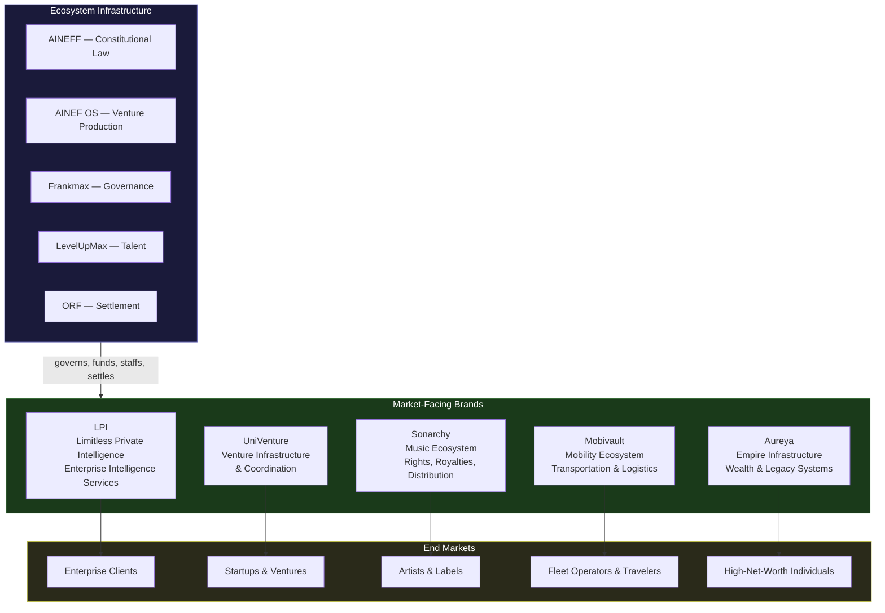
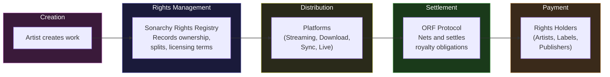
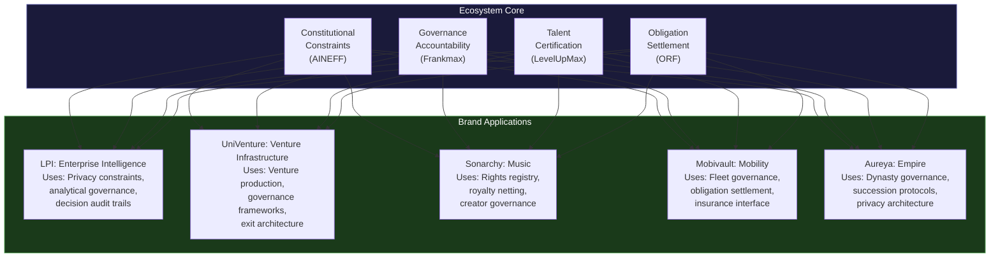

# Ecosystem Brands

The AINEFF Ecosystem produces value through its constitutional, governance, and infrastructure layers — but it **delivers** value to end markets through brand vehicles. Each brand is a market-facing identity operated by one or more AINE enterprises, governed by Frankmax, staffed by LevelUpMax operators, and settling obligations through the ORF Protocol.

Brands are not vanity. They are **market interfaces** — the surfaces through which the ecosystem touches industries, customers, and revenue.

---

## Brand Architecture

---

## LPI — Limitless Private Intelligence

### Identity

LPI is the **enterprise intelligence services** brand. It delivers AI-powered analytics, private intelligence, and strategic insight to organizations that need to understand their environment — competitive landscape, regulatory shifts, market dynamics, risk surfaces — without exposing their data to third parties.

### Core Proposition

Intelligence without surveillance. LPI provides the analytical power of large-scale AI systems with the privacy guarantees of the AINEFF constitutional framework. Client data never leaves client control. Analysis happens within governed boundaries. Results are auditable but private.

### Services

| Service | Description | Target Client |
|---|---|---|
| **Private Analytics Engine** | AI-powered analysis of client data within client infrastructure — no data leaves the perimeter | Enterprises with sensitive data (financial services, healthcare, defense) |
| **Competitive Intelligence** | Structured analysis of publicly available data to surface competitive patterns and threats | Strategy teams, M&A advisory, market research |
| **Regulatory Radar** | Real-time monitoring and analysis of regulatory changes across jurisdictions | Compliance teams, legal departments, GRC functions |
| **Risk Surface Mapping** | Comprehensive identification of operational, financial, and reputational risk exposures | Risk management, board-level reporting |
| **Decision Audit Trail** | Governance-grade documentation of analytical processes and conclusions | Regulated industries requiring analytical provenance |

### How LPI Fits the Ecosystem

LPI draws on the entire ecosystem stack: AINEFF provides the constitutional constraints that guarantee privacy. AINEF OS produced the venture cells that operate LPI services. Frankmax governs the analytical processes. LevelUpMax certifies the intelligence operators. ORF settles obligations with clients across jurisdictions.

---

## UniVenture

### Identity

UniVenture is the **venture infrastructure and coordination** brand. It provides the tools, frameworks, and coordination services that ventures need to launch, operate, and scale within governed constraints.

### Core Proposition

Venture building without the cowboy culture. UniVenture provides startup and venture infrastructure that includes governance from day one — not as an afterthought bolted on before an IPO, but as foundational architecture.

### Services

| Service | Description | Target Client |
|---|---|---|
| **Venture Launch Kit** | Constitutional charter, governance framework, capital envelope, and kill criteria — pre-packaged for new ventures | First-time founders, corporate venture arms |
| **Governance-as-Infrastructure** | Ongoing governance services that grow with the venture — from single-cell micro-enterprises to multi-entity federations | Scaling startups, portfolio companies |
| **Venture Cell Marketplace** | Coordination platform connecting venture cells with operators, capital, and market opportunities | AINE enterprises seeking talent and capital |
| **Exit Architecture** | Structured shutdown, obligation settlement, and asset distribution for ventures that have reached their end | Ventures approaching exit or termination |

### How UniVenture Fits the Ecosystem

UniVenture is the most direct expression of AINEF OS in the market. It packages the venture production infrastructure into services that external ventures can adopt — even those not originally born within the AINEFF Ecosystem. It is the gateway through which external entities enter the ecosystem's governance framework.

---

## Sonarchy

### Identity

Sonarchy is the **music ecosystem** brand. It addresses the music industry's most persistent problems: opaque royalty distribution, fragmented rights management, unfair creator economics, and the absence of a single source of truth for who owns what.

### Core Proposition

Transparent music economics. Sonarchy uses the ORF Protocol to settle music industry obligations — royalties, licensing fees, distribution payments — with the same finality, auditability, and netting efficiency that ORF brings to financial obligations.

### Services

| Service | Description | Target Client |
|---|---|---|
| **Rights Registry** | Canonical record of who owns what rights to which musical works — versioned, auditable, tamper-evident | Artists, labels, publishers, distributors |
| **Royalty Settlement** | ORF-powered obligation settlement for royalties — netted, fast, auditable | Rights holders, collection societies |
| **Distribution Coordination** | Coordinated distribution across platforms with unified reporting and settlement | Independent artists, labels, aggregators |
| **Creator Economics Dashboard** | Real-time visibility into earnings, obligations, and projections | Artists and their management |
| **Licensing Automation** | Programmable licensing with pre-defined terms, automatic compliance, and instant settlement | Sync licensing, sampling, covers |

### How Sonarchy Fits the Ecosystem

Sonarchy demonstrates the ecosystem's thesis in a specific vertical: music industry obligations are complex, cross-border, multi-party, and poorly served by existing infrastructure. ORF's netting capability reduces settlement friction. Frankmax's governance ensures auditability. The result is a music economy where creators can see exactly where their money flows and why.

---

## Mobivault

### Identity

Mobivault is the **mobility ecosystem** brand. It addresses transportation, logistics, fleet management, and mobility-as-a-service through governed, obligation-settled infrastructure.

### Core Proposition

Governed mobility. Mobivault brings constitutional governance to the mobility sector — where obligations between riders, drivers, fleet operators, insurers, and regulators are currently managed through fragmented, opaque systems.

### Services

| Service | Description | Target Client |
|---|---|---|
| **Fleet Governance Platform** | Constitutional governance framework for fleet operations — compliance, safety, obligation tracking | Fleet operators, logistics companies |
| **Mobility Obligation Settlement** | ORF-powered settlement of mobility obligations — fuel, maintenance, insurance, driver payments | Multi-modal transport operators |
| **Insurance Interface** | Structured data feeds for insurance carriers, enabling real-time risk assessment and premium adjustment | Insurance carriers, fleet operators |
| **Regulatory Compliance Engine** | Automated compliance with transportation regulations across jurisdictions | Operators in multi-jurisdiction markets |
| **Asset Lifecycle Management** | Governed tracking of vehicle and infrastructure assets from acquisition to disposal | Fleet operators, leasing companies |

### How Mobivault Fits the Ecosystem

Mobility is one of the most obligation-dense sectors in the economy. Every trip generates obligations: to the driver (payment), to the rider (service), to the insurer (risk reporting), to the regulator (compliance), to the fleet operator (vehicle maintenance). Mobivault uses the ecosystem's infrastructure to settle these obligations with the same rigor applied to financial obligations.

---

## Aureya

### Identity

Aureya is the **empire infrastructure** brand. It serves high-net-worth individuals, family offices, and dynasty-scale wealth structures with the governance, coordination, and obligation settlement infrastructure needed to manage multi-generational wealth.

### Core Proposition

Wealth infrastructure that outlives its creators. Aureya provides constitutional governance for wealth structures — not wealth management (picking investments), but wealth infrastructure (ensuring that the structures governing wealth are auditable, accountable, and resilient across generations).

### Services

| Service | Description | Target Client |
|---|---|---|
| **Dynasty Governance Architecture** | Constitutional frameworks for multi-generational wealth structures — succession rules, authority ceilings, failure thresholds | Family offices, dynastic trusts |
| **Obligation Mapping** | Complete mapping of all obligations associated with a wealth structure — legal, financial, familial, philanthropic | High-net-worth individuals, family councils |
| **Succession Protocol Design** | Programmable succession with explicit authority transfer rules, kill criteria for failing stewards, and forensic accountability | Wealth transfer planning |
| **Philanthropic Obligation Settlement** | ORF-powered settlement of charitable obligations with full auditability | Foundations, donor-advised funds |
| **Privacy Architecture** | Constitutional privacy guarantees for wealth structures — legible to authorized parties, invisible to everyone else | Ultra-high-net-worth individuals |

### How Aureya Fits the Ecosystem

Aureya applies the ecosystem's thesis to a specific, high-value market: the governance of lasting wealth structures. The problems of multi-generational wealth — succession disputes, stewardship failures, opacity, accountability gaps — are governance problems. AINEFF's constitutional framework, Frankmax's accountability system, and ORF's settlement infrastructure are directly applicable.

---

## How Each Brand Fits Within the Ecosystem

Every brand uses the same ecosystem infrastructure. Every brand is governed by the same constitutional constraints. Every brand is staffed by LevelUpMax-certified operators. Every brand settles obligations through ORF.

The brands are different market faces on the same underlying architecture. This is the power of the ecosystem model: **build the infrastructure once, apply it to every industry, and compound the value across all of them**.

| Brand | Market | Uses AINEFF? | Uses Frankmax? | Uses LevelUpMax? | Uses ORF? |
|---|---|---|---|---|---|
| **LPI** | Enterprise Intelligence | Yes — privacy constraints | Yes — analytical governance | Yes — intelligence operators | Yes — cross-border service settlement |
| **UniVenture** | Ventures & Startups | Yes — venture charters | Yes — venture governance | Yes — venture operators | Yes — venture obligation settlement |
| **Sonarchy** | Music Industry | Yes — rights governance | Yes — royalty accountability | Yes — music industry operators | Yes — royalty netting & settlement |
| **Mobivault** | Mobility & Logistics | Yes — fleet governance | Yes — safety accountability | Yes — mobility operators | Yes — transport obligation settlement |
| **Aureya** | Wealth & Legacy | Yes — dynasty constitutions | Yes — succession accountability | Yes — wealth governance operators | Yes — philanthropic settlement |

The brands are the proof that the ecosystem is not theoretical. They are the places where constitutional governance meets real markets, real clients, and real revenue.
