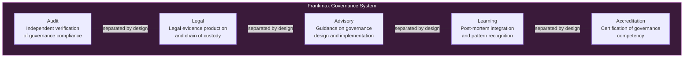
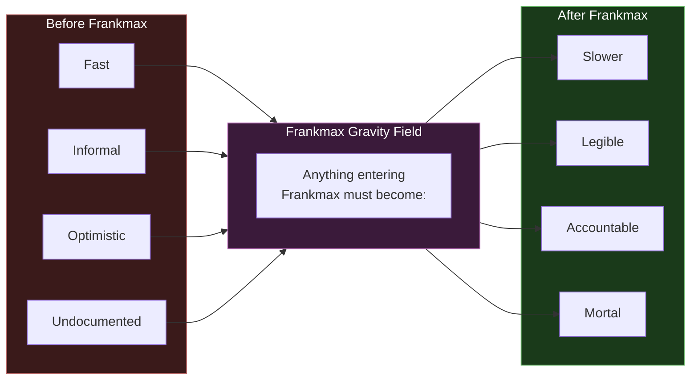

---

sidebar_position: 7
title: "Frankmax — Pre-Incident Governance System"
description: "Frankmax is the pre-incident governance system of the AINEFF Ecosystem — a coordination substrate that forces explicit authority, converts judgment into artifacts, and pre-allocates blame honestly. It is not a company. It is a gravity field."
tags: [entity, frankmax]
custom_status: active
custom_owner: Andrew Leo
custom_last_review: 2026-03-01
custom_next_review: 2026-06-01
---

# Frankmax — Pre-Incident Governance System

Frankmax answers one question:

> **"If this fails, can the people who authorized it survive investigation?"**

That is the entire purpose. Not "will this succeed?" Not "is this profitable?" Not even "is this ethical?" The question is surgical and specific: **when the post-mortem happens — and it will happen — does a clear, auditable trail exist that shows who knew what, who authorized what, and who was accountable for what?**

---

## The Three Hard Things

Most governance systems avoid the hard parts. They produce compliance checklists, policy documents, and training certificates that create the appearance of governance without the substance. Frankmax does the three things that are genuinely difficult:

### 1. Forces Explicit Authority

Every action that matters must trace back to an explicit authorization by a named individual. "The team decided" is not authority. "It was implied" is not authority. "Everyone knew" is not authority. Frankmax requires: **who specifically authorized this, under what authority, at what time, with what information available?**

### 2. Converts Judgment into Artifacts

Human judgment is invisible. A leader "decides" something in their head, communicates it verbally, and moves on. If it goes wrong, the judgment evaporates — no one can reconstruct what was known, what was considered, and what was deliberately ignored. Frankmax converts these invisible judgments into **versioned, tamper-evident, forensically reconstructable artifacts**.

### 3. Pre-Allocates Blame Honestly

After failure, blame follows power and narrative, not truth. Frankmax inverts this by requiring **blame allocation before the action is taken**. Before authorizing a significant decision, the authorizer must explicitly acknowledge: "If this fails in manner X, I am accountable. If it fails in manner Y, this other person is accountable." Pre-allocated blame cannot be retroactively reassigned.

---

## Five Pillars

Frankmax operates through five pillars, **deliberately separated by design**:

The pillars are separated because **combining them creates conflicts of interest**:

| Combination | Conflict |
|---|---|
| Audit + Advisory | The auditor who advised on the governance design cannot objectively audit their own advice |
| Legal + Audit | The legal team that produces evidence cannot be the same team that verifies the evidence |
| Advisory + Accreditation | The advisor who helped design the system cannot certify the system they designed |
| Learning + Audit | The team that learns from failures cannot be the team that determines whether failures occurred |
| Accreditation + Legal | The certifier cannot also be the legal authority that interprets the certification |

Every major accounting scandal, governance failure, and regulatory collapse in history can be traced to one of these combinations. Frankmax prevents them by architectural separation, not by policy or good intentions.

---

## Core Services

### PIAR — Pre-Incident Accountability Review

The flagship service. Before any significant decision is executed, a PIAR produces:

1. **Authority Map:** Who is authorizing this decision, under what grant of authority?
2. **Information Inventory:** What information was available to the authorizer at the time of authorization?
3. **Risk Acknowledgment:** What failure modes were identified, and what is the explicit response plan for each?
4. **Blame Pre-Allocation:** If each identified failure mode occurs, who is accountable?
5. **Kill Criteria:** Under what conditions must this decision be reversed, and who has authority to trigger reversal?

A completed PIAR is a **forensically reconstructable record** of the decision. If the decision fails, investigators can determine exactly what was known, what was decided, and who was accountable — without relying on memory, testimony, or narrative.

### Authority & Liability Mapping

A comprehensive map of who holds what authority and what liability across an entity. This is not an org chart — it is a **liability topology**. It shows:

- Who can authorize what
- What the maximum authority of each role is
- Where authority gaps exist (decisions that no one is explicitly authorized to make)
- Where authority overlaps exist (decisions that multiple people believe they can make)

### Kill Criteria Architecture

The design of explicit conditions under which a project, product, venture, or entity must be terminated. Kill criteria are defined **before launch**, not after problems emerge. They include:

- Quantitative triggers (revenue below threshold for N consecutive periods)
- Qualitative triggers (mandate drift detected by governance review)
- Temporal triggers (maximum duration without achieving milestones)
- External triggers (regulatory change that invalidates the venture's basis)

### Governance Artifact Production

The creation of auditable, versioned governance documents that meet AINEFF's Audit & Legal Evidence Standards. Every artifact includes:

- Version number and change history
- Author and authorizer identification
- Timestamp with tamper evidence
- Chain of custody metadata
- Forensic replay instructions

### Post-Incident Forensic Replay

When something fails, Frankmax conducts a forensic replay — reconstructing the decision chain from governance artifacts. This is not a "lessons learned" session. It is a **forensic reconstruction** that determines:

- Was the decision authorized?
- Was the authorizer informed?
- Were kill criteria in place?
- Were kill criteria triggered and ignored?
- Was blame pre-allocated accurately?

### Accreditation & Certification

Frankmax certifies individuals and organizations in governance competency. This is not a training certificate — it is an **accreditation** that attests to demonstrated capability in:

- Producing governance artifacts that meet evidence standards
- Conducting pre-incident accountability reviews
- Designing kill criteria architectures
- Performing forensic replays

---

## What Frankmax Is NOT

Frankmax is not a company. It is not a consulting firm. It is not a software platform.

Frankmax is a **coordination substrate** — a gravity field that anything entering must conform to.

### Slower

Speed without governance is recklessness. Frankmax deliberately slows decisions to the pace at which they can be properly authorized, documented, and pre-allocated. This is not a bug — it is the core function.

### Legible

Invisible decisions are ungovernable decisions. Everything that enters Frankmax becomes visible — not to everyone, but to the people constitutionally authorized to see it. Legibility is the precondition for accountability.

### Accountable

Anonymous authority is illegitimate authority. Frankmax requires that every significant action trace back to a named individual who explicitly accepted accountability. Collective responsibility is no responsibility.

### Mortal

Immortal projects become zombie projects. Everything within Frankmax has defined kill criteria and a finite lifespan. If it cannot die, it cannot be governed. If it cannot be governed, it does not belong in the system.

---

## The Frankmax Test

At any point, anyone in the ecosystem can apply the Frankmax Test:

> **"If this decision fails catastrophically tomorrow, and investigators arrive next week, can we hand them a complete, tamper-evident, forensically reconstructable record of who authorized it, what they knew, and what they explicitly accepted accountability for?"**

If the answer is no, the decision has not been through Frankmax — regardless of how many approval emails, Slack messages, or meeting minutes exist.

Governance is not documentation. Governance is **pre-committed accountability with forensic evidence**. That is what Frankmax produces.
