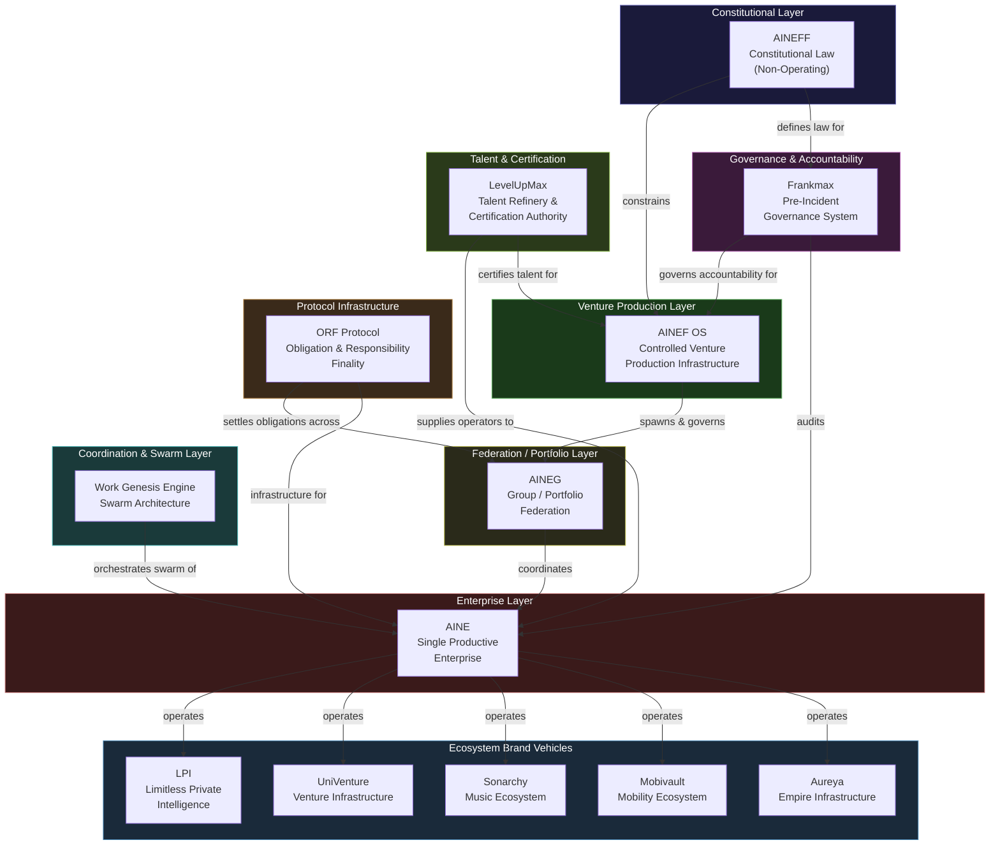

# Entities & Platforms

The AINEFF Ecosystem is not a single company. It is a **constellation of purpose-built entities**, each with a constitutionally defined mandate, authority ceiling, and failure boundary. No entity operates in isolation. Every entity exists because another entity requires it, constrains it, or is constrained by it.

This section documents every entity at the 10,000-foot level — what it is, why it exists, where it sits in the hierarchy, and how it interlocks with everything else.

---

## The Entity Map

---

## Entity Directory

| Entity | Type | Purpose | Touches Money? |
|---|---|---|---|
| [AINEFF](./aineff) | Constitutional Foundation | Defines mandate boundaries, authority ceilings, failure thresholds | Never |
| [AINEF OS](./ainef-os) | Venture Production Infrastructure | Spawns, funds, and governs all operating entities | Controls capital flow |
| [AINEG](./aineg) | Group / Portfolio / Federation | Coordinates across enterprises, industries, jurisdictions | Membership fees only |
| [AINE](./aine) | Single Productive Enterprise | The legal, economic, and operational unit that generates revenue | Yes — primary revenue |
| [WGE](./wge) | Work Genesis Engine | Swarm coordination across venture cells and entities | Allocation only |
| [Frankmax](./frankmax) | Pre-Incident Governance System | Forces accountability, produces governance artifacts | Service fees |
| [LevelUpMax](./levelupmax) | Talent Refinery & Certification | Converts raw ambition into governed execution capacity | Training fees |
| [ORF Protocol](./orf-protocol) | Obligation Settlement Infrastructure | Obligation-netting and settlement-normalization at scale | Protocol taxation |
| [Ecosystem Brands](./ecosystem-brands) | Brand Vehicles | Market-facing delivery of ecosystem capabilities | Revenue-generating |

---

## Core Architectural Principles

Every entity in the ecosystem obeys three inviolable rules:

1. **Authority flows downward, never upward.** AINEFF constrains AINEF OS, which constrains AINEG, which constrains AINE. No child entity can grant itself authority that its parent has not explicitly delegated.

2. **Money and coordination authority never sit at the same layer.** The entity that decides what gets built is never the entity that profits from what gets built. This separation is constitutional, not organizational.

3. **Every entity is mortal.** Every entity has explicit kill criteria, failure thresholds, and exit procedures. Nothing in the ecosystem is too important to die. Immortal entities become ungovernable entities.

---

## How Entities Interlock

The entities are not a hierarchy of command. They are a **lattice of constraints**. Each entity both enables and limits others:

- **AINEFF** writes the law but never enforces it. It defines what is permissible.
- **AINEF OS** builds the factory but never operates the products. It defines how ventures are produced.
- **AINEG** coordinates the portfolio but never captures revenue from coordination. It defines how enterprises federate.
- **AINE** generates revenue but never sets its own governance. It operates within boundaries set by every layer above.
- **Frankmax** ensures accountability but never makes operational decisions. It defines what happens when things fail.
- **LevelUpMax** produces talent but never deploys talent into operations directly. It defines how people become operators.
- **ORF Protocol** settles obligations but never originates them. It defines how value crosses boundaries.
- **WGE** orchestrates swarms but never owns the cells. It defines how autonomous units self-organize.

The result is a system where **no single entity can become a bottleneck, a tyrant, or a single point of failure** — because every entity's power is checked by at least two others.

---

## Reading Order

For a first pass through the entities, read them in order:

1. Start with [AINEFF](./aineff) to understand the constitutional foundation
2. Move to [AINEF OS](./ainef-os) to see how ventures are produced
3. Read [AINEG](./aineg) to understand federation and portfolio coordination
4. Study [AINE](./aine) to see the actual productive enterprise in detail
5. Explore [WGE](./wge) for swarm-level coordination
6. Read [Frankmax](./frankmax) for governance and accountability
7. Study [LevelUpMax](./levelupmax) for talent and certification
8. Read [ORF Protocol](./orf-protocol) for the obligation infrastructure thesis
9. Finish with [Ecosystem Brands](./ecosystem-brands) for market-facing brand vehicles

Each page is self-contained but references its neighbors. The system is designed to be entered from any point after this overview.
