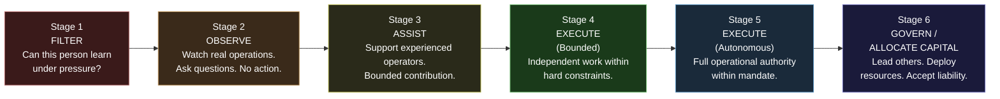
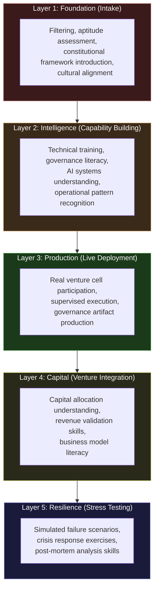

# LevelUpMax — Talent Refinery & Certification Authority

LevelUpMax is a **controlled talent refinery**. Not a school. Not a bootcamp. Not a training program. A refinery — an industrial process that takes raw material (ambitious people with potential) and converts it into a specific, high-value output (governed execution capacity).

The distinction matters. Schools educate. Bootcamps train. LevelUpMax **refines** — applying heat, pressure, and filtration to produce operators who can execute within constitutional constraints, under audit, at production speed.

---

## Core Identity

| Attribute | Value |
|---|---|
| **Entity Type** | Talent Refinery & Certification Authority |
| **Revenue** | Training fees, certification fees, promoter commissions |
| **Output** | Certified operators deployed into AINE enterprises and venture cells |
| **Governance** | Operates under AINEFF constitutional constraints, audited by Frankmax |
| **Long-Term Vision** | Global AI Risk Certification Authority (10-20 year horizon) |

---

## The 6-Stage Operator Lifecycle

Every operator progresses through six stages. No stage can be skipped. Each stage has explicit entry criteria, exit criteria, and failure conditions.

### Stage 1: Filter

**Question:** Can this person learn under pressure?

Not "are they smart?" Not "do they have experience?" The filter stage tests a single thing: **when placed under structured pressure with ambiguous instructions, does this person learn, adapt, and ask the right questions — or do they freeze, fake confidence, or blame the instructions?**

Most people are filtered out here. This is by design. The refinery exists to produce quality, not volume.

### Stage 2: Observe

**Question:** Can this person see before they do?

Observers are placed in real operational environments. They watch certified operators work. They ask questions. They take notes. They are explicitly forbidden from taking action. The purpose is to develop **operational pattern recognition** before the pressure of execution begins.

### Stage 3: Assist

**Question:** Can this person contribute without overstepping?

Assistants support experienced operators with bounded tasks. They do real work, but within tight constraints. They learn what "operating within boundaries" feels like — not as a concept, but as a daily practice.

### Stage 4: Execute (Bounded)

**Question:** Can this person produce independently within hard constraints?

Bounded executors operate independently but within explicit limits: capital ceilings, decision authority caps, mandatory review points. They are trusted to work alone but not trusted to set their own boundaries.

### Stage 5: Execute (Autonomous)

**Question:** Can this person be trusted with full mandate authority?

Autonomous executors have full operational authority within their mandate. They make decisions, allocate resources, and accept accountability — all within the constitutional framework. This is the stage where most operators will spend most of their career.

### Stage 6: Govern / Allocate Capital

**Question:** Can this person lead others, deploy resources, and accept liability for collective outcomes?

Governors and capital allocators are the rarest output of the refinery. They do not just execute — they set the conditions under which others execute. They approve capital envelopes, design mandate boundaries, and accept liability when the ventures they authorize fail.

---

## Bootcamp Tracks

LevelUpMax operates five bootcamp tracks, each building on the previous:

### Track 1: AI-Native Foundation

| Attribute | Value |
|---|---|
| **Duration** | 30 days |
| **Price** | $500 - $800 |
| **Prerequisite** | Passing the Stage 1 Filter |
| **Output** | Foundation-certified operator |
| **Content** | AI systems literacy, governance fundamentals, operational discipline, constitutional framework introduction |

This is the entry point. It teaches the minimum viable knowledge for operating in an AI-governed environment. It does not teach AI engineering — it teaches **AI operational literacy**: what AI systems can and cannot do, how governance constrains them, and what your responsibilities are as an operator.

### Track 2: Governed Production

| Attribute | Value |
|---|---|
| **Duration** | 90 days |
| **Price** | $800 - $1,200 |
| **Prerequisite** | Track 1 completion + Stage 3 clearance |
| **Output** | Production-certified operator |
| **Content** | Live deployment participation, governance artifact production, revenue validation, audit trail maintenance |

Track 2 is where theory meets reality. Operators participate in live venture cell deployments, produce real governance artifacts, validate real revenue, and maintain real audit trails. Failure in Track 2 is common and expected — it is part of the refinement process.

### Track 3: Infrastructure Stewardship

| Attribute | Value |
|---|---|
| **Duration** | 120 days |
| **Price** | $1,200 - $1,500 |
| **Prerequisite** | Track 2 completion + demonstrated production output |
| **Output** | Infrastructure-certified operator |
| **Content** | System architecture, platform operations, resilience engineering, cross-entity coordination |

Track 3 produces operators who can maintain and extend the ecosystem's infrastructure. These are the people who keep the factory running — not the products it produces, but the production infrastructure itself.

### Track 4: Telemetry Engineering

| Attribute | Value |
|---|---|
| **Duration** | 90 days |
| **Price** | $1,000 - $1,400 |
| **Prerequisite** | Track 2 completion + quantitative aptitude assessment |
| **Output** | Telemetry-certified operator |
| **Content** | Monitoring system design, anomaly detection, performance measurement, governance metric engineering |

Track 4 produces the operators who build and maintain the ecosystem's measurement systems. Without telemetry, governance is blind. These operators ensure that every metric the ecosystem relies on is accurate, timely, and tamper-evident.

### Track 5: Risk Modeling

| Attribute | Value |
|---|---|
| **Duration** | 120 days |
| **Price** | $1,500 - $2,000 |
| **Prerequisite** | Track 3 or Track 4 completion + risk assessment exam |
| **Output** | Risk-certified operator |
| **Content** | Actuarial fundamentals, failure mode analysis, contagion modeling, insurance interface, kill criteria design |

Track 5 is the most selective track. It produces operators who can model risk across the ecosystem — from individual venture cell failure to portfolio-level contagion to civilization-scale shock scenarios.

---

## 5-Layer Refinery Structure

The refinery itself is organized into five layers that mirror AINEF OS's architecture:

---

## AI Risk Certification Authority — The 10-20 Year Vision

The long-term aspiration for LevelUpMax is not to remain a talent refinery. It is to become the **global AI Risk Certification Authority** — the entity that certifies whether organizations, systems, and individuals meet the standard for governed AI operations.

This is a 10-20 year vision. The path:

| Phase | Timeline | Milestone |
|---|---|---|
| **Foundation** | Years 1-3 | Establish bootcamp tracks, produce first certified operators, build reputation through quality |
| **Recognition** | Years 3-5 | Industry bodies begin recognizing LevelUpMax certifications. Insurance carriers accept them as risk indicators. |
| **Standard-Setting** | Years 5-10 | LevelUpMax certification standards are adopted by regulatory bodies as reference frameworks |
| **Authority** | Years 10-15 | LevelUpMax becomes the de facto certification authority for AI risk — the way CPA boards certify accountants |
| **Infrastructure** | Years 15-20 | LevelUpMax certification is required by law or by insurance mandate. It is no longer optional — it is terrain. |

---

## The PEACE Framework Brochure

LevelUpMax markets to prospective operators using the PEACE Framework:

### P — Problem

The AI governance talent gap is real and growing. Organizations deploying AI systems need people who can operate them under governance — and those people do not exist yet. Traditional education does not produce them. Corporate training does not produce them. Only a purpose-built refinery can produce them.

### E — Empathy

You feel the gap. You know AI is transforming your industry. You see the job postings requiring "AI governance experience" that nobody has. You worry that the wave will pass you by — or worse, that you will be caught in the wreckage when ungoverned AI systems fail.

### A — Authority

LevelUpMax is the certification authority for the AINEFF Ecosystem — the largest constitutional coordination protocol designed for enterprise AI governance. Our certifications are backed by real deployment experience, real governance artifacts, and real accountability.

### C — Call to Action

Start with Track 1. Thirty days, $500-$800. If you can survive the filter and complete the foundation, you will know more about governed AI operations than 99% of the market.

### E — Evidence

- **$127,000** average salary for AI governance roles
- **340%** demand growth for AI compliance professionals over the past 3 years
- **12,000+** unfilled positions in AI risk and governance globally

---

## Distribution Model

LevelUpMax acquires operators through a **promoter channel partner** model:

### Promoter Channel Partners

Individuals and organizations who refer prospective operators to LevelUpMax. Promoters receive structured referral commissions:

| Referral Stage | Commission |
|---|---|
| Track 1 enrollment | Fixed referral fee |
| Track 2 enrollment | Increased referral fee |
| Track 3+ enrollment | Premium referral fee |
| Successful deployment into AINE | Deployment bonus |

Promoters are not salespeople — they are **trust nodes**. Their reputation depends on the quality of the people they refer. A promoter who refers people who fail the filter loses credibility and referral priority.

---

## Required Talent Profiles

LevelUpMax actively recruits the following profiles into its refinery:

| Profile | Why They Are Needed | Typical Background |
|---|---|---|
| **AI Engineers** | Build and deploy the AI systems within governance constraints | Software engineering, ML/AI research, data science |
| **Actuarial Scientists** | Model risk, failure probability, and insurance pricing | Actuarial science, statistics, financial mathematics |
| **Insurance Experts** | Design and operate the insurance interfaces | Insurance underwriting, risk management, claims |
| **Regulatory Counsel** | Navigate legal and regulatory requirements across jurisdictions | Law, regulatory affairs, compliance |
| **Compliance Veterans** | Bring institutional knowledge of what compliance actually requires | Financial services compliance, healthcare compliance, environmental compliance |

---

## Market Indicators

The talent market for AI governance is growing faster than any institutional pipeline can fill it:

| Metric | Value |
|---|---|
| **Average salary (AI governance roles)** | $127,000 |
| **Demand growth (3-year)** | 340% |
| **Unfilled positions globally** | 12,000+ |
| **Traditional programs producing qualified candidates** | Near zero |
| **Time to proficiency (traditional path)** | 2-3 years on the job |
| **Time to proficiency (LevelUpMax Track 1-2)** | 120 days |

The gap between demand and supply is the opportunity. LevelUpMax does not need to create demand — it needs to **fill the demand that already exists and is growing exponentially**.
