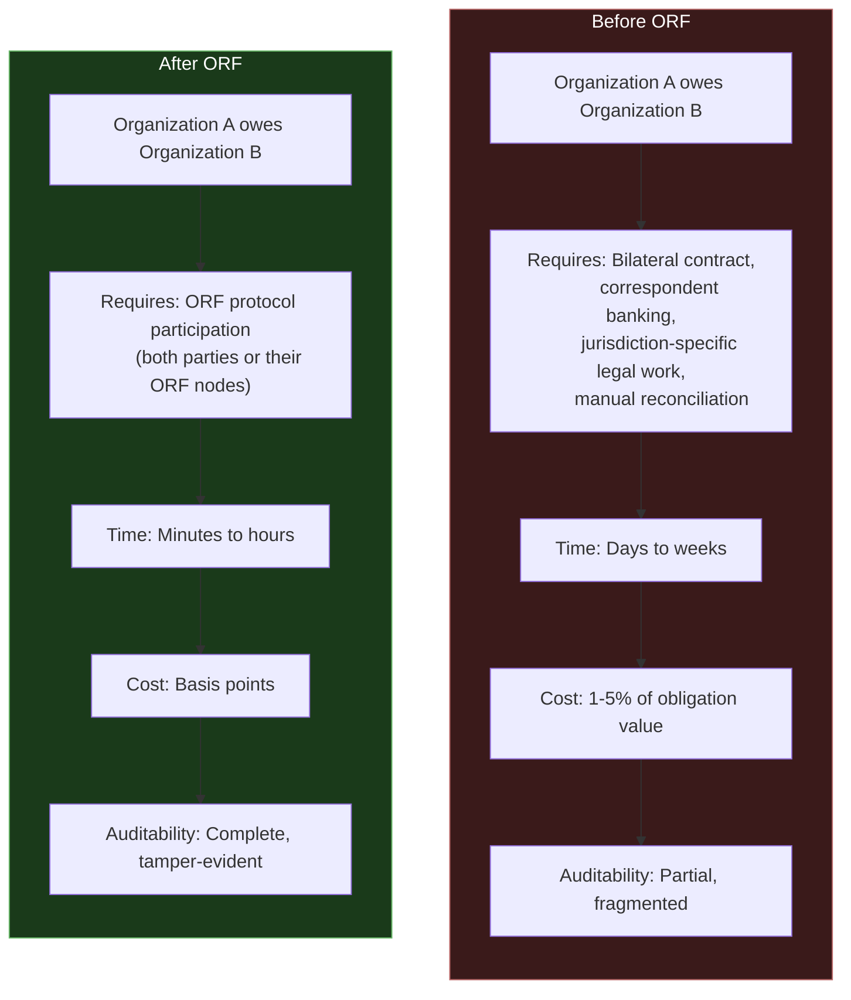
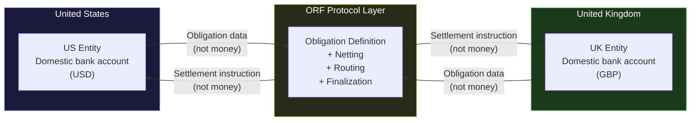
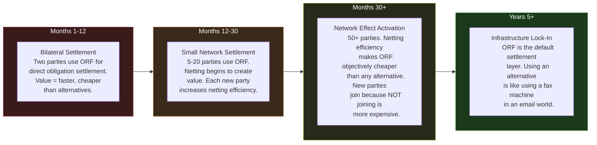

---

sidebar_position: 9
title: "ORF — Obligation & Responsibility Finality Protocol"
description: "ORF is the obligation-netting and settlement-normalization protocol at the core of the centi-trillion thesis — global infrastructure where money stays domestic but obligations cross borders, enabling treaty-grade financial coordination."
tags: [entity, orf, governance]
custom_status: active
custom_owner: Andrew Leo
custom_last_review: 2026-03-01
custom_next_review: 2026-06-01
---

# ORF — Obligation & Responsibility Finality Protocol

ORF is the **infrastructure layer** that makes everything else in the ecosystem compound. It is not a product, not a service, and not a platform. It is a **protocol for obligation-netting and settlement-normalization** — the coordination primitive that allows obligations to cross any boundary (organizational, jurisdictional, temporal) with finality.

ORF is the core of the **centi-trillion thesis**: the proposition that if you become the infrastructure through which obligations settle, you capture value at a scale proportional to the obligations flowing through you — and global obligations are measured in hundreds of trillions.

---

## What ORF Actually Does

The simplest explanation: **ORF makes obligations move the way the internet makes data move.**

Before the internet, moving data between two organizations required bespoke connections, proprietary protocols, and manual coordination. The internet provided a universal protocol that made data movement invisible — any organization can send data to any other organization without negotiating the plumbing.

ORF does the same thing for obligations. Before ORF, settling an obligation between two organizations (especially across jurisdictions) requires bespoke contracts, correspondent banking relationships, legal coordination, and weeks of processing. ORF provides a universal protocol that makes obligation settlement programmable, auditable, and fast.

---

## The Core Insight: Money Stays Domestic, Obligations Go Global

This is the key conceptual breakthrough that ORF is built on:

> **Correspondent banking is not money movement. It is synchronized bookkeeping.**

When Bank A in the US "sends money" to Bank B in the UK, no money actually crosses the Atlantic. What happens is:

1. Bank A debits the sender's account in the US
2. Bank A credits its correspondent account at Bank B
3. Bank B debits its correspondent account at Bank A
4. Bank B credits the receiver's account in the UK

**The money never moved.** Two ledgers were adjusted in a coordinated way. The "money transfer" is an **obligation settlement** — Bank A owes Bank B the equivalent value, and they reconcile periodically through their correspondent relationship.

ORF generalizes this insight. If money transfer is really just synchronized ledger adjustment, then you do not need to move money to settle obligations. You need a protocol that can:

1. **Define** obligations in a standard format
2. **Net** obligations across parties (A owes B $100, B owes A $70, net = A owes B $30)
3. **Route** netted obligations through the cheapest settlement path
4. **Finalize** settlement with tamper-evident proof

The money stays in its domestic banking system. The obligations are what cross borders — as data, through a protocol, with finality.

---

## Obligation Netting — The Value Multiplier

Obligation netting is where ORF creates massive value. Consider a network of five organizations that all owe each other money:

| From | To | Amount |
|---|---|---|
| A | B | $100 |
| B | C | $80 |
| C | A | $60 |
| A | D | $40 |
| D | E | $90 |
| E | A | $70 |

**Without netting:** Six separate transactions totaling $440 in gross obligation movement. Each transaction incurs fees, compliance checks, and settlement risk.

**With netting:** ORF calculates each party's net position:
- A: Owes $100 + $40 = $140, Is owed $60 + $70 = $130. Net: Owes $10
- B: Owes $80, Is owed $100. Net: Is owed $20
- C: Owes $60, Is owed $80. Net: Is owed $20
- D: Owes $90, Is owed $40. Net: Owes $50
- E: Owes $70, Is owed $90. Net: Is owed $20

**Netted settlement:** Three transfers totaling $50 instead of six transfers totaling $440. That is an **89% reduction** in settlement volume — fewer fees, less risk, less compliance overhead.

At scale, across thousands of organizations and millions of obligations, netting reduces the gross settlement volume by orders of magnitude. This is why ORF captures value at infrastructure scale — every obligation that flows through the protocol benefits from netting with every other obligation in the network.

---

## Network Effects Activate at Month 30+

ORF follows a specific adoption curve:

### Phase 1: Bilateral (Months 1-12)

ORF is simply a better pipe between two parties. Faster, cheaper, more auditable than existing settlement methods. The value proposition is straightforward: "Use this instead of what you are currently using. It is better."

### Phase 2: Small Network (Months 12-30)

As more parties join, netting begins to create compounding value. Each new participant increases the netting efficiency for everyone in the network. The value proposition shifts: "Not only is it better, but it gets better the more people use it."

### Phase 3: Network Effect Activation (Month 30+)

The inflection point. At approximately 50+ active participants, ORF's netting efficiency makes it objectively cheaper than any alternative — including building your own bilateral settlement system. The value proposition becomes: "It is now more expensive NOT to use this."

This is when ORF transitions from a product to infrastructure. Network effects make it self-reinforcing — each new participant makes the network more valuable, which attracts more participants, which makes the network more valuable.

### Phase 4: Infrastructure Lock-In (Years 5+)

ORF becomes the default. Using an alternative settlement method is like sending a fax when everyone else uses email — technically possible, but economically irrational. At this point, ORF captures value passively: every obligation that flows through the global economy benefits from flowing through ORF.

---

## Treaty-Grade Financial Coordination

At its most mature, ORF enables **treaty-grade financial coordination** — the ability for sovereign entities, multinational corporations, and regulatory bodies to coordinate obligation settlement with the same reliability and finality as international treaties.

This is where [AINEG-04](./aineg) (the cross-border federation layer) interfaces with ORF. AINEG-04 handles the jurisdictional, regulatory, and political coordination. ORF handles the obligation settlement. Together, they enable:

- Cross-border obligation settlement that respects both jurisdictions' laws
- Multi-currency netting without currency risk concentration
- Regulatory-compliant settlement that produces audit evidence for all relevant authorities
- Sovereign participation without sovereignty compromise (no country needs to cede authority to use ORF)

---

## The Infrastructure Layer That Makes Everything Compound

ORF is deliberately positioned as the **bottom of the stack** — the layer that makes every other entity's economics compound:

| Entity | Without ORF | With ORF |
|---|---|---|
| **AINE** | Revenue limited to domestic market, cross-border settlement is expensive and slow | Revenue accessible globally, obligation settlement is fast and cheap |
| **AINEG** | Cross-enterprise coordination limited by settlement friction | Seamless inter-enterprise obligation settlement enables true federation |
| **Frankmax** | Governance artifacts are domestic-only | Governance evidence crosses borders with the obligations it governs |
| **LevelUpMax** | Certification valid in one jurisdiction | Certification portable across jurisdictions via ORF-settled accreditation |
| **Ecosystem Brands** | Each brand operates in its own market silo | Brands can serve global markets through ORF-settled service delivery |

ORF does not generate the value. It **removes the friction** that prevents other entities from generating value at scale. The compounding happens because every entity becomes more productive when obligation settlement is solved — and their increased productivity generates more obligations that flow through ORF.

---

## The Centi-Trillion Thesis

Global GDP is $100+ trillion annually. The obligations underlying that GDP — supply chain commitments, financial contracts, service agreements, regulatory compliance, insurance claims, employment obligations — are multiples of GDP.

If ORF captures even a fraction of a basis point on the obligation flow it facilitates, the revenue at infrastructure scale is measured in billions. If ORF becomes the default settlement layer for a significant share of global obligations, the value it creates (through netting efficiency, settlement speed, and audit reliability) is measured in trillions.

This is not a prediction. It is a **design target**. Every architectural decision in the ecosystem is reverse-engineered from this end-state: ORF as the TCP/IP of obligation settlement, invisible, indispensable, and inescapable.
