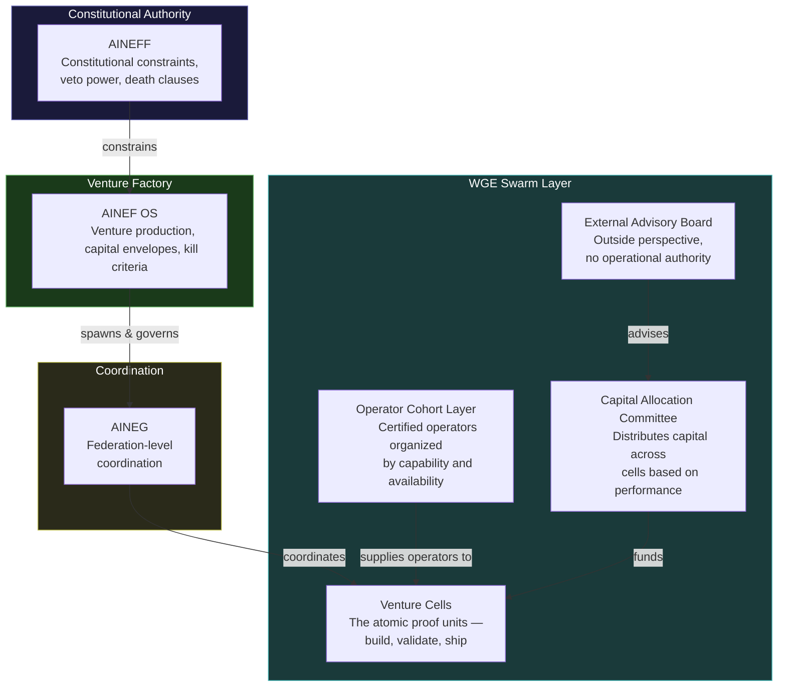
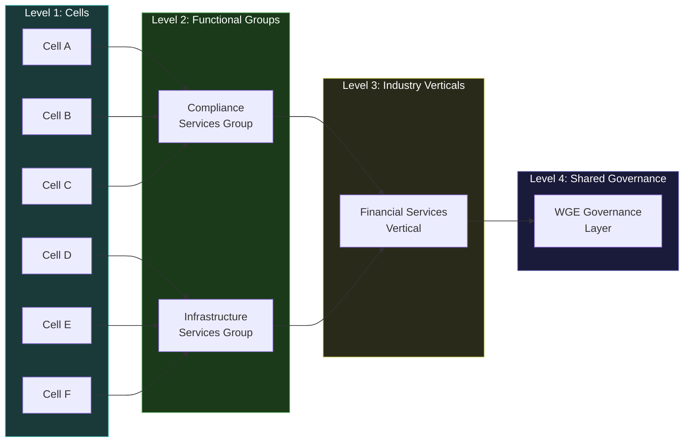
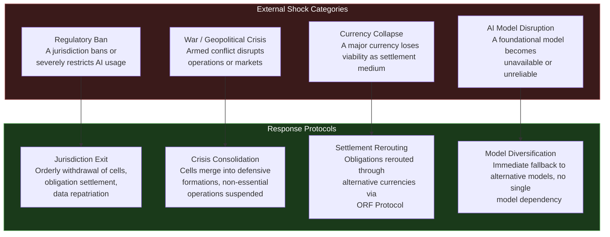

# Work Genesis Engine

The Work Genesis Engine (WGE) is the **swarm coordination layer** of the ecosystem. While AINEG coordinates at the federation level (across enterprises), WGE coordinates at the **cellular level** — orchestrating the self-organizing behavior of venture cells, operator cohorts, and capital allocation across the entire system.

**"Swarm"** in this context does not mean chaotic. It means: **a self-organizing network of entities with programmable mandates, where coordination emerges from rules rather than commands.**

---

## WGE Entity Architecture

The WGE operates through a layered architecture of entities, each with distinct authority and responsibility:

### Venture Cells — The Proof Units

Venture Cells are the **atomic units** of the swarm. Each cell is a small, self-contained team with a specific mandate, a capital envelope, and kill criteria. The cell's job is simple: **build something, validate it generates revenue, ship it — or die trying**.

Cells do not need permission to operate within their mandate. They need permission to exceed it.

### Operator Cohort Layer

Certified operators organized by capability, availability, and deployment history. When a Venture Cell needs talent, it draws from the Operator Cohort Layer — not from the open market. Every operator has been through [LevelUpMax](./levelupmax) certification.

### Capital Allocation Committee

Distributes capital across Venture Cells based on mandate compliance, revenue validation, and risk assessment. The committee does not pick winners based on charisma or pitch quality. It allocates capital based on **evidence**.

### External Advisory Board

Provides outside perspective to the Capital Allocation Committee. The advisory board has **zero operational authority** — it cannot direct cells, allocate capital, or override governance. It can only advise.

---

## Swarm Architecture

The WGE organizes the swarm through four levels of aggregation:

### Level 1: Cells

Individual Venture Cells operating autonomously within their mandates. Cells at this level do not need to coordinate — they operate independently, report their results, and either survive or die based on their own performance.

### Level 2: Functional Groups

Cells with related mandates aggregate into Functional Groups for resource sharing, knowledge pooling, and coordinated market positioning. A Functional Group is not a department — it is an **emergent coordination pattern** among cells that benefit from proximity.

### Level 3: Industry Verticals

Functional Groups serving the same industry aggregate into Industry Verticals. At this level, the swarm can present a coherent market face to an entire industry while maintaining internal cellular diversity.

### Level 4: Shared Governance

The WGE-level governance that applies across all cells, groups, and verticals. This is the thinnest possible governance layer — it handles only what cannot be handled at lower levels.

---

## Governance Fatigue Safeguards

Governance systems have a natural tendency to **accumulate rules**. Over time, well-intentioned policies stack up until the governance overhead exceeds the value of the governed activity. WGE implements explicit safeguards against this entropy:

### Annual Rule Pruning

Every year, the entire rule set is reviewed. Rules that have not been invoked, cited, or enforced in the past 12 months are candidates for elimination. The default is **remove** — rules must justify their continued existence.

### Maximum Rule Count

A hard ceiling on the total number of active governance rules at each level. When the ceiling is reached, adding a new rule requires removing an existing one. This forces prioritization.

| Level | Maximum Active Rules |
|---|---|
| Cell-level | 25 |
| Functional Group | 50 |
| Industry Vertical | 75 |
| WGE-wide | 100 |

### Protocol Simplification Triggers

When governance overhead (measured as time spent on compliance vs. time spent on production) exceeds defined thresholds, a simplification review is automatically triggered.

| Threshold | Action |
|---|---|
| Compliance time > 15% of production time | Advisory: Simplification recommended |
| Compliance time > 25% of production time | Mandatory: Simplification review within 30 days |
| Compliance time > 40% of production time | Emergency: Operations paused until governance is simplified |

### Rule Entropy Score

Every rule is assigned an entropy score that increases over time and decreases when the rule is actively used. High-entropy rules (old, unused, but still technically in force) are flagged for pruning. The entropy score makes governance debt visible before it becomes governance failure.

---

## External Shock Protocol

The swarm must survive shocks that no individual cell can anticipate. WGE defines response protocols for four categories of external shock:

### Regulatory Ban Response

When a jurisdiction bans or severely restricts AI usage:

1. **Immediate:** All cells in the affected jurisdiction cease client-facing operations
2. **48 hours:** Obligation settlement begins — all outstanding commitments are honored or transferred
3. **7 days:** Data repatriation — all data subject to the jurisdiction's rules is handled according to local law
4. **30 days:** Orderly withdrawal complete. Cells are either redeployed to other jurisdictions or terminated.
5. **Ongoing:** Monitoring for regulatory reversal. Re-entry protocols pre-defined.

### War / Geopolitical Crisis Response

1. **Immediate:** Safety of all operators is the first priority — all others are secondary
2. **24 hours:** Non-essential operations suspended. Essential services (those with active obligations to clients) enter maintenance mode
3. **7 days:** Crisis consolidation — cells merge into fewer, more resilient formations
4. **Ongoing:** Reduced operations until stability is restored

### Currency Collapse Response

1. **Immediate:** ORF Protocol activates settlement rerouting through alternative currencies
2. **48 hours:** All obligations denominated in the collapsed currency are redenominated according to pre-agreed conversion rules
3. **30 days:** Long-term settlement path established through stable currency alternatives

### AI Model Disruption Response

1. **Immediate:** Affected cells switch to fallback models. No cell may have a single-model dependency.
2. **48 hours:** Performance assessment of fallback models. Service level adjustments communicated to clients.
3. **7 days:** Long-term model diversification plan activated if disruption is structural rather than temporary.

---

## What "Swarm" Actually Means

The word "swarm" is often misunderstood as chaos. In the WGE context, a swarm is:

- **Self-organizing:** Cells form, merge, split, and dissolve based on mandate compliance and market feedback — not top-down commands
- **Programmable mandates:** Every cell's behavior is constrained by its mandate. The mandate is the program; the cell is the execution.
- **Emergent coordination:** Groups and verticals emerge from cell proximity and shared interest — they are not designed from the top down
- **Resilient to loss:** The swarm can lose any individual cell, group, or vertical and continue operating. There is no single point of failure.
- **Governed at every level:** Self-organization does not mean ungoverned. Every cell, group, and vertical operates within constitutional constraints from AINEFF.

The swarm is what happens when you give autonomous units clear rules, hard boundaries, and the freedom to operate within those boundaries. The result is not chaos — it is **order that does not require a central controller**.
