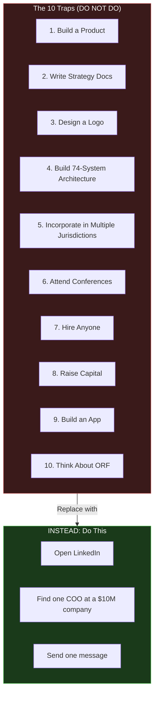
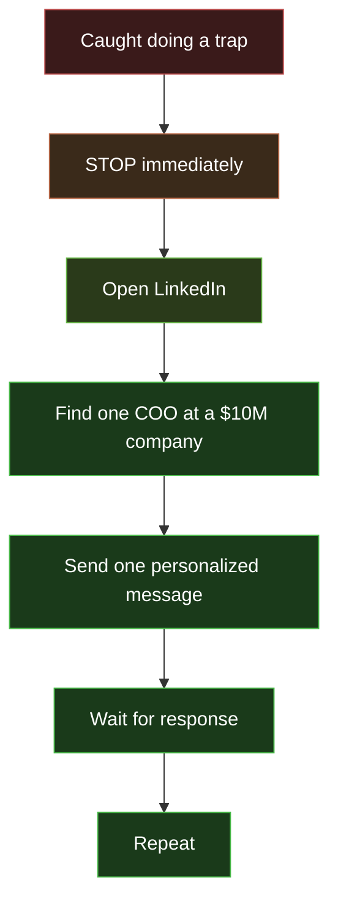

---

sidebar_position: 11
slug: 10-traps
title: "The 10 Traps"
description: "10 things NOT to do until $50K in monthly revenue — the most common forms of productive procrastination that kill early-stage ecosystems."
tags: [execution, operational, risk]
custom_status: active
custom_owner: Andrew Leo
custom_last_review: 2026-03-01
custom_next_review: 2026-06-01
---

# The 10 Traps

These are the 10 most seductive forms of productive procrastination available to a founder with a massive strategic vision and no revenue. Each one feels like progress. None of them generate revenue. All of them will kill the ecosystem if pursued before $50K/month.

**Do not do ANY of these until $50K/month in revenue.**

---

## The Traps at a Glance

---

## Trap 1: Build a Product

**The seduction:** "If I build it, they will come. I just need to get the MVP out and users will appear."

**The reality:** Nobody is waiting for your product. Nobody knows it exists. Nobody cares about your feature set. Products without customers are liabilities, not assets.

| What You Think Happens | What Actually Happens |
|---|---|
| Build product -> Users appear -> Revenue follows | Build product -> Silence -> Rebuild product -> Silence -> Panic |
| "The product will sell itself" | Nothing sells itself. Ever. |
| "I just need to add one more feature" | The next feature will not help either |

**What to do instead:** Sell the outcome manually. Deliver the Chokepoint Sprint by hand. When 10 clients are paying for the manual version, THEN build the product to automate what you already know works.

**Revenue impact of doing this trap:** $0. Months of work. Zero validation.

---

## Trap 2: Write Strategy Documents

**The seduction:** "I need to think this through more carefully. Let me write a comprehensive strategy document."

**The reality:** You already have 535,856+ lines of strategy. Writing more strategy is the most sophisticated form of procrastination available. It feels intellectual. It feels productive. It is neither.

| Metric | Strategy Writing | One Sales Conversation |
|---|---|---|
| Revenue generated | $0 | $0-$15,000 |
| Customer insight gained | 0 | Multiple data points |
| Validation of assumptions | None | Direct market feedback |
| Emotional satisfaction | High (dangerous) | Moderate (useful) |

**What to do instead:** Apply Rule 7. No theory without executable output within 48 hours. If a strategy session does not produce a phone call, it was a waste.

---

## Trap 3: Design a Logo

**The seduction:** "First impressions matter. I need a professional brand identity before I can approach clients."

**The reality:** No one has ever declined a $10,000 consulting engagement because of a logo. No one. In the history of B2B sales. Ever.

| What Clients Care About | What Clients Do Not Care About |
|---|---|
| "Can you solve my problem?" | Your color palette |
| "What results have you delivered?" | Your font choice |
| "How quickly can you start?" | Your brand guidelines |
| "What does this cost?" | Whether your logo is an acronym or a symbol |

**What to do instead:** Use your name. Use a simple text logo generated in 5 minutes. Spend zero dollars and zero hours on branding until revenue exceeds $50K/month.

---

## Trap 4: Build the 74-System Architecture

**The seduction:** "The 7-layer control model needs 74 interconnected systems. I should start designing them now so the architecture is ready when we scale."

**The reality:** 73 of those 74 systems are not needed for years. Designing them now is architecture tourism -- visiting places you will not live in for a decade.

| System | When Actually Needed | Years Away |
|---|---|---|
| ORF (Obligation Resolution Framework) | Phase 5+ | 2-3 years |
| PIAR (Inter-Agent Routing Protocol) | Phase 4+ | 1-2 years |
| Identity Infrastructure | Phase 4+ | 1-2 years |
| Marketplace | Phase 4+ | 1 year |
| Governance Protocol | Phase 3+ | 6-9 months |
| **DocuFlow MVP** | **Phase 1** | **NOW** |

**What to do instead:** Build only what Phase 1 requires. DocuFlow MVP. A landing page. A proposal template. That is the entire technology stack needed to generate $50K/month.

---

## Trap 5: Incorporate in Multiple Jurisdictions

**The seduction:** "The ecosystem spans Singapore, UAE, India, Brazil, EU, Japan, and the US. I should set up entities now for tax optimization and global operations."

**The reality:** You have zero customers. Multi-jurisdiction incorporation costs $10,000-50,000 in legal fees. You have $1,000.

| Action | Cost | Revenue Impact |
|---|---|---|
| Incorporate in 7 jurisdictions | $50,000+ | $0 |
| Register one LLC in your home jurisdiction | $100-500 | Enables invoicing |

**What to do instead:** Register one entity. The simplest, cheapest entity type available in your jurisdiction. Everything else waits until revenue demands it.

---

## Trap 6: Attend Conferences

**The seduction:** "I need to network. I need to be visible. I need to meet potential clients and partners at industry events."

**The reality:** Conferences cost $500-5,000 per event (travel, registration, accommodation). They produce business cards, not deals. The ROI is measurable: almost always negative for pre-revenue founders.

| Conference Outcome | Probability |
|---|---|
| Collect 50 business cards | 90% |
| Have 3 meaningful conversations | 60% |
| Get 1 follow-up meeting | 30% |
| Close 1 deal from conference | 5% |
| Close 1 deal from 20 LinkedIn messages | 15-25% |

**What to do instead:** The same number of meaningful conversations costs $0 on LinkedIn and takes one afternoon instead of three days.

---

## Trap 7: Hire Anyone

**The seduction:** "I need help. I cannot do everything alone. Let me hire a developer / marketer / sales person / assistant."

**The reality:** Hiring before product-market fit means you are paying someone to help you do the wrong thing faster. Hiring before automation means you are paying a human to do what an agent could do for 1/100th the cost.

| Hire | Annual Cost | What They Actually Do Pre-Revenue |
|---|---|---|
| Developer | $80,000-150,000 | Build features nobody uses |
| Marketer | $60,000-100,000 | Market a product nobody wants |
| Sales person | $60,000-120,000 | Sell something the founder cannot sell |
| Assistant | $40,000-60,000 | Organize the chaos of doing too many things |

**What to do instead:** Rule 3: No hiring before agent automation. Deploy agents first. Automate everything automatable. Recruit operators on revenue share (zero fixed cost). Hire only when revenue demands capacity that agents and operators cannot provide.

---

## Trap 8: Raise Capital

**The seduction:** "With $500K in funding, I could move 10x faster. I just need to build a pitch deck and talk to investors."

**The reality:** Fundraising takes 3-6 months of full-time effort for pre-revenue companies. During that time, you are not selling, not delivering, and not learning. Even if successful, the capital creates pressure to scale before you have something worth scaling.

| With Capital, No PMF | Without Capital, With PMF |
|---|---|
| Scale the wrong thing faster | Scale the right thing methodically |
| Investor reporting takes 20% of time | All time goes to customers |
| Pressure to show hockey stick growth | Growth matches reality |
| Misaligned incentives | Perfect alignment: revenue = validation |

**What to do instead:** Rule 4: No fundraising before sustainable revenue. Close one more deal. Then another. When you have $50K/month, investors will find YOU.

---

## Trap 9: Build an App

**The seduction:** "The ecosystem needs a mobile app / web app / desktop app. Users expect a polished interface."

**The reality:** Apps take 3-6 months to build properly. During that time, revenue is $0. The app will need to be rebuilt 3 times before it matches what the market actually wants. Building an app before understanding the market is the most expensive form of guessing.

| Action | Time | Cost | Revenue |
|---|---|---|---|
| Build app from vision | 3-6 months | $10K-100K | $0 |
| Deliver service manually | 5-10 days | $0 | $5-15K per engagement |
| Build app from proven manual process | 2-4 weeks | $1-5K | Based on proven demand |

**What to do instead:** Deliver everything manually first. Use spreadsheets. Use email. Use phone calls. When you have done it 10 times manually, you will know exactly what to automate. Build the app then.

---

## Trap 10: Think About ORF

**The seduction:** "The Obligation Resolution Framework is the core of the ecosystem. I should start designing the protocol, the data models, the governance structure..."

**The reality:** ORF is Phase 5+. That is Year 2 at the earliest. Thinking about ORF now is like designing the penthouse before pouring the foundation. It is intellectually stimulating. It is strategically irrelevant.

| ORF Work Now | ORF Work at Phase 5 |
|---|---|
| Based on theory and vision | Based on 100+ client engagements |
| No data to inform design | Rich data from real operations |
| No revenue to fund development | $200K+/month funding development |
| No clients to validate | Clients requesting the capability |
| No regulatory context | Regulatory relationships established |

**What to do instead:** Close the ORF document. You will open it again in 18 months. It will be better because you will know infinitely more about what the market actually needs.

---

## The Antidote

Every time you catch yourself doing any of the 10 traps, execute this protocol:

---

## The Trap Test

Before starting any new activity, ask:

1. **"Will this generate revenue in the next 90 days?"** If no, it is a trap.
2. **"Has a customer asked for this?"** If no, it is a trap.
3. **"Could I spend this time on a conversation instead?"** If yes, it is a trap.
4. **"Am I doing this because it is comfortable?"** If yes, it is definitely a trap.

---

## The Bottom Line

> **Open LinkedIn. Find one COO at a $10M company. Send one message.**
>
> **Everything else is procrastination.**
>
> **Everything. Else.**
