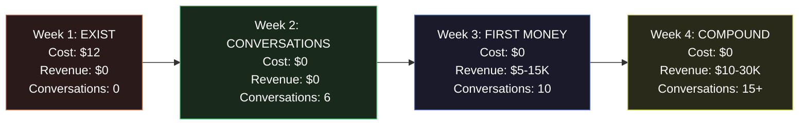

# 30-Day Action Plan

This is the most granular execution document in the ecosystem. It covers every day of the first 30 days with $1,000 starting capital. There are no abstractions here -- only actions, costs, and outcomes.

---

## 30-Day Overview

| Metric | Day 1 | Day 7 | Day 14 | Day 21 | Day 30 |
|---|---|---|---|---|---|
| **Capital Spent** | $0 | $12 | $12 | $12 | $12 |
| **Capital Remaining** | $1,000 | $988 | $988 | $988 | $988 |
| **Revenue** | $0 | $0 | $0 | $5-15K | $10-30K |
| **Conversations** | 0 | 0 | 6 | 10 | 15+ |
| **Deals Closed** | 0 | 0 | 0 | 1 | 2 |
| **Proposals Sent** | 0 | 0 | 2 | 4 | 5+ |

---

## Week 1: EXIST (Days 1-7)

**Objective:** Go from invisible to findable. Spend as little as possible.

**Cost Budget:** $12 | **Revenue Target:** $0

### Day 1 (Monday): Register Domain

| Task | Detail | Cost | Time |
|---|---|---|---|
| Register domain name | Use Namecheap or Cloudflare Registrar | $10 | 15 min |
| Set up professional email | Use Zoho Mail free tier or domain forwarding | $0 | 30 min |
| Set up Google Workspace (optional) | Only if free tier insufficient | $0 | 15 min |

**Deliverable:** Professional email address active (you@yourdomain.com).

**Decision Required:** Domain name. Keep it simple, professional, memorable.

---

### Day 2 (Tuesday): Build Landing Page

| Task | Detail | Cost | Time |
|---|---|---|---|
| Sign up for Carrd.co | Single-page website builder | $0-12/yr | 10 min |
| Build landing page | Headline, value prop, CTA, contact form | $0 | 2-3 hrs |
| Connect domain | Point DNS to Carrd | $0 | 30 min |

**Landing page must include:**
- Headline: "We find your biggest operational bottleneck in 5 days"
- 3 bullet points of value
- Clear CTA: "Book a 15-minute call"
- Calendly or Cal.com link (free tier)
- Professional headshot or logo (optional)

**Deliverable:** Live website at yourdomain.com.

---

### Day 3 (Wednesday): LinkedIn Foundation

| Task | Detail | Cost | Time |
|---|---|---|---|
| Rewrite LinkedIn headline | "[Industry] Operations Bottleneck Specialist" | $0 | 30 min |
| Update LinkedIn summary | Problem-focused, not credential-focused | $0 | 1 hr |
| Add featured section | Link to landing page, any relevant content | $0 | 30 min |
| Identify first 25 prospects | COOs and Founders at $5-50M companies | $0 | 2 hrs |

**Deliverable:** Optimized LinkedIn profile. 25-name prospect list.

---

### Day 4 (Thursday): Prospect Research

| Task | Detail | Cost | Time |
|---|---|---|---|
| Research 25 prospects | Company size, industry, pain signals | $0 | 3 hrs |
| Write personalized connection messages | One message per prospect, referencing specific pain | $0 | 2 hrs |
| Send first 10 connection requests | Personalized, not templated | $0 | 1 hr |

**Deliverable:** 10 connection requests sent with personalized messages.

---

### Day 5 (Friday): Content & Outreach

| Task | Detail | Cost | Time |
|---|---|---|---|
| Write first LinkedIn post | Share an operational insight, not a sales pitch | $0 | 1 hr |
| Send 5 more connection requests | Total: 15 outbound | $0 | 30 min |
| Research 25 more prospects | Total: 50 on master list | $0 | 2 hrs |

**Deliverable:** First content published. 15 outbound messages sent.

---

### Day 6 (Saturday): Pipeline Setup

| Task | Detail | Cost | Time |
|---|---|---|---|
| Set up CRM | Use free tool (HubSpot Free, Notion, or spreadsheet) | $0 | 1 hr |
| Log all 15 prospects in CRM | Status, notes, next action | $0 | 1 hr |
| Send 10 more connection requests | Total: 25 outbound | $0 | 1 hr |

**Deliverable:** CRM active. 25 prospects in pipeline.

---

### Day 7 (Sunday): Week 1 Review

| Task | Detail | Cost | Time |
|---|---|---|---|
| Review connection acceptance rate | Target: &gt;30% accepted | $0 | 30 min |
| Adjust messaging if acceptance &lt;20% | Rewrite approach | $0 | 1 hr |
| Plan Week 2 call schedule | Block calendar for discovery calls | $0 | 30 min |

**Week 1 Summary:**

| Metric | Target | Kill Signal |
|---|---|---|
| Domain + Website | Live | Not live by Day 3 |
| LinkedIn Profile | Optimized | Not updated by Day 3 |
| Outbound Messages | 25 | &lt;10 |
| Connection Acceptance | &gt;30% | &lt;10% |
| Capital Spent | $12 | &gt;$50 |

---

## Week 2: CONVERSATIONS (Days 8-14)

**Objective:** Have 6 real conversations. Listen. Quantify pain.

**Cost Budget:** $0 | **Revenue Target:** $0 | **Conversation Target:** 6

### Day 8 (Monday): First Content Push

| Task | Detail | Time |
|---|---|---|
| Write LinkedIn post about operational waste | Focus on quantified cost of inefficiency | 1 hr |
| Respond to all connection acceptances with conversation request | "Thanks for connecting. Quick question..." | 1 hr |
| Send 10 new connection requests | Total: 35 outbound | 1 hr |

---

### Day 9 (Tuesday): First Discovery Call

| Task | Detail | Time |
|---|---|---|
| **DISCOVERY CALL 1** | 30 min. Ask about #1 operational bottleneck | 30 min |
| Post-call notes | Pain point, quantified impact, next step | 15 min |
| Follow-up research on prospect's industry | Prepare for potential proposal | 1 hr |
| Send 5 more connection requests | 40 total outbound | 30 min |

**Discovery Call Framework:**
1. "What is the single biggest operational issue costing you right now?" (Listen 80%)
2. "How much does that cost you per month in revenue, time, or risk?"
3. "Have you tried to solve it? What happened?"
4. "If I could identify the root cause in 5 days, would that be worth exploring?"

---

### Day 10 (Wednesday): Calls 2 & 3

| Task | Detail | Time |
|---|---|---|
| **DISCOVERY CALL 2** | Same framework, different prospect | 30 min |
| **DISCOVERY CALL 3** | Same framework, different prospect | 30 min |
| Post-call notes for both | Pain patterns emerging | 30 min |
| Refine pitch based on feedback | What resonates vs. what falls flat | 1 hr |

---

### Day 11 (Thursday): Call 4 + Pattern Analysis

| Task | Detail | Time |
|---|---|---|
| **DISCOVERY CALL 4** | Adjusted pitch based on learnings | 30 min |
| Analyze patterns across 4 calls | Common pain, common language, common objections | 2 hrs |
| Draft proposal template | Based on actual pain expressed | 2 hrs |

---

### Day 12 (Friday): Calls 5 & 6 + First Proposals

| Task | Detail | Time |
|---|---|---|
| **DISCOVERY CALL 5** | Test refined positioning | 30 min |
| **DISCOVERY CALL 6** | Test refined positioning | 30 min |
| Draft 2 specific proposals | Customized for highest-probability prospects | 3 hrs |

**Proposal Structure:**
- Problem statement (in their words)
- Quantified cost of the problem (from their numbers)
- Proposed approach (Chokepoint Sprint: 5-10 days)
- Deliverable (3 identified bottlenecks with resolution paths)
- Investment ($5-15K based on company size)
- Guarantee (3x value or full refund)

---

### Day 13 (Saturday): Send Proposals

| Task | Detail | Time |
|---|---|---|
| Send Proposal 1 to warmest prospect | Include personal note referencing call | 30 min |
| Send Proposal 2 to second warmest | Include personal note | 30 min |
| Follow up with all non-responding connections | "Just checking in..." | 1 hr |

---

### Day 14 (Sunday): Week 2 Review

| Metric | Target | Kill Signal |
|---|---|---|
| Discovery Calls Completed | 6 | &lt;3 |
| Proposals Sent | 2 | 0 |
| Pain Points Quantified | 4+ | 0 quantified |
| Pipeline Value | $10-30K | $0 |
| Capital Spent (cumulative) | $12 | &gt;$100 |

---

## Week 3: FIRST MONEY (Days 15-21)

**Objective:** Close the first deal. Collect payment. Deliver value.

**Cost Budget:** $0 | **Revenue Target:** $5-15K | **Conversation Target:** 10 cumulative

### Day 15 (Monday): Follow Up + New Calls

| Task | Detail | Time |
|---|---|---|
| Follow up on Proposal 1 | Call or email, address objections | 30 min |
| Follow up on Proposal 2 | Same approach | 30 min |
| **DISCOVERY CALL 7** | New prospect, pipeline replenishment | 30 min |
| **DISCOVERY CALL 8** | New prospect | 30 min |

---

### Day 16 (Tuesday): Negotiate

| Task | Detail | Time |
|---|---|---|
| Negotiate Proposal 1 terms | Price, scope, timeline adjustments | 1 hr |
| Draft Proposal 3 (from new calls) | Third proposal in pipeline | 2 hrs |
| **DISCOVERY CALL 9** | Pipeline continues growing | 30 min |

---

### Day 17 (Wednesday): Push for Close

| Task | Detail | Time |
|---|---|---|
| Send revised Proposal 1 (if needed) | Final terms | 30 min |
| Send Proposal 3 | Third prospect | 30 min |
| **DISCOVERY CALL 10** | 10 total conversations reached | 30 min |
| LinkedIn post: industry insight | Maintain visibility | 1 hr |

---

### Day 18 (Thursday): Pre-Close

| Task | Detail | Time |
|---|---|---|
| Address final objections on Proposal 1 | Remove all friction | 1 hr |
| Prepare delivery plan | Ready to start immediately upon signing | 2 hrs |
| Follow up on Proposals 2 and 3 | Keep pipeline moving | 30 min |

---

### Day 19 (Friday): CLOSE FIRST DEAL

| Task | Detail | Time |
|---|---|---|
| **CLOSE FIRST DEAL** | Sign agreement, collect payment or deposit | 1 hr |
| Send invoice (if not prepaid) | Net-15 terms preferred | 15 min |
| Celebrate briefly. Then prepare. | 5 minutes of satisfaction. Then work. | 5 min |
| Plan delivery kickoff for Monday | Agenda, access requirements, timeline | 2 hrs |

---

### Day 20 (Saturday): Begin Delivery

| Task | Detail | Time |
|---|---|---|
| Delivery Day 1: Data collection and access | Client provides systems access, data | 4 hrs |
| Document initial findings | Early signal on bottlenecks | 1 hr |

---

### Day 21 (Sunday): Week 3 Review

| Metric | Target | Kill Signal |
|---|---|---|
| Deals Closed | 1 | 0 (CRITICAL -- revisit everything) |
| Revenue (invoiced or collected) | $5-15K | $0 |
| Proposals in Pipeline | 2+ remaining | 0 |
| Conversations Total | 10 | &lt;6 |
| Delivery Started | Yes | No deal to deliver |

---

## Week 4: COMPOUND (Days 22-30)

**Objective:** Deliver first engagement. Close second deal. Build case study. Set up retainer.

**Cost Budget:** $0 | **Revenue Target:** $10-30K cumulative | **Conversation Target:** 15+

### Day 22 (Monday): Present First Findings

| Task | Detail | Time |
|---|---|---|
| Delivery Day 2-3: Deep analysis | Map chokepoints with quantified impact | 6 hrs |
| Present interim findings to client | Show early value, build confidence | 1 hr |

---

### Day 23 (Tuesday): Close Second Deal

| Task | Detail | Time |
|---|---|---|
| Continue delivery on Deal 1 | Day 4 of analysis | 4 hrs |
| **CLOSE SECOND DEAL** (from Proposal 2 or 3) | Sign and invoice | 1 hr |
| 2 new discovery calls (#11, #12) | Pipeline never stops | 1 hr |

---

### Day 24-25 (Wed-Thu): Deliver + Document

| Task | Detail | Time |
|---|---|---|
| Complete first engagement delivery | Final report with 3 chokepoints identified | 8 hrs |
| Present findings to client | Quantified impact, resolution paths | 1 hr |
| Request testimonial and case study permission | Social proof | 15 min |
| Collect payment (if not already collected) | Confirm bank deposit | 15 min |

---

### Day 26-27 (Fri-Sat): New Prospects + Case Study

| Task | Detail | Time |
|---|---|---|
| Write case study from first engagement | Problem, approach, results, testimonial | 3 hrs |
| Publish case study on LinkedIn | Content marketing begins | 30 min |
| 3 new discovery calls (#13, #14, #15) | 15 conversations total | 1.5 hrs |
| Draft 2 new proposals | Pipeline for Week 5+ | 3 hrs |

---

### Day 28 (Sunday): Propose Retainer

| Task | Detail | Time |
|---|---|---|
| Propose ongoing retainer to first client | Monthly operational review, $3-5K/mo | 1 hr |
| Begin delivery on Deal 2 | Second engagement kickoff | 3 hrs |
| Follow up on new proposals | Keep pipeline moving | 30 min |

---

### Day 29-30 (Mon-Tue): Revenue Review

| Task | Detail | Time |
|---|---|---|
| Complete Week 4, full financial review | Revenue, costs, margin, pipeline | 2 hrs |
| Update KPI dashboard | All 12 KPIs current | 1 hr |
| Plan Month 2 based on learnings | Adjust strategy based on data | 2 hrs |
| Send 10 more outbound messages | Pipeline for Month 2 | 1 hr |

---

## 30-Day Final Scorecard

| Metric | Target | Stretch | Kill Signal |
|---|---|---|---|
| Revenue (collected) | $5-15K | $20K+ | $0 |
| Revenue (invoiced) | $10-30K | $35K+ | $0 |
| Deals Closed | 2 | 3 | 0 |
| Conversations | 15 | 20 | &lt;6 |
| Proposals Sent | 5 | 7 | &lt;2 |
| Close Rate | 40% | 50%+ | 0% |
| Case Studies | 1 | 2 | 0 |
| Retainer Proposed | 1 | 2 | 0 |
| Capital Spent | $12 | $12 | &gt;$200 |
| Capital Remaining | $988+ revenue | $988+ revenue | &lt;$800 with no revenue |

---

## Tools & Resources Budget

| Tool | Purpose | Cost | Required By |
|---|---|---|---|
| Domain registration | Professional web presence | $10/year | Day 1 |
| Carrd.co | Landing page builder | $0-12/year | Day 2 |
| Cal.com or Calendly | Meeting scheduling | $0 (free tier) | Day 2 |
| LinkedIn | Prospecting and content | $0 (free tier) | Day 3 |
| Zoom or Google Meet | Discovery calls | $0 (free tier) | Day 9 |
| HubSpot CRM or Notion | Pipeline tracking | $0 (free tier) | Day 6 |
| Google Workspace | Email and docs | $0-7/month | Day 1 |
| Stripe or PayPal | Payment collection | $0 (% per transaction) | Day 19 |
| **Total Fixed Cost** | | **$10-22** | |

**Remaining capital after Month 1:** $978-988 + revenue collected.

> The entire first month costs less than a single business lunch. There is no capital excuse for not executing.
