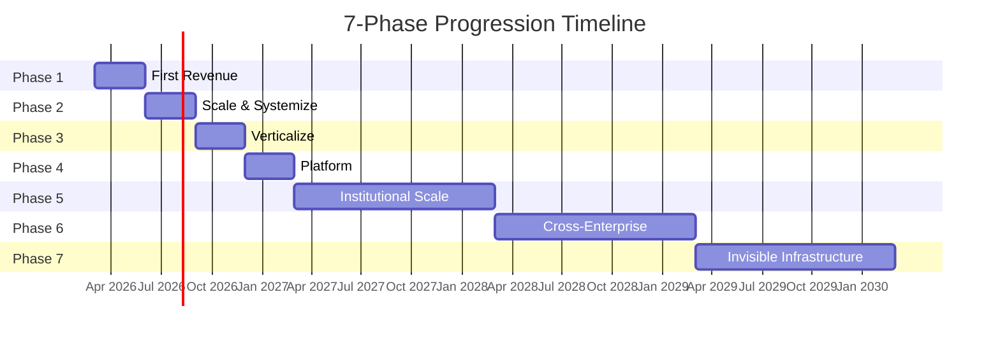

---

sidebar_position: 2
slug: 7-phases
title: "7-Phase Progression"
description: "The complete 7-phase execution plan from $0 to $400K+/month — entry conditions, exit criteria, kill triggers, revenue targets, and success probability for each phase."
tags: [execution, operational, strategic]
custom_status: active
custom_owner: Andrew Leo
custom_last_review: 2026-03-01
custom_next_review: 2026-06-01
---

# 7-Phase Progression

The AINEFF Ecosystem progresses through seven sequential phases, each with explicit entry conditions, exit criteria, kill triggers, and revenue targets. **No phase may be skipped.** Each phase creates the foundation, data, and revenue required to enter the next.

---

## Phase Overview

| Phase | Timeline | Revenue Target | Success Probability | Key Milestone |
|---|---|---|---|---|
| **Phase 1** | Months 1-3 | $5-15K/mo | 72% | First paying customer |
| **Phase 2** | Months 4-6 | $15-30K/mo | 58% | 100+ users, operator track |
| **Phase 3** | Months 7-9 | $30-50K/mo | 45% | Vertical dominance |
| **Phase 4** | Months 10-12 | $50-100K/mo | 35% | Marketplace launch |
| **Phase 5** | Year 2 | $200K/mo | 25% | Institutional contracts |
| **Phase 6** | Year 3 | $300K/mo | 18% | Cross-enterprise protocol |
| **Phase 7** | Year 3+ | $400K+/mo | 12% | Infrastructure status |

---

## Phase 1: First Revenue (Months 1-3)

**Objective:** Prove that someone will pay money for what the ecosystem delivers.

### Entry Conditions

- Founder available full-time
- $1,000 minimum starting capital
- Domain registered, landing page live
- LinkedIn profile optimized for consulting

### Core Activities

| Week | Activity | Deliverable |
|---|---|---|
| 1-2 | Legal setup, website, LinkedIn outreach | Entity registered, site live, 10 conversations initiated |
| 3-4 | Discovery calls, pain mapping, proposals | 3 proposals delivered, first deal closed |
| 5-8 | Delivery, DocuFlow MVP build, more outreach | First revenue collected, MVP with 5 beta users |
| 9-13 | Repeat deals, refine positioning, case studies | 3+ deals closed, $15K/mo revenue |

### Products Active

| Product | Status | Revenue Model |
|---|---|---|
| **Chokepoint Sprint** | Primary revenue driver | $5-15K per engagement, 5-10 day delivery |
| **Billing Leakage Audit** | Secondary revenue | $3-8K per engagement |
| **DocuFlow MVP** | Beta / free-to-low-cost | Freemium, converting to $49-199/mo |

### Exit Criteria (ALL must be met)

- [ ] $5K+ monthly recurring or equivalent pipeline
- [ ] 3+ paying customers
- [ ] At least 1 repeat customer or referral
- [ ] DocuFlow MVP live with 10+ users
- [ ] Documented sales playbook (what works, what does not)

### Kill Triggers

| Trigger | Threshold | Action |
|---|---|---|
| Zero revenue by Day 60 | $0 collected | Pivot positioning or target vertical |
| Zero conversations by Day 21 | 0 discovery calls | Abandon current outreach channel, try new one |
| Negative feedback on all proposals | 100% rejection | Restructure offer entirely |
| Capital exhaustion | &lt;$100 remaining | Emergency consulting gig, any vertical |

### Success Probability: 72%

Primary risk: founder spends time on architecture instead of conversations. Mitigation: daily conversation quota.

---

## Phase 2: Scale & Systemize (Months 4-6)

**Objective:** Move from founder-dependent sales to repeatable, systematized revenue.

### Entry Conditions

- Phase 1 exit criteria met
- $5K+/mo revenue
- 3+ paying customers
- Documented sales playbook

### Core Activities

| Month | Activity | Deliverable |
|---|---|---|
| 4 | DocuFlow to 50+ users, first enterprise conversation | Enterprise pilot proposal, user growth metrics |
| 5 | Operator recruitment (1-2), process documentation | First operator delivering independently |
| 6 | Enterprise deal close, systemize delivery | $30K/mo revenue, 100+ DocuFlow users |

### Products Active

| Product | Status | Revenue Model |
|---|---|---|
| **Chokepoint Sprint** | Systematized, operator-deliverable | $10-25K per engagement |
| **DocuFlow** | 100+ users, paid tier live | $99-299/mo per team |
| **Operator Track** | 1-2 operators in training | Revenue share model |
| **Enterprise Diagnostics** | First engagement | $25-50K per engagement |

### Exit Criteria

- [ ] $15K+ monthly recurring revenue
- [ ] 100+ DocuFlow active users
- [ ] 1+ operator delivering independently
- [ ] 1+ enterprise client engaged
- [ ] Gross margin above 70%

### Kill Triggers

| Trigger | Threshold | Action |
|---|---|---|
| Revenue plateau at Phase 1 levels | No growth for 60 days | Diagnose: pricing, positioning, or market |
| DocuFlow user churn &gt;20%/mo | Losing users faster than gaining | Product pivot or feature overhaul |
| Operator failure rate &gt;50% | Operators cannot deliver quality | Restructure training, simplify delivery |

### Success Probability: 58%

Primary risk: premature enterprise focus before SMB base is solid. Mitigation: enterprise is additive, not primary.

---

## Phase 3: Verticalize (Months 7-9)

**Objective:** Achieve dominance in one vertical before expanding horizontally.

### Entry Conditions

- Phase 2 exit criteria met
- $15K+/mo revenue
- Clear vertical signal from customer data
- Operator delivery proven

### Core Activities

| Month | Activity | Deliverable |
|---|---|---|
| 7 | Vertical deep-dive (insurance claims or similar) | Vertical-specific product variant |
| 8 | Copilot integration, governance module | AI-assisted delivery, compliance framework |
| 9 | Vertical case studies, conference presence | Recognized vertical authority, $50K/mo |

### Products Active

| Product | Status | Revenue Model |
|---|---|---|
| **Vertical Chokepoint Sprint** | Industry-specific methodology | $15-30K per engagement |
| **DocuFlow Vertical Edition** | Industry-specific workflows | $199-499/mo per team |
| **Governance Module** | Compliance-as-a-service | $5-15K/mo per enterprise |
| **Copilot** | AI-assisted operations | Usage-based pricing |

### Exit Criteria

- [ ] $30K+ monthly revenue
- [ ] 60%+ revenue from primary vertical
- [ ] 3+ enterprise clients in vertical
- [ ] Published case studies with measurable outcomes
- [ ] Recognized authority in vertical (speaking, publishing)

### Kill Triggers

| Trigger | Threshold | Action |
|---|---|---|
| Vertical shows no concentration | Revenue spread across 5+ industries equally | Pick strongest signal, double down |
| Insurance/claims market unreceptive | Zero enterprise interest after 30 outbound | Switch vertical to next candidate |
| Governance compliance too complex | Regulatory requirements exceed capacity | Simplify scope, partner with compliance firm |

### Success Probability: 45%

Primary risk: wrong vertical selection. Mitigation: follow the data, not the vision.

---

## Phase 4: Platform (Months 10-12)

**Objective:** Transition from services company to platform company.

### Entry Conditions

- Phase 3 exit criteria met
- $30K+/mo revenue
- Vertical dominance demonstrated
- Sufficient data for platform features

### Core Activities

| Month | Activity | Deliverable |
|---|---|---|
| 10 | Marketplace architecture, identity system design | Marketplace MVP specification |
| 11 | PIAR (Protocol for Inter-Agent Routing) prototype | Agent-to-agent communication |
| 12 | Platform beta launch, first third-party integrations | $100K/mo revenue target |

### Products Active

| Product | Status | Revenue Model |
|---|---|---|
| **Marketplace** | Beta launch | Transaction fees (5-15%) |
| **Identity Infrastructure** | Foundation layer | Per-identity pricing |
| **PIAR** | Prototype | API usage pricing |
| **All Phase 1-3 Products** | Mature, operator-delivered | Continued revenue |

### Exit Criteria

- [ ] $50K+ monthly revenue
- [ ] Marketplace live with 5+ third-party listings
- [ ] Platform revenue &gt;10% of total
- [ ] Identity system operational
- [ ] 5+ operators active

### Kill Triggers

| Trigger | Threshold | Action |
|---|---|---|
| Platform revenue &lt;5% at Month 12 | Services still dominate | Remain a services company, defer platform |
| Marketplace zero adoption | No third-party interest | Kill marketplace, focus on vertical tools |
| PIAR technical failure | Cannot achieve reliable agent routing | Simplify to direct integrations |

### Success Probability: 35%

Primary risk: building platform before market demands it. Mitigation: only build what customers are requesting.

---

## Phase 5: Institutional Scale (Year 2)

**Objective:** Secure institutional contracts that provide predictable, large-scale revenue.

### Entry Conditions

- Phase 4 exit criteria met
- $50K+/mo revenue
- Platform operational
- Brand recognition in primary vertical

### Revenue Target: $200K/month

### Key Activities

- Enterprise contracts ($50-200K/year each)
- Insurance carrier partnerships
- Regulatory body engagement
- Operator network to 10+ active operators
- Cross-vertical expansion to second vertical

### Exit Criteria

- [ ] $200K+/mo revenue
- [ ] 3+ institutional contracts (&gt;$100K/year each)
- [ ] 2+ verticals active
- [ ] 10+ operators
- [ ] Platform revenue &gt;25% of total

### Success Probability: 25%

---

## Phase 6: Cross-Enterprise (Year 3)

**Objective:** Enable multi-enterprise coordination through protocol adoption.

### Entry Conditions

- Phase 5 exit criteria met
- $200K+/mo revenue
- Multiple verticals active
- Protocol layer functional

### Revenue Target: $300K/month

### Key Activities

- Cross-enterprise obligation routing
- Industry consortium engagement
- Standards body participation
- International expansion (Tier 1 countries)
- ORF (Obligation Resolution Framework) deployment

### Exit Criteria

- [ ] $300K+/mo revenue
- [ ] 2+ enterprises routing obligations through protocol
- [ ] International presence in 1+ market
- [ ] ORF processing live obligations
- [ ] Insurance carriers referencing standards

### Success Probability: 18%

---

## Phase 7: Invisible Infrastructure (Year 3+)

**Objective:** Become terrain. Become the substrate upon which enterprise coordination operates.

### Entry Conditions

- Phase 6 exit criteria met
- $300K+/mo revenue
- Cross-enterprise adoption proven
- Regulatory interest or mandate

### Revenue Target: $400K+/month (and accelerating)

### Key Activities

- Regulatory mandate pursuit
- GDP-scale obligation processing
- Full protocol stack deployment
- Autonomous governance operation
- Civilization-scale infrastructure status

### Exit Criteria

There are no exit criteria. Infrastructure does not exit.

### Success Probability: 12%

This probability is not discouraging -- it is honest. TCP/IP had similar odds in 1975. The probability compounds from the discipline of each preceding phase.

---

## Cumulative Revenue Trajectory

```mermaid
graph LR
    P1["Phase 1
    $5-15K/mo"] -->|"Exit: $15K/mo"| P2["Phase 2
    $15-30K/mo"]
    P2 -->|"Exit: $30K/mo"| P3["Phase 3
    $30-50K/mo"]
    P3 -->|"Exit: $50K/mo"| P4["Phase 4
    $50-100K/mo"]
    P4 -->|"Exit: $100K/mo"| P5["Phase 5
    $200K/mo"]
    P5 -->|"Exit: $200K/mo"| P6["Phase 6
    $300K/mo"]
    P6 -->|"Exit: $300K/mo"| P7["Phase 7
    $400K+/mo"]

    style P1 fill:#1a3a1a,stroke:#4aba4a,color:#fff
    style P2 fill:#1a3a2a,stroke:#4aba6a,color:#fff
    style P3 fill:#1a3a3a,stroke:#4ababa,color:#fff
    style P4 fill:#1a2a3a,stroke:#4a6aba,color:#fff
    style P5 fill:#2a1a3a,stroke:#6a4aba,color:#fff
    style P6 fill:#3a1a2a,stroke:#ba4a6a,color:#fff
    style P7 fill:#3a1a1a,stroke:#ba4a4a,color:#fff
```

---

## The Iron Law of Phase Progression

**You cannot buy your way to a later phase.** Raising $10M does not skip Phase 1. Having 535,000 lines of strategy does not skip Phase 1. Knowing the end-state architecture does not skip Phase 1.

Phase 1 is conversations and revenue. There are no shortcuts.

> Every phase exists to generate the **data, revenue, relationships, and credibility** that make the next phase possible. Skip one, and the entire structure collapses.
