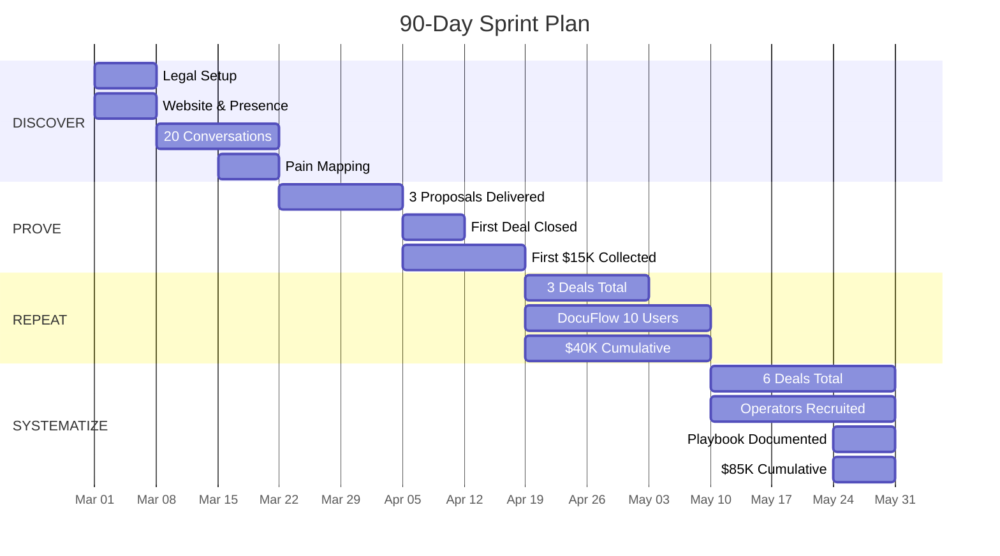
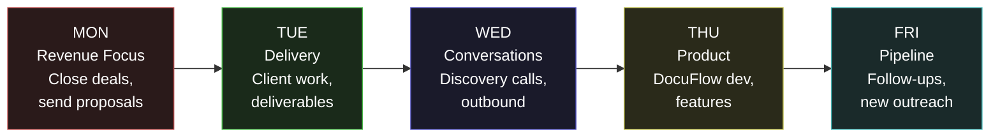

---

sidebar_position: 3
slug: 90-day-sprint
title: "90-Day Sprint Plan"
description: "Week-by-week execution plan for the first 90 days — from zero revenue to $85K cumulative, 6 deals closed, DocuFlow live, and operator playbook documented."
tags: [execution, operational, strategic]
custom_status: active
custom_owner: Andrew Leo
custom_last_review: 2026-03-01
custom_next_review: 2026-06-01
---

# 90-Day Sprint Plan

The first 90 days are the most important period in the ecosystem's history. Every subsequent phase depends on the revenue, data, and relationships generated here. This is not a plan for building a platform. This is a plan for **proving that someone will pay for what we deliver**.

---

## Sprint Overview

| Phase | Weeks | Cumulative Revenue | Conversations | Deals |
|---|---|---|---|---|
| **DISCOVER** | 1-3 | $0 | 20 | 0 |
| **PROVE** | 4-6 | $15K | 30 | 1-2 |
| **REPEAT** | 7-9 | $40K | 40 | 3 |
| **SYSTEMATIZE** | 10-13 | $85K | 50+ | 6 |

---

## Phase 1: DISCOVER (Weeks 1-3)

### Week 1: Foundation

**Theme:** Exist legally and digitally.

| Day | Activity | Deliverable | Success Metric |
|---|---|---|---|
| Mon | Register business entity (LLC or equivalent) | Entity registration filed | Filing confirmed |
| Tue | Register domain, set up email | Professional email active | Domain resolving |
| Wed | Build landing page (Carrd or equivalent, $12) | Landing page live | Page loads, CTA works |
| Thu | Optimize LinkedIn profile for consulting | Profile updated with value proposition | Profile complete |
| Fri | Identify 50 target prospects (COOs, Founders) | Prospect list in spreadsheet | 50 names with contact info |
| Sat | Send first 10 LinkedIn connection requests | 10 personalized messages sent | 10 messages in outbox |
| Sun | Research top 3 vertical pain points | Pain point document | 3 validated pain areas |

**Blockers:** Legal delays in entity registration. **Decision Required:** Entity type (LLC vs. sole prop).

**Revenue:** $0 | **Cost:** $12 | **Conversations:** 0

---

### Week 2: First Conversations

**Theme:** Talk to humans. Listen more than you speak.

| Day | Activity | Deliverable | Success Metric |
|---|---|---|---|
| Mon | Send 10 more connection requests | 20 total outbound | Acceptance rate &gt;30% |
| Tue | First discovery call | Call notes, pain points captured | 1 call completed |
| Wed | Second discovery call | Call notes, pain points captured | 2 calls completed |
| Thu | Third discovery call + refine pitch | Revised pitch based on feedback | 3 calls completed |
| Fri | Fourth and fifth discovery calls | Call notes, pattern recognition | 5 calls completed |
| Sat | Analyze call patterns, update prospect list | Pain pattern document | Patterns identified |
| Sun | Send 10 more outbound messages | 30 total outbound | Pipeline growing |

**Blockers:** Low response rate (&lt;10%). **Decision Required:** Adjust messaging or target different titles.

**Revenue:** $0 | **Cost:** $0 | **Conversations:** 5-7

---

### Week 3: Pain Mapping & Positioning

**Theme:** Convert conversations into patterns. Patterns into offers.

| Day | Activity | Deliverable | Success Metric |
|---|---|---|---|
| Mon | 2 more discovery calls | 7 total calls | Consistent pain themes |
| Tue | 2 more discovery calls | 9 total calls | Quantified pain ($X/month) |
| Wed | 2 more discovery calls | 11 total calls | 3+ prospects expressing interest |
| Thu | Map all pain points to service offerings | Pain-to-offer matrix | Clear service definitions |
| Fri | Draft first proposal template | Proposal template | Template ready for customization |
| Sat | 3 more calls or follow-ups | 14+ total conversations | 3+ warm prospects |
| Sun | Prepare 3 specific proposals | 3 proposals drafted | Ready to send Monday |

**Blockers:** Pain points too diverse to productize. **Decision Required:** Which pain point to lead with.

**Revenue:** $0 | **Cost:** $0 | **Conversations:** 14-20 | **Success Metric:** 3+ warm prospects ready for proposals

---

## Phase 2: PROVE (Weeks 4-6)

### Week 4: Proposals Out

**Theme:** Convert conversations into commitments.

| Day | Activity | Deliverable | Success Metric |
|---|---|---|---|
| Mon | Send Proposal 1 (highest probability) | Proposal delivered | Proposal opened |
| Tue | Send Proposal 2 | Proposal delivered | Proposal opened |
| Wed | Follow up on Proposal 1 + send Proposal 3 | 3 proposals in pipeline | Responses received |
| Thu | 3 new discovery calls | 17+ total conversations | Pipeline replenishing |
| Fri | Negotiate Proposal 1 terms | Terms sheet or counter-offer | Negotiation active |
| Sat | 2 more outbound conversations | 19+ total conversations | Pipeline growing |
| Sun | Prepare delivery plan for first deal | Delivery plan ready | Can start Monday if signed |

**Blockers:** Proposal objections (price, scope, timing). **Decision Required:** Discount strategy (if any).

**Revenue:** $0 (pipeline: $15-45K) | **Cost:** $0 | **Conversations:** 19-22

---

### Week 5: First Close

**Theme:** Close the first deal. Collect money.

| Day | Activity | Deliverable | Success Metric |
|---|---|---|---|
| Mon | **CLOSE FIRST DEAL** | Signed agreement | Money committed |
| Tue | Begin delivery (Chokepoint Sprint Day 1) | Kickoff completed | Client engaged |
| Wed | Delivery Day 2 + follow up on Proposals 2-3 | Progress on first delivery | Second deal advancing |
| Thu | Delivery Day 3 + 2 new calls | Interim findings | 22+ conversations |
| Fri | Delivery Day 4 + close Proposal 2 or 3 | Second deal possible | Two deals signed |
| Sat | Delivery Day 5 | First engagement milestone | Client satisfied |
| Sun | Document delivery process, capture learnings | Process document | Repeatable methodology |

**Blockers:** Client delays in providing access/data. **Decision Required:** Delivery methodology adjustments.

**Revenue:** $5-15K collected or invoiced | **Cost:** $0 | **Conversations:** 22-25

---

### Week 6: First Revenue Confirmed

**Theme:** Money in the bank. Refine and repeat.

| Day | Activity | Deliverable | Success Metric |
|---|---|---|---|
| Mon | Complete first delivery + present findings | Final deliverable to client | Client accepts findings |
| Tue | Collect payment + request testimonial | Payment received, testimonial request | **FIRST REVENUE** |
| Wed | Close second deal (or Proposal 3) | Second signed agreement | 2 deals closed |
| Thu | Begin second delivery | Kickoff completed | Revenue compounding |
| Fri | 3 new outbound conversations | 28+ total conversations | Pipeline for weeks 7-9 |
| Sat | Update financial tracking, KPI dashboard | Dashboard current | Clear revenue picture |
| Sun | Plan DocuFlow MVP sprint | MVP specification | Ready to build |

**Blockers:** Payment delays (net-30 terms). **Decision Required:** Payment terms policy (net-15 preferred).

**Revenue:** $10-15K cumulative | **Cost:** $0 | **Conversations:** 28-30

---

## Phase 3: REPEAT (Weeks 7-9)

### Week 7: Third Deal + DocuFlow

| Day | Activity | Deliverable | Success Metric |
|---|---|---|---|
| Mon-Tue | Close third deal | 3 deals total | Revenue diversifying |
| Wed-Thu | Begin DocuFlow MVP build (nights/weekends) | MVP sprint started | Technical progress |
| Fri-Sun | 5 new conversations, deliver engagement 2 | Pipeline and delivery parallel | 35+ conversations |

**Revenue:** $20-25K cumulative | **Conversations:** 35+

---

### Week 8: DocuFlow Beta

| Day | Activity | Deliverable | Success Metric |
|---|---|---|---|
| Mon-Wed | DocuFlow MVP core features complete | Functional prototype | Core workflow works |
| Thu-Fri | Invite 5 beta users from client network | 5 beta signups | Users onboarded |
| Sat-Sun | Fix critical bugs, 3 new conversations | Stable beta | 38+ conversations |

**Revenue:** $30-35K cumulative | **DocuFlow Users:** 5

---

### Week 9: Compound

| Day | Activity | Deliverable | Success Metric |
|---|---|---|---|
| Mon-Wed | DocuFlow to 10 users, 4th deal in pipeline | Growing product + pipeline | Dual revenue streams |
| Thu-Fri | Deliver engagement 3, request case study | Third delivery complete | Case study material |
| Sat-Sun | Write first case study, pipeline review | Published case study | Social proof created |

**Revenue:** $35-40K cumulative | **DocuFlow Users:** 10 | **Deals:** 3 closed, 1-2 in pipeline

---

## Phase 4: SYSTEMATIZE (Weeks 10-13)

### Week 10: Operator Recruitment

| Day | Activity | Deliverable | Success Metric |
|---|---|---|---|
| Mon-Wed | Identify and approach 3 potential operators | Operator candidates | 3 conversations |
| Thu-Fri | Close deals 4 and 5 | 5 deals total | Revenue accelerating |
| Sat-Sun | Document complete delivery playbook | Playbook v1.0 | Operator-ready process |

**Revenue:** $50-55K cumulative | **Conversations:** 42+

---

### Week 11: Operator Training

| Day | Activity | Deliverable | Success Metric |
|---|---|---|---|
| Mon-Wed | First operator shadows a delivery | Operator training started | Operator understands process |
| Thu-Fri | DocuFlow to 15+ users, feature improvements | Growing product | User retention &gt;80% |
| Sat-Sun | 5 new outbound conversations | 47+ total conversations | Pipeline for months 4-6 |

**Revenue:** $60-65K cumulative | **Operators:** 1 in training

---

### Week 12: First Operator Delivery

| Day | Activity | Deliverable | Success Metric |
|---|---|---|---|
| Mon-Wed | Operator delivers first engagement (supervised) | Operator-led delivery | Quality maintained |
| Thu-Fri | Close deal 6 | 6 deals total | Revenue target in sight |
| Sat-Sun | Refine playbook based on operator feedback | Playbook v1.1 | Improved methodology |

**Revenue:** $75-80K cumulative | **Operators:** 1 delivering

---

### Week 13: Sprint Review

| Day | Activity | Deliverable | Success Metric |
|---|---|---|---|
| Mon-Tue | Complete all open deliveries | All engagements delivered | 100% delivery rate |
| Wed | Full financial review and KPI assessment | Financial dashboard | $85K+ cumulative |
| Thu | 90-day retrospective: what worked, what failed | Retrospective document | Honest assessment |
| Fri | Phase 2 (Scale & Systemize) planning | Phase 2 plan | Ready for months 4-6 |
| Sat-Sun | Rest. Recharge. Reflect. | Founder wellbeing | Sustainable pace set |

**Revenue:** $80-85K cumulative | **Deals:** 6 | **DocuFlow Users:** 15-20 | **Operators:** 1

---

## 90-Day Success Metrics Summary

| Metric | Target | Kill Threshold | Measurement |
|---|---|---|---|
| Cumulative Revenue | $85K | &lt;$15K | Bank deposits |
| Deals Closed | 6 | &lt;2 | Signed agreements |
| Conversations | 50+ | &lt;20 | Call log |
| DocuFlow Users | 15-20 | &lt;5 | Active accounts |
| Operators | 1 trained | 0 approached | Operator pipeline |
| Client Retention | 100% (2+ engage again) | 0% repeat | Repeat business |
| Case Studies | 2+ published | 0 | Published content |
| Gross Margin | &gt;75% | &lt;50% | Revenue minus direct costs |

---

## Decision Log

Key decisions that must be made during the sprint:

| Decision | Deadline | Options | Impact |
|---|---|---|---|
| Entity type | Week 1 | LLC / Sole Prop / Corp | Legal liability, tax treatment |
| Lead vertical | Week 3 | Insurance / Healthcare / Financial Services / Other | All positioning and content |
| Pricing model | Week 4 | Fixed fee / Value-based / Retainer | Revenue per deal |
| Payment terms | Week 5 | Net-15 / Net-30 / Upfront | Cash flow timing |
| DocuFlow pricing | Week 7 | Freemium / Paid-only / Trial | User growth vs. revenue |
| Operator model | Week 10 | Revenue share / Salary / Contract | Margin and scalability |

---

## Weekly Rhythm During Sprint

> **The 90-day sprint is not about building a company. It is about proving that value can be exchanged for money.** Everything else -- the platform, the protocol, the infrastructure -- waits until this proof exists.
