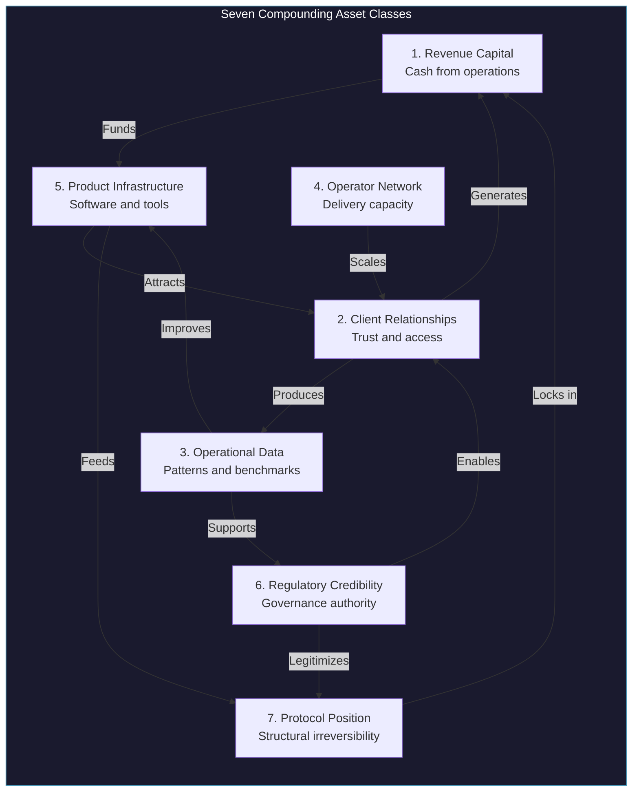
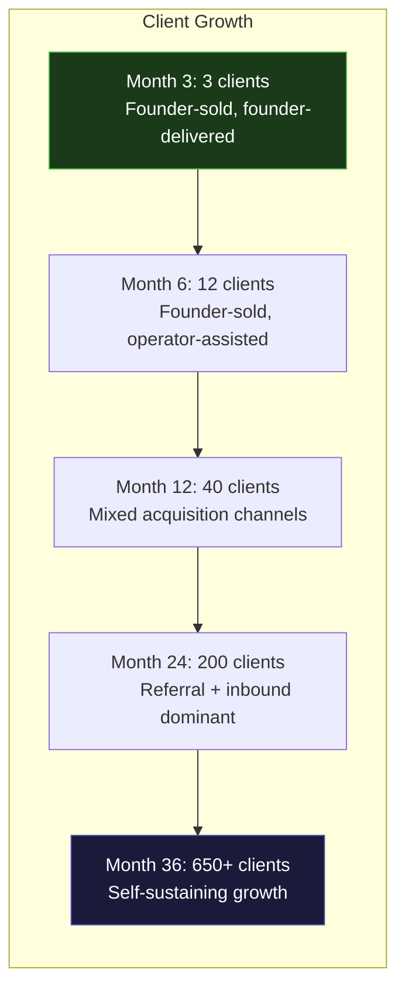
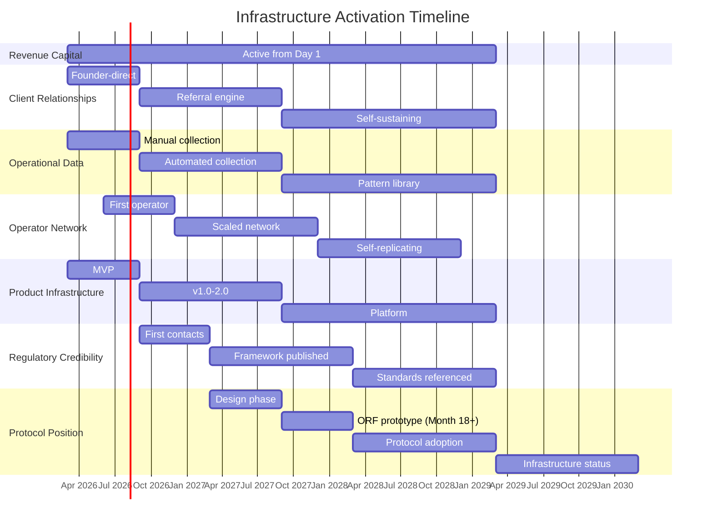
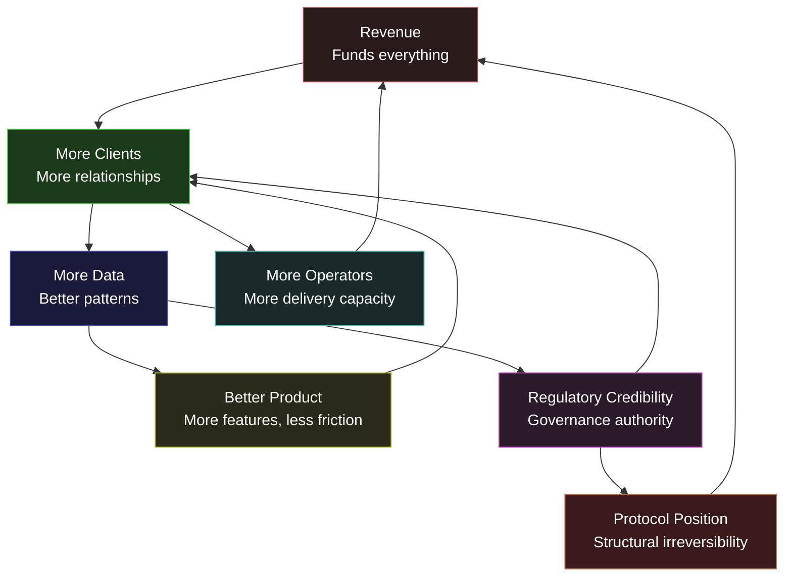

# Compounding Leverage Model

The AINEFF Ecosystem is not built on linear growth. It is built on **compounding leverage** -- seven distinct asset classes that grow monthly and multiply each other's value. Understanding this model is the difference between seeing a consulting practice and seeing an economic coordination protocol.

Every month of disciplined execution simultaneously builds seven assets. By Month 36, the compounding effect makes the ecosystem structurally irreversible.

---

## The Seven Asset Classes

### Asset Class Specifications

| # | Asset Class | Growth Rate (Monthly) | Multiplier Effect | Phase Activated |
|---|---|---|---|---|
| 1 | **Revenue Capital** | 15-25% MoM (Year 1) | Funds all other assets | Phase 1 (Month 1) |
| 2 | **Client Relationships** | 10-20% MoM | Each client produces referrals + data + case studies | Phase 1 (Month 2) |
| 3 | **Operational Data** | 20-30% MoM | Cumulative; never depreciates; improves every product | Phase 1 (Month 3) |
| 4 | **Operator Network** | 5-15% MoM | Each operator multiplies delivery capacity 3-5x | Phase 2 (Month 4) |
| 5 | **Product Infrastructure** | 10-15% MoM (features) | Software scales at near-zero marginal cost | Phase 1 (Month 3) |
| 6 | **Regulatory Credibility** | 3-8% MoM | Slow to build, nearly impossible to replicate | Phase 2 (Month 6) |
| 7 | **Protocol Position** | 1-5% MoM (early), accelerating | Creates structural lock-in; the ultimate moat | Phase 4 (Month 10) |

---

## Revenue-to-Assets Mapping

Every dollar of revenue simultaneously builds multiple asset classes. This is why revenue is the foundation -- it is the input that feeds every other form of compounding.

| Revenue Activity | Revenue Capital | Client Relationships | Operational Data | Operator Network | Product Infrastructure | Regulatory Credibility | Protocol Position |
|---|---|---|---|---|---|---|---|
| **Chokepoint Sprint** | $5-15K | New relationship + referral potential | Operational patterns from client | Delivery process refinement | Feature requests for DocuFlow | Case study for governance | Data for protocol design |
| **DocuFlow Subscription** | $99-499/mo | Ongoing usage relationship | Usage patterns, workflow data | Operator training tool | Product improvement feedback | Compliance feature usage | Workflow protocol data |
| **Billing Leakage Audit** | $3-8K | Deep financial relationship | Revenue pattern data | Audit methodology refinement | Audit automation features | Financial governance proof | Revenue governance protocol |
| **Governance Module** | $5-15K/mo | Enterprise governance relationship | Compliance pattern data | Governance delivery training | Governance platform features | Direct regulatory relevance | Governance protocol foundation |
| **Enterprise Contract** | $50-200K/yr | High-value institutional relationship | Large-scale operational data | Enterprise delivery capability | Enterprise feature requirements | Enterprise governance standards | Enterprise protocol adoption |

---

## Monthly Compounding Projections

### Months 1-12: Foundation Building

| Month | Revenue (Cumulative) | Clients (Total) | Data Points | Operators | Product Features | Regulatory Contacts | Protocol Readiness |
|---|---|---|---|---|---|---|---|
| **1** | $0 | 0 | 0 | 0 | Landing page | 0 | 0% |
| **2** | $5K | 1 | 50 | 0 | MVP v0.1 | 0 | 0% |
| **3** | $18.5K | 3 | 200 | 0 | MVP v0.2 | 0 | 0% |
| **4** | $35K | 5 | 500 | 1 (training) | MVP v0.5 | 1 | 2% |
| **5** | $58K | 8 | 1,000 | 1 (active) | v1.0 | 2 | 3% |
| **6** | $85K | 12 | 2,000 | 2 | v1.2 | 3 | 5% |
| **7** | $112K | 16 | 4,000 | 2 | v1.5 (vertical) | 5 | 8% |
| **8** | $147K | 20 | 7,000 | 3 | v2.0 | 7 | 10% |
| **9** | $187K | 25 | 12,000 | 4 | v2.2 (governance) | 10 | 15% |
| **10** | $231K | 30 | 18,000 | 5 | v3.0 (marketplace) | 12 | 20% |
| **11** | $277K | 35 | 25,000 | 6 | v3.2 | 14 | 25% |
| **12** | $327K | 40 | 35,000 | 7 | v3.5 | 16 | 30% |

### Months 13-24: Acceleration

| Month | Revenue (Cumulative) | Clients (Total) | Data Points | Operators | Protocol Readiness |
|---|---|---|---|---|---|
| **13** | $390K | 48 | 50,000 | 8 | 33% |
| **15** | $540K | 65 | 90,000 | 10 | 40% |
| **18** | $800K | 100 | 200,000 | 14 | 55% |
| **21** | $1.1M | 150 | 400,000 | 18 | 70% |
| **24** | $1.5M | 200 | 700,000 | 22 | 80% |

### Months 25-36: Compounding Visible

| Month | Revenue (Cumulative) | Clients (Total) | Data Points | Operators | Protocol Readiness |
|---|---|---|---|---|---|
| **27** | $2.2M | 280 | 1.2M | 28 | 85% |
| **30** | $3.2M | 380 | 2M | 35 | 90% |
| **33** | $4.5M | 500 | 3.5M | 42 | 93% |
| **36** | $6.2M | 650 | 5M+ | 50+ | 95% |

---

## Client & Operator Growth Projections

### Client Growth Drivers by Phase

| Phase | Primary Growth Driver | Secondary Driver | Client Acquisition Cost |
|---|---|---|---|
| **Months 1-3** | Founder outbound (LinkedIn) | Referrals from first clients | $0 (founder time only) |
| **Months 4-6** | Founder outbound + referrals | Content marketing, case studies | $200-500 |
| **Months 7-12** | Referrals + inbound | Operator-led outbound, vertical events | $500-1,000 |
| **Months 13-24** | Inbound + referrals | Partner channel, platform | $300-800 |
| **Months 25-36** | Platform + organic | Insurance requirements, regulatory push | $100-400 |

### Operator Growth Model

| Month | Active Operators | Operators in Training | Delivery Capacity (Engagements/Month) | Revenue per Operator |
|---|---|---|---|---|
| **3** | 0 | 1 | 2 (founder only) | -- |
| **6** | 2 | 1 | 5 | $7,500 |
| **9** | 4 | 2 | 10 | $10,000 |
| **12** | 7 | 3 | 18 | $12,000 |
| **18** | 14 | 4 | 35 | $14,000 |
| **24** | 22 | 5 | 55 | $16,000 |
| **36** | 50+ | 8 | 120+ | $18,000 |

---

## Infrastructure Activation Timeline

Not all assets are active from Day 1. Each asset class activates at the right time -- not before customer demand justifies it.

### ORF Activation (Month 18+)

The Obligation Resolution Framework activates at Month 18 -- not before. This timing is critical because:

| ORF Requirement | Status at Month 18 |
|---|---|
| 100+ client engagements for data | Met (estimated 100+ by Month 18) |
| $800K+ cumulative revenue to fund development | Met |
| 200,000+ operational data points | Met |
| 14+ operators for testing and deployment | Met |
| Regulatory relationships established | 10+ contacts active |
| Vertical dominance proven | Primary vertical established |

**ORF before Month 18 is Trap 10.** ORF after Month 18 is strategic execution.

---

## Compounding Path: 2026 to 2030

| Year | Revenue | Clients | Data Points | Operators | Asset Multiplier | Ecosystem Status |
|---|---|---|---|---|---|---|
| **2026** | $228K | 40 | 35K | 7 | 1x (baseline) | Services company |
| **2027** | $909K | 200 | 700K | 22 | 4x | Product-led company |
| **2028** | $3.4M | 650 | 5M | 50 | 15x | Platform company |
| **2029** | $15M | 2,000 | 25M | 120 | 66x | Protocol company |
| **2030** | $50M+ | 5,000+ | 100M+ | 300+ | 220x | Infrastructure |

### The Compounding Flywheel

The flywheel has one critical property: **once spinning, it becomes increasingly difficult to stop.** Each asset class feeds the others, creating a self-reinforcing system that compounds monthly. Competitors cannot replicate the flywheel because they cannot replicate the accumulated data, relationships, and regulatory position.

This is the difference between a company and infrastructure. A company can be outcompeted. Infrastructure can only be replaced by better infrastructure -- and by Month 36, the AINEFF Ecosystem will have a 3-year head start in all seven asset classes simultaneously.

---

## The Compounding Rule

> **Every action must build at least two asset classes simultaneously.** A Chokepoint Sprint generates revenue (Asset 1) AND client relationship (Asset 2) AND operational data (Asset 3). A DocuFlow feature ships product infrastructure (Asset 5) AND generates usage data (Asset 3). A regulatory meeting builds credibility (Asset 6) AND enables enterprise deals (Asset 2).**
>
> **Any action that builds only one asset class, or none, is waste.** Redirect the effort to an action that compounds.
