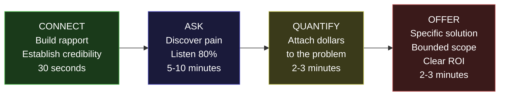

---

sidebar_position: 10
title: "Sales Conversation Framework"
description: "The CONNECT-ASK-QUANTIFY-OFFER methodology for converting conversations into revenue — buyer personas, objection handling, and the discipline of listening more than speaking."
tags: [execution, operational, strategic]
custom_status: active
custom_owner: Andrew Leo
custom_last_review: 2026-03-01
custom_next_review: 2026-06-01
---

# Sales Conversation Framework

Every dollar of revenue in the ecosystem begins with a conversation. Not a pitch deck. Not a product demo. Not a whitepaper. A **conversation** where you listen, quantify pain, and offer a specific, bounded solution.

This framework -- CONNECT, ASK, QUANTIFY, OFFER -- is the repeatable methodology that converts strangers into paying customers.

---

## The CAQO Framework

---

## Step 1: CONNECT (30 seconds)

**Goal:** Establish enough credibility to earn the right to ask questions.

### The Opening Line

> "I help [industry] companies find their biggest operational bottleneck -- the one that is silently costing them six figures a year."

**Variations by context:**

| Context | Opening |
|---|---|
| **LinkedIn cold message** | "I noticed [company] is scaling fast. I help companies at your stage find the operational bottleneck that usually appears around the $10M mark. Worth a 15-minute call?" |
| **Warm introduction** | "[Mutual contact] mentioned you might be dealing with [specific pain area]. I specialize in diagnosing exactly that kind of operational friction." |
| **Conference/event** | "I just heard your comment about [topic]. That exact issue is what I spend all day solving for companies like yours." |
| **Inbound inquiry** | "Thanks for reaching out. Tell me what prompted you to look into this -- what is the pain right now?" |

### CONNECT Rules

- Do NOT talk about yourself for more than 30 seconds
- Do NOT mention your product, platform, or technology
- Do NOT use jargon (ORF, AINEFF, protocol, agent)
- DO reference their specific company, industry, or situation
- DO establish one credibility signal (result achieved, relevant experience)

---

## Step 2: ASK (5-10 minutes)

**Goal:** Discover the real pain. The one they think about at 2am. Not the one they put in a slide deck.

### The Core Question

> "What is the single biggest operational issue costing you money right now?"

Then: **shut up and listen.**

### Follow-Up Questions

Ask these only after they finish speaking. Do not interrupt.

| Question | Purpose |
|---|---|
| "How long has that been going on?" | Establishes urgency and pain duration |
| "What have you tried to fix it?" | Reveals failed solutions and buying history |
| "Why did those attempts fail?" | Identifies root cause and real constraints |
| "Who else in your organization feels this pain?" | Identifies additional stakeholders and champions |
| "What happens if nothing changes in the next 6 months?" | Creates urgency by projecting consequences |
| "On a scale of 1-10, how urgent is solving this?" | Gauges buying intent directly |

### ASK Rules

- Listen 80% of the time. Talk 20%.
- Take notes. Write down their exact words. Use their language in the proposal.
- Never correct them. Even if their diagnosis is wrong, their pain is real.
- Never pitch during ASK. The moment you start selling, they stop sharing.
- If they say "it is not that bad," they are not your customer. Move on gracefully.

### Pain Signal Matrix

| What They Say | What It Means | Sales Readiness |
|---|---|---|
| "We lose sleep over this" | High pain, high urgency | Ready to buy now |
| "It costs us about $X per month" | Quantified pain, rational buyer | Ready for proposal |
| "We have been looking at solutions" | Active buying cycle | Competitive -- move fast |
| "It is annoying but manageable" | Low pain, low urgency | Not ready -- nurture |
| "Our board is asking about this" | External pressure | High urgency, complex decision |
| "We tried [competitor] and it failed" | Burned buyer | High opportunity if you differentiate clearly |

---

## Step 3: QUANTIFY (2-3 minutes)

**Goal:** Attach a dollar amount to the pain. People buy when the cost of the problem exceeds the cost of the solution.

### The Quantification Question

> "Can you help me understand what this costs you? In monthly revenue lost, time wasted, or risk exposure?"

### Quantification Framework

| Pain Type | Quantification Approach | Example |
|---|---|---|
| **Revenue leakage** | "How much revenue falls through the cracks per month?" | "$50K/month in unbilled services" |
| **Time waste** | "How many hours per week does your team spend on this? At what fully loaded cost?" | "20 hrs/week x $75/hr = $6,000/month" |
| **Risk exposure** | "What would a compliance failure cost? What is the probability?" | "$500K fine x 10% probability = $50K expected cost" |
| **Opportunity cost** | "What could your team do instead if this problem disappeared?" | "Launch new product 3 months faster = $200K revenue" |
| **Customer impact** | "How many customers are affected? What is the retention impact?" | "5% churn increase = $100K/year lost" |

### Quantification Rules

- Let THEM estimate the numbers. Their numbers are always more credible to them than yours.
- If they cannot quantify, help them with a framework. "Most companies at your size see this costing between $X and $Y per month. Does that feel right?"
- Write the number down. Repeat it back. "So this is roughly a $50K per month problem?"
- This number becomes the anchor for your offer. Your price must be 3-10x less than the pain.

---

## Step 4: OFFER (2-3 minutes)

**Goal:** Present a specific, bounded, low-risk solution that is obviously worth the price.

### The Offer Statement

> "Here is what I propose: for $X, I will identify your top 3 operational chokepoints in 5-10 business days. Each chokepoint will come with a quantified impact and a specific resolution path. If the findings are not worth at least 3x what you pay, I will refund every dollar."

### Offer Structure

| Element | Detail | Purpose |
|---|---|---|
| **Price** | $5,000 - $15,000 (based on company size) | Low enough to be a no-brainer given quantified pain |
| **Scope** | 3 chokepoints identified and analyzed | Bounded -- no scope creep |
| **Timeline** | 5-10 business days | Fast -- urgency maintained |
| **Deliverable** | Written report with quantified impact per chokepoint | Tangible -- something to show the board |
| **Guarantee** | 3x value or full refund | Risk reversal -- removes buyer fear |
| **Upsell path** | "If the findings are valuable, we can discuss implementation" | Plants seed for Phase 2 engagement |

### Pricing Guide

| Company Revenue | Engagement Price | Rationale |
|---|---|---|
| $1M - $5M | $5,000 - $7,500 | Pain is real but budget is limited |
| $5M - $20M | $7,500 - $12,000 | Sufficient budget, clear ROI |
| $20M - $100M | $12,000 - $25,000 | Enterprise-lite, higher complexity |
| $100M+ | $25,000 - $50,000 | Enterprise, multi-stakeholder |

### OFFER Rules

- Never negotiate price on the first call. "Let me send you a proposal with the details."
- Never discount more than 20%. If they want 50% off, you have a positioning problem, not a pricing problem.
- Always include the guarantee. It removes fear and signals confidence.
- Always define the next step. "I will send the proposal by end of day tomorrow. Can we schedule a 15-minute call Thursday to discuss?"

---

## Buyer Personas

### Persona 1: COO / Operations Leader

| Attribute | Detail |
|---|---|
| **Title** | COO, VP Operations, Head of Ops |
| **Company Size** | $5M - $50M revenue |
| **Pain Profile** | Operational inefficiency, scaling friction, process chaos |
| **Decision Style** | Pragmatic, results-oriented, data-driven |
| **Objection Pattern** | "We do not have time for another consulting project" |
| **Winning Argument** | "This is 5 days, not 5 months. You get answers, not a report that gathers dust." |
| **Sales Cycle** | 7-14 days |
| **Engagement Value** | $7,500 - $15,000 |

---

### Persona 2: CFO / Finance Leader

| Attribute | Detail |
|---|---|
| **Title** | CFO, VP Finance, Controller |
| **Company Size** | $10M - $100M revenue |
| **Pain Profile** | Billing leakage, margin erosion, compliance cost |
| **Decision Style** | ROI-focused, skeptical, needs numbers |
| **Objection Pattern** | "What is the measurable ROI?" |
| **Winning Argument** | "We typically find $50K-$500K in annual leakage. The engagement pays for itself in the first finding." |
| **Sales Cycle** | 14-21 days |
| **Engagement Value** | $10,000 - $25,000 |

---

### Persona 3: CTO / CISO

| Attribute | Detail |
|---|---|
| **Title** | CTO, CISO, VP Engineering, VP IT |
| **Company Size** | $20M - $200M revenue |
| **Pain Profile** | Technical debt, security gaps, compliance burden, AI governance |
| **Decision Style** | Technical, detail-oriented, risk-averse |
| **Objection Pattern** | "How does this integrate with our existing systems?" |
| **Winning Argument** | "The diagnostic requires no integration. We work with your existing data and systems. If we find something valuable, we discuss implementation separately." |
| **Sales Cycle** | 14-30 days |
| **Engagement Value** | $15,000 - $50,000 |

---

## Objection Handling

| Objection | Response | Principle |
|---|---|---|
| "We cannot afford this right now" | "I understand. But can you afford to lose $X per month for another 6 months? The engagement is a fraction of what the problem costs." | Reframe cost as investment |
| "We need to think about it" | "Of course. What specific questions would help you decide? Let me address those now so you have everything you need." | Surface hidden objections |
| "We have internal resources for this" | "That is great. Have they identified the top 3 chokepoints yet? If so, what is the plan? If not, why?" | Challenge assumption gently |
| "We are talking to other vendors" | "Good -- you should compare. Quick question: are any of them offering a money-back guarantee on 3x value? We are." | Differentiate on risk reversal |
| "The timing is not right" | "When would be right? And what will the problem have cost by then?" | Quantify delay cost |
| "I need to get approval from [someone]" | "Makes sense. Can we schedule a call with you and [someone] together? I am happy to present the case." | Move up the chain |
| "Send me some information" | "I would rather not waste your time with a generic brochure. Let me send you a 1-page proposal specific to what we discussed. I will have it to you by tomorrow." | Convert to proposal |

---

## Conversation Metrics

Track these for every conversation to improve the framework over time:

| Metric | Target | Measurement |
|---|---|---|
| **Conversation-to-Proposal Rate** | &gt;50% | Proposals sent / Conversations held |
| **Proposal-to-Close Rate** | &gt;33% | Deals closed / Proposals sent |
| **Average Time to Close** | &lt;14 days | Days from first conversation to signed agreement |
| **Average Deal Size** | &gt;$8,000 | Revenue per closed deal |
| **Referral Rate** | &gt;20% | Deals from referrals / Total deals |
| **Talk-to-Listen Ratio** | &lt;30:70 | Self-assessment after each call |

---

## Post-Conversation Checklist

Complete within 1 hour of every conversation:

- [ ] Update CRM with notes, next action, and deal stage
- [ ] Record pain points in their exact language
- [ ] Record quantified impact (their numbers)
- [ ] Draft proposal if conversation was warm (send within 24 hours)
- [ ] Schedule follow-up action (call, email, proposal)
- [ ] Identify any referral opportunities mentioned
- [ ] Rate conversation quality: Hot / Warm / Cold / Dead
- [ ] Log insights: what worked, what did not, what to try next time

> **Every conversation teaches you something. The question is whether you capture the lesson or let it evaporate.** The post-conversation checklist is not bureaucracy -- it is the compounding mechanism for sales skill.
