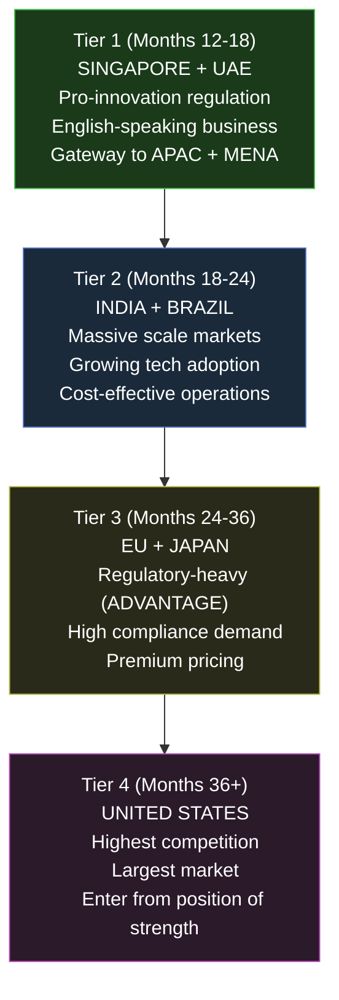
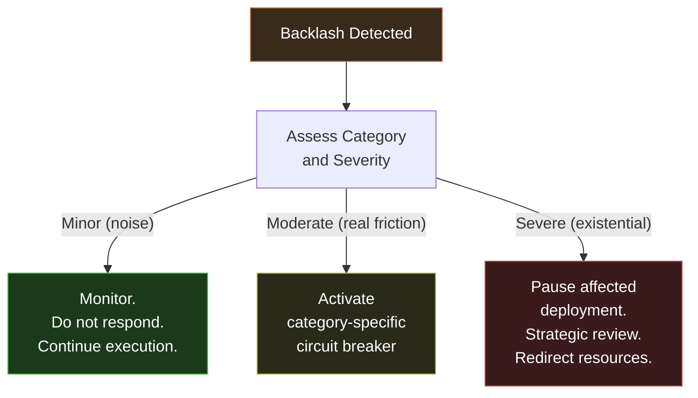
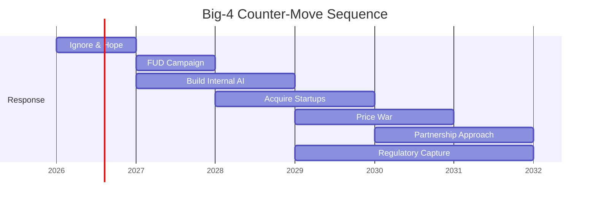
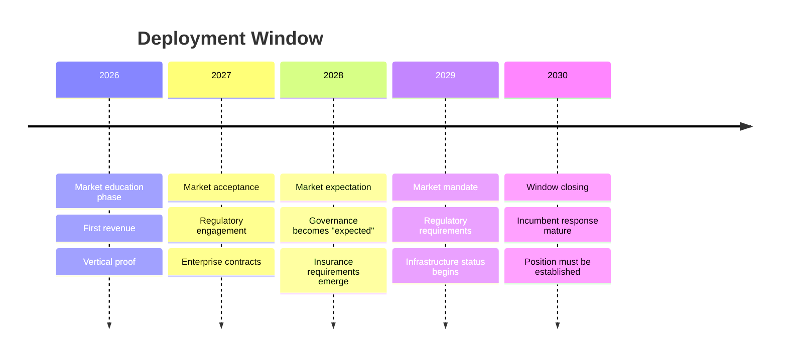

---

sidebar_position: 12
title: "Deployment & Rollout Strategy"
description: "Global deployment sequencing, country rollout order, backlash management, Big-4 disruption timeline, counter-move analysis, and the 2-5 year professional transition window."
tags: [execution, operational, strategic]
custom_status: active
custom_owner: Andrew Leo
custom_last_review: 2026-03-01
custom_next_review: 2026-06-01
---

# Deployment & Rollout Strategy

The AINEFF Ecosystem deploys in deliberate phases, across carefully sequenced geographies, with explicit backlash management and competitive response strategies. This is not a launch plan. It is a **deployment doctrine** for infrastructure that will eventually touch every enterprise on the planet.

---

## Deployment Phases

The ecosystem deploys through six phases, each designed to build the foundation for the next while minimizing visibility to potential adversaries (incumbent firms, regulators, competitors).

### Phase 0: Invisible Foundation (Months 1-6)

| Dimension | Detail |
|---|---|
| **Objective** | Build revenue, relationships, and credibility without drawing competitive attention |
| **Visibility** | Near-zero. No press. No conferences. No public announcements. |
| **Activities** | Consulting engagements, DocuFlow beta, operator recruitment |
| **Positioning** | "Boutique operational consulting" -- deliberately understated |
| **Risk** | None -- invisibility is the safest position |

### Phase 1: Regulator-First (Months 6-12)

| Dimension | Detail |
|---|---|
| **Objective** | Establish regulatory relationships before competitors realize the regulatory angle exists |
| **Visibility** | Selective. Visible to regulators and compliance officers only. |
| **Activities** | Governance module deployment, compliance framework publication, regulatory body engagement |
| **Positioning** | "AI governance and operational compliance" |
| **Risk** | Regulatory bodies move slowly; patience required |

### Phase 2: Baseline Work (Months 12-18)

| Dimension | Detail |
|---|---|
| **Objective** | Accumulate enough client engagements to establish baseline data across the vertical |
| **Visibility** | Moderate. Case studies published. Speaking at vertical events. |
| **Activities** | Enterprise contracts, vertical deep-dive, operator network expansion |
| **Positioning** | "The standard for operational governance in [vertical]" |
| **Risk** | Competitors notice and begin positioning |

### Phase 3: Hybrid Mode (Months 18-24)

| Dimension | Detail |
|---|---|
| **Objective** | Transition from services-led to platform-led while maintaining service revenue |
| **Visibility** | High within vertical. Moderate externally. |
| **Activities** | Marketplace launch, ORF prototype, cross-enterprise pilots |
| **Positioning** | "Operational infrastructure platform" |
| **Risk** | Premature platform push; services revenue must remain primary |

### Phase 4: Citizen AINE-Lite (Months 24-36)

| Dimension | Detail |
|---|---|
| **Objective** | Deploy lightweight, accessible versions of the ecosystem for SMBs and individual practitioners |
| **Visibility** | Broad. Public marketing. Content marketing at scale. |
| **Activities** | Self-serve product tiers, community building, partner program |
| **Positioning** | "Operational intelligence for every company" |
| **Risk** | Quality dilution across market segments |

### Phase 5: Quiet Scale (Months 36+)

| Dimension | Detail |
|---|---|
| **Objective** | Scale infrastructure adoption without drawing adversarial attention from incumbents |
| **Visibility** | Paradoxically low. The best infrastructure is invisible. |
| **Activities** | Protocol-level integration, regulatory mandates, cross-border deployment |
| **Positioning** | Infrastructure. Not a vendor. Not a platform. Terrain. |
| **Risk** | Incumbent counter-moves (see Big-4 section below) |

---

## Country Rollout Order

Geographic deployment follows a deliberate sequence based on regulatory environment, market readiness, competitive density, and strategic value.

| Tier | Countries | Entry Timing | Strategic Rationale | Market Size |
|---|---|---|---|---|
| **Tier 1** | Singapore, UAE | Months 12-18 | Pro-innovation regulation, English-speaking, low competition, strategic gateway position | $50B+ combined enterprise IT spend |
| **Tier 2** | India, Brazil | Months 18-24 | Massive scale, growing tech adoption, cost-effective operator recruitment, emerging regulatory frameworks | $200B+ combined enterprise IT spend |
| **Tier 3** | EU, Japan | Months 24-36 | Regulatory complexity creates demand, high willingness to pay for compliance, GDPR/AI Act creates natural market | $500B+ combined enterprise IT spend |
| **Tier 4** | United States | Months 36+ | Highest competition (Big-4, tech giants), enter from position of global proof and regulatory credibility | $1T+ enterprise IT spend |

**The US is deliberately last.** Entering the US market first means competing with the Big-4 on their home turf with no proof, no scale, and no credibility. Entering the US last means arriving with global deployment proof, regulatory endorsements, and established infrastructure. The Big-4 cannot replicate a global regulatory position overnight.

---

## Backlash Categories & Circuit Breakers

As the ecosystem scales, five categories of backlash will emerge. Each has a circuit breaker -- a predefined response that limits damage.

| Category | Source | Trigger | Circuit Breaker |
|---|---|---|---|
| **Job Displacement Fear** | Employees and unions | AI replacing human tasks visible to media | Publish "augmentation, not replacement" data. Show new roles created per role displaced. Slow deployment in affected area. |
| **Regulatory Overreach** | Government bodies | AI governance perceived as unregulated or risky | Proactive compliance. Open-source governance frameworks. Invite regulatory review. |
| **Competitive Sabotage** | Big-4, tech incumbents | Market disruption becomes visible | See Big-4 Counter-Moves below. Maintain multiple revenue streams. Never depend on one market. |
| **Client Resistance** | Enterprise IT and middle management | Threat to existing power structures | Engage executive sponsors. Demonstrate ROI to resisters' KPIs. Patience. |
| **Media Narrative** | Journalists and commentators | "AI destroying jobs" or "AI governance monopoly" stories | Do not engage in media wars. Let results speak. Focus on customer outcomes, not PR. |

### Circuit Breaker Protocol

---

## Big-4 Disruption Timeline

The Big-4 professional services firms (Deloitte, PwC, EY, KPMG) represent a $200B+ global market that the AINEFF Ecosystem will progressively disrupt. The disruption follows predictable patterns.

### Lines That Die First

These service lines are most vulnerable to AI-driven operational governance:

| Service Line | Current Big-4 Revenue | Disruption Timeline | Vulnerability |
|---|---|---|---|
| **Data entry and processing** | $15B+ | Years 1-2 | Critical -- AI replaces 90%+ of this work |
| **Basic audit procedures** | $20B+ | Years 2-3 | High -- automated audit trails replace manual testing |
| **Tax preparation (routine)** | $18B+ | Years 2-3 | High -- rule-based, automatable |
| **Compliance checklist work** | $12B+ | Years 1-2 | Critical -- governance protocols automate this |
| **IT advisory (commodity)** | $10B+ | Years 2-4 | High -- AI-driven diagnostics replace junior consultants |
| **Procurement processing** | $8B+ | Years 1-3 | High -- agent automation of purchase orders |

### Lines That Survive Longest

| Service Line | Current Big-4 Revenue | Disruption Timeline | Why They Survive |
|---|---|---|---|
| **M&A advisory** | $15B+ | Years 5-8+ | Requires judgment, relationships, negotiation |
| **Complex litigation support** | $10B+ | Years 5-10+ | Legal complexity, human testimony required |
| **Regulatory lobbying** | $5B+ | Years 7-10+ | Inherently political and relationship-driven |
| **Board-level strategy** | $8B+ | Years 5-8+ | C-suite relationships and judgment calls |
| **Crisis management** | $3B+ | Years 5-10+ | Requires real-time human judgment under pressure |

---

## Big-4 Counter-Moves

The Big-4 will respond to disruption with seven predictable strategies. All eventually fail.

| # | Counter-Move | Description | Why It Fails |
|---|---|---|---|
| 1 | **Acquire AI startups** | Buy companies building competing technology | Acquired companies lose innovation DNA; integration destroys agility |
| 2 | **Build internal AI practice** | Invest $100M+ in internal AI capabilities | Partnership model prevents fast execution; consensus culture kills innovation |
| 3 | **Price war** | Reduce fees to undercut ecosystem pricing | Unsustainable at scale; their cost structure is fundamentally higher |
| 4 | **Regulatory capture** | Lobby for regulations that favor incumbent compliance providers | Backfires when AINEFF ecosystem is already regulatory-aligned; creates demand for governance tools |
| 5 | **FUD campaign** | Spread fear about AI governance reliability | Market eventually validates through results; FUD has diminishing returns |
| 6 | **Partnership approach** | Partner with AINEFF ecosystem rather than competing | Cedes strategic position; ecosystem absorbs their client relationships |
| 7 | **Ignore and hope** | Pretend disruption is not happening | The classic incumbent response; always fails |

### Counter-Move Timeline

---

## Professions Following the Big-4

As the Big-4 are disrupted, cascading effects reach adjacent professions:

| Profession | Current Practitioners (Global) | Disruption Phase | Transition Path |
|---|---|---|---|
| **Tax preparers** | 500,000+ | Phase 2-3 (Years 2-3) | Transition to tax strategy and planning (judgment work) |
| **Auditors (routine)** | 300,000+ | Phase 3-4 (Years 3-5) | Transition to audit governance and exception handling |
| **GRC analysts** | 200,000+ | Phase 2-3 (Years 2-3) | Transition to governance architecture and oversight |
| **Compliance officers** | 250,000+ | Phase 3-4 (Years 3-5) | Transition to compliance strategy and regulatory relations |
| **Legal ops** | 150,000+ | Phase 3-5 (Years 3-6) | Transition to legal strategy and complex case management |
| **Procurement staff** | 400,000+ | Phase 2-3 (Years 2-4) | Transition to vendor relationship management and strategy |
| **Payroll processors** | 300,000+ | Phase 1-2 (Years 1-3) | Transition to compensation strategy and employee relations |
| **Data entry operators** | 1,000,000+ | Phase 1-2 (Years 1-2) | Retraining required; most roles eliminated |
| **IT advisory (junior)** | 200,000+ | Phase 2-4 (Years 2-5) | Transition to architecture and strategic IT planning |
| **Insurance underwriting** | 350,000+ | Phase 3-5 (Years 3-6) | Transition to risk strategy and complex case assessment |

---

## Black-Market AI Dynamics

As AI governance becomes regulated and the ecosystem becomes infrastructure, a parallel "black market" for ungoverned AI will emerge. This is not a risk -- it is an inevitability that must be contained.

### Black-Market Characteristics

| Characteristic | Detail |
|---|---|
| **What it is** | AI systems operating outside governance frameworks: unaudited, unregistered, unaccountable |
| **Who uses it** | Organizations seeking to avoid compliance costs; bad actors; early adopters in unregulated jurisdictions |
| **Where it thrives** | Jurisdictions with weak AI regulation; sectors with low audit scrutiny; small companies below regulatory thresholds |
| **Why it matters** | Undermines trust in governed AI; creates regulatory pressure; potential source of reputational damage for all AI governance |

### Containment Strategy

| Strategy | Mechanism |
|---|---|
| **Insurance incentive** | Insurance carriers offer lower premiums for governed AI, making black-market AI financially disadvantageous |
| **Regulatory floor** | Work with regulators to establish minimum governance standards that apply universally |
| **Market pressure** | Enterprise clients require governance certification from vendors, pushing compliance downstream |
| **Transparency advantage** | Governed AI produces audit trails that ungoverned AI cannot; clients prefer provable outcomes |
| **Cost parity** | Keep governance costs low enough that the "savings" from black-market AI are not worth the risk |

---

## The 2-5 Year Transition Window

The window for deploying operational governance infrastructure is approximately 2-5 years. Before this window, the market is not ready. After it, incumbents will have responded or new entrants will have commoditized the space.

| Year | Market Status | Ecosystem Position | Window Status |
|---|---|---|---|
| **2026** | Early adoption; skepticism common | Proving value through engagements | Opening |
| **2027** | Growing acceptance; "interesting" becomes "useful" | Scaling through vertical dominance | Open |
| **2028** | Expectation forming; "useful" becomes "expected" | Platform operational; cross-enterprise | Wide open |
| **2029** | Mandates emerging; "expected" becomes "required" | Protocol adoption; regulatory endorsement | Narrowing |
| **2030** | Standards established; competition intensifies | Must be established infrastructure or cede position | Closing |

> **The ecosystem must be established infrastructure by 2030.** After that, the window of opportunity narrows dramatically as incumbents respond and new entrants commoditize. The 2-5 year transition window is the strategic context for every deployment decision.
