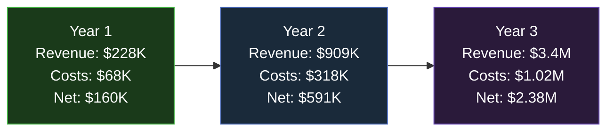
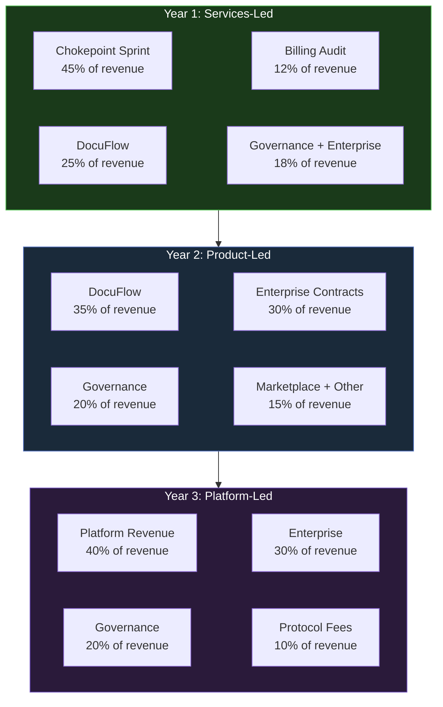
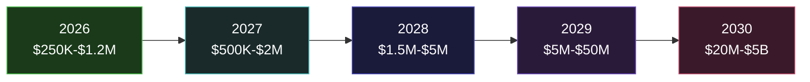

# Financial Model

This financial model projects the ecosystem's revenue, costs, margins, and cash position across three years. It is built on conservative assumptions grounded in the 7-Phase Progression and validated by the conversation-driven sales methodology.

**Key premise:** Revenue is earned, not projected. Every number below must be validated by actual customer payments.

---

## 3-Year Summary

| Metric | Year 1 | Year 2 | Year 3 |
|---|---|---|---|
| **Total Revenue** | $228,000 | $909,000 | $3,400,000 |
| **Total Costs** | $68,000 | $318,000 | $1,020,000 |
| **Gross Profit** | $194,000 | $773,000 | $2,890,000 |
| **Gross Margin** | 85% | 85% | 85% |
| **OPEX** | $34,000 | $182,000 | $510,000 |
| **Net Income** | $160,000 | $591,000 | $2,380,000 |
| **Net Margin** | 70% | 65% | 70% |

---

## Year 1: Monthly Revenue Detail

| Month | Chokepoint Sprint | DocuFlow | Billing Audit | Governance | Enterprise | Total Revenue | Cumulative |
|---|---|---|---|---|---|---|---|
| **1** | $0 | $0 | $0 | $0 | $0 | **$0** | $0 |
| **2** | $5,000 | $0 | $0 | $0 | $0 | **$5,000** | $5,000 |
| **3** | $10,000 | $500 | $3,000 | $0 | $0 | **$13,500** | $18,500 |
| **4** | $12,000 | $1,500 | $3,000 | $0 | $0 | **$16,500** | $35,000 |
| **5** | $15,000 | $3,000 | $5,000 | $0 | $0 | **$23,000** | $58,000 |
| **6** | $15,000 | $5,000 | $5,000 | $2,000 | $0 | **$27,000** | $85,000 |
| **7** | $12,000 | $7,000 | $3,000 | $5,000 | $0 | **$27,000** | $112,000 |
| **8** | $10,000 | $9,000 | $3,000 | $8,000 | $5,000 | **$35,000** | $147,000 |
| **9** | $8,000 | $10,000 | $2,000 | $10,000 | $10,000 | **$40,000** | $187,000 |
| **10** | $5,000 | $12,000 | $2,000 | $10,000 | $15,000 | **$44,000** | $231,000 |
| **11** | $5,000 | $14,000 | $0 | $12,000 | $15,000 | **$46,000** | $277,000 |
| **12** | $3,000 | $15,000 | $0 | $12,000 | $20,000 | **$50,000** | $327,000 |

**Note:** Revenue ramp assumes the 90-Day Sprint targets are met. Month 1 is $0 (DISCOVER phase). First revenue arrives Month 2.

---

## Revenue Stream Evolution

---

## Cost Structure

### Year 1 Monthly Costs

| Category | Month 1-3 | Month 4-6 | Month 7-9 | Month 10-12 | Annual |
|---|---|---|---|---|---|
| **Tools & Software** | $12/mo | $100/mo | $300/mo | $500/mo | $2,736 |
| **Compute & AI APIs** | $50/mo | $200/mo | $500/mo | $1,000/mo | $5,250 |
| **Contractor/Freelance** | $0 | $500/mo | $1,500/mo | $3,000/mo | $15,000 |
| **Operator Compensation** | $0 | $0 | $2,000/mo | $5,000/mo | $21,000 |
| **Legal & Accounting** | $200/mo | $300/mo | $500/mo | $500/mo | $4,500 |
| **Insurance** | $0 | $100/mo | $200/mo | $200/mo | $1,500 |
| **Marketing** | $0 | $0 | $200/mo | $500/mo | $2,100 |
| **Miscellaneous** | $100/mo | $200/mo | $300/mo | $500/mo | $3,300 |
| **Total Monthly** | **$362** | **$1,400** | **$5,500** | **$11,200** | **$55,386** |

### Year 2 Monthly Costs

| Category | Monthly Average | Annual |
|---|---|---|
| **Tools & Software** | $1,500 | $18,000 |
| **Compute & AI APIs** | $3,000 | $36,000 |
| **Team (Operators + Contractors)** | $15,000 | $180,000 |
| **Legal & Compliance** | $2,000 | $24,000 |
| **Insurance** | $500 | $6,000 |
| **Marketing & Sales** | $2,000 | $24,000 |
| **Office & Infrastructure** | $1,500 | $18,000 |
| **Miscellaneous** | $1,000 | $12,000 |
| **Total** | **$26,500** | **$318,000** |

### Year 3 Monthly Costs

| Category | Monthly Average | Annual |
|---|---|---|
| **Tools & Software** | $5,000 | $60,000 |
| **Compute & AI APIs** | $10,000 | $120,000 |
| **Team** | $50,000 | $600,000 |
| **Legal & Compliance** | $5,000 | $60,000 |
| **Insurance** | $2,000 | $24,000 |
| **Marketing & Sales** | $5,000 | $60,000 |
| **Office & Infrastructure** | $3,000 | $36,000 |
| **Miscellaneous** | $5,000 | $60,000 |
| **Total** | **$85,000** | **$1,020,000** |

---

## Margin Analysis

| Metric | Year 1 | Year 2 | Year 3 |
|---|---|---|---|
| **Revenue** | $228,000 | $909,000 | $3,400,000 |
| **COGS (Direct Delivery)** | $34,200 (15%) | $136,350 (15%) | $510,000 (15%) |
| **Gross Profit** | $193,800 | $772,650 | $2,890,000 |
| **Gross Margin** | 85% | 85% | 85% |
| **OPEX** | $34,000 | $182,000 | $510,000 |
| **EBITDA** | $159,800 | $590,650 | $2,380,000 |
| **EBITDA Margin** | 70% | 65% | 70% |

**Gross margin remains high (85%) because:**
- Services are knowledge-leveraged (no physical goods)
- DocuFlow is software (near-zero marginal cost)
- Agent automation replaces human labor in delivery
- Operator model uses revenue share (variable cost, not fixed)

---

## Cash Flow & Runway

| Month | Revenue | Costs | Net Cash Flow | Cash Balance |
|---|---|---|---|---|
| **0** | $0 | $0 | $0 | $1,000 |
| **1** | $0 | $362 | -$362 | $638 |
| **2** | $5,000 | $362 | +$4,638 | $5,276 |
| **3** | $13,500 | $362 | +$13,138 | $18,414 |
| **4** | $16,500 | $1,400 | +$15,100 | $33,514 |
| **5** | $23,000 | $1,400 | +$21,600 | $55,114 |
| **6** | $27,000 | $1,400 | +$25,600 | $80,714 |
| **7** | $27,000 | $5,500 | +$21,500 | $102,214 |
| **8** | $35,000 | $5,500 | +$29,500 | $131,714 |
| **9** | $40,000 | $5,500 | +$34,500 | $166,214 |
| **10** | $44,000 | $11,200 | +$32,800 | $199,014 |
| **11** | $46,000 | $11,200 | +$34,800 | $233,814 |
| **12** | $50,000 | $11,200 | +$38,800 | $272,614 |

### Break-Even Analysis

| Milestone | Month | Cash Position |
|---|---|---|
| **First revenue** | Month 2 | $5,276 |
| **Monthly break-even** | Month 2 (Revenue &gt; Costs) | $5,276 |
| **Cumulative break-even** | Month 2 (Revenue &gt; Total Invested) | $5,276 |
| **Sustainable operations** | Month 4-5 ($15K+/mo consistent) | $33,514 |
| **Cash buffer established** | Month 8+ ($100K+ reserve) | $131,714 |

**With $1,000 starting capital and $12/month costs in Month 1, the ecosystem breaks even almost immediately upon first revenue.** There is no extended burn period because there are no fixed costs beyond minimal tooling.

---

## Burn Rate & Runway

| Period | Monthly Burn | Revenue | Net Burn | Runway (at current cash) |
|---|---|---|---|---|
| Month 1 | $362 | $0 | $362 | 2.8 months |
| Month 3 | $362 | $13,500 | Cash positive | Infinite |
| Month 6 | $1,400 | $27,000 | Cash positive | Infinite |
| Month 9 | $5,500 | $40,000 | Cash positive | Infinite |
| Month 12 | $11,200 | $50,000 | Cash positive | Infinite |

**The model remains cash-positive from Month 2 onward because costs scale with revenue, not ahead of it.** Costs increase only after revenue supports them.

---

## 5-Year Revenue Trajectory

| Year | Low Case | Base Case | High Case | Revenue Model |
|---|---|---|---|---|
| **2026** | $150,000 | $228,000 | $500,000 | Services + early product |
| **2027** | $500,000 | $909,000 | $1,200,000 | Product-led growth |
| **2028** | $1,500,000 | $3,400,000 | $5,000,000 | Platform + enterprise |
| **2029** | $5,000,000 | $15,000,000 | $25,000,000 | Protocol adoption |
| **2030** | $20,000,000 | $50,000,000 | $100,000,000 | Infrastructure scale |

### Revenue Model Transition

| Year | Primary Revenue Type | Margin Profile | Growth Driver |
|---|---|---|---|
| 2026 | Consulting services | 85% gross, linear growth | Founder effort |
| 2027 | SaaS + services | 85% gross, sub-linear growth | Product leverage |
| 2028 | Platform + enterprise | 88% gross, exponential potential | Network effects |
| 2029 | Protocol fees + platform | 92% gross, exponential | Adoption flywheel |
| 2030 | Infrastructure taxation | 95%+ gross, GDP-correlated | Structural irreversibility |

---

## Key Financial Assumptions

| Assumption | Value | Sensitivity |
|---|---|---|
| Average Chokepoint Sprint deal size | $10,000 | High -- ranges from $5K to $25K |
| DocuFlow average monthly revenue per customer | $150 | Medium -- ranges from $49 to $499 |
| Enterprise average deal size | $50,000 | High -- ranges from $25K to $200K |
| Sales conversion rate | 33% | Medium -- ranges from 20% to 50% |
| Monthly customer churn | 5% | High -- critical for SaaS projections |
| Gross margin | 85% | Low -- knowledge services maintain margins |
| Operator revenue share | 30% | Medium -- affects scalability economics |
| Monthly cost growth rate | 15% | Medium -- scales with revenue, not ahead of it |

---

## Financial Health Indicators

| Indicator | Healthy | Warning | Critical |
|---|---|---|---|
| **Gross Margin** | &gt;80% | 60-80% | &lt;60% |
| **Net Margin** | &gt;50% | 30-50% | &lt;30% |
| **Cash Runway** | &gt;6 months | 3-6 months | &lt;3 months |
| **Revenue Growth (MoM)** | &gt;15% | 5-15% | &lt;5% or negative |
| **Customer Acquisition Cost** | &lt;$500 | $500-$2,000 | &gt;$2,000 |
| **LTV:CAC Ratio** | &gt;5:1 | 3:1-5:1 | &lt;3:1 |
| **Burn Multiple** | &lt;1 (cash positive) | 1-2 | &gt;2 |

> **This financial model is a hypothesis, not a forecast.** Every number must be validated by actual revenue. Update monthly with real data. The model adapts to reality; reality does not adapt to the model.
