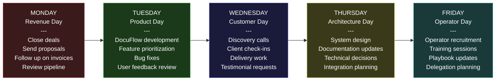
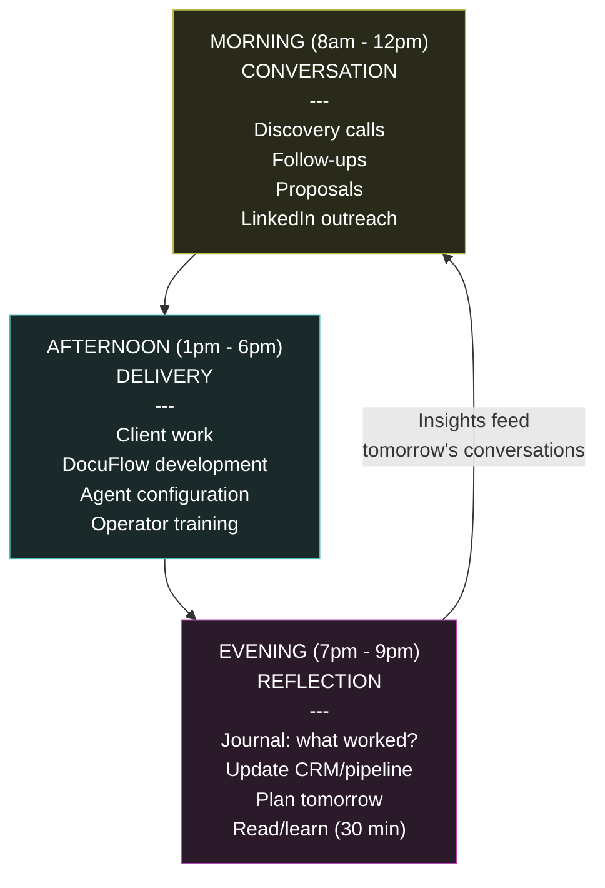
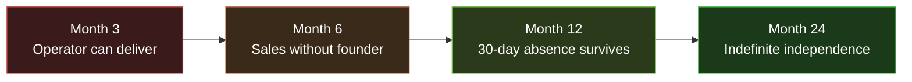

---

sidebar_position: 5
title: "Founder Discipline Doctrine"
description: "The personal operating system for the founding period — weekly rhythm, daily cadence, seven iron rules, irreversibility tests, and the exit test that proves the ecosystem can survive without you."
tags: [execution, operational, governance]
custom_status: active
custom_owner: Andrew Leo
custom_last_review: 2026-03-01
custom_next_review: 2026-06-01
---

# Founder Discipline Doctrine

The ecosystem's greatest asset and greatest liability is the same thing: **the founder**. This document defines the personal operating system that prevents the founder from becoming the bottleneck, the single point of failure, and the primary risk to execution.

Discipline is not motivation. Motivation fluctuates. Discipline is a system that produces output regardless of emotional state.

---

## Weekly Rhythm

Every week follows the same structure. No exceptions. No "this week is different." The rhythm exists precisely so that decision fatigue does not consume the founder's cognitive capacity.

### Weekly Non-Negotiables

| Day | Primary Focus | Minimum Output | Time Allocation |
|---|---|---|---|
| **Monday** | Revenue | 1 proposal sent or 1 deal advanced | 80% revenue, 20% admin |
| **Tuesday** | Product | 1 feature shipped or 1 bug fixed | 80% building, 20% planning |
| **Wednesday** | Customers | 2 conversations (discovery or check-in) | 80% external, 20% internal |
| **Thursday** | Architecture | 1 design decision documented | 60% design, 40% documentation |
| **Friday** | Operators | 1 operator interaction (recruit, train, or review) | 60% delegation, 40% process |
| **Saturday** | Overflow + Learning | Catch up on missed items, read, research | Flexible |
| **Sunday** | Planning + Rest | Next week planned, energy restored | 20% planning, 80% rest |

### Weekly Review Checklist (Sunday Evening, 30 minutes)

- [ ] Revenue update: what closed, what advanced, what stalled?
- [ ] Product update: what shipped, what is blocked?
- [ ] Customer update: who is happy, who is at risk?
- [ ] Pipeline update: conversations scheduled for next week?
- [ ] Energy check: am I sustainable at this pace?
- [ ] Kill check: is anything failing that should be stopped?

---

## The 7 Rules of Discipline

These are not aspirational guidelines. They are hard constraints enforced through weekly review. Violating any rule triggers an immediate corrective action.

### Rule 1: No Feature Without 90-Day Revenue Connection

Every feature, every line of code, every system design must trace to a paying customer within 90 days. If it cannot, it does not get built.

| Test | Pass | Fail |
|---|---|---|
| "Which customer asked for this?" | Named customer with stated need | "Nobody yet, but they will" |
| "When will this generate revenue?" | "Within 90 days, here is the path" | "Eventually, when the platform scales" |
| "What is the revenue per hour of build time?" | &gt;$100/hr equivalent | &lt;$10/hr or unknowable |

**Corrective Action:** Stop building. Open LinkedIn. Send a message.

---

### Rule 2: No Platform Before PMF

The urge to build a platform is the strongest form of procrastination available to a technical founder. Platforms are Phase 4. Product-market fit is Phases 1-2.

| PMF Signal | Not PMF |
|---|---|
| Customers refer without being asked | Customers need convincing |
| Inbound inquiries exceed outbound | All business is outbound |
| Retention &gt;80% after 3 months | Churn &gt;30% monthly |
| Willingness to pay increases | Price resistance increases |

**Corrective Action:** Delete the Figma file. Close the architecture document. Make a phone call.

---

### Rule 3: No Hiring Before Agent Automation

Before hiring a human for any task, prove that an AI agent cannot do it. The cost of a human is $50-200K/year. The cost of an agent is $50-500/month.

| Task | Agent First | Human Only If |
|---|---|---|
| Data entry | Automated pipeline | Agent accuracy &lt;90% after tuning |
| Report generation | Template + LLM | Client requires human sign-off |
| Scheduling | Cal.com + automation | Relationship requires personal touch |
| Research | Agent-driven analysis | Judgment calls requiring domain expertise |
| Delivery | Agent-assisted workflow | Client contractually requires human |

**Corrective Action:** Build the agent. If it fails after 2 weeks of tuning, then consider a human.

---

### Rule 4: No Fundraising Before Sustainable Revenue

External capital at this stage creates three deadly problems:
1. **Misaligned incentives** -- investors want hockey sticks, the ecosystem needs methodical compounding
2. **Premature scaling** -- capital enables hiring and building before PMF
3. **Accountability distortion** -- reporting to investors replaces reporting to customers

| Acceptable Capital | Unacceptable Capital |
|---|---|
| Customer revenue | Venture capital (pre-PMF) |
| Client prepayments | Angel investment (pre-revenue) |
| Service retainers | Grants (with strings attached) |
| Self-funding from savings | Friends and family loans |

**Corrective Action:** Close one more deal instead.

---

### Rule 5: No Horizontal Before Vertical Dominance

Expanding to a second vertical before dominating the first is a death sentence. "Dominance" means:

| Dominance Indicator | Threshold |
|---|---|
| Market recognition | Known by 20+ decision-makers in vertical |
| Revenue concentration | 60%+ of revenue from primary vertical |
| Case studies | 3+ published with quantified outcomes |
| Referral rate | 30%+ of new business from referrals |
| Pricing power | Ability to increase prices without losing clients |

**Corrective Action:** Go deeper in the current vertical. Call the next prospect on the list.

---

### Rule 6: No Infrastructure Before Customer Demand

The ORF (Obligation Resolution Framework), PIAR, identity systems, and marketplace are Phase 4+ capabilities. Building them before customers demand them is architecture seduction.

| Build Now | Build Later |
|---|---|
| Landing page | Protocol layer |
| Proposal template | Marketplace |
| CRM tracking | Identity infrastructure |
| DocuFlow MVP | ORF |
| Invoice system | Agent routing protocol |

**Corrective Action:** Ask "which customer asked for this?" If the answer is nobody, stop.

---

### Rule 7: No Theory Without Executable Output

Every strategy session, architecture discussion, or documentation effort must produce an executable action within 48 hours. Theory that does not produce action is procrastination with intellectual camouflage.

| Acceptable Output | Unacceptable Output |
|---|---|
| "Based on this analysis, I will call 5 COOs tomorrow" | "This analysis reveals interesting structural patterns" |
| "This design means DocuFlow needs feature X by Friday" | "This design shows the elegance of the 7-layer model" |
| "This risk register means I should not do Y this week" | "This risk register is comprehensive and well-organized" |

**Corrective Action:** Add a "Next Action" line to every document. Execute it before writing the next document.

---

## Compounding Daily Cadence

The founder's day compounds three activities that feed each other:

| Time Block | Duration | Activity Type | Energy Level |
|---|---|---|---|
| **6:00-7:00** | 1 hr | Exercise, preparation | Physical reset |
| **7:00-8:00** | 1 hr | Planning, email, admin | Low-cognitive warm-up |
| **8:00-12:00** | 4 hrs | Conversations (calls, outreach, proposals) | Peak cognitive (external) |
| **12:00-1:00** | 1 hr | Lunch, walk, reset | Recovery |
| **1:00-6:00** | 5 hrs | Delivery (client work, product, agents) | Sustained cognitive (internal) |
| **6:00-7:00** | 1 hr | Dinner, transition | Recovery |
| **7:00-9:00** | 2 hrs | Reflection, learning, planning | Low-cognitive wind-down |
| **9:00+** | -- | Rest. No work. | Sleep is a competitive advantage. |

---

## Year 1 Irreversibility Tests

Three tests that prove the founder has internalized discipline over ego:

### Test 1: Kill a Politically Inconvenient Venture

**Scenario:** A venture or product that the founder is personally attached to -- perhaps one that has been designed in great detail -- shows no market traction after 60 days.

**Passing:** Kill it publicly. Announce the kill. Redirect all resources to what is working.

**Failing:** Keep it alive "because we have already invested so much" (sunk cost fallacy) or "because it will work eventually" (hope as strategy).

---

### Test 2: PCI-Triggered Spin-Off

**Scenario:** A product or capability within the ecosystem grows to the point where it would be better served as an independent entity with its own governance.

**Passing:** Spin it off. Give it independence. Accept that the ecosystem is smaller but healthier.

**Failing:** Keep it inside because "we might need it" or "it is part of the vision."

---

### Test 3: Reject Capital That Demands Protocol Exceptions

**Scenario:** An investor offers significant capital but requires the ecosystem to violate one of its constitutional constraints (e.g., skip the Atomic Constraint, bypass governance protocols, accelerate past a phase gate).

**Passing:** Reject the capital. Explain why. Find alternative funding.

**Failing:** Accept the capital and rationalize the exception. "Just this once" becomes "always."

---

## Founder Exit Test

The ultimate test of founder discipline:

> **"If you disappear tomorrow, does everything continue?"**

This test is applied progressively:

| Timeline | Exit Test Level | Passing Criteria |
|---|---|---|
| Month 3 | Can an operator deliver a Chokepoint Sprint without you? | Documented playbook, one successful operator delivery |
| Month 6 | Can sales happen without you on every call? | Operator or partner closes a deal independently |
| Month 12 | Can the ecosystem operate for 30 days without you? | Revenue, delivery, and growth continue for a month |
| Month 24 | Can the ecosystem operate indefinitely without you? | Self-sustaining operations, governance, and growth |

**If the answer is "no" at any checkpoint, the founder has failed to build a system and has instead built a job.**

---

## Discipline Failure Recovery Protocol

When discipline fails (and it will), the recovery protocol is:

1. **Acknowledge** -- write down exactly what rule was violated and why
2. **Quantify** -- estimate the cost in time, money, or opportunity
3. **Correct** -- take the corrective action specified for that rule
4. **Prevent** -- add a trigger or check that makes the violation harder to repeat
5. **Continue** -- do not spiral into self-recrimination; execute the next action

> Discipline is not perfection. It is the speed of recovery after imperfection.
