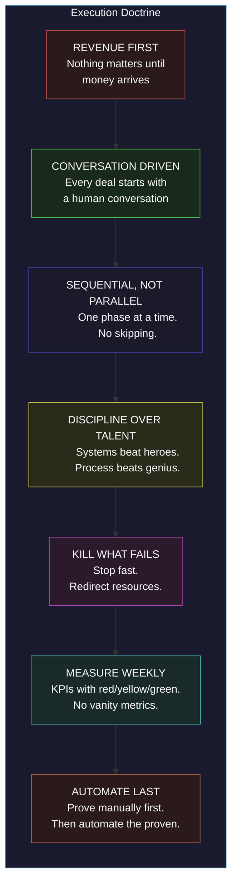
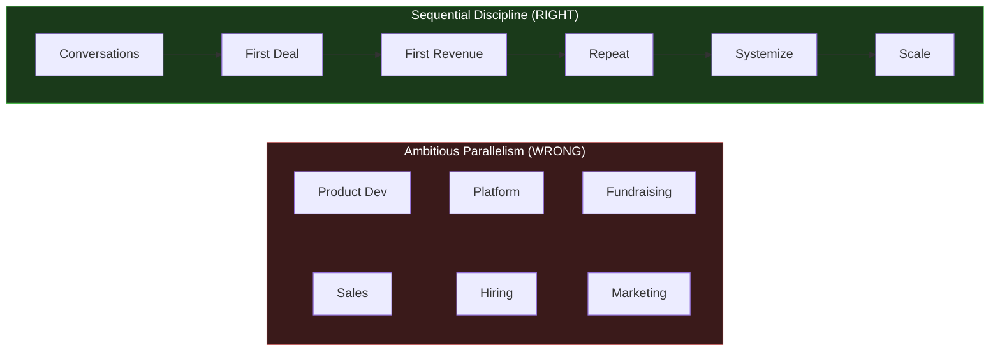

# Execution & Operations

> **"Slow is smooth, smooth is speed."**

This is the execution layer of the AINEFF Ecosystem. Everything in the vision, blueprint, and architecture layers is irrelevant until it generates revenue, serves a customer, and compounds into structural advantage. This section contains the operational doctrine that converts 535,000+ lines of strategy into cash flow, customers, and defensible terrain.

---

## Current State vs. Target State

| Dimension | Current State | 90-Day Target | Year 1 Target | Year 3 Target |
|---|---|---|---|---|
| **Revenue** | $0/month | $15K/month | $19K/month avg ($228K annual) | $283K/month ($3.4M annual) |
| **Customers** | 0 | 3 | 12-20 | 100+ |
| **Products Live** | 0 | DocuFlow MVP | DocuFlow + Chokepoint | Full product suite |
| **Operators** | 0 | 0 | 2-3 | 15+ |
| **Strategy Lines** | 535,856+ | 535,856+ | 540,000+ | 600,000+ |
| **Agent Tasks/Day** | 0 | 5 | 50+ | 500+ |
| **Cash Position** | $1,000 | $15K+ | $50K+ | $500K+ |

The gap between current state and target is not bridged by ambition. It is bridged by **disciplined sequential execution** -- one conversation, one deal, one delivery at a time.

---

## The Execution Doctrine

---

## Seven Non-Negotiable Discipline Rules

These rules are not guidelines. They are hard constraints. Violating any one of them is grounds for a full execution review.

| # | Rule | Rationale | Violation Indicator |
|---|---|---|---|
| 1 | **No feature without 90-day revenue connection** | Every line of code must trace to a paying customer within 90 days | Building infrastructure nobody asked for |
| 2 | **No platform before PMF** | Platforms are Phase 4. Product-market fit is Phase 1-2. | Designing marketplaces before closing 3 deals |
| 3 | **No hiring before agent automation** | If a task can be automated by an AI agent, do that first | Posting job listings before deploying agents |
| 4 | **No fundraising before sustainable revenue** | External capital creates misaligned incentives at this stage | Pitch decks before revenue dashboards |
| 5 | **No horizontal before vertical dominance** | Own one vertical completely before expanding to the next | Selling to 5 industries with 0 dominance in any |
| 6 | **No infrastructure before customer demand** | Build only what customers are actively requesting | ORF development before Month 18 |
| 7 | **No theory without executable output** | Every strategy document must produce an action within 48 hours | Strategy sessions that generate documents but no tasks |

---

## Philosophy: Methodical Execution Beats Ambitious Parallelism

The natural instinct of a founder with 535,000+ lines of strategy is to execute everything simultaneously. This instinct is fatal.

**Why parallelism fails at this stage:**

- **Resource fragmentation** -- $1,000 capital and one founder cannot sustain parallel workstreams
- **Feedback delay** -- parallel execution delays learning because you cannot isolate what is working
- **Cognitive overload** -- context-switching between 10 workstreams produces 0 excellent outputs
- **Kill discipline failure** -- when everything runs in parallel, nothing gets killed because nothing has enough data to evaluate

**Why sequential execution wins:**

- **Full attention** -- one workstream gets 100% of founder energy
- **Fast feedback** -- sequential execution produces data in days, not months
- **Clear kill signals** -- when only one thing is running, success or failure is unambiguous
- **Compounding** -- each phase creates the foundation for the next; skipping phases creates debt

---

## Execution Section Map

| Document | Purpose | Key Question Answered |
|---|---|---|
| [7-Phase Progression](./7-phases) | Full lifecycle from $0 to $400K+/mo | What does the complete journey look like? |
| [90-Day Sprint Plan](./90-day-sprint) | Week-by-week first quarter execution | What do I do this week? |
| [30-Day Action Plan](./30-day-plan) | Day-by-day first month with $1,000 | What do I do today? |
| [Founder Discipline Doctrine](./founder-discipline) | Weekly rhythm and personal operating system | How do I stay disciplined? |
| [Kill Discipline](./kill-criteria) | When and how to terminate ventures | When do I stop? |
| [Risk Register](./risk-register) | Top 20 risks with mitigations | What could go wrong? |
| [Financial Model](./financial-model) | 3-year revenue and cost projections | What are the numbers? |
| [KPI Dashboard](./kpi-dashboard) | 12 KPIs with tracking thresholds | How do I measure progress? |
| [Sales Conversation Framework](./conversation-framework) | CONNECT-ASK-QUANTIFY-OFFER methodology | How do I sell? |
| [The 10 Traps](./10-traps) | Things NOT to do until $50K revenue | What should I avoid? |
| [Deployment & Rollout Strategy](./deployment-sequencing) | Global deployment and disruption timeline | How does this scale globally? |
| [Compounding Leverage Model](./compounding-leverage) | Seven asset classes and growth trajectories | How does value compound? |

---

## The Only Metric That Matters

At this stage, there is exactly one metric that matters:

> **Monthly revenue from paying customers.**

Everything else -- strategy lines, architecture elegance, system design, vision clarity -- is a **leading indicator at best** and a **distraction at worst**. Revenue is the only trailing indicator that proves the ecosystem is real.

When revenue arrives, it funds everything. When it does not, nothing else matters.

**Open LinkedIn. Find one COO. Send one message. Everything else is procrastination.**
