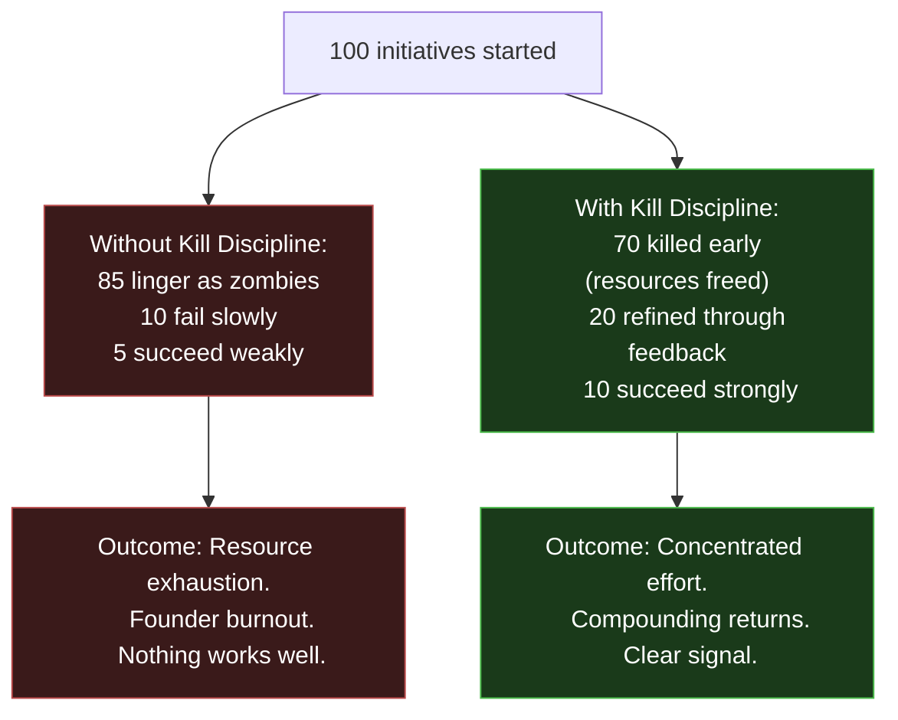
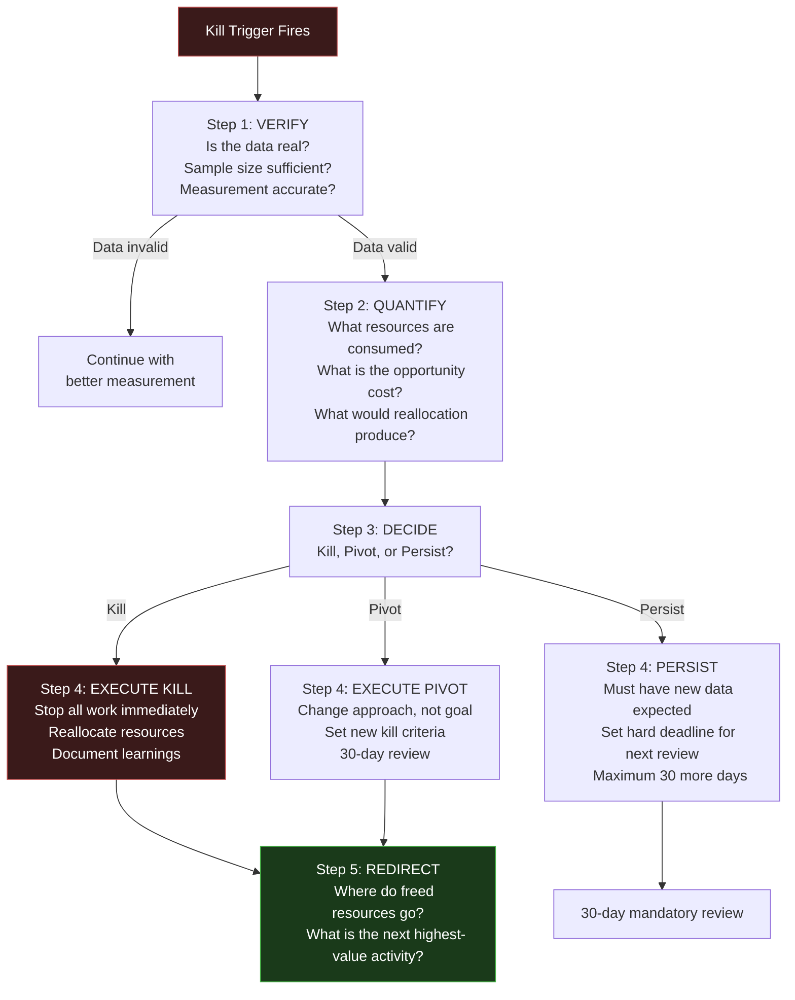

---

sidebar_position: 6
title: "Kill Discipline"
description: "When and how to terminate ventures, features, products, and systems — the most important discipline in the ecosystem. Most failures come from over-building, not under-building."
tags: [execution, operational, governance, atomic-constraint, risk]
custom_status: active
custom_owner: Andrew Leo
custom_last_review: 2026-03-01
custom_next_review: 2026-06-01
---

# Kill Discipline

The most important skill in building an ecosystem is not starting things. It is **stopping things**. Every venture, feature, product, and system must earn its continued existence through measurable contribution. Anything that does not contribute is consuming resources that should be directed elsewhere.

> **Most ecosystems fail from over-building, not under-building.**

---

## Why Kill Discipline Matters

The mathematics are simple:
- **10 initiatives at 10% effort each** = 0 outcomes (nothing gets enough energy to succeed)
- **2 initiatives at 50% effort each** = 1-2 outcomes (concentrated energy produces results)
- **1 initiative at 100% effort** = 1 strong outcome (maximum signal, fastest learning)

Kill discipline is what converts the first scenario into the third.

---

## Kill Criteria by Phase

### Phase 1: First Revenue (Months 1-3)

| What to Kill | Kill Trigger | Timeline | Action After Kill |
|---|---|---|---|
| Current outreach channel | &lt;10% response rate after 50 messages | 14 days | Switch to different channel or messaging |
| Current target vertical | Zero qualified conversations after 20 outreach attempts | 21 days | Switch vertical, apply same methodology |
| Current pricing | 100% price objection on 3+ proposals | 21 days | Restructure pricing (lower entry, higher value) |
| Current positioning | Prospects do not understand what you do after 30-second pitch | 14 days | Rewrite positioning from scratch |
| DocuFlow MVP feature | Zero usage after 14 days of availability | 14 days | Remove feature, redirect development effort |
| Any activity not generating conversations | Time spent without pipeline advancement | 7 days | Stop activity, allocate time to outreach |

### Phase 2: Scale & Systemize (Months 4-6)

| What to Kill | Kill Trigger | Timeline | Action After Kill |
|---|---|---|---|
| Operator candidate | Cannot deliver independently after 3 supervised engagements | 45 days | Release operator, simplify delivery, try next candidate |
| DocuFlow feature set | User churn &gt;20% monthly for 2 consecutive months | 60 days | Major product pivot or scope reduction |
| Enterprise sales effort | Zero enterprise interest after 15 targeted outreach attempts | 30 days | Return focus to SMB, revisit enterprise in Phase 3 |
| Marketing channel | &lt;2% conversion rate after $500 equivalent effort | 30 days | Kill channel, try next one |
| Partnership exploration | No signed agreement after 3 meetings | 45 days | Deprioritize, focus on direct sales |

### Phase 3: Verticalize (Months 7-9)

| What to Kill | Kill Trigger | Timeline | Action After Kill |
|---|---|---|---|
| Primary vertical | &lt;60% revenue concentration despite 90 days of focus | 90 days | Switch to vertical showing strongest organic signal |
| Governance module | Zero enterprise adoption after 60-day pilot | 60 days | Simplify to compliance checklist, not full module |
| Copilot integration | User satisfaction &lt;60% after 30-day beta | 30 days | Revert to manual workflow, redesign copilot |
| Conference/speaking strategy | Zero leads from 3 speaking engagements | 90 days | Kill conference budget, redirect to direct outreach |
| Second vertical exploration | Cannibalizing primary vertical attention | Immediate | Kill immediately, return to primary vertical |

### Phase 4: Platform (Months 10-12)

| What to Kill | Kill Trigger | Timeline | Action After Kill |
|---|---|---|---|
| Marketplace | Zero third-party listings after 90-day launch | 90 days | Kill marketplace, remain a vertical tool company |
| PIAR protocol | Cannot achieve reliable agent routing after 60 days dev | 60 days | Simplify to direct API integrations |
| Identity infrastructure | No customer demand signal from 10+ conversations | 30 days | Defer to Phase 5 or later |
| Platform revenue model | Platform revenue &lt;5% of total at Month 12 | 90 days | Remain services-first, platform is additive only |

---

## Mandatory Kill Triggers

These triggers apply regardless of phase. They are non-negotiable.

| # | Trigger | Threshold | Immediate Action |
|---|---|---|---|
| 1 | **Founder health crisis** | Physical or mental health significantly impaired | Pause all non-essential activity. Health first. |
| 2 | **Cash runway &lt;30 days** | Cannot cover 30 days of minimum expenses | Emergency revenue: take any consulting gig available |
| 3 | **Zero revenue at Day 90** | $0 collected after 90 days of execution | Full strategic review. Consider pivot or shutdown. |
| 4 | **Key dependency failure** | Critical tool, platform, or partner ceases to exist | Migrate within 14 days or kill dependent product |
| 5 | **Legal/regulatory threat** | Cease and desist, lawsuit, or regulatory action | Pause affected activity, seek legal counsel immediately |
| 6 | **Ethical violation** | Any activity that violates Atomic Constraint | Kill immediately. No exceptions. No "just this once." |
| 7 | **Sunk cost escalation** | Spending more to justify past spending | Kill immediately. Past spending is irrelevant to future decisions. |

---

## The Kill Decision Framework

When a kill trigger fires, follow this framework:

### The Three Valid Responses to a Kill Trigger

| Response | When Appropriate | Requirement |
|---|---|---|
| **Kill** | Data clearly shows failure. No reasonable path to recovery. | Immediate resource reallocation. |
| **Pivot** | Goal is valid but approach is wrong. New approach identified. | New kill criteria set. 30-day max timeline. |
| **Persist** | New data expected that could change the picture. | Hard deadline. No more than 30 additional days. |

**"Persist" is the most dangerous option.** It is the default choice of founders who cannot let go. Every "persist" decision must come with a hard deadline and specific data point that would change the decision.

---

## Exit Orchestration Procedures

Killing a venture, product, or feature is not just "stopping work." It requires orderly shutdown.

### For Client-Facing Products/Services

1. **Notify affected clients** -- 30 days advance notice minimum
2. **Complete in-progress engagements** -- honor all commitments
3. **Provide transition support** -- help clients find alternatives
4. **Document learnings** -- what worked, what failed, why
5. **Archive all assets** -- code, documents, client records
6. **Reallocate resources** -- people, time, and money to next priority

### For Internal Systems/Features

1. **Stop all development immediately** -- no "one more feature"
2. **Migrate dependent systems** -- ensure nothing breaks
3. **Archive code and documentation** -- preserve for future reference
4. **Reallocate development time** -- to highest-priority feature
5. **Document the kill** -- reason, data, and lessons learned

### For Operator Relationships

1. **Honest conversation** -- explain the decision and reasoning
2. **Honor financial commitments** -- pay everything owed
3. **Provide references** -- support their next opportunity
4. **Maintain relationship** -- they may be valuable in the future
5. **Document the experience** -- improve operator selection criteria

---

## The Kill Discipline Manifesto

1. **Killing is not failure.** Failure is continuing to invest in something that is not working.
2. **Speed of kill is a competitive advantage.** The faster you kill, the faster you reallocate.
3. **Emotional attachment is the enemy of kill discipline.** The more you love it, the more objectively you must evaluate it.
4. **Sunk costs are irrelevant.** The money, time, and energy already spent cannot be recovered. Only future allocation matters.
5. **Every resource consumed by a zombie is stolen from a winner.** Resources are finite. Zombies are infinite.
6. **The kill decision is the founder's most important decision.** More ecosystems die from what they refuse to kill than from what they fail to build.

---

## Kill Audit Schedule

| Frequency | Scope | Method |
|---|---|---|
| **Weekly** | All active features and initiatives | Sunday review: "What should I stop?" |
| **Monthly** | All products and revenue streams | Monthly financial review: "What is not earning?" |
| **Quarterly** | All ventures and strategic bets | Quarterly strategic review: "What has not proven itself?" |
| **Phase Gate** | Entire phase exit criteria | Phase transition: "Did this phase deliver what it promised?" |

> **The discipline of stopping is harder than the discipline of starting. Master it, and you master execution.**
