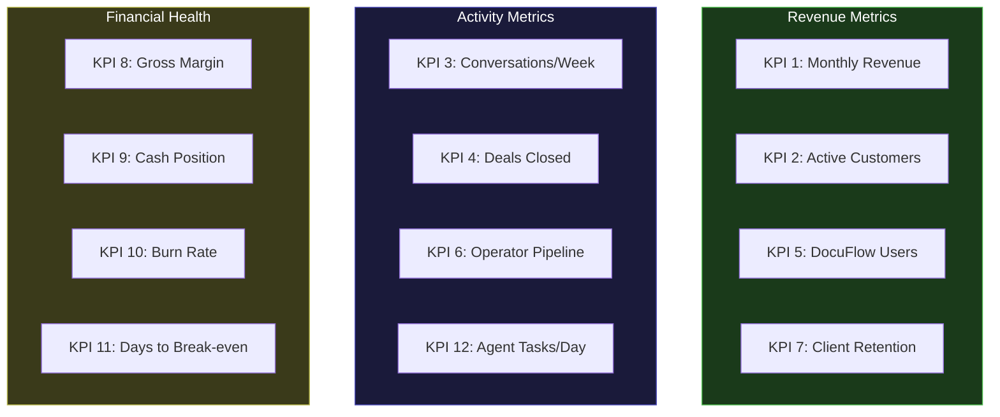

---

sidebar_position: 9
title: "KPI Dashboard"
description: "12 key performance indicators with weekly and monthly tracking, conditional formatting thresholds (Green/Yellow/Red), and the measurement system that prevents vanity metrics."
tags: [execution, operational, financial]
custom_status: active
custom_owner: Andrew Leo
custom_last_review: 2026-03-01
custom_next_review: 2026-06-01
---

# KPI Dashboard

Twelve metrics. Tracked weekly. Color-coded. No vanity metrics. Every KPI connects directly to ecosystem survival and growth. If a metric is green, continue. If yellow, investigate. If red, act immediately.

---

## Dashboard Overview



---

## KPI Summary Table

| # | KPI | Frequency | Green | Yellow | Red | Current Target |
|---|---|---|---|---|---|---|
| 1 | Monthly Revenue | Weekly | Above target | 75-100% of target | &lt;75% of target | Phase-dependent |
| 2 | Active Customers | Weekly | Growing MoM | Flat | Declining | Phase-dependent |
| 3 | Conversations/Week | Weekly | 5+ | 3-4 | &lt;3 | 5 minimum |
| 4 | Deals Closed (Monthly) | Monthly | 2+ | 1 | 0 | 2/month |
| 5 | DocuFlow Users | Weekly | Growing 15%+ MoM | Growing 5-15% | Flat or declining | Phase-dependent |
| 6 | Operator Pipeline | Monthly | 2+ candidates | 1 candidate | 0 candidates | 1+ by Month 3 |
| 7 | Client Retention | Monthly | &gt;90% | 75-90% | &lt;75% | &gt;90% |
| 8 | Gross Margin | Monthly | &gt;80% | 65-80% | &lt;65% | 85% |
| 9 | Cash Position | Weekly | &gt;6 months runway | 3-6 months | &lt;3 months | Growing |
| 10 | Burn Rate | Monthly | &lt;50% of revenue | 50-80% | &gt;80% | &lt;30% |
| 11 | Days to Break-even | Monthly | Achieved | &lt;60 days away | &gt;60 days / receding | Month 2 |
| 12 | Agent Tasks/Day | Weekly | Above target | 50-100% of target | &lt;50% of target | Phase-dependent |

---

## Detailed KPI Specifications

### KPI 1: Monthly Revenue

**Why it matters:** Revenue is the ultimate validation that the ecosystem creates value someone will pay for. Everything else is a leading indicator.

| Threshold | Phase 1 (Mo 1-3) | Phase 2 (Mo 4-6) | Phase 3 (Mo 7-9) | Phase 4 (Mo 10-12) |
|---|---|---|---|---|
| **Green** | &gt;$10K/mo | &gt;$20K/mo | &gt;$35K/mo | &gt;$60K/mo |
| **Yellow** | $5-10K/mo | $15-20K/mo | $25-35K/mo | $45-60K/mo |
| **Red** | &lt;$5K/mo | &lt;$15K/mo | &lt;$25K/mo | &lt;$45K/mo |

**Measurement:** Bank deposits + invoiced amounts. Not pipeline. Not "expected." Only money received or contractually committed.

**Red Action:** Immediately increase conversation rate by 50%. Review pricing. Review positioning. Open kill review for non-revenue activities.

---

### KPI 2: Active Customers

**Why it matters:** Customer concentration risk. Revenue from 1 customer is fragile. Revenue from 10 is resilient.

| Threshold | Phase 1 | Phase 2 | Phase 3 | Phase 4 |
|---|---|---|---|---|
| **Green** | 3+ | 8+ | 15+ | 25+ |
| **Yellow** | 2 | 5-7 | 10-14 | 15-24 |
| **Red** | 0-1 | &lt;5 | &lt;10 | &lt;15 |

**Measurement:** Customers who have paid in the last 60 days or have an active contract.

**Red Action:** Pipeline crisis. Double outbound activity. Consider pricing reduction for volume.

---

### KPI 3: Conversations per Week

**Why it matters:** Conversations are the leading indicator for everything else. No conversations = no deals = no revenue.

| Threshold | All Phases |
|---|---|
| **Green** | 5+ conversations/week |
| **Yellow** | 3-4 conversations/week |
| **Red** | &lt;3 conversations/week |

**Definition of "conversation":** A meaningful exchange with a potential, current, or past customer. Discovery call, check-in call, proposal discussion, or referral conversation. LinkedIn messages do not count unless they lead to a scheduled call.

**Red Action:** Drop everything else. Monday through Friday is now conversation-only. No product work, no architecture, no admin until conversations are back to green.

---

### KPI 4: Deals Closed (Monthly)

**Why it matters:** Conversion rate from conversations to revenue. Measures sales effectiveness.

| Threshold | Phase 1 | Phase 2 | Phase 3 | Phase 4 |
|---|---|---|---|---|
| **Green** | 2+/month | 3+/month | 4+/month | 5+/month |
| **Yellow** | 1/month | 2/month | 3/month | 4/month |
| **Red** | 0/month | 0-1/month | &lt;2/month | &lt;3/month |

**Measurement:** Signed agreement with payment terms. Verbal commitments do not count.

**Red Action:** Review proposals. Are they clear? Compelling? Priced correctly? Get feedback from prospects who declined. Adjust offer structure.

---

### KPI 5: DocuFlow Active Users

**Why it matters:** Product adoption validates product-market fit. User growth without marketing spend indicates organic demand.

| Threshold | Phase 1 | Phase 2 | Phase 3 | Phase 4 |
|---|---|---|---|---|
| **Green** | 10+ | 100+ | 300+ | 500+ |
| **Yellow** | 5-9 | 50-99 | 150-299 | 300-499 |
| **Red** | &lt;5 | &lt;50 | &lt;150 | &lt;300 |

**Measurement:** Users who have logged in and performed a meaningful action in the last 7 days.

**Red Action:** Talk to churned users. Why did they leave? What feature is missing? What competitor did they switch to? Fix the top reason before adding any new features.

---

### KPI 6: Operator Pipeline

**Why it matters:** Operators are the scaling mechanism. Without operators, the founder is the bottleneck.

| Threshold | Phase 1 | Phase 2 | Phase 3+ |
|---|---|---|---|
| **Green** | 1+ candidate identified | 2+ in training | 3+ active, 2+ candidates |
| **Yellow** | Searching actively | 1 in training | 2 active, 1 candidate |
| **Red** | Not searching | 0 in pipeline | &lt;2 active, 0 candidates |

**Measurement:** Candidates in active conversation, operators in training, operators delivering independently.

**Red Action:** Allocate 20% of Friday to operator recruitment. Post in relevant communities. Ask existing network for referrals.

---

### KPI 7: Client Retention Rate

**Why it matters:** Retention proves value delivery. High retention means clients need you. Low retention means you are "nice to have."

| Threshold | All Phases |
|---|---|
| **Green** | &gt;90% (monthly) |
| **Yellow** | 75-90% (monthly) |
| **Red** | &lt;75% (monthly) |

**Measurement:** (Clients at end of month who were clients at start of month) / (Clients at start of month). Excludes new acquisitions.

**Red Action:** Call every churned client within 48 hours. Ask why. Document. Fix the top reason. If systemic, consider major product/service pivot.

---

### KPI 8: Gross Margin

**Why it matters:** Margin determines how much of every dollar of revenue fuels growth. Low margins mean working harder but not growing.

| Threshold | All Phases |
|---|---|
| **Green** | &gt;80% |
| **Yellow** | 65-80% |
| **Red** | &lt;65% |

**Measurement:** (Revenue - Direct Costs) / Revenue. Direct costs include: compute, delivery labor (including operator compensation), and tool costs directly tied to client work.

**Red Action:** Analyze cost per engagement. Where is margin leaking? Options: raise prices, automate delivery steps, reduce scope, or replace expensive tools.

---

### KPI 9: Cash Position

**Why it matters:** Cash is oxygen. Run out, and everything stops regardless of pipeline or strategy quality.

| Threshold | All Phases |
|---|---|
| **Green** | &gt;6 months of expenses covered |
| **Yellow** | 3-6 months covered |
| **Red** | &lt;3 months covered |

**Measurement:** Current bank balance / average monthly total costs (trailing 3 months).

**Red Action:** Reduce all non-essential spending immediately. Accelerate invoicing. Pursue immediate-payment engagements. Consider emergency consulting.

---

### KPI 10: Burn Rate

**Why it matters:** Burn rate relative to revenue shows whether the ecosystem is growing sustainably or consuming its future.

| Threshold | All Phases |
|---|---|
| **Green** | Costs &lt;50% of revenue |
| **Yellow** | Costs 50-80% of revenue |
| **Red** | Costs &gt;80% of revenue, or revenue is $0 |

**Measurement:** Total monthly costs / Total monthly revenue.

**Red Action:** Freeze all cost increases. Review every subscription, tool, and contractor. Cut anything that does not directly generate revenue within 30 days.

---

### KPI 11: Days to Break-Even

**Why it matters:** Break-even is the point where the ecosystem sustains itself without external capital. Before break-even, you are borrowing from the future.

| Threshold | Phase 1 | Phase 2+ |
|---|---|---|
| **Green** | Achieved (Break-even passed) | Achieved and stable |
| **Yellow** | &lt;30 days away | Revenue dip threatens break-even |
| **Red** | &gt;60 days away or receding | Lost break-even status |

**Measurement:** At current revenue and cost trajectory, how many days until cumulative revenue exceeds cumulative costs?

**Red Action:** This KPI should be green by Month 2-3. If red persists past Month 4, trigger full strategic review.

---

### KPI 12: Agent Tasks per Day

**Why it matters:** Agent automation is the lever that separates linear growth from exponential growth. More agent tasks = more leverage per founder hour.

| Threshold | Phase 1 | Phase 2 | Phase 3 | Phase 4 |
|---|---|---|---|---|
| **Green** | 5+/day | 20+/day | 50+/day | 100+/day |
| **Yellow** | 2-4/day | 10-19/day | 25-49/day | 50-99/day |
| **Red** | &lt;2/day | &lt;10/day | &lt;25/day | &lt;50/day |

**Measurement:** Automated tasks completed by AI agents in a 24-hour period. Includes: data processing, report generation, scheduling, research, and any other automated workflow.

**Red Action:** Review agent configuration. Are agents deployed on the right tasks? Are they failing silently? Invest 4 hours in agent improvement before hiring a human.

---

## Dashboard Tracking Template

### Weekly Dashboard (Fill Every Sunday)

| KPI | This Week | Last Week | Trend | Status |
|---|---|---|---|---|
| Monthly Revenue (projected) | $ | $ | Up/Down/Flat | Green/Yellow/Red |
| Active Customers | # | # | Up/Down/Flat | Green/Yellow/Red |
| Conversations This Week | # | # | Up/Down/Flat | Green/Yellow/Red |
| Deals Closed (MTD) | # | # | Up/Down/Flat | Green/Yellow/Red |
| DocuFlow Active Users | # | # | Up/Down/Flat | Green/Yellow/Red |
| Operator Pipeline | # | # | Up/Down/Flat | Green/Yellow/Red |
| Client Retention (MTD) | % | % | Up/Down/Flat | Green/Yellow/Red |
| Gross Margin (MTD) | % | % | Up/Down/Flat | Green/Yellow/Red |
| Cash Position | $ | $ | Up/Down/Flat | Green/Yellow/Red |
| Burn Rate | % | % | Up/Down/Flat | Green/Yellow/Red |
| Days to Break-even | # | # | Up/Down/Flat | Green/Yellow/Red |
| Agent Tasks/Day | # | # | Up/Down/Flat | Green/Yellow/Red |

### Conditional Formatting Rules

```
IF status = RED for any KPI:
  → Add to "Immediate Action Items" list
  → Address in Monday morning planning
  → Cannot be ignored for more than 7 days

IF status = RED for 3+ KPIs simultaneously:
  → Trigger emergency review
  → Consider scope reduction
  → Focus only on revenue-generating activities

IF status = GREEN for all 12 KPIs:
  → Consider increasing targets by 20%
  → Look for the next constraint
  → This is rare -- enjoy it briefly, then push harder
```

---

## Anti-Vanity Metrics

These metrics are explicitly excluded from the dashboard because they feel good but do not matter:

| Vanity Metric | Why It Does Not Matter | What to Track Instead |
|---|---|---|
| LinkedIn followers | Followers do not pay invoices | Conversations/week |
| Website traffic | Traffic does not close deals | Deals closed |
| Strategy document pages | Pages do not generate revenue | Revenue |
| Features shipped | Features without users are waste | DocuFlow active users |
| Meetings held | Meetings are not outcomes | Deals closed from meetings |
| Lines of code written | Code without users is liability | Agent tasks/day |
| Proposals sent | Proposals are inputs, not outputs | Close rate |
| Hours worked | Hours are inputs, not outcomes | Revenue per hour |

> **If a metric makes you feel good without making the ecosystem healthier, it is a vanity metric. Delete it from your dashboard.**
