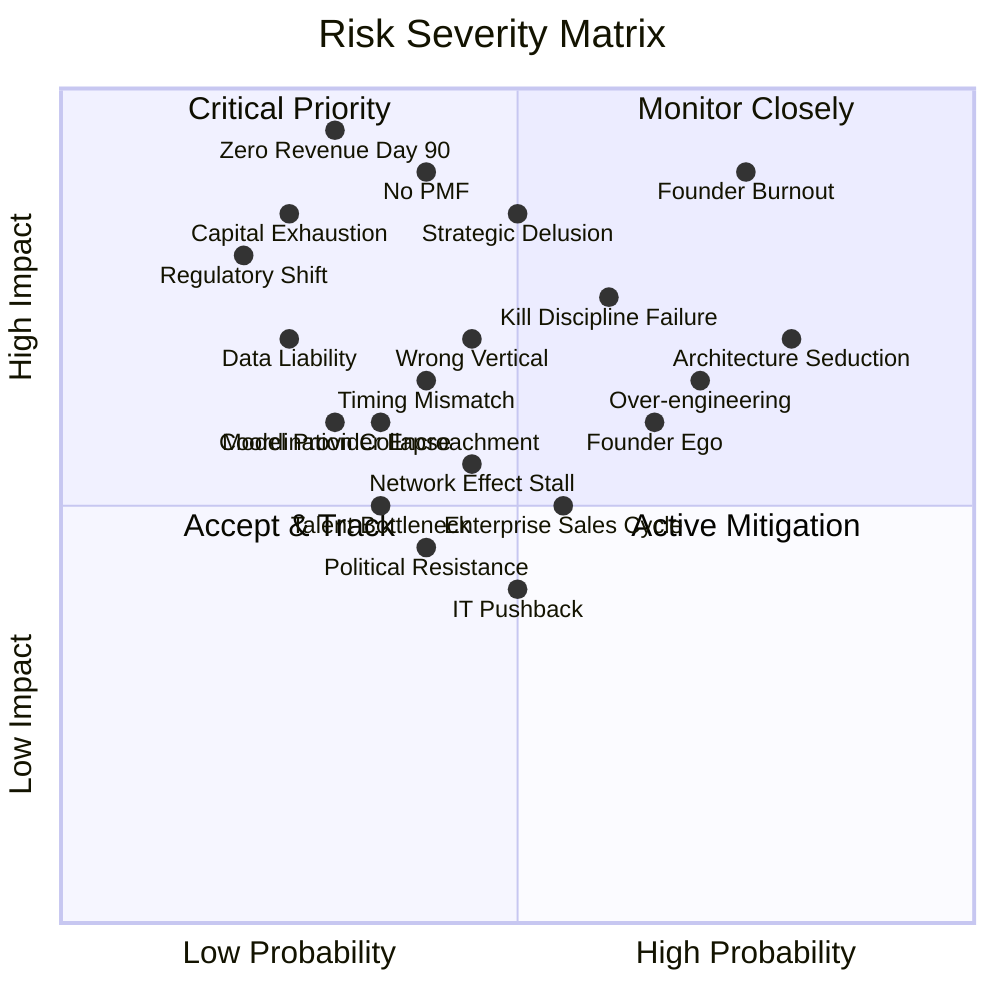

# Risk Register

This register catalogs the 20 highest-probability, highest-impact risks facing the AINEFF Ecosystem. Each risk includes a probability estimate, impact assessment, category classification, mitigation strategy, and trigger indicator that signals the risk is materializing.

Risks are not things to fear. They are things to **monitor, mitigate, and respond to**. The purpose of this register is to ensure no risk arrives as a surprise.

---

## Risk Severity Matrix

---

## Risk Summary Table

| # | Risk | Probability | Impact | Category | Phase Most Critical |
|---|---|---|---|---|---|
| 1 | Founder Burnout | High (75%) | Critical | Operational | Phase 1-2 |
| 2 | Architecture Seduction | Very High (80%) | High | Behavioral | Phase 1 |
| 3 | Over-engineering | High (70%) | High | Technical | Phase 1-2 |
| 4 | Zero Revenue Day 90 | Moderate (30%) | Critical | Financial | Phase 1 |
| 5 | No PMF | Moderate (40%) | Critical | Strategic | Phase 1-2 |
| 6 | Capital Exhaustion | Low (25%) | Critical | Financial | Phase 1 |
| 7 | Kill Discipline Failure | High (60%) | High | Behavioral | Phase 2-3 |
| 8 | Founder Ego | High (65%) | Moderate | Behavioral | Phase 2-4 |
| 9 | Wrong Vertical | Moderate (45%) | High | Strategic | Phase 1-3 |
| 10 | Enterprise Sales Cycle | High (55%) | Moderate | Operational | Phase 2-3 |
| 11 | Political Resistance | Moderate (40%) | Moderate | Market | Phase 3-5 |
| 12 | IT Pushback | Moderate (50%) | Moderate | Market | Phase 2-4 |
| 13 | Model Provider Encroachment | Moderate (35%) | High | Competitive | Phase 3-5 |
| 14 | Network Effect Stall | Moderate (45%) | Moderate | Strategic | Phase 4-5 |
| 15 | Regulatory Shift | Low (20%) | Critical | External | Phase 5-7 |
| 16 | Strategic Delusion | Moderate (50%) | Critical | Behavioral | Phase 1-3 |
| 17 | Talent Bottleneck | Moderate (35%) | Moderate | Operational | Phase 3-5 |
| 18 | Data Liability | Low (25%) | High | Legal | Phase 3-6 |
| 19 | Coordination Collapse | Moderate (30%) | High | Operational | Phase 4-6 |
| 20 | Timing Mismatch | Moderate (40%) | High | Strategic | Phase 1-3 |

---

## Detailed Risk Profiles

### Risk 1: Founder Burnout

| Dimension | Detail |
|---|---|
| **Probability** | High (75%) |
| **Impact** | Critical -- ecosystem halts entirely |
| **Category** | Operational |
| **Description** | Solo founder attempts to execute sales, delivery, product development, architecture, operator management, and administration simultaneously. Cognitive and physical capacity exceeded within 60-90 days. |
| **Trigger Indicators** | Sleep &lt;6 hours consistently; missed weekly rhythm for 2+ weeks; declining conversation quality; emotional decision-making; inability to prioritize |
| **Mitigation Strategy** | Strict daily cadence (morning/afternoon/evening structure); mandatory rest on Sundays; exercise 5x/week; operator recruitment by Month 3 to distribute load; kill non-essential activities aggressively |
| **Contingency** | If burnout occurs: 7-day full stop. Zero work. Then restart with reduced scope -- revenue activities only. |

---

### Risk 2: Architecture Seduction

| Dimension | Detail |
|---|---|
| **Probability** | Very High (80%) |
| **Impact** | High -- months of effort with zero revenue |
| **Category** | Behavioral |
| **Description** | Founder has 535,000+ lines of strategy and architecture. The temptation to refine, extend, and perfect this architecture instead of selling is overwhelming. Architecture work feels productive. It is not. |
| **Trigger Indicators** | Hours spent on architecture documents exceeding hours spent on conversations; new system designs before first sale; excitement about technical elegance over customer pain |
| **Mitigation Strategy** | Thursday is the ONLY architecture day. Rule 7: no theory without executable output within 48 hours. Weekly review question: "How many conversations did I have vs. how many documents did I write?" |
| **Contingency** | If caught in architecture spiral: close all design tools. Open LinkedIn. Send 5 messages before doing anything else. |

---

### Risk 3: Over-engineering

| Dimension | Detail |
|---|---|
| **Probability** | High (70%) |
| **Impact** | High -- product complexity exceeds market need |
| **Category** | Technical |
| **Description** | Building DocuFlow or other products with more features than the market requires. The 74-system architecture creates gravitational pull toward complexity. |
| **Trigger Indicators** | Feature development time exceeding 2 weeks without user validation; features with &lt;10% adoption; codebase complexity growing faster than user base |
| **Mitigation Strategy** | MVP-only approach. No feature without user request. Ship in 48-hour cycles. Every feature must have a named user who asked for it. |
| **Contingency** | If over-engineered: strip product to core 3 features. Delete everything else. Rebuild only what users demand. |

---

### Risk 4: Zero Revenue Day 90

| Dimension | Detail |
|---|---|
| **Probability** | Moderate (30%) |
| **Impact** | Critical -- existential threat |
| **Category** | Financial |
| **Description** | Despite 90 days of execution, no customer has paid for anything. All effort has produced zero revenue. |
| **Trigger Indicators** | Zero proposals accepted by Day 45; declining conversation rate; no repeat interest from any prospect; all feedback negative |
| **Mitigation Strategy** | Kill triggers at Day 21 (zero conversations), Day 45 (zero proposals accepted), Day 60 (zero revenue). Each trigger activates a specific pivot. Maintain emergency consulting capability as fallback. |
| **Contingency** | Full strategic review. Options: (a) pivot positioning entirely, (b) change target market, (c) take traditional consulting work to fund extended runway, (d) pause ecosystem and take employment. |

---

### Risk 5: No PMF (Product-Market Fit)

| Dimension | Detail |
|---|---|
| **Probability** | Moderate (40%) |
| **Impact** | Critical -- growth impossible without PMF |
| **Category** | Strategic |
| **Description** | Customers buy once but do not return. No organic referrals. Price sensitivity remains high. Churn exceeds acquisition. The product solves a problem but not one people urgently pay to solve. |
| **Trigger Indicators** | Retention &lt;50% after 3 months; zero referrals after 10 clients; every deal requires heavy discounting; customers describe product as "nice to have" |
| **Mitigation Strategy** | Weekly customer conversations. Track retention obsessively. Ask "would you be upset if this disappeared?" Survey. Iterate positioning and packaging based on customer language, not founder language. |
| **Contingency** | If no PMF by Month 6: major pivot. Change the product, the market, or both. Do not persist without PMF past Month 9. |

---

### Risk 6: Capital Exhaustion

| Dimension | Detail |
|---|---|
| **Probability** | Low (25%) |
| **Impact** | Critical -- operations cease |
| **Category** | Financial |
| **Description** | Starting capital ($1,000) and early revenue insufficient to cover minimum operating expenses. Cash reaches zero before sustainable revenue. |
| **Trigger Indicators** | Burn rate exceeding revenue by Month 3; cash balance declining toward zero; unexpected expenses (legal, technical) |
| **Mitigation Strategy** | Keep costs at near-zero ($12/month tooling). No hiring. No office. No subscriptions without revenue to support them. Maintain emergency consulting capability. |
| **Contingency** | Emergency revenue: take any consulting engagement that pays immediately. Reduce scope to revenue-only activities. |

---

### Risk 7: Kill Discipline Failure

| Dimension | Detail |
|---|---|
| **Probability** | High (60%) |
| **Impact** | High -- resource drain from zombie initiatives |
| **Category** | Behavioral |
| **Description** | Founder fails to kill underperforming initiatives, features, or ventures. Sunk cost fallacy and emotional attachment prevent rational reallocation of resources. |
| **Trigger Indicators** | More than 5 active initiatives simultaneously; no initiative killed in 90 days; "persist" chosen on every kill review; growing list of "almost ready" projects |
| **Mitigation Strategy** | Weekly kill review (Sunday). Monthly forced ranking of all initiatives. Rule: if you cannot rank it in the top 3, kill it. External accountability partner for kill decisions. |
| **Contingency** | If kill discipline has failed: declare "kill week." Evaluate everything. Kill at least 50% of active initiatives. |

---

### Risk 8: Founder Ego

| Dimension | Detail |
|---|---|
| **Probability** | High (65%) |
| **Impact** | Moderate -- poor decisions, missed signals |
| **Category** | Behavioral |
| **Description** | Founder's identity becomes entangled with the ecosystem's success. Criticism of the ecosystem is perceived as personal attack. Feedback is filtered through ego. Decisions optimize for founder status rather than ecosystem health. |
| **Trigger Indicators** | Defensive responses to customer feedback; inability to admit a strategy was wrong; spending time on public image before revenue; rejecting data that contradicts the vision |
| **Mitigation Strategy** | Weekly journaling: "What was I wrong about this week?" External advisor who has permission to deliver brutal feedback. Remind self: "The ecosystem is not me. I am not the ecosystem." |
| **Contingency** | If ego has distorted decisions: 48-hour reflection period. Re-read all negative customer feedback. Make one decision that ego opposes. |

---

### Risk 9: Wrong Vertical

| Dimension | Detail |
|---|---|
| **Probability** | Moderate (45%) |
| **Impact** | High -- months wasted in wrong market |
| **Category** | Strategic |
| **Description** | The initial vertical chosen for deep focus (e.g., insurance claims) turns out to have structural barriers -- regulatory requirements, long sales cycles, entrenched incumbents, or insufficient pain urgency. |
| **Trigger Indicators** | Consistently long sales cycles (&gt;60 days); low urgency from prospects; regulatory barriers discovered mid-engagement; incumbent solutions "good enough" |
| **Mitigation Strategy** | Do not commit fully to a vertical before 20 conversations and 3 paid engagements. Track vertical-level metrics separately. Follow the data, not the vision. |
| **Contingency** | If wrong vertical confirmed: pivot within 30 days. Apply same methodology to next-best vertical signal from conversation data. |

---

### Risk 10: Enterprise Sales Cycle

| Dimension | Detail |
|---|---|
| **Probability** | High (55%) |
| **Impact** | Moderate -- cash flow disruption, morale drain |
| **Category** | Operational |
| **Description** | Enterprise deals take 3-12 months to close. During this period, revenue is zero from the enterprise pipeline while significant time is invested in presentations, pilots, and negotiations. |
| **Trigger Indicators** | Enterprise deals consuming &gt;40% of time with no revenue; SMB pipeline shrinking due to enterprise distraction; morale declining from "almost closed" deals |
| **Mitigation Strategy** | Enterprise is additive, not primary, until Phase 3. Maintain SMB pipeline at all times. Never allow enterprise pursuits to exceed 30% of time in Phases 1-2. Use Chokepoint Sprint as paid pilot to shorten cycle. |
| **Contingency** | If enterprise pipeline is consuming too much time: hard cap at 20% of weekly hours. Redirect remainder to SMB revenue. |

---

### Risk 11: Political Resistance

| Dimension | Detail |
|---|---|
| **Probability** | Moderate (40%) |
| **Impact** | Moderate -- slows adoption in target organizations |
| **Category** | Market |
| **Description** | Internal stakeholders at client organizations resist adoption because the ecosystem's diagnostics reveal uncomfortable truths about operational inefficiency. Middle management perceives threat to job security. |
| **Trigger Indicators** | Engagement findings "buried" by client; follow-up engagements blocked by middle management; positive executive reception but zero operational adoption |
| **Mitigation Strategy** | Frame all findings as opportunities, not failures. Quantify impact in revenue terms, not headcount terms. Engage executive sponsors who can override political resistance. |
| **Contingency** | If political resistance is blocking revenue: pivot positioning to "augmentation" rather than "optimization." People support tools that make them look good. |

---

### Risk 12: IT Pushback

| Dimension | Detail |
|---|---|
| **Probability** | Moderate (50%) |
| **Impact** | Moderate -- blocks technical deployment |
| **Category** | Market |
| **Description** | Client IT departments resist external tools and AI-powered diagnostics. Security concerns, integration requirements, and "not invented here" syndrome delay or prevent deployment. |
| **Trigger Indicators** | Security questionnaire demands blocking deployment; IT requiring 90+ day review cycles; IT proposing internal alternatives |
| **Mitigation Strategy** | Design for IT-friendly deployment (no data leaves client environment, SOC 2 readiness, minimal integration requirements). Engage IT as partner, not obstacle. Provide security documentation proactively. |
| **Contingency** | If IT is immovable: offer consulting-only engagement that requires no software deployment. Deliver value without technical integration. |

---

### Risk 13: Model Provider Encroachment

| Dimension | Detail |
|---|---|
| **Probability** | Moderate (35%) |
| **Impact** | High -- commoditizes the offering |
| **Category** | Competitive |
| **Description** | OpenAI, Anthropic, Google, or other AI model providers expand into enterprise operations, offering capabilities that overlap with the ecosystem's value proposition at lower cost or bundled with existing subscriptions. |
| **Trigger Indicators** | Model providers launching enterprise operations tools; client references to "ChatGPT can do this"; pricing pressure from free/bundled alternatives |
| **Mitigation Strategy** | Differentiate on domain expertise, not AI capability. The ecosystem's value is in understanding operations, not in running models. Build relationships and vertical expertise that model providers cannot replicate. Operate at the "judgment layer" above commodity AI. |
| **Contingency** | If model providers commoditize the technical layer: accelerate toward protocol and governance positioning where model providers cannot compete. |

---

### Risk 14: Network Effect Stall

| Dimension | Detail |
|---|---|
| **Probability** | Moderate (45%) |
| **Impact** | Moderate -- limits platform potential |
| **Category** | Strategic |
| **Description** | The marketplace and platform features (Phase 4+) fail to achieve network effects. Third-party adoption is minimal. The "cold start" problem prevents the platform from reaching critical mass. |
| **Trigger Indicators** | Marketplace listings remain &lt;10 after 6 months; user-to-user interactions near zero; no organic growth in platform features |
| **Mitigation Strategy** | Do not attempt platform until Phase 4 (proven demand from 50+ customers). Seed marketplace with internal offerings first. Subsidize early third-party participants. |
| **Contingency** | If network effects do not materialize: remain a vertical SaaS + services company. Platform is additive, not essential, to the revenue model. |

---

### Risk 15: Regulatory Shift

| Dimension | Detail |
|---|---|
| **Probability** | Low (20%) |
| **Impact** | Critical -- could enable or destroy entire positioning |
| **Category** | External |
| **Description** | Regulatory changes in AI governance, data privacy, or enterprise operations could either accelerate adoption (favorable regulation) or block deployment (restrictive regulation). The direction is unpredictable. |
| **Trigger Indicators** | Legislative proposals mentioning AI governance; industry group lobbying efforts; competitor positioning around compliance |
| **Mitigation Strategy** | Design for regulatory compatibility from Day 1. Build audit trails, explainability, and compliance features into every product. Engage with regulatory bodies proactively (Phase 5+). |
| **Contingency** | Favorable regulation: accelerate compliance positioning. Unfavorable regulation: pivot to compliance-as-a-service (helping others comply). |

---

### Risk 16: Strategic Delusion

| Dimension | Detail |
|---|---|
| **Probability** | Moderate (50%) |
| **Impact** | Critical -- all decisions based on false premises |
| **Category** | Behavioral |
| **Description** | The founder confuses the 535,000-line strategy with reality. The strategy becomes a self-reinforcing belief system that filters out contradictory data. The map is mistaken for the territory. |
| **Trigger Indicators** | Referring to strategy documents as evidence for market claims; dismissing customer feedback that contradicts the strategy; spending more time on strategy refinement than customer conversation |
| **Mitigation Strategy** | Rule: strategy documents are hypotheses, not facts. Every strategy claim must be validated by customer data. Weekly question: "What did a customer tell me this week that contradicts my strategy?" |
| **Contingency** | If strategic delusion is detected: 1-week moratorium on all strategy documents. Only customer conversations and revenue activities permitted. |

---

### Risk 17: Talent Bottleneck

| Dimension | Detail |
|---|---|
| **Probability** | Moderate (35%) |
| **Impact** | Moderate -- limits delivery capacity |
| **Category** | Operational |
| **Description** | Cannot find, train, or retain operators who can deliver at the quality level required. The ecosystem remains founder-dependent because no one else can do the work. |
| **Trigger Indicators** | Operator candidates failing training; operators delivering substandard work; founder doing &gt;80% of delivery at Month 6 |
| **Mitigation Strategy** | Rule 3: automate before hiring. Simplify delivery process to reduce skill requirements. Create modular delivery playbooks. Start operator recruitment at Month 3, not Month 1. |
| **Contingency** | If talent bottleneck persists: accept lower growth rate. Quality over quantity. One founder delivering excellently beats three operators delivering poorly. |

---

### Risk 18: Data Liability

| Dimension | Detail |
|---|---|
| **Probability** | Low (25%) |
| **Impact** | High -- legal exposure, client trust destruction |
| **Category** | Legal |
| **Description** | The ecosystem's diagnostic work involves accessing sensitive client data. A data breach, unauthorized disclosure, or mishandling of data creates legal liability and destroys trust. |
| **Trigger Indicators** | Client asking about data handling before engagement; industry-specific data regulations (HIPAA, PCI, GDPR); increasing data volumes beyond secure handling capacity |
| **Mitigation Strategy** | Minimize data access and retention. Process data in client environments when possible. Carry professional liability insurance. Implement security practices from Day 1, not after an incident. |
| **Contingency** | If data incident occurs: immediate disclosure to affected clients. Full remediation. External security audit. Legal counsel engagement. |

---

### Risk 19: Coordination Collapse

| Dimension | Detail |
|---|---|
| **Probability** | Moderate (30%) |
| **Impact** | High -- ecosystem fragmentation |
| **Category** | Operational |
| **Description** | As the ecosystem grows beyond the founder (operators, products, clients, partnerships), coordination overhead exceeds productive capacity. Communication breaks down. Quality diverges across delivery streams. |
| **Trigger Indicators** | Operators making inconsistent decisions; client complaints about inconsistency; founder spending &gt;50% of time on internal coordination; conflicting priorities across streams |
| **Mitigation Strategy** | Documented playbooks for every repeatable process. Weekly alignment meetings (30 min max). Clear authority boundaries for operators. Automated reporting and dashboards. |
| **Contingency** | If coordination has collapsed: reduce scope to what the founder can directly oversee. Rebuild coordination systems. Re-expand only when systems are proven. |

---

### Risk 20: Timing Mismatch

| Dimension | Detail |
|---|---|
| **Probability** | Moderate (40%) |
| **Impact** | High -- market not ready or already past |
| **Category** | Strategic |
| **Description** | The ecosystem is either too early (market not ready for AI-driven operational governance) or too late (incumbents have already captured the position). The timing window for entry is narrower than assumed. |
| **Trigger Indicators** | Prospects saying "interesting but we are not ready"; competitors launching similar offerings; market moving faster than execution pace |
| **Mitigation Strategy** | Maintain conversations with market to track readiness signals. Do not build ahead of demand. Adapt positioning to current market maturity, not future vision. Phase execution appropriately. |
| **Contingency** | If too early: slow down, reduce burn, maintain presence, wait for market. If too late: find the underserved niche within the now-competitive space. |

---

## Risk Review Cadence

| Frequency | Activity | Responsible |
|---|---|---|
| **Weekly** | Review trigger indicators for top 5 risks | Founder |
| **Monthly** | Full register review, update probabilities | Founder + Advisor |
| **Quarterly** | Risk re-ranking, add/remove risks | Founder + Advisor |
| **Phase Gate** | Complete risk assessment before phase transition | Founder |

> **A risk you have planned for is a problem. A risk you have not planned for is a crisis.** This register ensures every risk is merely a problem.
