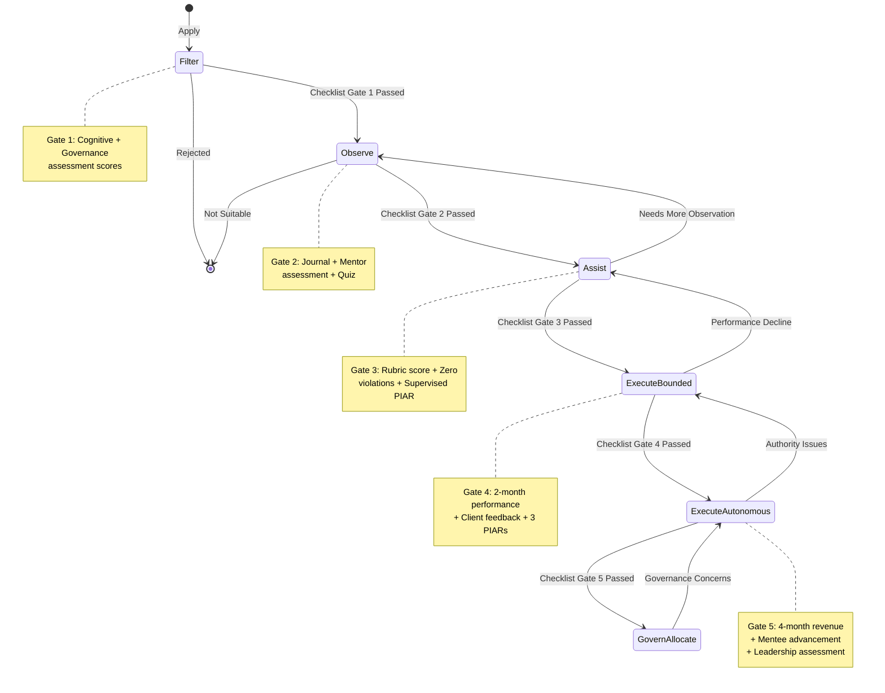
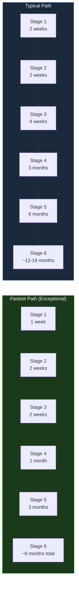

# Operator Capability Maturity Checklist

This reference document provides a **concrete, checkable assessment** for each operator stage. Use it for self-assessment, peer validation, mentorship planning, and stage progression decisions. Every checklist item maps to a specific competency required at that stage.

---

## Stage Progression State Diagram

---

## Stage 1: Filter -- Assessment Checklist

**Duration:** 1-2 weeks | **Assessor:** Screening Coordinator

### Cognitive Capabilities

| # | Competency | Assessment Method | Threshold | Checked |
|---|---|---|---|---|
| 1.1 | Pattern recognition under ambiguity | Structured assessment | Above 70th percentile | Pending |
| 1.2 | Decision-making under incomplete information | Scenario exercises | Above 70th percentile | Pending |
| 1.3 | Constraint satisfaction problem-solving | Structured assessment | Above 70th percentile | Pending |
| 1.4 | Failure analysis and root cause identification | Scenario exercises | Above 70th percentile | Pending |

### Governance Awareness

| # | Competency | Assessment Method | Threshold | Checked |
|---|---|---|---|---|
| 1.5 | Understanding of pre-incident accountability | Scenario-based test | Above 60th percentile | Pending |
| 1.6 | Ability to identify when escalation is needed | Scenario-based test | Above 60th percentile | Pending |
| 1.7 | Willingness to document and be transparent | Interview assessment | Positive signal | Pending |
| 1.8 | Response to ethical dilemmas | Scenario-based test | No disqualifying responses | Pending |

### Communication and Culture

| # | Competency | Assessment Method | Threshold | Checked |
|---|---|---|---|---|
| 1.9 | Clear, precise communication | Written + verbal assessment | "Clear and honest" by 2+ reviewers | Pending |
| 1.10 | No disqualifying cultural signals | Behavioral assessment | No red flags | Pending |

### Gate 1 Scoring

| Dimension | Weight | Minimum Score |
|---|---|---|
| Cognitive assessment | 40% | 70th percentile |
| Governance awareness | 30% | 60th percentile |
| Communication quality | 20% | "Clear and honest" by 2+ reviewers |
| Cultural signal | 10% | No disqualifiers |

---

## Stage 2: Observe -- Assessment Checklist

**Duration:** 2 weeks | **Assessor:** Assigned Mentor

### Knowledge Demonstrated

| # | Competency | Evidence Required | Threshold | Checked |
|---|---|---|---|---|
| 2.1 | Can accurately describe venture cell operations | Observation journal entries | 5+ detailed entries | Pending |
| 2.2 | Understands PIAR process from observation | Written summary after observing 2+ PIARs | Accurate description | Pending |
| 2.3 | Can explain the 6-stage operator lifecycle | Governance quiz | Above 80% | Pending |
| 2.4 | Understands incident severity levels (P0-P3) | Governance quiz | Above 80% | Pending |
| 2.5 | Can explain the Atomic Constraint and why it matters | Written reflection | Demonstrates understanding, not just recitation | Pending |
| 2.6 | Understands entity hierarchy (AINEFF through AINE) | Governance quiz | Above 80% | Pending |

### Behavioral Assessment

| # | Competency | Evidence Required | Threshold | Checked |
|---|---|---|---|---|
| 2.7 | Daily observation journal maintained | Journal entries | Complete for full observation period | Pending |
| 2.8 | Questions demonstrate insight, not just surface | Mentor assessment | "Insightful" rating | Pending |
| 2.9 | Respects the operating model | Peer feedback | No red flags | Pending |
| 2.10 | Shows learning velocity | Mentor assessment | Measurable improvement week over week | Pending |

### Gate 2 Scoring

| Dimension | Weight | Minimum Score |
|---|---|---|
| Observation journal quality | 30% | Demonstrates clear understanding |
| Mentor assessment | 30% | "Ready for supervised tasks" |
| Governance quiz | 25% | Above 80% |
| Peer feedback | 15% | No red flags |

---

## Stage 3: Assist -- Assessment Checklist

**Duration:** 2-6 weeks | **Assessor:** Supervisor / Cell Lead

### SOPs Mastered

| # | SOP | Mastery Evidence | Checked |
|---|---|---|---|
| 3.1 | Operator Onboarding SOP | Can explain all 6 stages, gate criteria, demotion triggers | Pending |
| 3.2 | Governance Review SOP | Can classify rule changes into Tier 1/2/3 | Pending |
| 3.3 | Deployment SOP (Isolation Zone) | Has deployed to Isolation Zone independently | Pending |
| 3.4 | Audit SOP | Understands ACTS trail requirements | Pending |
| 3.5 | Venture Cell SOP | Can describe cell structure and responsibilities | Pending |

### Skills Demonstrated

| # | Skill | Evidence Required | Threshold | Checked |
|---|---|---|---|---|
| 3.6 | Task execution accuracy | Weekly evaluation scores | 70%+ for 3 consecutive weeks | Pending |
| 3.7 | Governance compliance | Violation record | Zero violations | Pending |
| 3.8 | Learning velocity | Feedback incorporation rate | Consistent improvement | Pending |
| 3.9 | Communication clarity | Standup participation quality | Timely, clear, honest | Pending |
| 3.10 | Reliability | Meeting deadlines, showing up prepared | Consistent | Pending |

### Decisions Handled (Supervised)

| # | Decision Type | Evidence Required | Checked |
|---|---|---|---|
| 3.11 | Completed supervised PIAR as Decision Maker | PIAR completion record | Pending |
| 3.12 | Executed bounded tasks without requiring re-work | Task completion records | Pending |
| 3.13 | Deployed to Isolation Zone | Deployment records | Pending |

### Gate 3 Scoring

| Dimension | Weight | Minimum Score |
|---|---|---|
| Task quality (rubric composite) | 30% | Above 70% for 3 consecutive weeks |
| Governance compliance | 25% | Zero violations |
| Learning velocity | 20% | Consistent improvement |
| Communication | 15% | "Clear and timely" |
| Supervised PIAR completion | 10% | "Competent" by Governance Reviewer |

---

## Stage 4: Execute (Bounded) -- Assessment Checklist

**Duration:** 1-3 months | **Assessor:** Cell Lead

### SOPs Mastered

| # | SOP | Mastery Evidence | Checked |
|---|---|---|---|
| 4.1 | All Stage 3 SOPs | Demonstrated mastery in daily operations | Pending |
| 4.2 | Incident Response SOP | Can classify severity, knows response protocols | Pending |
| 4.3 | PIAR SOP | Can initiate and participate in PIARs independently | Pending |
| 4.4 | Client Engagement SOP | Can communicate with clients (CC Cell Lead) | Pending |
| 4.5 | Deployment SOP (full Extension Zone) | Has deployed to Extension Zone with peer review | Pending |
| 4.6 | Capital Allocation SOP (micro-budget) | Understands &lt; $500 spending authority | Pending |

### Skills Demonstrated

| # | Skill | Evidence Required | Threshold | Checked |
|---|---|---|---|---|
| 4.7 | Independent task execution | Monthly evaluation scores | 75%+ for 2 consecutive months | Pending |
| 4.8 | Peer review participation | Review records | Regular, constructive reviews | Pending |
| 4.9 | Client communication | Client interaction logs | Professional, CC Cell Lead | Pending |
| 4.10 | Governance compliance | Violation record | Zero violations throughout Stage 4 | Pending |
| 4.11 | Revenue contribution | Revenue attribution records | Measurable contribution to cell revenue | Pending |

### Decisions Handled Independently

| # | Decision Type | Evidence Required | Minimum Count | Checked |
|---|---|---|---|---|
| 4.12 | Led PIARs as Decision Maker | PIAR records | 3+ PIARs | Pending |
| 4.13 | Made spending decisions (&lt; $500) | Expense records | 5+ decisions | Pending |
| 4.14 | Made technical decisions (within architecture) | PR/deployment records | 10+ decisions | Pending |
| 4.15 | Handled client communication | Communication logs | 5+ client interactions | Pending |

### Tools Proficient In

| # | Tool/System | Proficiency Evidence | Checked |
|---|---|---|---|
| 4.16 | ACTS (Audit and Causal Trace) | Regularly creates proper audit trails | Pending |
| 4.17 | Golden Repo (Git workflow) | Proper PRs, reviews, branching | Pending |
| 4.18 | CI/CD Pipeline | Can deploy through standard pipeline | Pending |
| 4.19 | CRM System | Can manage client records | Pending |
| 4.20 | Monitoring Dashboard | Can read and interpret operational metrics | Pending |

### Client Feedback

| # | Criterion | Evidence Required | Threshold | Checked |
|---|---|---|---|---|
| 4.21 | Client satisfaction | Client feedback records | Positive feedback from 2+ clients | Pending |
| 4.22 | No client complaints | Complaint records | Zero substantiated complaints | Pending |

### Gate 4 Scoring

| Dimension | Weight | Minimum Score |
|---|---|---|
| Consistent performance | 25% | Above 75% for 2 consecutive months |
| Governance compliance | 20% | Zero violations |
| Client feedback | 20% | Positive from 2+ clients |
| Revenue contribution | 20% | Measurable |
| PIAR competence | 15% | 3+ successful PIARs |

---

## Stage 5: Execute (Autonomous) -- Assessment Checklist

**Duration:** 3+ months before Stage 6 eligibility | **Assessor:** Cell Lead + AINEG Representative

### SOPs Mastered

| # | SOP | Mastery Evidence | Checked |
|---|---|---|---|
| 5.1 | All ecosystem SOPs | Demonstrated mastery in daily operations | Pending |
| 5.2 | Full Capital Allocation SOP | Can submit and manage requests up to $10,000 | Pending |
| 5.3 | Full Client Engagement SOP | Manages direct client relationships | Pending |
| 5.4 | Security Incident SOP | Can classify and respond to security incidents | Pending |
| 5.5 | AINE Creation/Termination SOPs | Awareness-level understanding | Pending |

### Skills Demonstrated

| # | Skill | Evidence Required | Threshold | Checked |
|---|---|---|---|---|
| 5.6 | Revenue target achievement | Revenue records | Exceeded targets 4+ consecutive months | Pending |
| 5.7 | Portfolio management | Portfolio performance records | Positive growth trajectory | Pending |
| 5.8 | Mentoring effectiveness | Mentee progression records | 1+ mentee advanced to Stage 4+ | Pending |
| 5.9 | Strategic contribution | Cell strategy documents | Demonstrated ability to shape strategy | Pending |
| 5.10 | Governance excellence | PIAR quality records | Exemplary quality, zero violations | Pending |

### Decisions Handled Independently

| # | Decision Type | Evidence Required | Minimum Count | Checked |
|---|---|---|---|---|
| 5.11 | Capital requests ($500-$5,000) | Request records | 5+ approved requests | Pending |
| 5.12 | Client scope/pricing decisions | Decision logs | 10+ independent decisions | Pending |
| 5.13 | New technical patterns introduced | PR records + peer consultation | 3+ patterns adopted | Pending |
| 5.14 | Governance rule proposals (Tier 1-2) | Proposal records | 1+ proposals submitted | Pending |
| 5.15 | Incident response (P2-P3) | Incident records | 3+ incidents managed | Pending |

### Leadership Assessment

| # | Criterion | Evidence Required | Threshold | Checked |
|---|---|---|---|---|
| 5.16 | Cell Lead recommendation | Written recommendation | "Ready for governance authority" | Pending |
| 5.17 | AINEG representative endorsement | Written endorsement | "Demonstrates leadership" | Pending |
| 5.18 | Peer respect | Peer survey | Positive from 80%+ of peers | Pending |

### Gate 5 Scoring

| Dimension | Weight | Minimum Score |
|---|---|---|
| Revenue track record | 25% | Exceeded 4+ consecutive months |
| Governance excellence | 20% | Zero violations, exemplary PIARs |
| Mentoring impact | 20% | 1+ mentee at Stage 4+ |
| Strategic contribution | 20% | Demonstrated strategy influence |
| Leadership assessment | 15% | Dual recommendation (Cell Lead + AINEG) |

---

## Stage 6: Govern / Allocate Capital -- Ongoing Assessment

**Duration:** Ongoing | **Assessor:** AINEG + AINEFF Board (periodic review)

Stage 6 operators are not progressing to a next stage -- they are assessed continuously to **maintain** their authority.

### Ongoing Competency Requirements

| # | Competency | Assessment Method | Frequency | Checked |
|---|---|---|---|---|
| 6.1 | Capital allocation performance | ROI tracking on allocated capital | Quarterly | Pending |
| 6.2 | Governance rule design quality | Rule adoption rate, entropy scores | Quarterly | Pending |
| 6.3 | Cell performance (cells under management) | Revenue, retention, compliance metrics | Monthly | Pending |
| 6.4 | Mentoring pipeline | Stage 4-5 operators advancing | Quarterly | Pending |
| 6.5 | Constitutional compliance | Zero violations | Continuous | Pending |
| 6.6 | Strategic contribution to AINEG | Portfolio strategy outcomes | Quarterly | Pending |

### Demotion Triggers

| Trigger | Consequence |
|---|---|
| Capital allocation resulting in significant loss without adequate PIAR | Demotion to Stage 5 + governance review |
| Constitutional violation | Immediate demotion + constitutional review |
| Pattern of cell failures under management | Review + potential demotion |
| Failure to maintain mentoring pipeline | Warning, then demotion |

---

## Self-Assessment Template

Use this template quarterly for personal development tracking. Complete honestly -- this is for your benefit.

### Instructions

Rate yourself 1-5 on each dimension, then have a peer validate your scores.

- **1** = No competency -- need training
- **2** = Basic awareness -- need practice
- **3** = Competent -- can perform with guidance
- **4** = Proficient -- can perform independently
- **5** = Expert -- can teach others

### Self-Assessment Matrix

| Competency Area | Self-Rating (1-5) | Peer-Validated Rating (1-5) | Gap | Action Plan |
|---|---|---|---|---|
| SOP knowledge (for my stage) | __ | __ | __ | __ |
| Governance compliance | __ | __ | __ | __ |
| Technical execution | __ | __ | __ | __ |
| Client interaction | __ | __ | __ | __ |
| Decision quality | __ | __ | __ | __ |
| Communication clarity | __ | __ | __ | __ |
| Revenue contribution | __ | __ | __ | __ |
| Mentoring (if Stage 5+) | __ | __ | __ | __ |
| Strategic thinking | __ | __ | __ | __ |
| Escalation judgment | __ | __ | __ | __ |

### "Ready for Next Stage" Self-Check

| Question | Your Answer |
|---|---|
| Have I met ALL gate criteria for my current stage? | Yes / No / Partially |
| Have I maintained zero governance violations? | Yes / No |
| Can I articulate why every gate criterion exists? | Yes / No |
| Has my mentor/Cell Lead confirmed my readiness? | Yes / No |
| What is my weakest area? | __ |
| What is my plan to address it? | __ |

---

## Peer Validation Requirements

Self-assessment alone is insufficient. Peer validation ensures objectivity.

| Stage | Minimum Peer Validators | Validator Requirements |
|---|---|---|
| Stage 2 &rarr; 3 | 1 mentor + 1 peer | Mentor at Stage 4+, peer has worked directly with candidate |
| Stage 3 &rarr; 4 | 1 supervisor + 2 peers | Supervisor at Stage 5+, peers have reviewed candidate's work |
| Stage 4 &rarr; 5 | Cell Lead + 2 peers + 2 clients | Cell Lead formal assessment, peer operational review, client feedback |
| Stage 5 &rarr; 6 | Cell Lead + AINEG representative + 3 peers | Formal leadership assessment from two authority levels |

### Validation Scoring

Peer validators score each competency independently. The final score is calculated as:

- **Self-assessment weight:** 20%
- **Peer validation weight:** 50%
- **Objective metrics weight:** 30% (revenue, violations, PIAR records, etc.)

If self-assessment and peer validation diverge by more than 1.5 points on any dimension, a calibration discussion is required before stage progression.

---

## Maturity Progression Timeline

**Key principle:** Progression is merit-based, not time-based. No operator advances by simply waiting. Every gate requires demonstrated competency validated by objective evidence and peer assessment.

---

## Related Documents

- [Operator Onboarding SOP](/docs/processes/operator-onboarding-sop) -- Full stage definitions, gate criteria, and demotion triggers
- [Role-Based SOP Navigator](/docs/guides/role-sop-navigator) -- Which SOPs apply at each stage
- [Escalation & Authority Matrix](/docs/guides/escalation-matrix) -- Decision authority limits by stage
- [Operator Performance Review SOP](/docs/processes/operator-performance-review-sop) -- Formal review procedures
