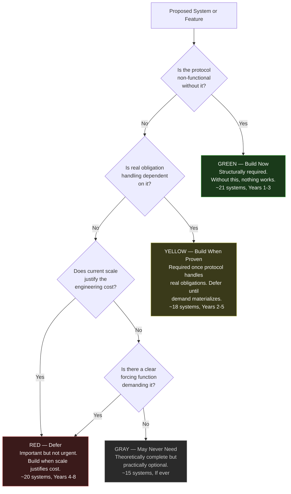
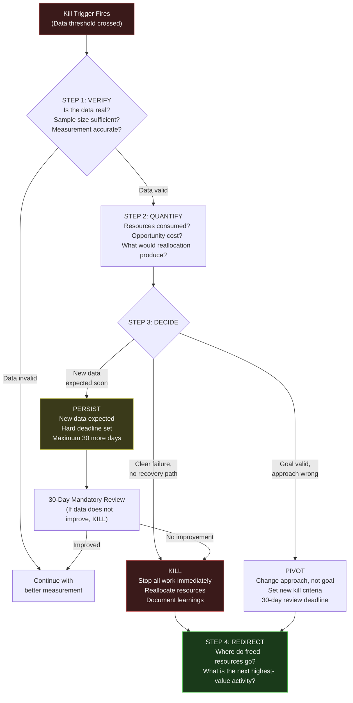
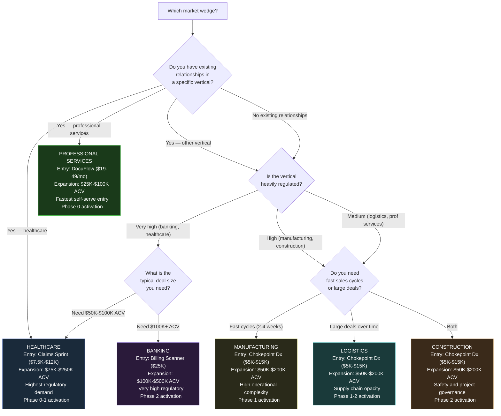
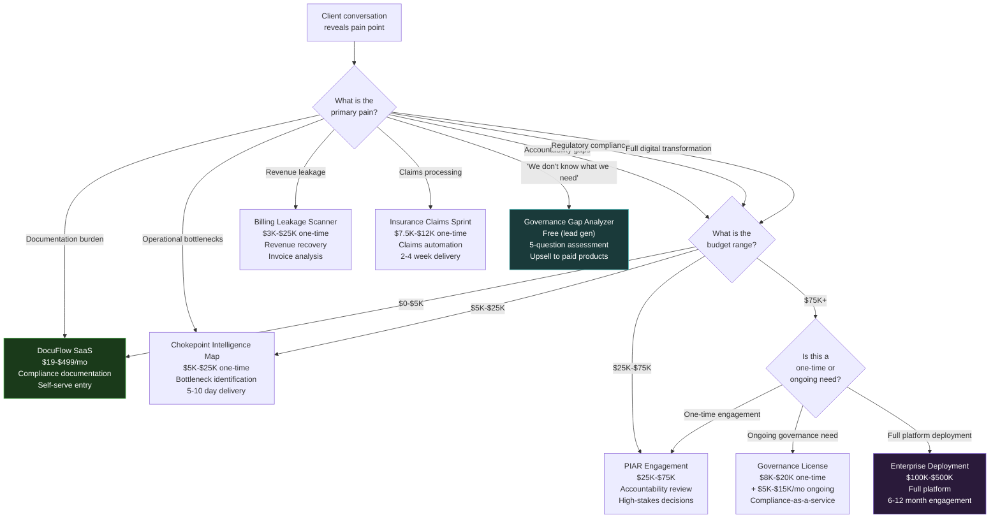
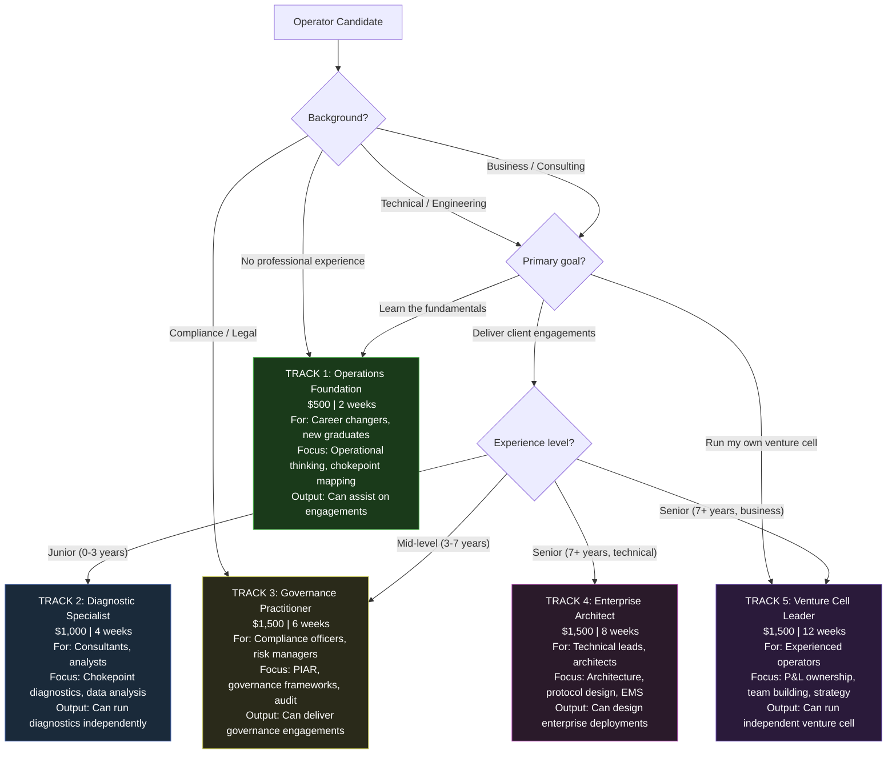
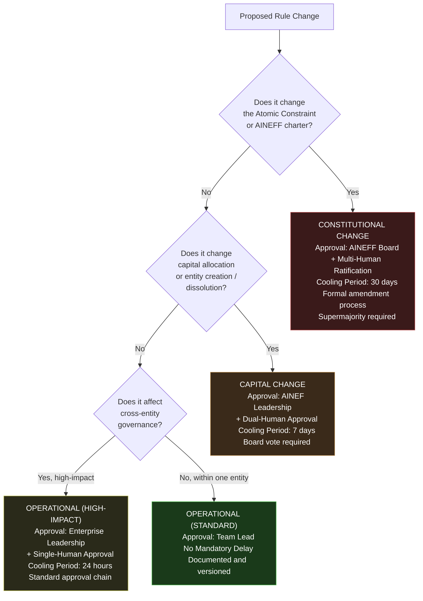
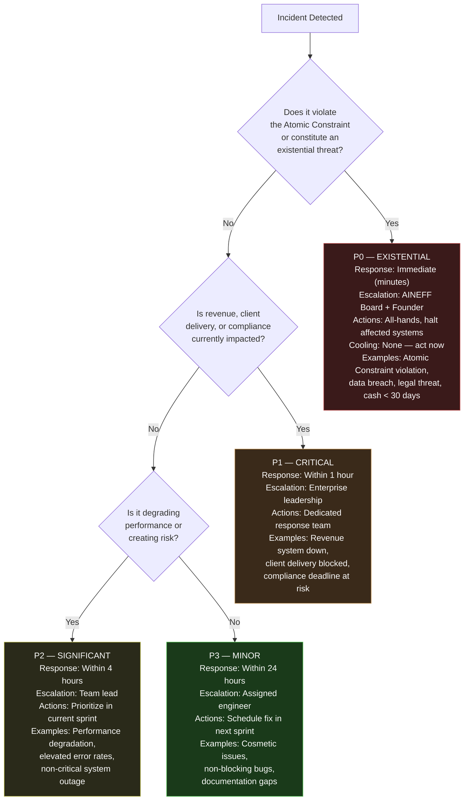
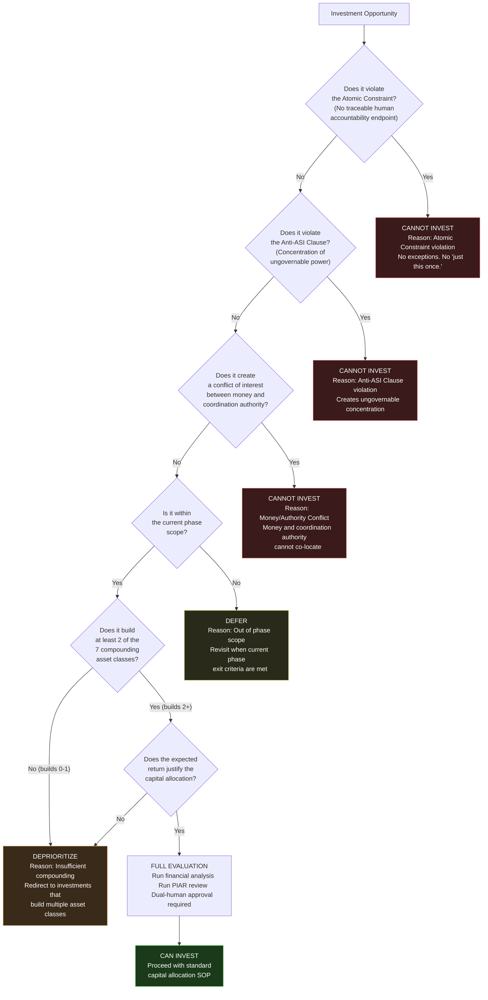

# Decision Trees & Flowcharts

The AINEFF Ecosystem formalizes recurring decisions into explicit decision trees. This page collects all major decision trees into one visual reference. Each tree can be traced back to its source documentation for full context.

---

## 1. Should We Build This System?

The Green / Yellow / Red / Gray priority framework determines when to build each of the 74 systems.

**Source:** [Systems & Modules Overview](/docs/systems/)

### Build Priority Examples

| System | Priority | Rationale |
|---|---|---|
| EMS (Enterprise Manufacturing) | Green | Cannot create enterprises without it |
| GAAGR (Global Registry) | Green | Cannot identify entities without it |
| Assembly Line Orchestration | Yellow | Needed when manufacturing at volume |
| Insurance Pool | Red | Needed when group risk pooling begins |
| Intergovernmental Review | Gray | Needed only for cross-border treaty coordination |

---

## 2. Should We Kill This Venture?

The kill criteria decision tree applies to ventures, features, products, and systems at any phase.

**Source:** [Kill Discipline](/docs/execution/kill-criteria)

### Mandatory Kill Triggers (Any Phase)

| # | Trigger | Threshold | Action |
|---|---|---|---|
| 1 | Founder health crisis | Significantly impaired | Pause all non-essential activity |
| 2 | Cash runway &lt; 30 days | Cannot cover expenses | Emergency consulting revenue |
| 3 | Zero revenue at Day 90 | $0 collected | Full strategic review |
| 4 | Key dependency failure | Critical tool/partner gone | Migrate in 14 days or kill |
| 5 | Legal/regulatory threat | Cease and desist / lawsuit | Pause, seek counsel |
| 6 | Ethical violation | Atomic Constraint breached | Kill immediately. No exceptions. |
| 7 | Sunk cost escalation | Spending to justify past spending | Kill immediately |

---

## 3. Which Market Wedge to Enter?

Decision tree for selecting target vertical based on existing relationships, regulatory environment, and deal size.

**Source:** [6 Market Wedges](/docs/products/market-wedges)

---

## 4. Which Product to Offer?

Based on buyer persona, pain point, and budget.

**Source:** [Products Overview](/docs/products/), [Revenue Streams](/docs/products/revenue-streams)

---

## 5. Which Operator Track?

Based on background, goals, and experience level.

**Source:** [LevelUpMax](/docs/entities/levelupmax), [Operator Training](/docs/products/offerings/operator-track)

---

## 6. How to Classify a Rule Change

Operational vs Capital vs Constitutional classification determines the approval path.

**Source:** [Governance Review SOP](/docs/processes/governance-review-sop), [15 Systems of Coordination](/docs/blueprint/15-systems-coordination)

---

## 7. Incident Severity Classification

P0 through P3 severity levels with response requirements.

**Source:** [Incident Response SOP](/docs/processes/incident-response-sop)

---

## 8. Investment Opportunity Evaluation

Can we invest / Cannot invest decision tree based on constitutional constraints and strategic alignment.

**Source:** [Capital Strategy](/docs/execution/capital-strategy), [Monetization Boundaries](/docs/products/monetization-boundaries)

---

## Using These Decision Trees

These decision trees are not suggestions -- they are **governance instruments**. Each tree encodes constraints that flow from the Atomic Constraint, the 15 Systems of Coordination, and the constitutional hierarchy.

When you face one of these decisions:

1. Start at the top of the relevant tree
2. Answer each question honestly with current data
3. Follow the path to its conclusion
4. Document the decision and reasoning in ACTS
5. If you disagree with the tree's conclusion, escalate -- do not override

The trees are version-controlled governance artifacts subject to the [Governance Review SOP](/docs/processes/governance-review-sop).
