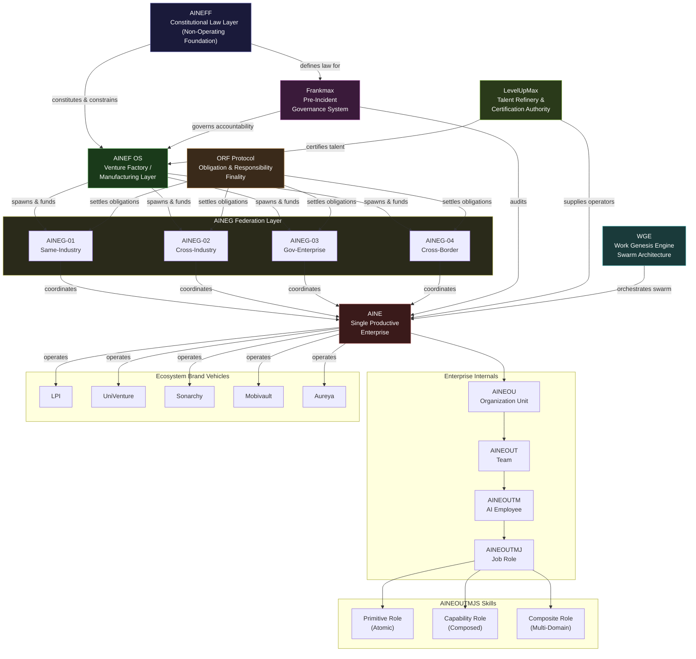
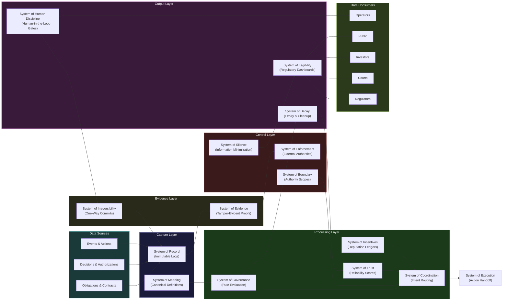
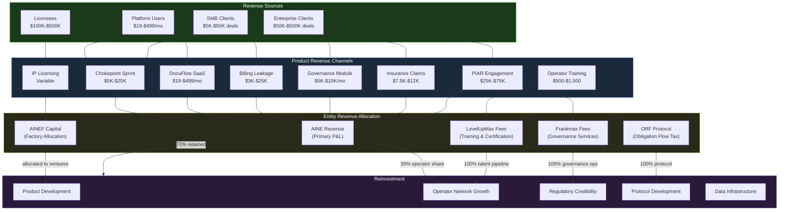
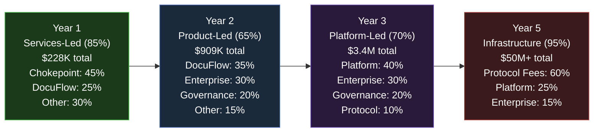
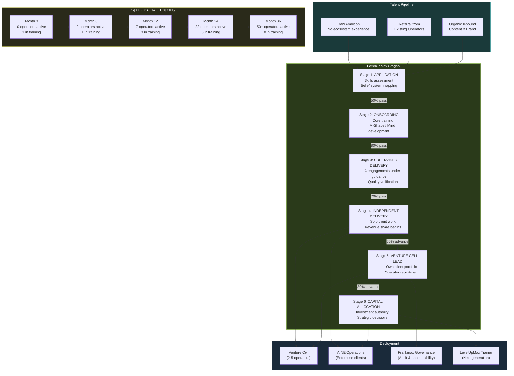
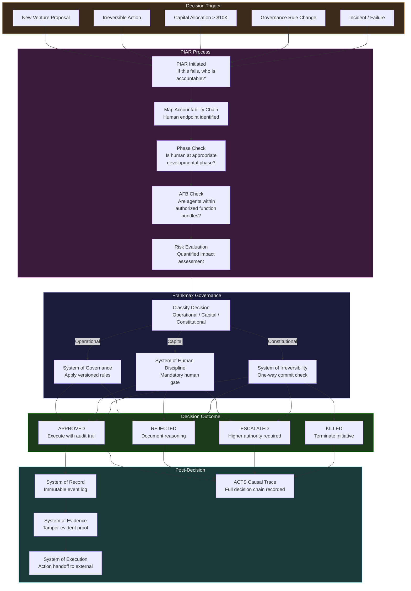
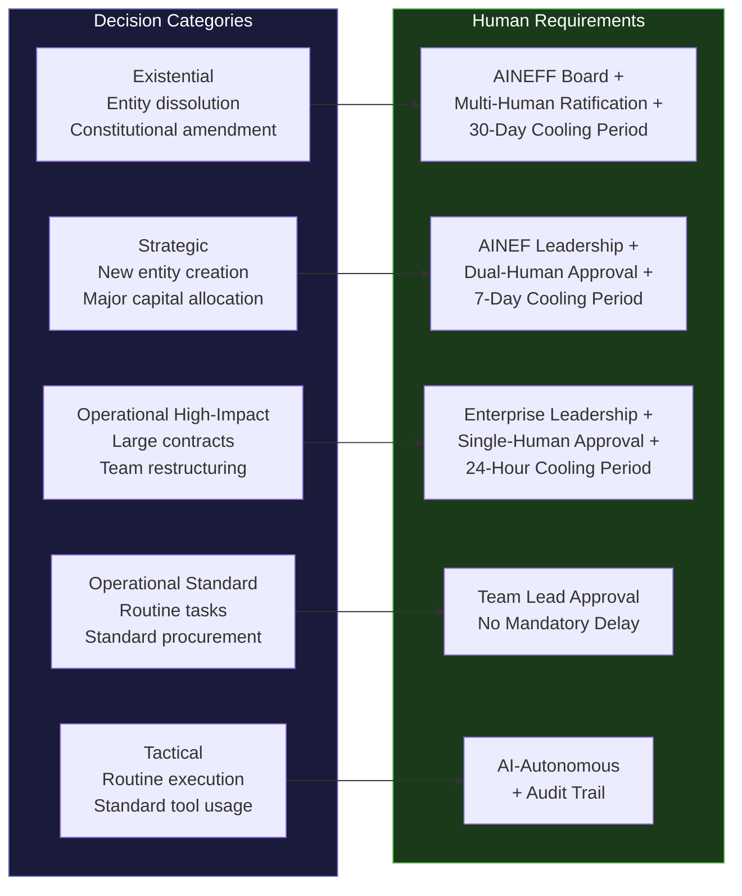
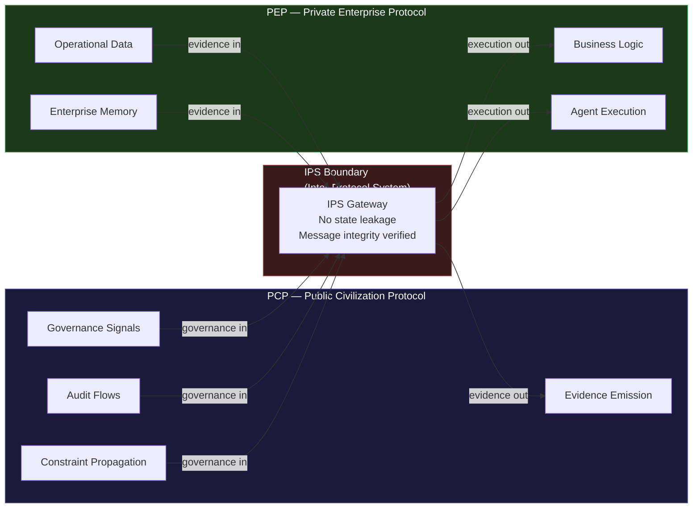

---

sidebar_position: 2
title: "Complete Ecosystem Map"
description: "Master visual guide showing how everything connects -- entities, data flow, money flow, talent flow, governance flow, and technology stack in one unified view."
tags: [guide, reference]
custom_status: active
custom_owner: Andrew Leo
custom_last_review: 2026-03-01
custom_next_review: 2026-06-01
---

# Complete Ecosystem Map

This page provides six master diagrams that show how the AINEFF Ecosystem connects at every level. Each diagram reveals a different dimension of the same underlying system.

---

## 1. Entity Relationship Diagram

The complete structural hierarchy from constitutional law down to atomic skills, including all lateral relationships between entities.

---

## 2. Data Flow Diagram

How data moves through the 15 coordination systems, from raw events through to external oversight.

---

## 3. Money Flow Diagram

How revenue flows from clients through entities, products, and operators back into the ecosystem.

### Revenue Transition Over Time

---

## 4. Talent Flow Diagram

How operators move through LevelUpMax into venture cells and the broader ecosystem.

---

## 5. Governance Flow Diagram

How decisions flow through the PIAR process, through Frankmax governance, to execution.

### Decision Categories and Human Requirements

---

## 6. Technology Stack Diagram

The complete technology stack from infrastructure layer through to user-facing products.

```mermaid
graph TB
    subgraph L1_INFRA["Layer 1: Infrastructure"]
        COMPUTE["Compute & Energy
        Cloud / On-Prem / Hybrid"]
        STORAGE["Storage
        Append-Only Event Stores
        Knowledge Graphs"]
        NETWORK["Network
        Protocol Routing
        PCP / PEP Isolation"]
    end

    subgraph L2_COGNITIVE["Layer 2: Cognitive Architecture"]
        UMAL["UMAL
        Universal Model
        Abstraction Layer"]
        CPE["CPE
        Cognitive Post-Processing
        Engine"]
        GRIL["GRIL
        Grounded Retrieval
        Intelligence Layer"]
    end

    subgraph L3_DATA["Layer 3: Data, Memory & Identity"]
        OMG["OMG
        Orchestrated Memory
        Graph"]
        IRMS2["IRMS
        Identity & Role
        Management"]
        KIMS2["KIMS
        Knowledge Integrity
        Management"]
    end

    subgraph L4_EXPERIENCE["Layer 4: Experience & Intelligence"]
        UIEE["UIEE
        Unified Intelligence
        Experience Engine"]
        WGE2["WGE
        Work Genesis Engine"]
        MAGE["MAGE
        Meta-Agent
        Governance Engine"]
    end

    subgraph L5_AGENT["Layer 5: Agent Runtime"]
        ARE["ARE
        Agent Runtime
        Environment"]
        AOS["AOS
        Agentic Operating
        System"]
        ACTS2["ACTS
        Audit & Causal
        Trace System"]
    end

    subgraph L6_ECONOMIC["Layer 6: Economic & Trust"]
        ORF2["ORF Protocol
        Obligation Settlement"]
        PAME2["PAME
        Power Asymmetry Engine"]
        DEFS2["DEFS
        Defensive Economics"]
        CCRS2["CCRS
        Cartel & Coordination
        Risk"]
    end

    subgraph L7_PRODUCTS["Layer 7: User-Facing Products"]
        DOCUFLOW2["DocuFlow
        Compliance SaaS"]
        CHOKEPOINT["Chokepoint
        Intelligence Map"]
        BILLING2["Billing Leakage
        Scanner"]
        GOV2["Governance Gap
        Analyzer"]
        CLAIMS2["Insurance Claims
        Automation"]
        PIAR2["PIAR
        Accountability Review"]
        MARKETPLACE["Skills Marketplace"]
    end

    L1_INFRA --> L2_COGNITIVE
    L2_COGNITIVE --> L3_DATA
    L3_DATA --> L4_EXPERIENCE
    L4_EXPERIENCE --> L5_AGENT
    L5_AGENT --> L6_ECONOMIC
    L6_ECONOMIC --> L7_PRODUCTS

    style L1_INFRA fill:#3a1a1a,stroke:#ba6a6a,color:#fff
    style L2_COGNITIVE fill:#3a2a1a,stroke:#ba8a4a,color:#fff
    style L3_DATA fill:#2a2a1a,stroke:#baba4a,color:#fff
    style L4_EXPERIENCE fill:#1a3a1a,stroke:#4aba6a,color:#fff
    style L5_AGENT fill:#1a2a3a,stroke:#4a6aba,color:#fff
    style L6_ECONOMIC fill:#1a1a3a,stroke:#6a6aba,color:#fff
    style L7_PRODUCTS fill:#2a1a3a,stroke:#8a4aba,color:#fff
```

### Protocol Architecture: PCP vs PEP

---

## Summary: The Single-Page View

The AINEFF Ecosystem is a **constitutional economic coordination protocol** where:

1. **AINEFF** (constitutional law) constrains **AINEF** (venture factory) which spawns **AINEGs** (federations) which coordinate **AINEs** (enterprises)
2. **Frankmax** governs accountability across all entities using 15 coordination systems
3. **LevelUpMax** converts raw talent into certified operators through 6 stages
4. **ORF Protocol** settles obligations across entity boundaries
5. **WGE** orchestrates work across autonomous venture cells
6. Revenue flows from 25+ products through enterprises, with 30% operator share and 70% reinvested into 7 compounding asset classes
7. The technology stack spans 7 layers from infrastructure through to user-facing products, with PCP/PEP protocol isolation enforced at every boundary
8. All decisions flow through PIAR accountability review before execution, with human gates at every irreversible action
