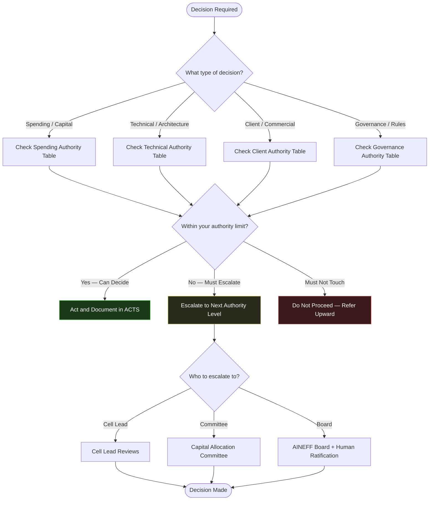
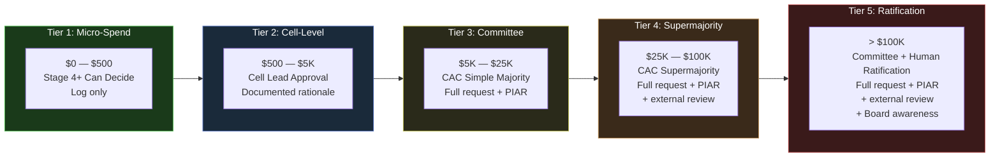
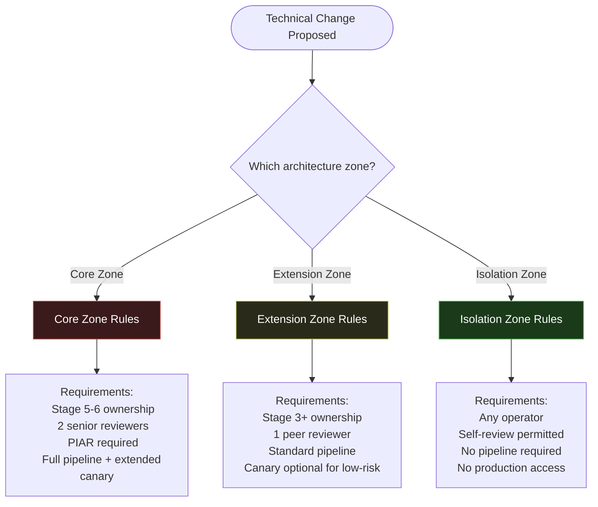
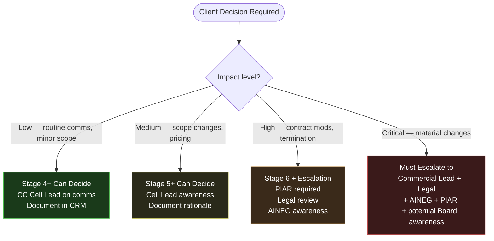
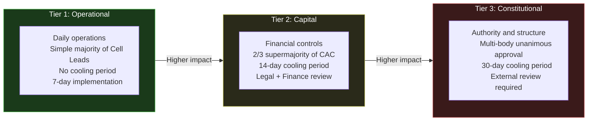

---

sidebar_position: 8
title: "Escalation & Authority Matrix"
description: "Visual reference showing decision authority limits by role and operator stage — spending limits, technical decisions, client decisions, and governance decisions with escalation paths."
tags: [guide, reference, risk, governance]
custom_status: active
custom_owner: Andrew Leo
custom_last_review: 2026-03-01
custom_next_review: 2026-06-01
---

# Escalation & Authority Matrix

This reference document maps **who can decide what** across every operator stage and decision type. Use it to instantly determine whether you can act independently, must escalate, or must not touch a decision at all.

---

## Quick Reference: Escalation Path

---

## Spending & Capital Authority

Spending authority increases with operator stage. Every expenditure must be logged regardless of amount.

| Amount Range | Stage 1-3 (Filter/Observe/Assist) | Stage 4 (Execute Bounded) | Stage 5 (Execute Autonomous) | Stage 6 (Govern/Allocate) | Approval Body |
|---|---|---|---|---|---|
| $0 -- $500 | Must Not Touch | Can Decide | Can Decide | Can Decide | Log only |
| $500 -- $5,000 | Must Not Touch | Must Escalate | Can Decide (with Cell Lead awareness) | Can Decide | Cell Lead |
| $5,000 -- $25,000 | Must Not Touch | Must Not Touch | Must Escalate | Can Decide (within delegation) | Capital Allocation Committee (simple majority) |
| $25,000 -- $100,000 | Must Not Touch | Must Not Touch | Must Not Touch | Must Escalate | Capital Allocation Committee (supermajority) |
| &gt; $100,000 | Must Not Touch | Must Not Touch | Must Not Touch | Must Escalate | Committee + Human Ratification |

### Spending Escalation Flow

**Source:** [Capital Allocation SOP](/docs/processes/capital-allocation-sop)

---

## Technical Decision Authority

Technical decisions cover architecture changes, vendor selection, tooling, data access, and deployment.

| Decision Type | Stage 1-3 | Stage 4 (Bounded) | Stage 5 (Autonomous) | Stage 6 (Govern/Allocate) | Escalation Target |
|---|---|---|---|---|---|
| Bug fix (non-breaking) | Must Not Touch | Can Decide | Can Decide | Can Decide | Peer reviewer |
| Configuration change | Must Not Touch | Can Decide (with review) | Can Decide | Can Decide | Peer reviewer |
| Feature implementation (within architecture) | Must Not Touch | Can Decide (with review) | Can Decide | Can Decide | Standard PR review |
| New integration or adapter | Must Not Touch | Must Escalate | Can Decide (with peer consultation) | Can Decide | Cell Lead |
| Architecture pattern change | Must Not Touch | Must Not Touch | Must Escalate | Can Decide (with Architecture Review) | Architecture Review Board |
| Vendor selection (&lt; $5K/yr) | Must Not Touch | Must Escalate | Can Decide | Can Decide | Cell Lead |
| Vendor selection (&gt; $5K/yr) | Must Not Touch | Must Not Touch | Must Escalate | Must Escalate | Capital Allocation Committee |
| Data access (read, non-PII) | Must Not Touch | Can Decide | Can Decide | Can Decide | Standard access controls |
| Data access (PII or sensitive) | Must Not Touch | Must Not Touch | Must Escalate | Can Decide (with compliance review) | Compliance + Legal |
| Core Zone deployment | Must Not Touch | Must Not Touch | Must Not Touch | Can Decide (2 senior reviewers + PIAR) | Senior review panel |
| Extension Zone deployment | Must Not Touch | Can Decide (peer review) | Can Decide | Can Decide | Standard pipeline |
| Isolation Zone deployment | Can Decide (Stage 3 only) | Can Decide | Can Decide | Can Decide | Self-review permitted |

### Architecture Zone Escalation

**Source:** [Deployment SOP](/docs/processes/deployment-sop)

---

## Client & Commercial Decision Authority

Client decisions encompass contract terms, scope changes, pricing, and relationship management.

| Decision Type | Stage 1-3 | Stage 4 (Bounded) | Stage 5 (Autonomous) | Stage 6 (Govern/Allocate) | Escalation Target |
|---|---|---|---|---|---|
| Client communication (routine) | Must Not Touch | Can Decide (CC Cell Lead) | Can Decide | Can Decide | Cell Lead awareness |
| Client communication (sensitive) | Must Not Touch | Must Escalate | Must Escalate | Can Decide | Cell Lead / Commercial Lead |
| Scope change (&lt; 10% of contract) | Must Not Touch | Must Escalate | Can Decide | Can Decide | Cell Lead |
| Scope change (&gt; 10% of contract) | Must Not Touch | Must Not Touch | Must Escalate | Can Decide (with PIAR) | Commercial Lead + PIAR |
| Pricing exception (&lt; 15% discount) | Must Not Touch | Must Not Touch | Can Decide (within pre-approved bands) | Can Decide | Cell Lead |
| Pricing exception (&gt; 15% discount) | Must Not Touch | Must Not Touch | Must Escalate | Must Escalate | Commercial Lead + Finance |
| Contract modification (non-material) | Must Not Touch | Must Not Touch | Can Decide (with Legal review) | Can Decide | Legal review |
| Contract modification (material) | Must Not Touch | Must Not Touch | Must Not Touch | Must Escalate | Legal + AINEG + PIAR |
| New client engagement | Must Not Touch | Must Not Touch | Can Decide (within cell mandate) | Can Decide | Cell Lead |
| Client termination | Must Not Touch | Must Not Touch | Must Escalate | Can Decide (with PIAR) | Cell Lead + AINEG |
| Client escalation handling | Must Not Touch | Must Escalate | Can Decide (P2-P3 issues) | Can Decide (all severity) | Severity-dependent |

### Client Decision Escalation Path

**Source:** [Client Engagement SOP](/docs/processes/client-engagement-sop)

---

## Governance Decision Authority

Governance decisions are the most restricted. They affect the rule set that governs the entire ecosystem.

| Decision Type | Stage 1-3 | Stage 4 (Bounded) | Stage 5 (Autonomous) | Stage 6 (Govern/Allocate) | Escalation Target |
|---|---|---|---|---|---|
| Propose operational rule change (Tier 1) | Must Not Touch | Can Propose (cannot approve) | Can Propose (cannot approve) | Can Propose and Approve | Cell Leads (simple majority) |
| Propose capital rule change (Tier 2) | Must Not Touch | Must Not Touch | Can Propose (cannot approve) | Can Propose (cannot approve alone) | Capital Allocation Committee (supermajority) |
| Propose constitutional rule change (Tier 3) | Must Not Touch | Must Not Touch | Must Not Touch | Can Propose (cannot approve) | Multi-body: AINEFF Board + AINEG + Frankmax |
| Initiate PIAR | Must Not Touch | Can Initiate | Can Initiate | Can Initiate and Lead | Decision Maker role |
| Lead PIAR (as Decision Maker) | Must Not Touch | Must Escalate (except supervised) | Can Lead | Can Lead | Governance Reviewer |
| Trigger kill criteria review | Must Not Touch | Must Escalate | Can Trigger | Can Trigger and Decide | Cell Lead / CAC |
| Approve operator stage progression | Must Not Touch | Must Not Touch | Must Not Touch | Can Approve (to Stage 4+) | AINEG representative |
| Modify SOP | Must Not Touch | Must Not Touch | Can Propose changes | Can Propose and Implement | Governance Reviewer sign-off |

### Governance Rule Change Escalation

**Source:** [Governance Review SOP](/docs/processes/governance-review-sop)

---

## Master Authority Matrix (All Decision Types)

A condensed cross-reference of operator stage against all decision categories.

| Operator Stage | Spending Limit | Technical Scope | Client Authority | Governance Authority | Escalation Default |
|---|---|---|---|---|---|
| **Stage 1 (Filter)** | $0 | None | None | None | N/A -- no authority |
| **Stage 2 (Observe)** | $0 | None | None | None | N/A -- observation only |
| **Stage 3 (Assist)** | $0 | Isolation Zone only | None | None | Supervisor for all decisions |
| **Stage 4 (Bounded)** | &lt; $500 | Extension + Isolation Zones, with review | Routine comms (CC Cell Lead) | Can initiate PIARs | Cell Lead |
| **Stage 5 (Autonomous)** | &lt; $5,000 | Full within cell mandate, new patterns with consultation | Direct client relationships, scope/pricing within bands | Full PIAR authority, can propose Tier 1-2 rules | Cell Lead / CAC |
| **Stage 6 (Govern/Allocate)** | Within delegation (up to CAC threshold) | Core Zone with senior review, architecture authority | Contract modifications, client strategy | Can propose all tiers, approve Tier 1, design governance | AINEG / AINEFF Board |

---

## Escalation Response Times

When escalation is required, the following response times apply:

| Escalation Target | Expected Response Time | If No Response |
|---|---|---|
| Peer reviewer | Within 4 hours | Assign alternate reviewer |
| Cell Lead | Within 2 hours (business hours) | Escalate to AINEG |
| Commercial Lead | Within 4 hours | Escalate to AINEG |
| Capital Allocation Committee | Within 48 hours (scheduled) or 4 hours (emergency) | Emergency session convened |
| Legal / Compliance | Within 24 hours (routine) or 2 hours (incident) | Outside counsel engaged |
| AINEG Representative | Within 24 hours | Escalate to AINEFF Board |
| AINEFF Board | Within 72 hours (routine) or 1 hour (P0 incident) | Emergency Board session |

---

## Key Rules for Escalation

1. **When in doubt, escalate.** It is always safer to escalate unnecessarily than to overstep authority. No operator has ever been penalized for escalating.
2. **Escalation is not failure.** Recognizing the boundary of your authority is a governance competency, not a weakness.
3. **Document every escalation** in ACTS with the rationale for why you escalated and who you escalated to.
4. **Never skip levels.** Escalate to the next authority level, not directly to the Board (unless P0 conditions are met).
5. **If your escalation target is unavailable,** escalate to the next level up after the expected response time elapses.
6. **"Must Not Touch" means Must Not Touch.** There is no exception pathway for decisions above your stage authority. Attempting to act on a "Must Not Touch" decision is a governance violation triggering demotion review.

---

## Related SOPs

- [Capital Allocation SOP](/docs/processes/capital-allocation-sop) -- Detailed spending approval workflows
- [Operator Onboarding SOP](/docs/processes/operator-onboarding-sop) -- Stage definitions and authority boundaries
- [Governance Review SOP](/docs/processes/governance-review-sop) -- Rule change tiers and approval processes
- [Incident Response SOP](/docs/processes/incident-response-sop) -- Severity-based escalation protocols
- [PIAR SOP](/docs/processes/piar-sop) -- Pre-Incident Accountability Review procedures
