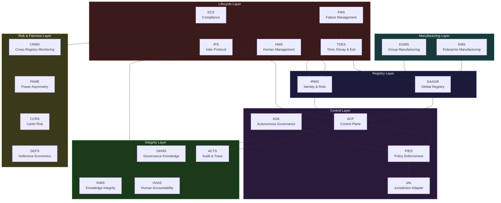
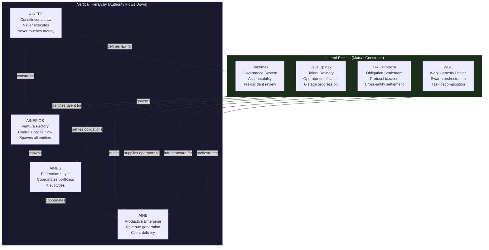
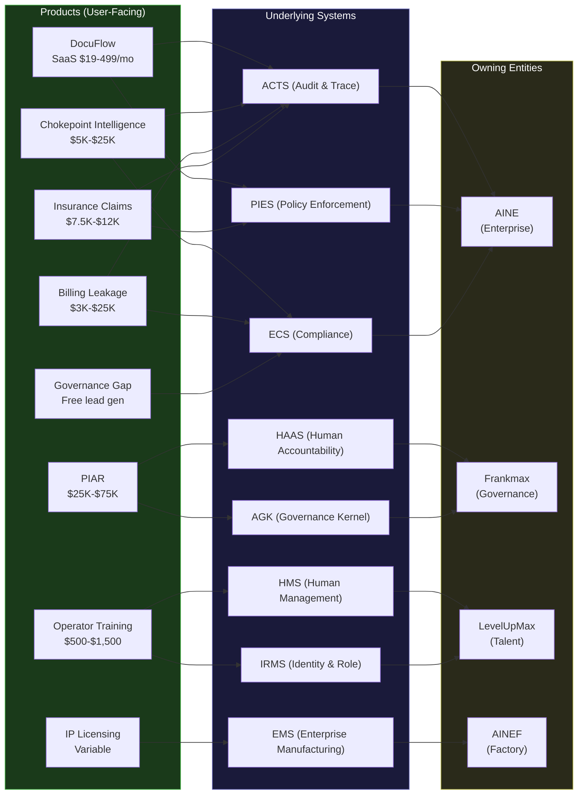
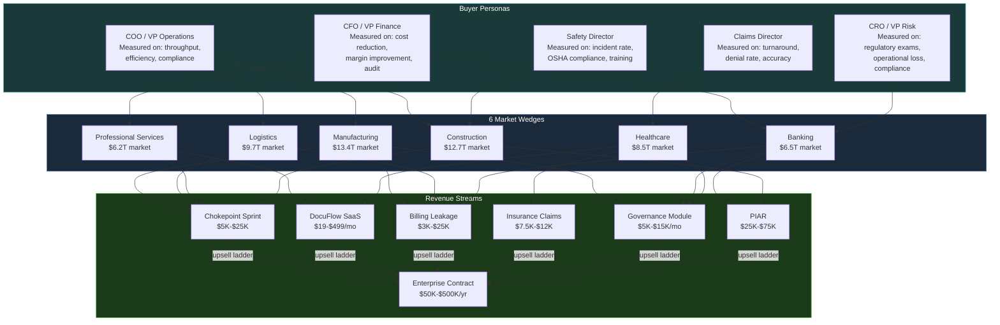
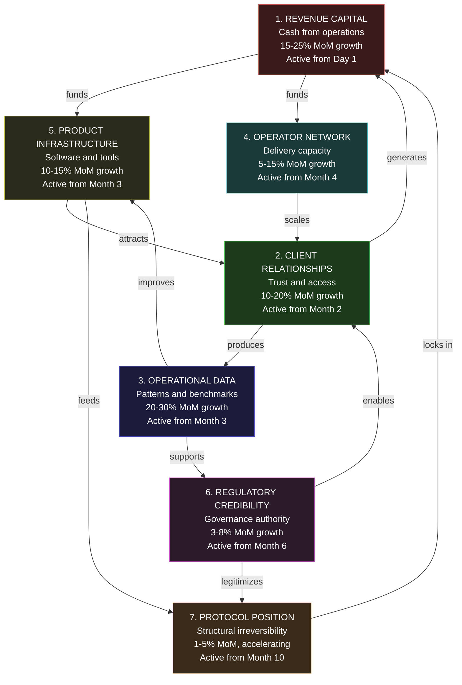
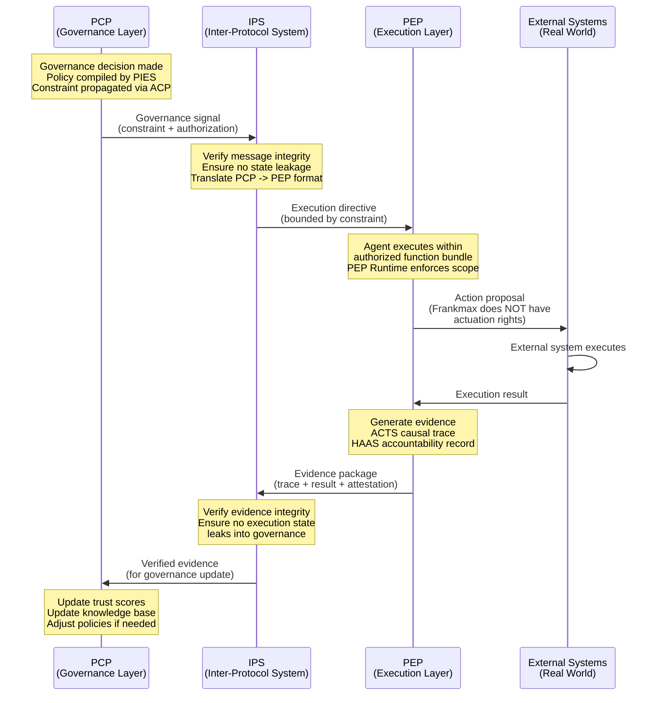
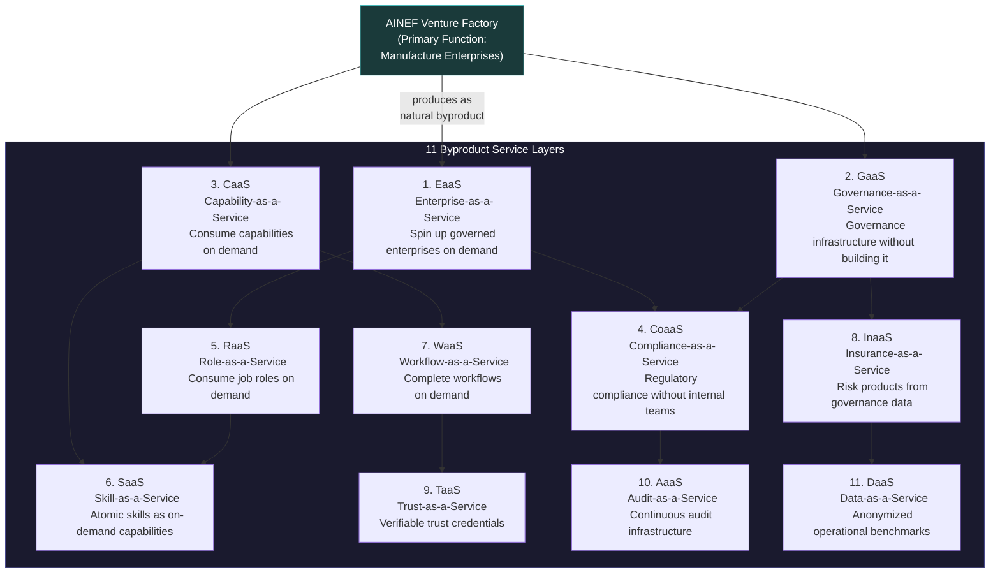

# Visual Glossary -- Entity & System Relationships

This page is a visual companion to the [text glossary](/docs/glossary). While the glossary defines terms alphabetically, this page shows how they **relate to each other** through Mermaid diagrams.

---

## 1. The 21 Core Systems -- Dependency Graph

How the 21 core AINEFF systems depend on each other. Arrows indicate structural dependencies -- the downstream system cannot function without the upstream system's output.

**Source:** [21 Core AINEFF Systems](/docs/systems/21-core-systems)

---

## 2. The 8 Entities -- Hierarchy and Lateral Relationships

How the 8 named entities relate vertically (hierarchy) and laterally (mutual constraint).

**Source:** [Entities & Platforms](/docs/entities/)

### Entity Characteristics Matrix

| Entity | Touches Money | Executes | Employs People | Creates Entities | Authority Source |
|---|---|---|---|---|---|
| **AINEFF** | Never | Never | Never | Defines roles only | Self (constitutional) |
| **AINEF OS** | Controls capital flow | Yes (manufacturing) | Yes (factory staff) | Yes (all entities) | AINEFF charter |
| **AINEG** | Membership fees only | Yes (coordination) | No | No | AINEF mandate |
| **AINE** | Primary revenue | Yes (production) | Yes (AI + human) | No | AINEG + AINEF |
| **Frankmax** | Service fees | Yes (governance) | Yes (reviewers) | No | AINEFF charter |
| **LevelUpMax** | Training fees | Yes (education) | Yes (trainers) | No | AINEF mandate |
| **ORF Protocol** | Protocol taxation | Yes (settlement) | Minimal | No | AINEFF charter |
| **WGE** | Allocation only | Yes (orchestration) | Minimal | No | AINEF mandate |

---

## 3. Products Map to Systems Map to Entities

How user-facing products trace back to underlying systems and the entities that own them.

---

## 4. Revenue Streams Map to Market Wedges Map to Buyer Personas

How revenue connects to markets and the people who make buying decisions.

---

## 5. The 7 Compounding Assets -- How They Feed Each Other

The seven asset classes and how each one strengthens the others.

**Source:** [Compounding Leverage Model](/docs/execution/compounding-leverage)

### The Compounding Rule

Every action must build at least two asset classes simultaneously:

| Revenue Activity | Asset Classes Built |
|---|---|
| Chokepoint Sprint | Revenue Capital + Client Relationships + Operational Data + Product Infrastructure |
| DocuFlow Subscription | Revenue Capital + Client Relationships + Operational Data + Product Infrastructure |
| Billing Leakage Audit | Revenue Capital + Client Relationships + Operational Data |
| Governance Module | Revenue Capital + Client Relationships + Regulatory Credibility + Protocol Position |
| Enterprise Contract | Revenue Capital + Client Relationships + Operational Data + Regulatory Credibility |
| Operator Training | Operator Network + Client Relationships + Regulatory Credibility |

**Any action that builds only one asset class, or none, is waste.**

---

## 6. PCP vs PEP Traffic Flow

How the Protocol Control Plane and Protocol Execution Plane interact through the IPS boundary.

**Source:** [Protocol Architecture](/docs/architecture/protocol-architecture)

### PCP vs PEP Comparison

| Dimension | PCP (Public Civilization Protocol) | PEP (Private Enterprise Protocol) |
|---|---|---|
| **Scope** | Governance, audit, constitutional | Business logic, agent execution, operations |
| **Visibility** | External authorities can inspect | Private to the enterprise |
| **Mutability** | Constraints are versioned and published | Operational state changes continuously |
| **Authority** | Higher (governance overrides execution) | Lower (execution within governance bounds) |
| **Data** | Governance artifacts, audit trails | Business data, operational state |
| **Failure Mode** | Governance paralysis | Operational outage |

---

## 7. The Complete Byproduct Economy Stack

The 11 service layers that emerge as natural byproducts of the venture factory.

**Source:** [Factory Byproduct Economy](/docs/systems/factory-byproducts)

### Byproduct Activation Sequence

| Layer | Activation Phase | Revenue Model | Dependency |
|---|---|---|---|
| GaaS | Phase 2 (Month 4-6) | License + monthly | Core governance module |
| CaaS | Phase 2 (Month 6) | Usage-based | Agent capabilities operational |
| CoaaS | Phase 3 (Month 7-9) | Monthly subscription | Compliance module + JAL |
| RaaS | Phase 3 (Month 9) | Per-role pricing | IRMS + HMS operational |
| SaaS (Skills) | Phase 4 (Month 10-12) | Per-invocation | Skills marketplace live |
| WaaS | Phase 4 (Month 12) | Per-workflow | WGE + agent runtime |
| EaaS | Phase 5 (Year 2) | Per-enterprise | Full EMS operational |
| InaaS | Phase 5 (Year 2) | Premium-based | Insurance pricing system |
| TaaS | Phase 5 (Year 2) | Per-verification | Trust system + PAME |
| AaaS | Phase 6 (Year 3) | Subscription | ACTS + full audit stack |
| DaaS | Phase 6 (Year 3) | Per-query | 1M+ data points accumulated |

---

## Navigating Between Visual and Text

| If You See This Diagram | Read This Page for Full Detail |
|---|---|
| 21 Core Systems Dependency Graph | [21 Core AINEFF Systems](/docs/systems/21-core-systems) |
| Entity Hierarchy | [Entity Hierarchy](/docs/blueprint/entity-hierarchy) + [Entities Overview](/docs/entities/) |
| Products-Systems-Entities Map | [Products Overview](/docs/products/) + [Systems Overview](/docs/systems/) |
| Revenue-Wedges-Personas Map | [Revenue Streams](/docs/products/revenue-streams) + [Market Wedges](/docs/products/market-wedges) |
| Compounding Assets | [Compounding Leverage Model](/docs/execution/compounding-leverage) |
| PCP vs PEP Flow | [Protocol Architecture](/docs/architecture/protocol-architecture) |
| Byproduct Economy | [Factory Byproduct Economy](/docs/systems/factory-byproducts) |
