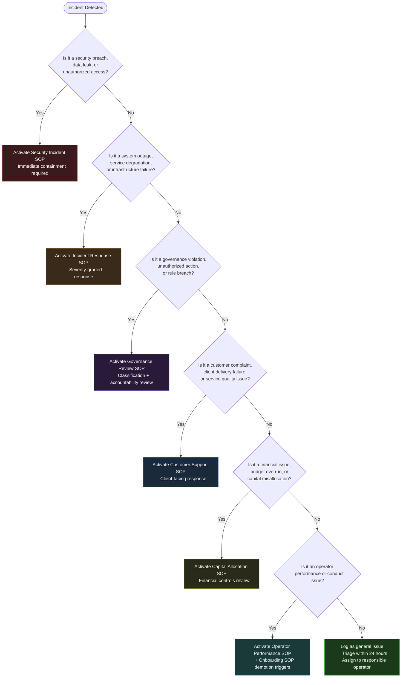
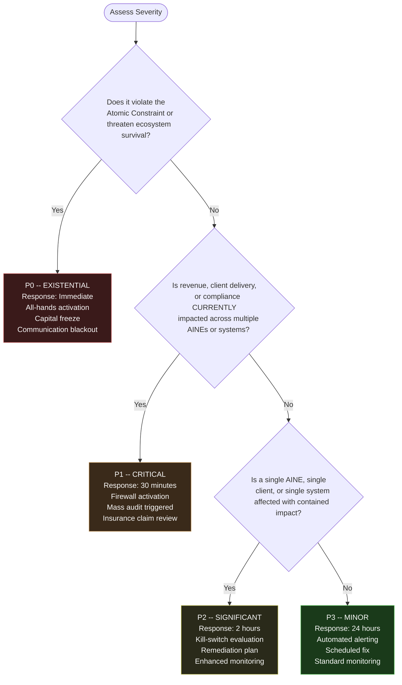
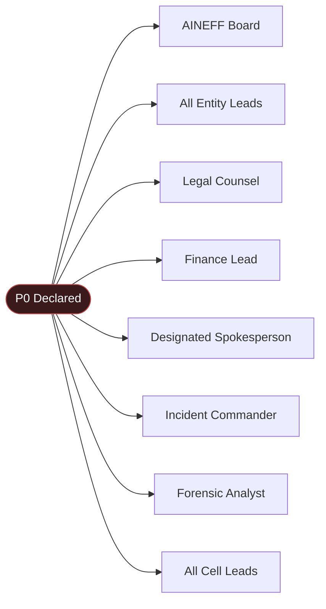

# Incident Classification & Response Matrix

This reference document helps you **instantly classify any incident** and know exactly which SOP to activate, who to notify, and what timeline to follow. Start with the decision tree, then use the severity matrix and role activation tables for specifics.

---

## Incident Type Decision Tree

When an incident occurs, use this decision tree to determine which SOP governs the response.

---

## Severity Classification Matrix (P0 -- P3)

Once the incident type is identified, classify its severity using this matrix.

| Severity | Name | Definition | Response Time | Command Authority | Cooling Before Action |
|---|---|---|---|---|---|
| **P0** | Existential | Threatens survival or fundamental viability of the ecosystem | Immediate (&lt; 15 minutes to activate) | AINEFF Board + all entity leads | None -- act now |
| **P1** | Critical | System-wide impact, contagion risk, or major trust breach | Within 30 minutes | AINEG + affected entity leads | None -- contain first |
| **P2** | Significant | Localized failure with contained impact | Within 2 hours | Affected Cell Lead + AINE Lead | Assess before acting |
| **P3** | Minor | Performance degradation or drift from expected behavior | Within 24 hours | Responsible operator | Schedule in next window |

### Severity Decision Tree

---

## Incident Type x Severity Response Matrix

Cross-reference incident type with severity to determine the exact response protocol.

| Incident Type | P0 Response | P1 Response | P2 Response | P3 Response |
|---|---|---|---|---|
| **Security** | Full lockdown, Board activation, forensic team, law enforcement liaison | Containment + isolation, affected system shutdown, breach investigation | Single system isolation, vulnerability patch, access review | Vulnerability scan finding, scheduled patching, monitoring |
| **System Outage** | All-hands, capital freeze, shelter protocols | Failure Contagion Firewall, mass audit, remediation plan within 4h | Kill-switch evaluation, fix within 4h, 7-day monitoring | Automated alert, scheduled fix within 1 week |
| **Governance Violation** | Constitutional violation -- immediate demotion, constitutional review | Cross-entity violation -- governance review, authority suspension | Single-entity violation -- demotion trigger review, remediation | Process deviation -- warning, documentation, training |
| **Customer Complaint** | Major trust breach across client base -- Board-managed response | Multiple client impact -- Commercial Lead response within 24h | Single client issue -- Cell Lead response, remediation plan | Minor feedback -- logged, addressed in next cycle |
| **Financial** | Cash runway &lt; 30 days -- emergency consulting, spending halt | Budget overrun &gt; 50% -- capital freeze on affected cell, CAC review | Budget overrun &lt; 50% -- enhanced monitoring, adjusted projections | Minor variance -- logged, addressed in monthly review |
| **Operator Conduct** | Ethical violation / Atomic Constraint breach -- immediate termination review | Pattern of governance violations -- demotion + governance review | Single violation -- demotion trigger evaluation per SOP | Performance below threshold -- coaching, monitoring |

---

## Notification Requirements by Severity

Who must be notified, and when, for each severity level.

| Stakeholder | P0 | P1 | P2 | P3 |
|---|---|---|---|---|
| **AINEFF Board** | Immediate | Within 1 hour | Daily summary | Weekly summary |
| **All Entity Leads** | Immediate | Within 15 minutes | Same day | Weekly summary |
| **Affected Cell Leads** | Immediate | Within 30 minutes | Same day | As needed |
| **All Operators** | Board-approved message only | Need-to-know basis | Affected teams only | Not required |
| **Affected Clients** | Board-approved, within 24 hours | Within 24 hours | Within 24 hours | Not required |
| **Regulators** | As legally required | If compliance-relevant | If compliance-relevant | Not required |
| **Public / Media** | Board-approved only | If required by circumstance | Not required | Not required |
| **Legal Counsel** | Immediate | Within 1 hour | If compliance-relevant | Not required |
| **Insurance Provider** | If claim-triggering | If claim-triggering | Not required | Not required |

---

## Role Activation by Incident Type and Severity

Which roles are activated for each combination.

### P0 Activation (All Incident Types)

### P1 Activation by Type

| Role | Security Incident | System Outage | Governance Violation | Customer Complaint | Financial Issue |
|---|---|---|---|---|---|
| **Incident Commander** | Activated | Activated | Not required | Not required | Not required |
| **AINEG Lead** | Activated | Activated | Activated | Activated | Activated |
| **Security Lead** | Activated | If relevant | Not required | Not required | Not required |
| **Infrastructure Lead** | If relevant | Activated | Not required | Not required | Not required |
| **Governance Reviewer** | Activated | Not required | Activated | Not required | Not required |
| **Commercial Lead** | Not required | If client-facing | Not required | Activated | Not required |
| **Finance Lead** | Not required | Not required | If financial | Not required | Activated |
| **Legal** | Activated | If compliance | Activated | If contractual | Activated |
| **Audit Lead** | Activated | Activated | Activated | Not required | Activated |

### P2 Activation by Type

| Role | Security | Outage | Governance | Customer | Financial |
|---|---|---|---|---|---|
| **Cell Lead** | Activated | Activated | Activated | Activated | Activated |
| **AINE Lead** | Activated | Activated | Activated | If cross-cell | If cross-cell |
| **Responsible Operator** | Activated | Activated | Activated | Activated | Activated |
| **Peer Reviewer** | Activated | If code-related | Not required | Not required | Not required |
| **Commercial Operator** | Not required | If client-facing | Not required | Activated | Not required |

---

## Response Timeline Summary

Consolidated timeline showing all response milestones by severity.

```mermaid
flowchart LR
    subgraph P0_TL["P0 Timeline"]
        P0_0["T+0
        Detected"] --> P0_15["T+15min
        Protocols activated
        Capital freeze
        Board assembling"] --> P0_60["T+1hr
        Board assembled
        Situation briefing"] --> P0_120["T+2hr
        Situation assessment
        complete"] --> P0_360["T+6hr
        Response plan
        approved"] --> P0_1440["T+24hr
        Client comms
        (Board-approved)"]
    end

    subgraph P1_TL["P1 Timeline"]
        P1_0["T+0
        Detected"] --> P1_15["T+15min
        Entity leads
        notified"] --> P1_30["T+30min
        Firewall
        activated"] --> P1_60["T+1hr
        Damage
        assessed"] --> P1_240["T+4hr
        Remediation plan
        + insurance review"] --> P1_4320["T+72hr
        Post-incident
        review"]
    end

    subgraph P2_TL["P2 Timeline"]
        P2_0["T+0
        Detected"] --> P2_30["T+30min
        Impact
        assessed"] --> P2_120["T+2hr
        Kill-switch or
        remediate decided"] --> P2_240["T+4hr
        Remediation
        underway"] --> P2_1440["T+24hr
        Client notified
        (if affected)"] --> P2_4320["T+72hr
        Post-incident
        review"]
    end

    style P0_TL fill:#3a1a1a,stroke:#ba4a4a,color:#fff
    style P1_TL fill:#3a2a1a,stroke:#ba8a4a,color:#fff
    style P2_TL fill:#2a2a1a,stroke:#baba4a,color:#fff
```

---

## Post-Incident Requirements

Every P0, P1, and P2 incident requires a formal post-incident review.

| Requirement | P0 | P1 | P2 | P3 |
|---|---|---|---|---|
| **Post-incident review** | Within 72 hours | Within 72 hours | Within 72 hours | Not required |
| **Forensic replay** | Required | Required | Not required | Not required |
| **Root cause analysis** | Required | Required | Required | Optional |
| **ACTS trace review** | Required | Required | Required | Automated only |
| **Prevention action items** | Required (Board-tracked) | Required (AINEG-tracked) | Required (Cell Lead-tracked) | Logged in backlog |
| **Action item closure target** | &gt; 90% within 30 days | &gt; 90% within 30 days | &gt; 90% within 30 days | Best effort |
| **Recurrence monitoring** | 12 months | 12 months | 6 months | Not required |

### Post-Incident Review Participants

| Severity | Required Participants |
|---|---|
| **P0** | AINEFF Board, all entity leads, incident commander, forensic analyst, external reviewer |
| **P1** | AINEG, affected entity leads, incident commander, audit lead |
| **P2** | Cell Lead, affected operators, AINE Lead |

---

## Incident Metrics Targets

| Metric | P0 Target | P1 Target | P2 Target | P3 Target |
|---|---|---|---|---|
| **Mean Time to Detect (MTTD)** | &lt; 5 minutes | &lt; 5 minutes | &lt; 1 hour | &lt; 24 hours |
| **Mean Time to Respond (MTTR)** | &lt; 15 minutes | &lt; 30 minutes | &lt; 2 hours | &lt; 24 hours |
| **Post-Incident Review completion** | 100% within 72 hours | 100% within 72 hours | 100% within 72 hours | N/A |
| **Action item closure** | &gt; 90% within 30 days | &gt; 90% within 30 days | &gt; 90% within 30 days | Best effort |
| **Recurrence rate** | &lt; 5% within 12 months | &lt; 5% within 12 months | &lt; 10% within 12 months | Not tracked |

---

## Quick Classification Checklist

When an incident occurs, answer these questions in order:

1. **What type is it?** Security / Outage / Governance / Customer / Financial / Operator / General
2. **What severity is it?** P0 (existential) / P1 (critical) / P2 (significant) / P3 (minor)
3. **Which SOP governs?** Check the decision tree above
4. **Who needs to know?** Check the notification matrix
5. **Who responds?** Check the role activation tables
6. **What is the timeline?** Check the response timeline
7. **What happens after?** Check the post-incident requirements

---

## Related SOPs

- [Incident Response SOP](/docs/processes/incident-response-sop) -- Severity-graded response framework (P0 through P3)
- [Security Incident SOP](/docs/processes/security-incident-sop) -- Security-specific containment and investigation
- [Governance Review SOP](/docs/processes/governance-review-sop) -- Governance violation classification and response
- [Client Engagement SOP](/docs/processes/client-engagement-sop) -- Client-facing incident communication
- [Capital Allocation SOP](/docs/processes/capital-allocation-sop) -- Financial incident response and capital freeze procedures
